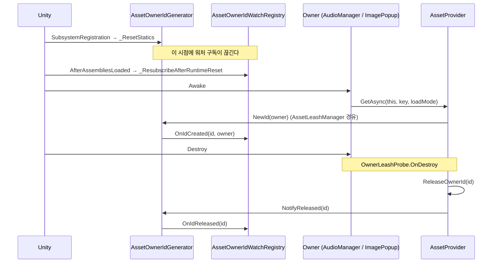
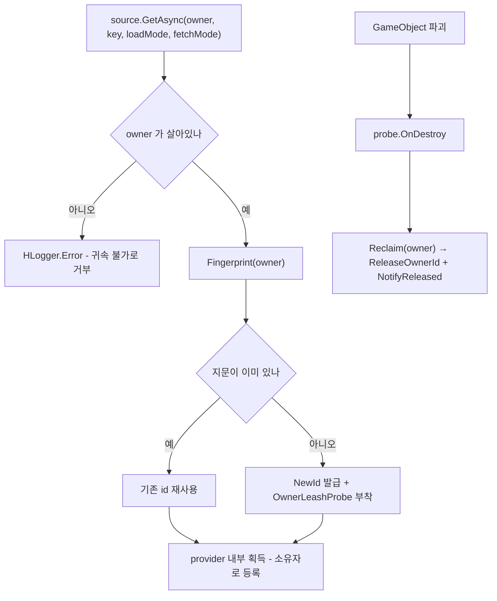

# Subscription - 소유자 식별과 leash

> 대상: `Runtime/Subscription/*.cs` (`AssetOwnerId` / `AssetOwnerIdGenerator` /
> `AssetLeashManager` / `ICSharpAssetLeash` / `OwnerLeashProbe`)
> 상위 문서: [Runtime/README.md](../Runtime/README.md)

---

## 요약

이 폴더는 **"이 에셋을 누가 붙잡고 있나"를 값 하나로 표현하는 방법**을 정의한다. 실제 점유
계산은 캐시가 하고([Cache.md](Cache.md)), 여기서는 그 계산에 쓸 식별자를 발급하고 수명 시작·종료를
외부에 알리는 일만 한다.

두 갈래로 나뉜다.

- **식별자 축** - `AssetOwnerId` + `AssetOwnerIdGenerator`. 값과 발급기.
- **leash 축** - `AssetLeashManager` + `ICSharpAssetLeash` + `OwnerLeashProbe`.
  소유자 객체를 지문에 대응시키고, 파괴 시점을 감지해 회수한다.

2026-09-04 개편 전에는 leash 축이 `AssetLeaseManager` 라는 이름의 **선택 계층**이었고
사용처가 0건이었다. 지금은 `AssetProvider` 의 상주 객체라 모든 획득이 이곳을 지난다.

---

## AssetOwnerId

```csharp
// Subscription/AssetOwnerId.cs:26-54
public readonly struct AssetOwnerId : IEquatable<AssetOwnerId> {
    public readonly int Value;
    public static AssetOwnerId None => new(0);
    public bool IsValid => Value > 0;

    public bool Equals(AssetOwnerId other) => Value == other.Value;
    public override int GetHashCode() => Value;

    public static implicit operator int(AssetOwnerId ownerId) => ownerId.Value;
    // int -> AssetOwnerId 역방향 변환은 2026-08-06 에 제거했다.
    // 생성자는 2026-09-04 부터 internal 이다.
}
```

`readonly struct` + `IEquatable` 조합이 캐시의 `HashSet<AssetOwnerId>` 원소로 쓰일 때
박싱을 피하는 근거다(`Cache/MemoryAssetCache.cs:46`).

`Value > 0` 만 유효하다. 무효 id 로 들어온 `Save` 는 2026-09-04 부터 **거부되고 에러가 남는다**.
익명 경로로 강등되던 종전 동작은 익명 축과 함께 제거됐다.

---

## AssetOwnerIdGenerator

```csharp
// Subscription/AssetOwnerIdGenerator.cs - 2026-09-04 기준
// 둘 다 internal 이다. 발급은 AssetLeashManager 만 하고, 그곳은 항상 owner 를 넘긴다.
internal static AssetOwnerId NewId(object owner) {
    var ownerId = new AssetOwnerId(Interlocked.Increment(ref nextId));
    OnIdCreated?.Invoke(ownerId.Value, owner);   // 페이로드는 int 다
    return ownerId;
}
internal static void NotifyReleased(AssetOwnerId ownerId) {
    if (!ownerId.IsValid) return;
    OnIdReleased?.Invoke(ownerId.Value);
}
```

`NotifyReleased` 는 **통지만** 한다. 실제 자산 회수는 `provider.ReleaseOwnerId` 가 따로 하고,
둘의 짝을 맞추는 것은 `AssetLeashManager._ReclaimEntry` 한 곳이다. 소비자가 짝을 맞출 일은 없다.

`owner` 인자는 식별에 쓰이지 않는다. 오직 `OnIdCreated` 이벤트를 통해 추적 도구에 전달되는
보조 정보다.

### 정적 상태 리셋

```csharp
// Subscription/AssetOwnerIdGenerator.cs:43-49
[RuntimeInitializeOnLoadMethod(RuntimeInitializeLoadType.SubsystemRegistration)]
private static void _ResetStatics() {
    nextId = 0;
    OnIdCreated = null;
    OnIdReleased = null;
}
```

Domain Reload 비활성 환경에서 id 카운터와 구독이 플레이 세션을 넘어 잔존하는 것을 막는다.
**대가는 `[InitializeOnLoad]` 구독자가 함께 끊긴다는 것**이고, 그 복구를 에디터 워처가
`AfterAssembliesLoaded` 재구독으로 맞춰 두었다(`Editor/Subscription/AssetOwnerIdWatchRegistry.cs:52-55`).
리셋 시점을 바꾸면 그 순서 보장이 깨진다 - 코드 주석이 이를 명시한다(`:35-39`).



---

## 실제 사용 패턴

소유자는 더 이상 `AssetOwnerId` 를 들지 않는다. 소유자 객체 자체를 넘기면 `AssetLeashManager`
가 지문을 발급해 내부에 보관한다. 아래 코드는 개편 전 형태이고, 지금은 이런 코드를 쓰지 않는다.

```csharp
// HUI/Popup/ImagePopup.cs - 2026-09-04 기준
// 소유자는 자기 자신을 넘길 뿐 id 를 보지 않는다.
var sprite = await provider.GetAsync(this, key, mode, AssetFetchMode.CacheFirst);
provider?.Release(this, currentKey);

// OnDestroy - 정상 반납. 이것을 빠뜨려도 파괴 프로브가 같은 회수를 한다.
resourcesProvider?.ReleaseOwner(this);
addressableProvider?.ReleaseOwner(this);
```

아래는 개편 전 형태다. `NewId` 와 `NotifyReleased` 는 이제 internal 이라 이 코드는
패키지 밖에서 컴파일되지 않는다.

```csharp
// 2026-09-04 이전. 참고용이며 따라 쓰지 말 것
AssetOwnerId ownerId;
public AssetOwnerId OwnerId {
    get { if (!ownerId.IsValid) ownerId = AssetOwnerIdGenerator.NewId(this); return ownerId; }
}
if (ownerId.IsValid) AssetOwnerIdGenerator.NotifyReleased(ownerId);
```

발급 시점은 이제 소비자가 정하지 않는다. 첫 `GetAsync(owner, ...)` 에서 provider 가 지문을
발급하고 파괴 프로브를 붙인다. 소비자가 하는 일은 다 쓴 시점의 반납뿐이다.

| 소비자 | 소유자 | 반납 |
|---|---|---|
| `HAudio/AudioManager` | 매니저 자신 (`AudioClipRepository` 생성자에 전달) | `ReleaseAll()` -> 그 소유자 몫만 |
| `HUI/Popup/ImagePopup` | 팝업 자신 | `OnDestroy` -> provider 2개 각각 `ReleaseOwner(this)` |
| `HDialogue/CharacterPortraitController` | 컨트롤러 각자 | 포즈 교체 시 `Release(this, key)`, 파괴 시 프로브 |
| `HcupLocalization/LocalizationManager` | 매니저 자신 | 언어 교체 시 `Release(this, prevKey)` |

`CharacterStageDirector` 는 provider 를 만들어 자식 컨트롤러에 넘기는 쪽이라 `Dispose` 로
마감한다. 자식들은 각자 소유자로 참여하므로 한 컨트롤러의 파괴는 그 몫만 회수한다.

---

## leash 축 - provider 의 상주 계층

```csharp
// Subscription/AssetLeashManager.cs - Component 소유자 (가드 로그 생략)
internal OwnerLiveToken Fingerprint(Component owner) {
    if (disposed) return default;
    if (owner == null) return default;                     // Unity == 는 파괴된 것도 건다

    LeashEntry entry = _EnsureEntry(owner);
    if (entry.Probe == null) _AttachProbe(owner, entry);   // 파괴 통지를 여기서 건다

    // 상한을 걸 수 없으면 획득 자체를 성립시키지 않는다
    if (entry.Probe == null) { _ReclaimEntry(entry); return default; }

    return OwnerLiveToken.Issue(entry);                    // 신원 + 생존 판정을 한 값에
}
```

지문 테이블은 `ConditionalWeakTable<object, LeashEntry>` 다. 일반 `Dictionary` 로 바꾸면
provider 가 자기가 서비스한 모든 소유자를 영원히 살려두어, 소유권 누수를 고치려던 물건이
더 큰 누수가 된다. `LeashEntry` 가 소유자를 참조해도 되는 이유는 CWT 가 ephemeron 이라
값에서 키로 가는 참조가 키의 수집을 막지 않기 때문이다.



**순수 C# 소유자는 이 자동 경로가 없다.** 자기 GameObject 가 없어 파괴 이벤트를 스스로
내지 못하므로 `source.Leash(owner, anchor)` 로 anchor 의 수명을 상한으로 빌린다. anchor 가
죽으면 회수되지만 그 시점은 소유자가 실제로 쓸모를 다한 시점보다 늦을 수 있어, 돌려받은
`ICSharpAssetLeash` 를 `using` 으로 닫는 것이 정확한 시점을 주는 유일한 보증이다.
`Destroy(component)` 로 컴포넌트만 지우는 경우도 프로브가 잡지 못한다 - GameObject 는
살아 있기 때문이다. 두 경우 모두 Owner Watcher 의 진단으로 드러나고, 회수는
`AssetLeashManager.ReclaimDeadOwners()`(공개 경로는 `IAssetSource.ReclaimOrphans()`) 가 맡는다.

---

## 주의할 점

1. **`NotifyReleased` 는 자산을 해제하지 않는다**(`:55-58`). `provider.ReleaseOwner` 와 짝을
   맞춰야 하고, 순서를 뒤집어도 무방하나 하나를 빠뜨리면 각각 다른 증상이 난다 -
   `ReleaseOwner` 누락은 실제 누수, `NotifyReleased` 누락은 에디터 워처 목록의 유령 항목이다.
2. ~~`AssetOwnerId` 의 `int` → `AssetOwnerId` implicit 변환은 발급기를 우회한다.~~
   → 2026-08-06 변환 제거, 2026-09-04 생성자와 발급기를 internal 로. 어셈블리 밖에서는
   신원을 만들 수도 발급받을 수도 없다. 이벤트 페이로드도 `int` 라 구독으로 새어 나가지 않는다.
3. **정적 이벤트는 플레이 진입마다 비워진다**(`AssetOwnerIdGenerator.cs:43-49`). 런타임
   구독자를 붙일 때는 재구독 경로를 스스로 설계해야 한다.
4. **`nextId` 는 세션 내 단조 증가이고 재사용되지 않는다**(`:56`). 세션을 넘긴 id 비교는
   의미가 없다.
5. ~~lease 3파일(약 260행)은 사용처 0건이다.~~ -> 2026-09-04 해소. 세 파일을 삭제하고
   `AssetLeashManager` / `ICSharpAssetLeash` / `OwnerLeashProbe` 로 대체했다. 새 계층은
   `AssetProvider` 의 상주 객체라 모든 획득이 반드시 통과한다. `IAssetOwner` 도 함께
   삭제했다 - 소유자 매개변수 타입이 `Component` / `object` 로 바뀌어 표식이 불필요해졌다.
6. **자동 회수는 GameObject 파괴에만 걸린다.** `Destroy(component)` 단독과 순수 C# 소유자는
   잡히지 않는다. ~~폴링을 도입하지 않는 한 구조적으로 감지할 수 없으므로 진단으로 다룬다.~~
   → 2026-09-07 보완. 매 프레임 폴링 대신 `ReclaimDeadOwners()` 를 부르는 시점에만 약한 표를
   훑어 걷어낸다. 감지가 자동이 아닌 것은 그대로이나 회수 수단은 생겼다.
7. **명시적 반납이 정상 플로우다.** 프로브는 안전망이지 대체재가 아니다. 다 쓴 시점에
   `Release(owner, key)` 를 부르는 것과 파괴될 때까지 들고 있는 것은 점유 기간이 다르다.
   강도는 소유자 종류에 따라 다르다. Component 는 프로브가 자기 GameObject 에 붙어 회수
   시점이 자기 수명과 같으므로 명시 반납이 선택이다. 순수 C# 소유자는 회수 시점이 anchor
   수명이라 자기 수명과 어긋나므로 ICSharpAssetLeash.Dispose 가 의무다. 2026-09-08 에 강한 목록을
   없앤 뒤로 GC 된 순수 소유자는 ReclaimOrphans() 로도 걷히지 않는다.
