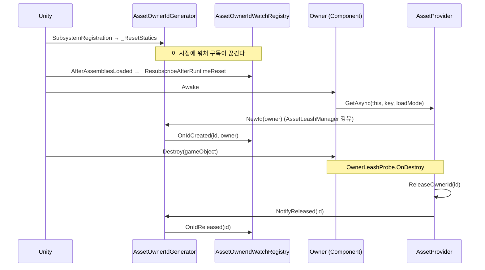
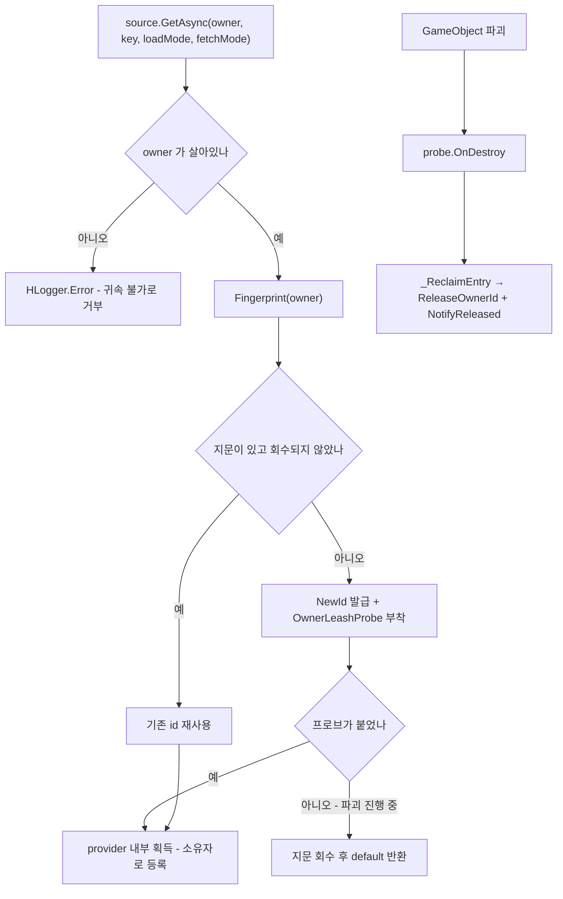

# Subscription - 소유자 식별과 leash

> 대상: `Runtime/Subscription/*.cs` (`AssetOwnerId` / `AssetOwnerIdGenerator` / `AssetLeashManager` / `ICSharpAssetLeash` / `OwnerLeashProbe`)
> 상위 문서: [Runtime/README.md](../Runtime/README.md)

---

## 요약

이 폴더는 **"이 에셋을 누가 붙잡고 있나"를 값 하나로 표현하는 방법**을 정의한다. 실제 점유 계산은 캐시가 하고 ([Cache.md](Cache.md)), 여기서는 그 계산에 쓸 식별자를 발급하고 소유자의 수명 시작·종료를 감지해 회수와 외부 통지를 맡는다.

두 갈래로 나뉜다.

- **식별자 축** - `AssetOwnerId` + `AssetOwnerIdGenerator`. 값과 발급기.
- **leash 축** - `AssetLeashManager` + `ICSharpAssetLeash` + `OwnerLeashProbe`. 소유자 객체를 지문에 대응시키고, 파괴 시점을 감지해 회수한다. `AssetProvider` 의 상주 객체라 모든 획득이 이곳을 지난다.

---

## AssetOwnerId

```csharp
// Subscription/AssetOwnerId.cs:26-54
public readonly struct AssetOwnerId : IEquatable<AssetOwnerId> {
    public readonly int Value;
    public static AssetOwnerId None => new(0);
    public bool IsValid => Value > 0;

    internal AssetOwnerId(int value) { Value = value; }   // 어셈블리 밖에서 만들 수 없다

    public bool Equals(AssetOwnerId other) => Value == other.Value;
    public override int GetHashCode() => Value;

    public static implicit operator int(AssetOwnerId ownerId) => ownerId.Value;   // 읽기 방향만
}
```

`readonly struct` + `IEquatable` 조합이 캐시의 `ownerTable`(`Dictionary<AssetOwnerId, HashSet<TKey>>`) 키로 쓰일 때 박싱을 피하는 근거다 (`Cache/MemoryAssetCache.cs:51`).

`Value > 0` 만 유효하다. 무효 id 로 들어온 `Save` 는 **거부되고 에러가 남는다**. `int → AssetOwnerId` 방향의 변환은 없고 생성자는 internal 이라, 어셈블리 밖에서는 신원을 만들 수 없다.

---

## AssetOwnerIdGenerator

```csharp
// Subscription/AssetOwnerIdGenerator.cs:55-64
// 둘 다 internal 이다. 발급은 AssetLeashManager 만 하고, 그곳은 항상 owner 를 넘긴다.
internal static AssetOwnerId NewId(object owner) {
    var ownerId = new AssetOwnerId(Interlocked.Increment(ref nextId));
    OnIdCreated?.Invoke(ownerId.Value, owner);   // 페이로드는 int 다
    return ownerId;
}
internal static void NotifyReleased(AssetOwnerId ownerId) {
    if (!ownerId.IsValid) return;
    OnIdReleased?.Invoke(ownerId.Value);
}
```

`NotifyReleased` 는 **통지만** 한다. 실제 자산 회수는 `provider.ReleaseOwnerId` 가 따로 하고, 둘의 짝을 맞추는 것은 `AssetLeashManager._ReclaimEntry` 한 곳이다 (`Subscription/AssetLeashManager.cs:314-324`). 소비자가 짝을 맞출 일은 없다.

`owner` 인자는 식별에 쓰이지 않는다. 오직 `OnIdCreated` 이벤트를 통해 추적 도구에 전달되는 보조 정보다. 이벤트 페이로드가 `AssetOwnerId` 가 아니라 `int` 인 이유는, 공개 이벤트를 구독하는 것만으로 살아 있는 남의 신원을 손에 넣지 못하게 하기 위해서다 (`:32-37`).

### 정적 상태 리셋

```csharp
// Subscription/AssetOwnerIdGenerator.cs:43-48
[RuntimeInitializeOnLoadMethod(RuntimeInitializeLoadType.SubsystemRegistration)]
private static void _ResetStatics() {
    nextId = 0;
    OnIdCreated = null;
    OnIdReleased = null;
}
```

Domain Reload 비활성 환경에서 id 카운터와 구독이 플레이 세션을 넘어 잔존하는 것을 막는다. **대가는 `[InitializeOnLoad]` 구독자가 함께 끊긴다는 것**이고, 그 복구를 에디터 워처가 `AfterAssembliesLoaded` 재구독으로 맞춰 두었다 (`Editor/Subscription/AssetOwnerIdWatchRegistry.cs:69-72`). 리셋 시점을 바꾸면 그 순서 보장이 깨진다 - 코드 주석이 이를 명시한다 (`:39-42`).



---

## 사용 패턴

소유자는 `AssetOwnerId` 를 들지 않는다. 소유자 객체 자체를 넘기면 `AssetLeashManager` 가 지문을 발급해 내부에 보관한다. 첫 `GetAsync(owner, ...)` 에서 지문이 발급되고 파괴 프로브가 붙는다. 소비자가 하는 일은 다 쓴 시점의 반납뿐이다.

```csharp
// HUI/Runtime/HUI/Popup/ImagePopup.cs - 소유자는 자기 자신을 넘길 뿐 id 를 보지 않는다.
var sprite = await provider.GetAsync(this, key, mode, AssetFetchMode.CacheFirst);

// OnDestroy - 정상 반납 후 자기가 만든 provider 폐기.
resourcesProvider?.ReleaseOwner(this);
addressableProvider?.ReleaseOwner(this);
resourcesProvider?.Dispose();
addressableProvider?.Dispose();
```

패키지 내 다른 모듈의 소유자 구성:

| 소비자 | 소유자 | 반납 |
|---|---|---|
| `HAudio/AudioManager` | 매니저 자신 (`AudioClipRepository` 생성자에 전달) | `ReleaseCatalog` 는 그 카탈로그 key 를 `Release`, `ReleaseAll` 은 `ReleaseOwner`. 기본 provider 를 저장소가 만들었으면 `Dispose` 까지 |
| `HUI/Popup/ImagePopup` | 팝업 자신 | `OnDestroy` -> provider 2개 각각 `ReleaseOwner(this)` 후 `Dispose` |
| `HDialogue/CharacterPortraitController` | 컨트롤러 각자 | 포즈 교체 시 `Release(this, key)`, 파괴 시 프로브 |
| `HcupLocalization/LocalizationManager` | 매니저 자신 | 언어 교체 시 `Release(this, prevKey)`, 폐기 시 `Dispose` |

`CharacterStageDirector` 는 provider 를 만들어 자식 컨트롤러에 넘기는 쪽이라 `Dispose` 로 마감한다. 자식들은 각자 소유자로 참여하므로 한 컨트롤러의 파괴는 그 몫만 회수한다.

---

## leash 축 - provider 의 상주 계층

```csharp
// Subscription/AssetLeashManager.cs:182-206 - Component 소유자 (가드 로그 생략)
internal OwnerLiveToken Fingerprint(Component owner) {
    if (disposed) return default;
    if (owner == null) return default;                     // Unity == 는 파괴된 것도 건다

    LeashEntry entry = _EnsureEntry(owner);
    if (entry.Probe == null) _AttachProbe(owner, entry);   // 파괴 통지를 여기서 건다

    // 상한을 걸 수 없으면 획득 자체를 성립시키지 않는다
    if (entry.Probe == null) { _ReclaimEntry(entry); return default; }

    return OwnerLiveToken.Issue(entry);                    // 신원 + 생존 판정을 한 값에
}
```

지문 테이블은 `ConditionalWeakTable<object, LeashEntry>` 다 (`:169`). 일반 `Dictionary` 로 바꾸면 provider 가 자기가 서비스한 모든 소유자를 영원히 살려두어, 소유권 누수를 고치려던 물건이 더 큰 누수가 된다.

**`LeashEntry` 에는 소유자로 가는 필드가 없다** (`:53-61`). 프로브 핸들러와 `CSharpAssetLeash` 는 `LeashEntry` 만 캡처한다. 하나라도 owner 를 캡처하면 앵커(다른 GameObject)의 컴포넌트가 순수 객체를 살려두어, 수명 상한을 주려던 앵커가 오히려 수명을 늘린다.

`OwnerLiveToken` 은 발급 시점의 `LeashEntry` 와 신원을 함께 담는다 (`:67-84`). 로드 완료 후 provider 는 이 토큰 하나로 "그 소유자가 아직 살아 있고 같은 신원인가" 를 O(1) 로 판정한다. 회수된 소유자가 다시 요청하면 `_EnsureEntry` 가 새 지문을 발급하므로 (`:349-365`), 옛 토큰과 옛 창구는 신원 불일치로 죽은 것으로 판정된다.



**순수 C# 소유자는 이 자동 경로가 없다.** 자기 GameObject 가 없어 파괴 이벤트를 스스로 내지 못하므로 `source.Leash(owner, anchor)` 로 anchor 의 수명을 상한으로 빌린다. anchor 가 죽으면 회수되지만 그 시점은 소유자가 실제로 쓸모를 다한 시점보다 늦을 수 있어, 돌려받은 `ICSharpAssetLeash` 를 `using` 으로 닫는 것이 정확한 시점을 주는 유일한 보증이다.

`Destroy(component)` 로 컴포넌트만 지우는 경우도 프로브가 잡지 못한다 - GameObject 는 살아 있기 때문이다. 이 점유는 `IAssetSource.ReclaimOrphans()` (내부적으로 `AssetLeashManager.ReclaimDeadOwners()`, `:290-311`) 를 부를 때 약한 표를 훑어 걷힌다. 대상은 파괴된 Unity 소유자뿐이다. GC 된 순수 C# 소유자는 약한 표에서 쌍이 사라져 여기에 걸리지 않고, anchor 파괴가 유일한 회수 시점이다.

---

## 주의할 점

1. **`NotifyReleased` 는 자산을 해제하지 않는다** (`AssetOwnerIdGenerator.cs:61-64`). 회수와 통지의 짝은 `_ReclaimEntry` 가 맞춘다. 통지가 빠지면 에디터 워처 목록에 유령 항목이 남고, 회수가 빠지면 실제 누수가 된다.
2. **정적 이벤트는 플레이 진입마다 비워진다** (`AssetOwnerIdGenerator.cs:43-48`). 런타임 구독자를 붙일 때는 재구독 경로를 스스로 설계해야 한다.
3. **`nextId` 는 세션 내 단조 증가이고 재사용되지 않는다** (`:56`). 세션을 넘긴 id 비교는 의미가 없다.
4. **자동 회수는 GameObject 파괴에만 걸린다.** `Destroy(component)` 단독과 순수 C# 소유자는 잡히지 않는다. 전자는 `ReclaimOrphans()` 를 부를 때 걷히고, 후자는 anchor 파괴가 상한이다. 감지는 자동이 아니다 - 부르는 시점은 호출자가 정한다.
5. **파괴가 진행 중인 GameObject 에서는 획득이 실패한다.** 프로브를 붙일 수 없으면 `GetAsync` 는 로드 없이 `default` 를, `Leash` 는 `null` 을 돌려주고 `HLogger.Error` 를 남긴다 (`AssetLeashManager.cs:367-380`). 자산은 teardown 전에 확보한다.
6. **한 소유자는 하나의 앵커만 갖는다.** 이미 앵커가 있는 순수 C# 소유자에게 다른 앵커로 `Leash` 를 다시 부르면 새 앵커는 무시되고 경고가 남는다 (`:260-266`).
7. **명시적 반납이 정상 플로우다.** 프로브는 안전망이지 대체재가 아니다. 다 쓴 시점에 `Release(owner, key)` 를 부르는 것과 파괴될 때까지 들고 있는 것은 점유 기간이 다르다. Component 는 프로브가 자기 GameObject 에 붙어 회수 시점이 자기 수명과 같으므로 명시 반납이 선택이다. 순수 C# 소유자는 회수 시점이 anchor 수명이라 자기 수명과 어긋나므로 `ICSharpAssetLeash.Dispose` 가 의무다.

---

## 히스토리

### 2026-09-08 :: 순수 C# 소유자의 강한 목록 제거

- 이전: 순수 C# 소유자의 항목을 강한 목록(`liveEntries`)에도 담아, GC 된 순수 소유자의 점유도 `ReclaimOrphans()` 로 걷을 수 있었다. 창구 반납은 "Dispose 하지 않고 버려도 anchor 가 파괴되면 회수된다" 는 허용형으로 적혀 있었다.
- 현재: 강한 목록이 없다. GC 된 순수 소유자는 `ReclaimOrphans()` 로 걷히지 않고 anchor 파괴가 유일한 회수 시점이다. 창구 반납은 의무로 명시됐다.

### 2026-09-07 :: 죽은 소유자 회수 수단 추가

- 이전: `Destroy(component)` 로 죽은 소유자의 점유는 폴링 없이는 감지할 수 없어 진단으로만 다뤘다.
- 현재: `ReclaimDeadOwners()` 를 부르는 시점에만 약한 표를 훑어 걷어낸다.

### 2026-09-04 :: lease 계층을 leash 계층으로 대체

- 이전: leash 축이 `AssetLeaseManager` / `IAssetLeaseManager` / `IAssetLease` 라는 **옵트인 계층**이었다. 소유자는 `IAssetOwner` 표식을 달고, 스스로 `AssetOwnerIdGenerator.NewId(this)` 로 id 를 발급받아 들고 있다가 `NotifyReleased` 로 통지했다.
- 현재: 네 타입을 삭제하고 `AssetLeashManager` / `ICSharpAssetLeash` / `OwnerLeashProbe` 로 대체했다. 소유자 매개변수 타입이 `Component` / `object` 라 표식이 필요 없다. `NewId` / `NotifyReleased` 와 `AssetOwnerId` 생성자는 internal 이 됐고, 이벤트 페이로드는 `int` 가 됐다.

```csharp
// 2026-09-04 이전 소비자 코드. 지금은 패키지 밖에서 컴파일되지 않는다.
AssetOwnerId ownerId;
public AssetOwnerId OwnerId {
    get { if (!ownerId.IsValid) ownerId = AssetOwnerIdGenerator.NewId(this); return ownerId; }
}
if (ownerId.IsValid) AssetOwnerIdGenerator.NotifyReleased(ownerId);
```

### 2026-08-06 :: 역방향 implicit 변환 제거

- 이전: `int → AssetOwnerId` implicit 변환이 있어 임의 정수가 owner 로 통과했다.
- 현재: `AssetOwnerId → int` 읽기 방향만 남았다.
