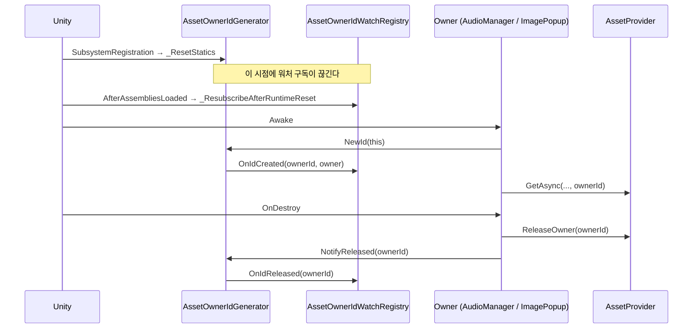
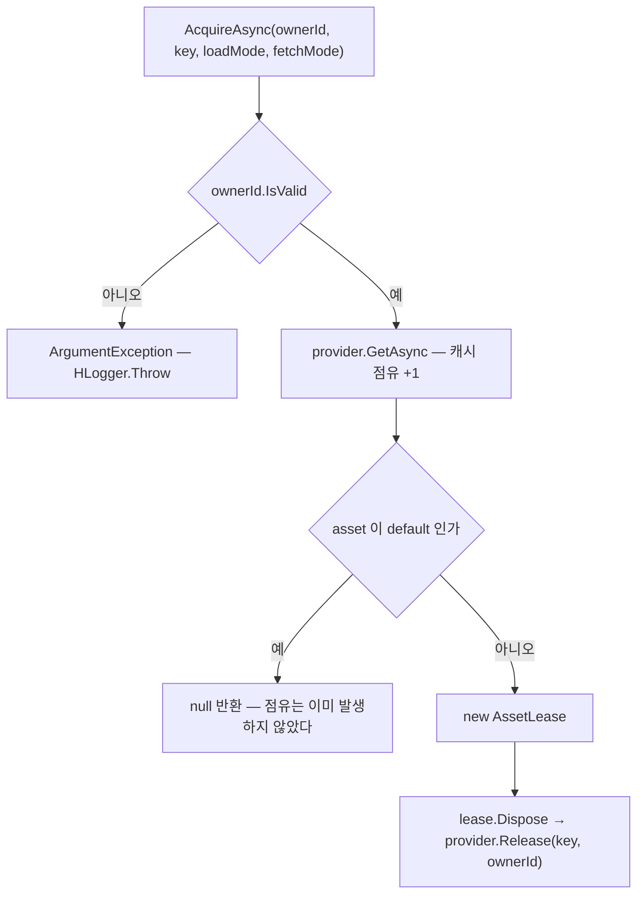

# Subscription — 소유자 식별과 lease

> 대상: `Runtime/Subscription/*.cs` (`AssetOwnerId` / `AssetOwnerIdGenerator` / `IAssetOwner` /
> `IAssetLease` / `IAssetLeaseManager` / `AssetLeaseManager`)
> 상위 문서: [Runtime/README.md](../Runtime/README.md)

---

## 요약

이 폴더는 **"이 에셋을 누가 붙잡고 있나"를 값 하나로 표현하는 방법**을 정의한다. 실제 점유
계산은 캐시가 하고([Cache.md](Cache.md)), 여기서는 그 계산에 쓸 식별자를 발급하고 수명 시작·종료를
외부에 알리는 일만 한다.

두 갈래로 나뉜다.

- **식별자 축** — `AssetOwnerId` + `AssetOwnerIdGenerator` + `IAssetOwner`. 실제로 쓰인다.
- **lease 축** — `IAssetLease` + `IAssetLeaseManager` + `AssetLeaseManager`. **사용처 0건.**

---

## AssetOwnerId

```csharp
// Subscription/AssetOwnerId.cs:23-49
public readonly struct AssetOwnerId : IEquatable<AssetOwnerId> {
    public readonly int Value;
    public static AssetOwnerId None => new(0);
    public bool IsValid => Value > 0;

    public bool Equals(AssetOwnerId other) => Value == other.Value;
    public override int GetHashCode() => Value;

    public static implicit operator int(AssetOwnerId ownerId) => ownerId.Value;
    public static implicit operator AssetOwnerId(int value) => new AssetOwnerId(value);
}
```

`readonly struct` + `IEquatable` 조합이 캐시의 `Dictionary<AssetOwnerId, int>` 키로 쓰일 때
박싱을 피하는 근거다(`Cache/MemoryAssetCache.cs:40`).

`Value > 0` 만 유효하다. 무효 id 는 캐시에서 **익명 경로로 강등**된다 — 예외가 아니라 조용한
경로 전환이다(`Cache/MemoryAssetCache.cs:66-68`, `:109`, `:140`, `:156`).

---

## AssetOwnerIdGenerator

```csharp
// Subscription/AssetOwnerIdGenerator.cs:49-58
public static AssetOwnerId NewId(object owner = null) {
    var ownerId = new AssetOwnerId(Interlocked.Increment(ref nextId));
    OnIdCreated?.Invoke(ownerId, owner);
    return ownerId;
}
public static void NotifyReleased(AssetOwnerId ownerId) {
    if (!ownerId.IsValid) return;
    OnIdReleased?.Invoke(ownerId);
}
```

`NotifyReleased` 는 **통지만** 한다. 실제 자산 회수는 `provider.ReleaseOwner(ownerId)` 가 따로
해야 한다 — 두 호출이 짝이다.

`owner` 인자는 식별에 쓰이지 않는다. 오직 `OnIdCreated` 이벤트를 통해 추적 도구에 전달되는
보조 정보다.

### 정적 상태 리셋

```csharp
// Subscription/AssetOwnerIdGenerator.cs:40-45
[RuntimeInitializeOnLoadMethod(RuntimeInitializeLoadType.SubsystemRegistration)]
private static void _ResetStatics() {
    nextId = 0;
    OnIdCreated = null;
    OnIdReleased = null;
}
```

Domain Reload 비활성 환경에서 id 카운터와 구독이 플레이 세션을 넘어 잔존하는 것을 막는다.
**대가는 `[InitializeOnLoad]` 구독자가 함께 끊긴다는 것**이고, 그 복구를 에디터 워처가
`AfterAssembliesLoaded` 재구독으로 맞춰 두었다(`Editor/Subscription/AssetOwnerIdWatchRegistry.cs:52-55`).
리셋 시점을 바꾸면 그 순서 보장이 깨진다 — 코드 주석이 이를 명시한다(`:35-39`).



---

## 실제 사용 패턴

`IAssetOwner` 는 `OwnerId` 하나만 요구하는 최소 계약이다(`Subscription/IAssetOwner.cs:20-22`).
패키지 내 유일한 구현체는 `HUI/Runtime/HUI/Popup/ImagePopup.cs:12` 이고, **지연 발급** 형태다.

```csharp
// HUI/Popup/ImagePopup.cs:47-51, 67-69 — 요약
AssetOwnerId ownerId;
public AssetOwnerId OwnerId {
    get { if (!ownerId.IsValid) ownerId = AssetOwnerIdGenerator.NewId(this); return ownerId; }
}
// OnDestroy
resourcesProvider?.ReleaseOwner(ownerId);
addressableProvider?.ReleaseOwner(ownerId);
if (ownerId.IsValid) AssetOwnerIdGenerator.NotifyReleased(ownerId);
```

`HAudio/AudioManager.cs:103` 은 `Awake` 즉시 발급하는 반대 형태다. 둘 다 `OnDestroy` 에서
`ReleaseOwner` + `NotifyReleased` 짝을 맞춘다(`AudioManager.cs:114-115`).

| 소비자 | 발급 시점 | 회수 |
|---|---|---|
| `HAudio/AudioManager.cs:103` | `Awake` | `OnDestroy` → `ReleaseOwner` + `NotifyReleased` (`:114-115`) |
| `HUI/Popup/ImagePopup.cs:50` | `OwnerId` 최초 접근 시 (지연) | `OnDestroy` → provider 2개 각각 `ReleaseOwner` (`:67-69`) |

`HDialogue` / `HcupLocalization` 은 owner 를 쓰지 않고 `ReleaseAll()` 로 통째로 비운다
(`CharacterStageDirector.cs:77`, `LocalizationManager.cs:61`).

---

## lease 축 — 현재 미사용

```csharp
// Subscription/AssetLeaseManager.cs:50-56 — nested AssetLease
public void Dispose() {
    if (isDisposed) return;
    isDisposed = true;
    assetProvider.Release(Key, OwnerId);
}
```

`AcquireAsync` 는 `provider.GetAsync` 를 호출한 뒤 결과가 `default` 면 lease 를 발급하지 않고
`null` 을 돌려준다(`:102-103`). 발급되면 `using` 블록으로 `Release` 짝을 컴파일러가 강제할 수
있다.



**이 축은 패키지 어디에서도 호출되지 않는다** (`AssetLeaseManager` / `IAssetLeaseManager` /
`IAssetLease` 전역 grep — 자기 정의 파일과 다른 파일의 헤더 주석 외 0건). `IAssetOwner` 만
살아남아 lease 없이 `ownerId` 전달용으로 쓰인다.

---

## 주의할 점

1. **`NotifyReleased` 는 자산을 해제하지 않는다**(`:55-58`). `provider.ReleaseOwner` 와 짝을
   맞춰야 하고, 순서를 뒤집어도 무방하나 하나를 빠뜨리면 각각 다른 증상이 난다 —
   `ReleaseOwner` 누락은 실제 누수, `NotifyReleased` 누락은 에디터 워처 목록의 유령 항목이다.
2. **`AssetOwnerId` 의 `int` → `AssetOwnerId` implicit 변환**(`AssetOwnerId.cs:48`)은 발급기를
   우회한다. 임의 정수가 owner 로 통과하며, 컴파일러가 `NewId` 누락을 잡지 못한다.
3. **정적 이벤트는 플레이 진입마다 비워진다**(`AssetOwnerIdGenerator.cs:40-45`). 런타임
   구독자를 붙일 때는 재구독 경로를 스스로 설계해야 한다.
4. **`nextId` 는 세션 내 단조 증가이고 재사용되지 않는다**(`:50`). 세션을 넘긴 id 비교는
   의미가 없다.
5. **lease 3파일(약 260행)은 사용처 0건이다.** 유지한다면 "선택 계층"임을 명시하고, 정리한다면
   `IAssetOwner` 는 남겨야 한다 — `ImagePopup` 이 구현하고 있다.
6. **`AssetLeaseManager` 는 `ReleaseOwner` 를 노출하지 않는다**(`IAssetLeaseManager.cs:26-38`).
   일괄 회수는 provider 를 직접 잡아야 하므로, lease 를 쓰더라도 provider 참조를 함께 들고
   있어야 한다.
