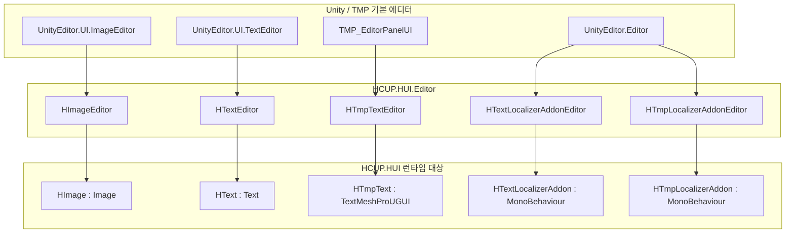
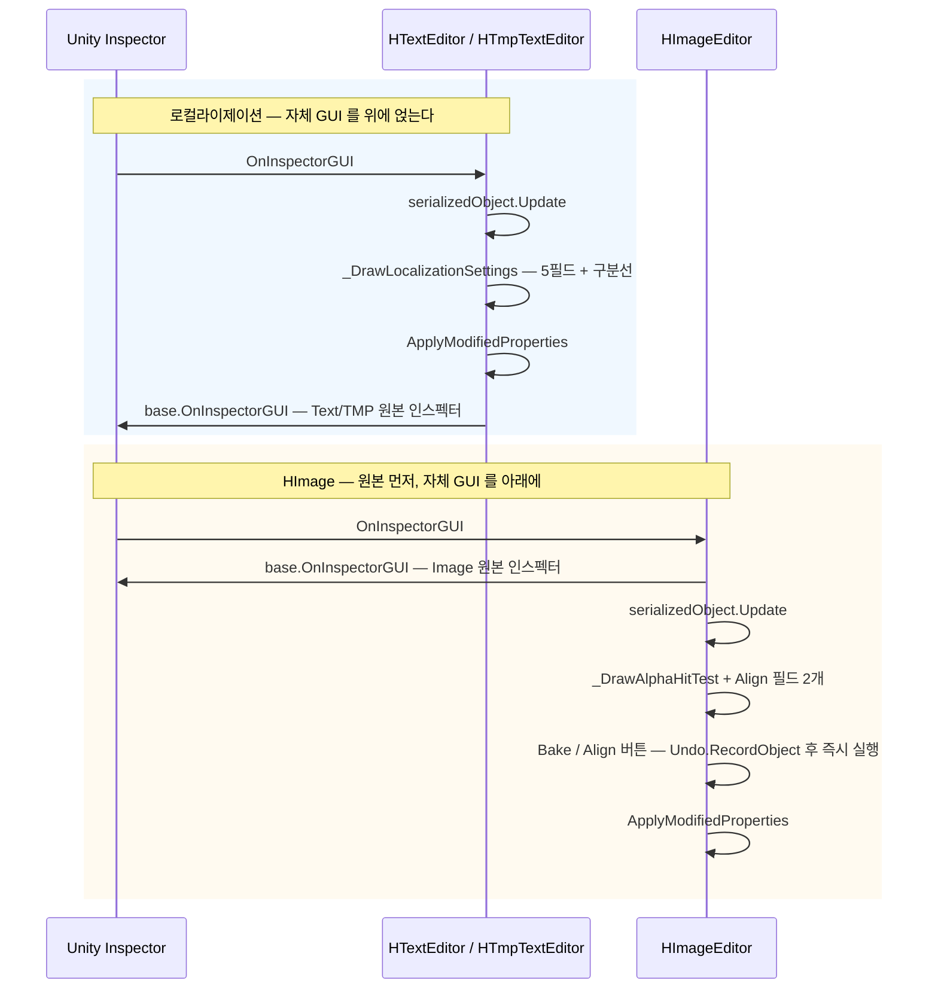

# HCUP.HUI.Editor

> 어셈블리: `HCUP.HUI.Editor` (`Editor/HCUP.HUI.Editor.asmdef`, rootNamespace `HUI.Editor`)
> 의존: `HCUP.HUtil`, `HCUP.HUI`, `HCUP.HCore`, `Unity.TextMeshPro`, `Unity.TextMeshPro.Editor`
> 플랫폼: `includePlatforms: ["Editor"]`
> 동반 어셈블리: `HCUP.HUI` (런타임 — [Runtime/README.md](../Runtime/README.md))

---

## 요약

**커스텀 인스펙터 5개가 전부다.** 에디터 창(`EditorWindow`), 메뉴 항목(`MenuItem`), 에셋
후처리기(`AssetPostprocessor`), 프로퍼티 드로어(`PropertyDrawer`) 는 하나도 없다.

5개 모두 같은 문제를 푼다 — **런타임 컴포넌트가 `[HideInInspector]` 로 감춰 둔 직렬화 필드를,
기본 인스펙터를 유지한 채 노출한다.**

```csharp
// Text/Localization/HTmpText.cs:13-22 — 필드는 감춰져 있다
[SerializeField, HideInInspector] bool useLocalization;
[SerializeField, HideInInspector] string localizationId;
```

`HTmpText` 는 `TextMeshProUGUI` 를 상속하므로 TMP 의 방대한 커스텀 인스펙터가 그려진다. 새 필드를
그냥 두면 그 인스펙터에 나타나지 않는다. 그래서 TMP 의 에디터를 상속하고 `base.OnInspectorGUI()`
**앞에** 자체 GUI 를 끼워 넣는다.

---

## 파일 지도

| 경로 | 대상 | 상속한 에디터 | 그리는 것 |
|---|---|---|---|
| `HUI/Image/HImageEditor.cs` | `HUI.ImageUI.HImage` | `UnityEditor.UI.ImageEditor` | Alpha Hit Test 2필드 + 액션 버튼 3개 |
| `HUI/Text/HTextEditor.cs` | `HUI.TextUI.HText` | `UnityEditor.UI.TextEditor` | 로컬라이제이션 5필드 |
| `HUI/Text/HTmpTextEditor.cs` | `HUI.TextUI.HTmpText` | `TMPro.EditorUtilities.TMP_EditorPanelUI` | 로컬라이제이션 5필드 |
| `HUI/Text/HTextLocalizerAddonEditor.cs` | `HUI.TextUI.HTextLocalizerAddon` | `UnityEditor.Editor` | 로컬라이제이션 4필드 |
| `HUI/Text/HTmpLocalizerAddonEditor.cs` | `HUI.TextUI.HTmpLocalizerAddon` | `UnityEditor.Editor` | 로컬라이제이션 4필드 |

---

## 계층 구조



**상속 계열이 갈리는 이유는 대상의 상속 계열이 갈리기 때문이다.** 애드온 2종은 `MonoBehaviour`
직속이라 기본 `Editor` 로 충분하고, 나머지 3종은 Unity/TMP 가 이미 만들어 둔 인스펙터를 잃지
않으려고 그것을 상속한다.

---

## 그리는 순서 — 두 가지 배치

로컬라이제이션 에디터 3종(`HTextEditor` / `HTmpTextEditor` / 애드온 2종)과 `HImageEditor` 의
`base.OnInspectorGUI()` 호출 위치가 반대다.



`_DrawLocalizationSettings` 는 `useLocalization` 이 켜져 있을 때만 하위 필드를 들여쓰기해 노출하고
(`HTextEditor.cs:49-63`), `useOriginalText` 가 켜져 있을 때만 `originalTextMode` 를 한 단 더
들여쓴다. 애드온 2종은 `useLocalization` 스위치 자체가 없다 — 컴포넌트를 붙였다는 것이 곧 활성이다.

---

## 즉시 실행 버튼 (`HImageEditor`)

이 어셈블리에서 **런타임 메서드를 에디터에서 직접 호출하는 유일한 지점**이다.

| 버튼 | 호출 | Undo 대상 |
|---|---|---|
| `Bake Base Position` | `HImage.BakeBasePosition()` | `image.rectTransform` |
| `Align To Sprite Pivot` | `HImage.AlignToSpritePivot()` | `image.rectTransform` |
| `Apply Alpha Hit Test` | `HImage.ApplyAlphaHitTest()` | `image` |

```csharp
// HUI/Image/HImageEditor.cs:42-46
if (GUILayout.Button("Bake Base Position")) {
    Undo.RecordObject(image.rectTransform, "Bake Base Position");
    image.BakeBasePosition();
    EditorUtility.SetDirty(image);
}
```

---

## 사용 예

새 `[HideInInspector]` 필드를 `HTmpText` 에 추가했다면 에디터도 같이 고쳐야 한다.

```csharp
// 1) 런타임 — HTmpText.cs
[SerializeField, HideInInspector] bool useRichTextFallback;

// 2) 에디터 — HTmpTextEditor.cs
SerializedProperty fallbackProp;
protected override void OnEnable() {
    base.OnEnable();
    fallbackProp = serializedObject.FindProperty("useRichTextFallback");   // 문자열 이름 — 리네임에 취약
}
private void _DrawLocalizationSettings() {
    // ...
    EditorGUILayout.PropertyField(fallbackProp, new GUIContent("Rich Text Fallback"));
}
```

---

## 주의할 점

### 계약

1. **`FindProperty` 는 필드명 문자열에 묶여 있다.** 5개 에디터 전부 `nameof` 를 쓰지 않고
   `"useLocalization"` 같은 리터럴을 쓴다 (`HTextEditor.cs:27-31`, `HImageEditor.cs:36-37, :58-59`).
   런타임 필드를 리네임하면 **컴파일은 통과하고 인스펙터만 조용히 비어 버린다.** `HImageEditor`
   에만 null 가드가 있다 (`HImageEditor.cs:61`) — 나머지 4개는 `NullReferenceException` 이 난다.
2. **`HImageEditor` 는 `serializedObject.Update()` 를 `base.OnInspectorGUI()` **뒤에** 부른다**
   (`HImageEditor.cs:28-30`). Unity 의 `ImageEditor` 가 이미 `ApplyModifiedProperties` 를 마친
   뒤이므로 현재 배치에서는 동작하지만, 순서 의존이 문서화되어 있지 않다.
3. **애드온 에디터 2종은 `base.OnInspectorGUI()` 를 부르지 않는다.** 따라서 스크립트 필드 슬롯을
   포함해 4개 프로퍼티만 보인다 — 의도된 축약이다 (`HTextLocalizerAddonEditor.cs:31-47`).

### 정리 대상

4. **네 파일이 완전 중복이다.** `HTextEditor._DrawLocalizationSettings` 와
   `HTmpTextEditor._DrawLocalizationSettings` 는 `_DrawSeparator` 까지 문자 단위로 같고
   (`HTextEditor.cs:44-75` ≡ `HTmpTextEditor.cs:46-77`), 애드온 에디터 2종의 `OnEnable` +
   `OnInspectorGUI` 도 서로 완전히 같다 (`HTextLocalizerAddonEditor.cs:24-47` ≡
   `HTmpLocalizerAddonEditor.cs:24-47`). 정적 헬퍼 하나로 모을 수 있다.
5. **`HTmpTextEditor` 가 `TMP_EditorPanelUI` 를 상속하는데 `[CanEditMultipleObjects]` 가 없다.**
   5개 에디터 어디에도 없어 다중 선택 편집이 불가능하다.
6. **`Unity.TextMeshPro` 참조가 `HCUP.HUI.Editor` asmdef 에 중복 선언되어 있다** —
   `Unity.TextMeshPro` 와 `Unity.TextMeshPro.Editor` 둘 다 있으나, 런타임 타입은 `HCUP.HUI` 를
   통해서도 들어온다. 제거해도 컴파일되는지 확인 대상이다(미검증).

### 없는 것

7. **`ScrollView` / `Popup` / `DropDown` / `DebugConsole` 에는 에디터 지원이 전혀 없다.**
   `BaseRecycleView` 는 `viewport`·`content`·`itemPrefab` 배선이 전부 필수인데
   (`BaseRecycleView.cs:60-70`), 누락을 잡아 주는 인스펙터 검증이 없다. 실패는 런타임
   `NullReferenceException` 으로만 드러난다.

---

## 확장 지점

| 하고 싶은 것 | 손댈 곳 |
|---|---|
| 로컬라이제이션 필드 추가 | 런타임 필드 + `HTextEditor`·`HTmpTextEditor`·애드온 2종 = 5곳 동시 수정 |
| 로컬라이제이션 ID 자동완성 드롭다운 | `_DrawLocalizationSettings` 의 `localizationIdProp` 그리기를 `EditorGUILayout.Popup` 으로 교체 |
| `HImage` 새 액션 버튼 | `HImageEditor.OnInspectorGUI` + 런타임 public 메서드 |
| 스크롤뷰 배선 누락 검증 | 신규 `[CustomEditor(typeof(BaseRecycleView<,>), true)]` — 현재 없음 |
| 다중 선택 편집 | 5개 에디터 전부에 `[CanEditMultipleObjects]` 추가 |
