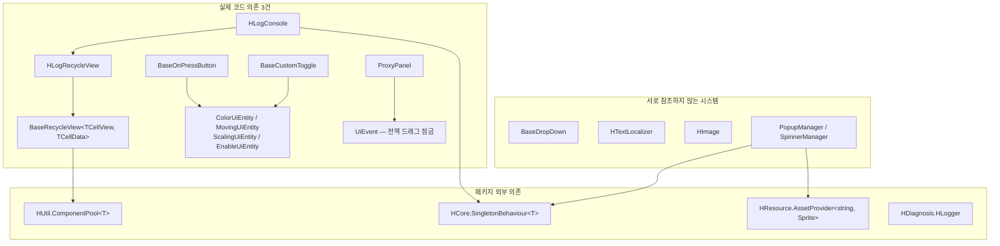
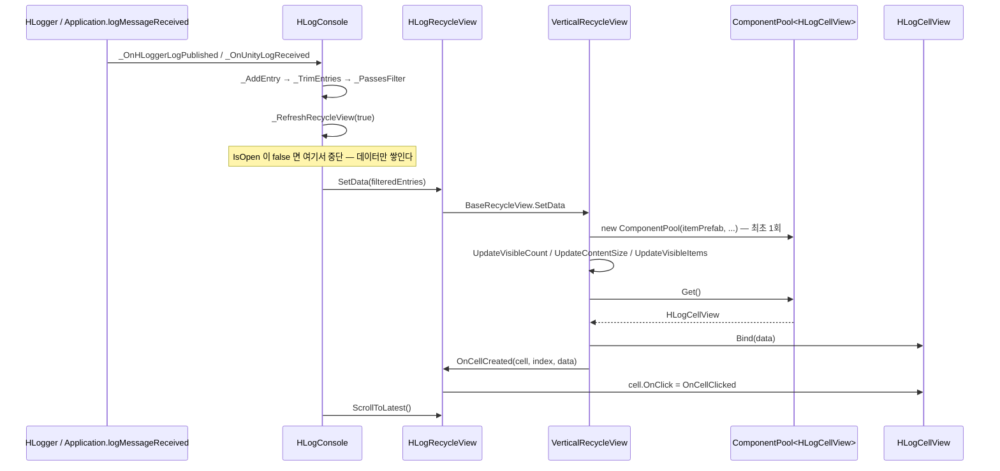

# HCUP.HUI

> 어셈블리: `HCUP.HUI` (`Runtime/HCUP.HUI.asmdef`, rootNamespace `HUI`)
> 의존: `UniTask`, `Unity.TextMeshPro`, `HCUP.HUtil`, `HCUP.HDiagnosis`, `HCUP.HInspector`, `HCUP.HCore`, `DOTween.Modules`, `HCUP.HResource`
> 동반 어셈블리: `HCUP.HUI.Editor` (인스펙터 확장 5종 — [Editor/README.md](../Editor/README.md))

---

## 요약

HUI 는 **UI 컴포넌트 라이브러리**다. 게임 로직은 들어 있지 않고, 8개 시스템이 서로 거의
독립적으로 존재한다. 시스템 간 실제 코드 의존은 세 갈래뿐이다.

1. `DebugConsole` → `ScrollView` (`HLogRecycleView : VerticalRecycleView<HLogCellView, HLogCellData>`,
   `HLogRecycleView.cs:6`)
2. `Button` / `Toggle` → `Entity` (색·이동·스케일·활성 적용을 `*UiEntity` 직렬화 클래스에 위임)
3. `Panel` → `UiEvent` (`ProxyPanel.SetAutoDragCheck` 가 전역 드래그 잠금을 잡는다, `ProxyPanel.cs:42-43`)

나머지는 서로를 참조하지 않는다. 그래서 이 문서는 **지도와 공통 규약만** 다루고, 각 시스템의
동작은 아래 시스템 문서로 내린다.

---

## 시스템 지도

| 시스템 | 문서 | 파일 | 대표 타입 | 네임스페이스 |
|---|---|---|---|---|
| 재활용 스크롤뷰 | [../docs/Scrollview.md](../docs/Scrollview.md) | 10 | `BaseRecycleView<TCellView, TCellData>` | `HUI.ScrollView` |
| 입력 컨트롤 (버튼·토글·엔티티) | [../docs/InputControls.md](../docs/InputControls.md) | 20 | `DelegateButton` / `BaseCustomToggle` / `ColorUiEntity` | `HUI.ButtonUI` `HUI.ToggleUI` `HUI.Entity` |
| 오버레이 (팝업·스피너) | [../docs/Overlay.md](../docs/Overlay.md) | 9 | `PopupManager<T>` / `SpinnerManager` | `HUI.Popup` `HUI.Spinner` |
| 디버그 콘솔 | [../docs/DebugConsole.md](../docs/DebugConsole.md) | 6 | `HLogConsole` | `HUI.DebugConsole` |
| 드롭다운 | [../docs/DropDown.md](../docs/DropDown.md) | 6 | `BaseDropDown<TData, TUnit>` | `HUI.Dropdown` |
| 텍스트 / 로컬라이제이션 | [../docs/Text.md](../docs/Text.md) | 6 (+에디터 4) | `HTextLocalizer` | `HUI.TextUI` |
| 패널 / 포인터 프록시 | [../docs/Panel.md](../docs/Panel.md) | 4 | `ProxyPanel` / `UiEvent` | `HUI.Panel` + 전역 |
| 이미지 / 그래픽 | [../docs/Graphic.md](../docs/Graphic.md) | 2 (+에디터 1) | `HImage` | `HUI.ImageUI` `HUI.Graphic` |

합계 63 런타임 파일. `Samples~/` 8 파일은 Unity 가 컴파일하지 않으므로 이 문서의 호출처 집계에서 제외한다.



---

## 공통 규약

코드에서 실제로 확인되는 규약만 적는다.

### 1. UI 는 이벤트를 발화하고, 로직은 밖에 있다

`DelegateButton` 은 Unity `Button` 을 상속하지만 자신은 아무 것도 하지 않는다. `interactable`
검사 후 `Action` 을 쏘는 것이 전부다.

```csharp
// Button/DelegateButton.cs:40-48
public override void OnPointerDown(PointerEventData eventData) {
    base.OnPointerDown(eventData);
    if (interactable) OnPointDown?.Invoke();
}
```

`ProxyPanel` 은 이 규약의 극단이다 — 10개 Unity 포인터 인터페이스를 전부 구현하고, 각각을
동명의 `event Action<PointerEventData>` 로 그대로 넘긴다 (`ProxyPanel.cs:45-54`). 자체 상태가 없다.

**예외 하나:** `HLogConsole` 은 UI 컴포넌트이면서 로그 수집·필터·저장 로직을 직접 갖는다
(`HLogConsole.Actions.cs`). 도구성 컴포넌트라 매니저를 따로 두지 않은 것으로 보인다.

### 2. 접두 규칙

| 접두 | 의미 | 예 |
|---|---|---|
| `H` | HCUP 이 Unity 타입을 상속·대체한 것 | `HImage : Image`, `HText : Text`, `HTmpText : TextMeshProUGUI`, `HLogConsole` |
| `Base` | 상속 전제의 추상/기반 타입 | `BaseRecycleView`, `BaseCustomToggle`, `BaseOnPressButton`, `BasePopupUi`, `BaseDropDown` |
| `I` | 인터페이스 | `IRecycleView`, `IDropUnit`, `IBasicPanel` |
| `_` | private 메서드 | `_Init`, `_RefreshBackground`, `_HideSafely` |

필드는 camelCase + `[SerializeField]`, 프로퍼티는 PascalCase 노출이 일관되게 지켜진다.

### 3. `HInspector` 속성으로 인스펙터를 구성한다

`[HTitle]` 로 섹션을 나누고 `[HShowIf]` / `[HHideIf]` / `[HOnValueChanged]` / `[HButton]` /
`[HReadOnly]` / `[HListDrawer]` 로 조건부 노출을 만든다. Odin 유무와 무관하게 동작하는 자체 구현이다.

### 4. 정적 상태는 `RuntimeInitializeOnLoadMethod` 로 리셋한다

Domain Reload 비활성 환경에서 이전 플레이의 상태가 잔존하는 것을 막는 방어가 두 곳에 있다.

```csharp
// UiEvent.cs:25-29
[UnityEngine.RuntimeInitializeOnLoadMethod(UnityEngine.RuntimeInitializeLoadType.SubsystemRegistration)]
private static void _ResetStatics() { dragOwner = null; IsDragging = false; }
```

`HTextLocalizer` 도 동일하게 `GetText` / `OnLanguageChanged` 를 비운다 (`HTextLocalizer.cs:12-16`).
**정적 상태를 가진 나머지 타입은 이 방어가 없다** — `SingletonBehaviour<T>.instance` 는 `OnDestroy`
의존이다.

### 5. 싱글톤은 `HCore.SingletonBehaviour<T>` 하나로 통일된다

`PopupManager<T>` / `SpinnerManager` / `HLogConsole` 셋 다 이것을 상속한다. `Awake` 에서 중복
인스턴스를 `Destroy` 하므로, **파생 `Awake` 는 `base.Awake()` 뒤에 `instance != this` 를 확인해야
한다.** 실제로 그렇게 하는 곳은 `SpinnerManager` 한 곳뿐이다 (`SpinnerManager.cs:79`).

---

## 크로스커팅 흐름 — 셀 하나가 만들어지기까지

시스템 3개(`DebugConsole` → `ScrollView` → `HUtil.ComponentPool`)를 관통하는 유일한 흐름이다.



`OnCellCreated` 훅이 이 흐름의 확장점이다 — 풀에서 꺼낸 셀에 **매번** 외부 콜백을 다시 꽂는다.
풀 재사용 때문에 `Bind` 만으로는 셀의 이벤트 배선이 유지되지 않기 때문이다.

---

## 사용 예

```csharp
// 1) 버튼 — 이벤트만 구독한다. 눌림 연출은 ColorOnPressButton 컴포넌트가 따로 처리한다
GetComponent<DelegateButton>().OnPointUp += () => _StartGame();

// 2) 스크롤뷰 — 제네릭 파생 클래스를 만들고 SetData 만 부른다
public sealed class ItemListView : VerticalRecycleView<ItemCellView, ItemCellData> { }
itemListView.SetData(items);

// 3) 팝업 — PopupManager<T> 를 상속한 프로젝트 매니저를 통해 진입
MyPopupManager.Instance.ShowLog(PopLevel.Warning, "저장 실패", "다시 시도하시겠습니까?",
    onClickOk: _Retry, onClickCancel: null);

// 4) 스피너 — 참조 카운트. Show 한 횟수만큼 Hide 해야 내려간다
SpinnerManager.Instance.Show(this, "불러오는 중...");
await SpinnerManager.Instance.Show(this, LoadAsync());   // await 오버로드는 finally 로 자동 Hide

// 5) 로컬라이제이션 — HTextLocalizer.GetText 델리게이트를 프로젝트가 채운다
HTextLocalizer.GetText = uid => myTable.Lookup(uid);
HTextLocalizer.RaiseLanguageChanged("ko");
```

---

## 주의할 점

시스템 개별 사항은 각 시스템 문서에 있다. 여기에는 **어셈블리 전역** 사항만 적는다.

### 계약

1. **`SingletonBehaviour<T>.Instance` 는 인스턴스가 없으면 `null` 을 반환한다** (로그만 남기고).
   `SpinnerManager.Instance.Show(...)` 같은 호출은 씬에 매니저가 없으면 `NullReferenceException`
   이 된다 (`HCore/SingletonBehaviour.cs:31-38`).
2. **`Samples~` 는 컴파일되지 않는다.** `DemoPopupManager` 등 8개 파일은 어떤 계약도 검증하지
   않는다. HUI 의 공개 API 중 패키지 내부 호출처가 0인 것이 여럿인 이유이기도 하다.

### 정리 대상 (전역)

3. **네임스페이스 없는 전역 타입이 2개 있다** — `UiEvent` (`UiEvent.cs:19`) 와 `IBasicPanel`
   (`Panel/IBasicPanel.cs:1`). 패키지가 전역 네임스페이스를 오염시킨다. 나머지 61개 파일은
   전부 `HUI.*` 하위다.
4. **DOTween 조건부 컴파일이 일관되지 않다.** `ColorUiEntity` 만 `#if DOTWEEN_PRO` 가드를 쓰고
   (`ColorUiEntity.cs:20-22, :176-182`), `MovingUiEntity.cs:3`·`ScalingUiEntity.cs:3`·`HDropDown.cs:20`
   은 `using DG.Tweening;` 을 무조건 연다. asmdef 는 `DOTween.Modules` 를 무조건 참조하고
   `defineConstraints` 는 비어 있으므로 — **DOTween 이 없으면 어셈블리 전체가 컴파일되지 않는다.**
   `ColorUiEntity` 의 가드는 실질적으로 무의미하다.
5. **`Entity/IAttachable.cs` 는 구현체도 호출처도 없다** (전역 grep 1건 = 선언 자신).
6. **`Graphic/SpriteUtil.cs` 는 호출처가 0이고, 주석이 전부 깨진 인코딩이다** (`SpriteUtil.cs:9-12, :22-38`).
   로직은 `HImage._CalcOffsetPx` 와 동일하다 ([Graphic.md](../docs/Graphic.md) 참조).
7. **`Popup/AlertPopup.cs` 는 어디서도 인스턴스화되지 않는다.** `OnReturn`/`OnDispose` 는 풀 콜백
   시그니처를 흉내내지만 이 클래스를 담는 풀이 없다 (전역 grep 3건 = 전부 자기 파일).

### 상위 폴더 README 와의 관계

8. `HUI/README.md` 는 1.0.0 시점 패키지 소개 문서다. 폴더별 파일 수(`Scrollview(10)` 등)는 현행과
   일치하지만 `Text` 폴더(6파일)가 목록에 없다. 어셈블리 구조·계약은 이 문서가 현행이다.

---

## 확장 지점

| 하고 싶은 것 | 손댈 곳 |
|---|---|
| 새 버튼 연출 (예: 회전) | `BaseOnPressButton` 상속 + 새 `*UiEntity` 직렬화 클래스 |
| 새 스크롤 레이아웃 | `BaseRecycleView<TCellView, TCellData>` 의 추상 5종 구현 |
| 셀에 외부 콜백 배선 | `BaseRecycleView.OnCellCreated` 오버라이드 (`BaseRecycleView.cs:193`) |
| 프로젝트 전용 팝업 매니저 | `PopupManager<T>` 상속 (`T` 는 자기 자신) |
| 로컬라이제이션 백엔드 교체 | `HTextLocalizer.GetText` 대입 + `RaiseLanguageChanged` 호출 |
| 새 포인터 이벤트 중계 | `ProxyPanel` 에 인터페이스 + `event` 추가 |
| 인스펙터 확장 | `HCUP.HUI.Editor` — [Editor/README.md](../Editor/README.md) |
