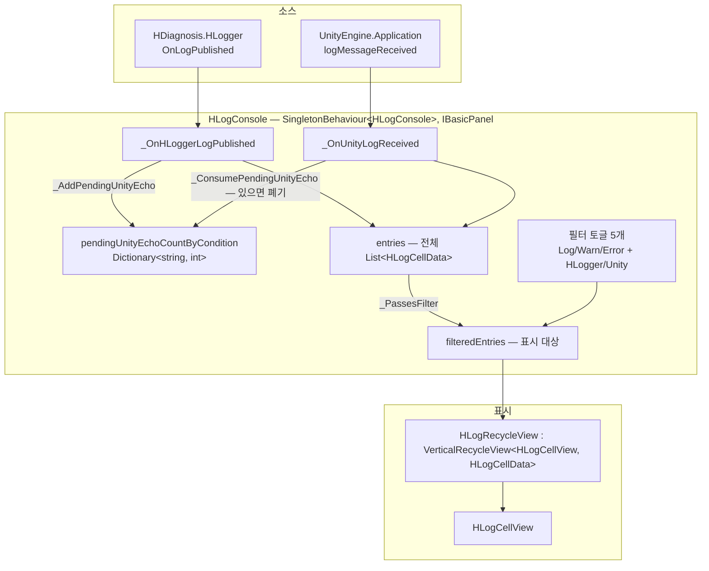
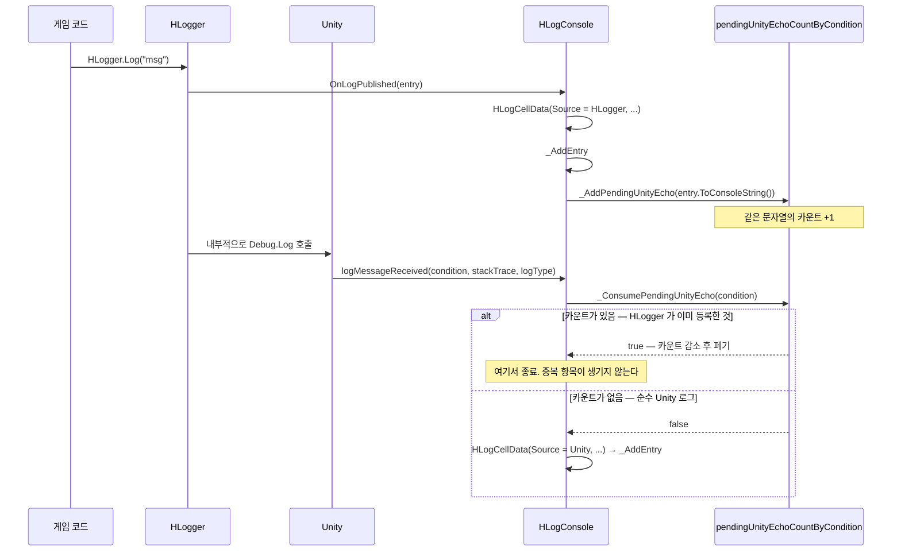
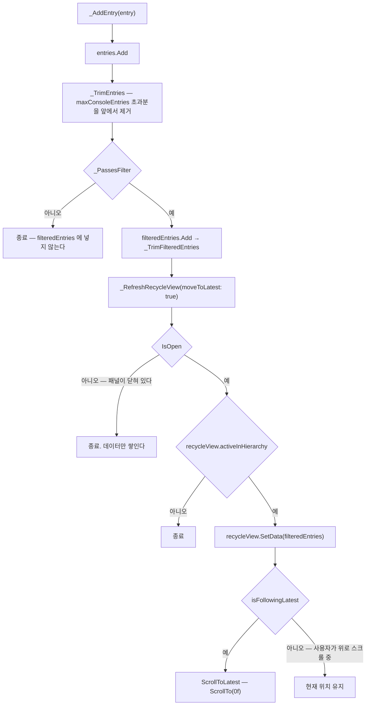
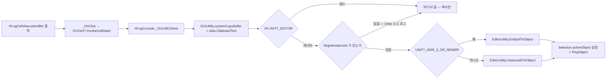
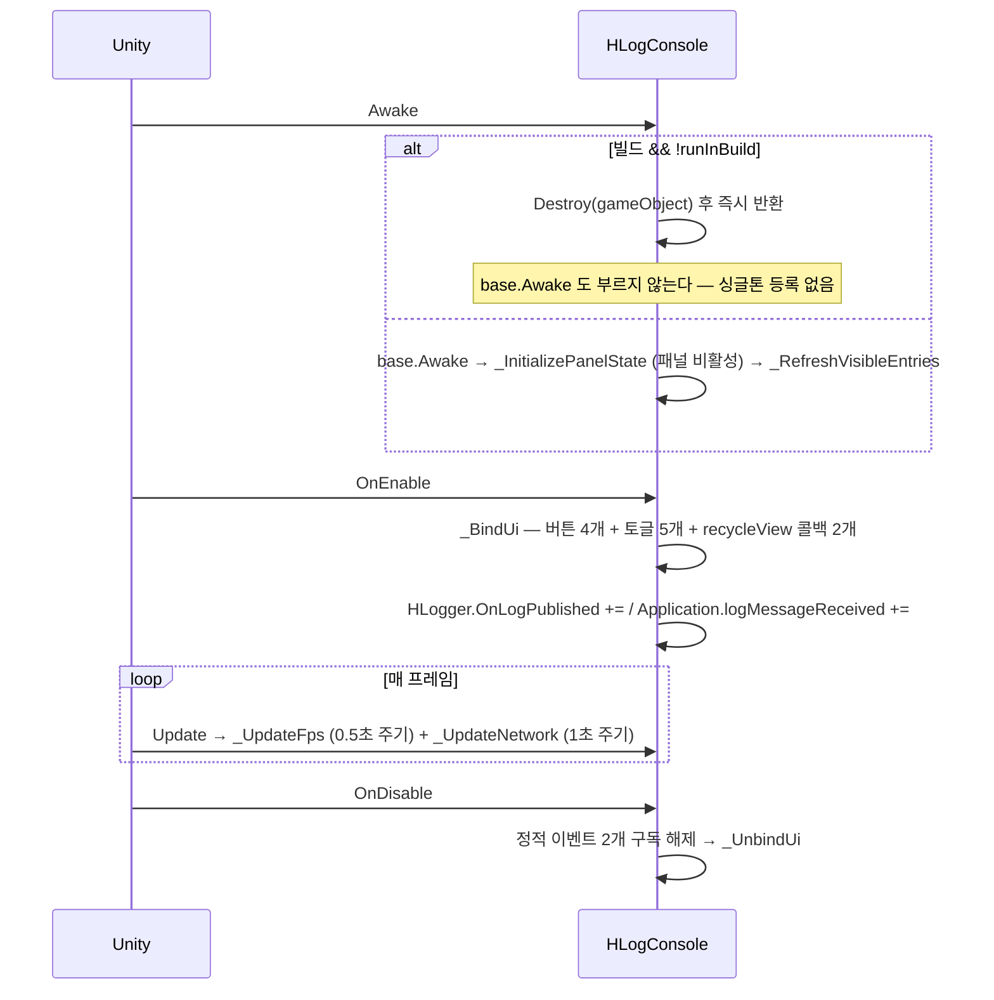

# DebugConsole — 런타임 로그 콘솔

> 어셈블리: `HCUP.HUI` — [Runtime/README.md](../Runtime/README.md)
> 네임스페이스: `HUI.DebugConsole`
> 파일: `Runtime/HUI/DebugConsole/` 6개 (587행)

---

## 요약

**빌드에서도 동작하는 인게임 로그 뷰어**다. 두 소스에서 로그를 받아 하나의 리스트로 합치고,
필터·저장·클립보드 복사·에디터 핑을 제공한다.

- `HLogger.OnLogPublished` — HCUP 자체 로거
- `Application.logMessageReceived` — Unity 전역

두 소스가 겹치는 문제가 이 시스템의 중심이다. `HLogger` 는 내부에서 `Debug.Log` 를 호출하므로
같은 로그가 Unity 콜백으로도 한 번 더 도착한다. **중복 제거를 위해 pending echo 카운터**를 둔다
(`HLogConsole.Actions.cs:187-208`).

`HLogConsole` 은 이 어셈블리에서 **UI 컴포넌트가 로직을 직접 갖는 유일한 예외**다
(README 의 "이벤트만 발화" 규약에서 벗어난다). 도구성 컴포넌트라 매니저를 분리하지 않았다.

---

## 파일 지도

| 경로 | 행 | 역할 |
|---|---|---|
| `HLogConsole.cs` | 169 | 필드·프로퍼티·정적 로그 헬퍼 + 에디터 테스트 도구 |
| `HLogConsole.Lifecycle.cs` | 37 | `Awake`/`OnEnable`/`OnDisable`/`Update` (partial) |
| `HLogConsole.Actions.cs` | 267 | 수집·필터·중복 제거·저장·FPS·네트워크 (partial) |
| `HLogCellData.cs` | 63 | 로그 1건 DTO. `HLogSource` enum 포함 |
| `HLogCellView.cs` | 72 | 셀. 레벨별 색 막대 + 클릭 |
| `HLogRecycleView.cs` | 39 | `VerticalRecycleView` 파생. 최신 추적 상태 |

partial 3분할 규약은 프로젝트의 `클래스명.기능.cs` 명명을 따른다.

---

## 계층 구조



---

## 데이터 모델

```csharp
// HLogCellData.cs:11-36 (요약)
public sealed class HLogCellData {
    public HLogSource Source { get; }          // HLogger | Unity
    public LogLevel Level { get; }             // HDiagnosis.Logger.LogLevel
    public DateTimeOffset Timestamp { get; }
    public string Message { get; }
    public string Debug { get; }               // HLogger 의 부가 문자열 / Unity 의 stackTrace
    public int? TargetInstanceId { get; }      // HLogger 만 채운다. 에디터 핑에 쓰인다
    public string DisplayText { get; }         // 생성자에서 1회 조립 — HH:mm:ss
    public string ClipboardText { get; }       // 생성자에서 1회 조립 — yyyy-MM-dd HH:mm:ss
}
```

`DisplayText` / `ClipboardText` 를 **생성자에서 미리 만든다**. 셀이 재활용될 때마다 문자열을
다시 조립하지 않기 위한 선택이다 (`:34-35`). 두 문자열의 차이는 타임스탬프 형식뿐이다.

Unity `LogType` → `LogLevel` 변환은 정적 헬퍼가 담당한다 — `Assert`/`Exception` 이 `Error` 로
접힌다 (`HLogCellData.cs:50-61`).

---

## 흐름 1 — 로그 수집과 중복 제거



매칭 키가 **로그 문자열 전체**(`condition`)라는 점이 이 방식의 성질을 결정한다. 같은 문자열이
서로 다른 경로로 여러 번 오면 카운트로만 구분되고, 순서가 뒤바뀌어도 문자열이 같으면 소거된다.

---

## 흐름 2 — 항목 추가와 표시 갱신



`Open()` 이 `_RefreshRecycleView(true)` 를 부르므로 (`HLogConsole.Actions.cs:14-17`), 닫혀 있는
동안 쌓인 항목은 열 때 한꺼번에 반영된다.

### 최신 추적 상태

사용자가 위로 스크롤하면 새 로그가 와도 따라가지 않아야 한다. 그 판정을 `HLogRecycleView` 가 한다.

```csharp
// HLogRecycleView.cs:12-23
public bool IsAtLatest(float tolerance = 0.001f) {
    if (scrollRect == null) return true;
    if (Count <= VisibleCount) return true;
    return scrollRect.verticalNormalizedPosition <= tolerance;
}

public void ScrollToLatest() {
    if (scrollRect == null) return;
    isProgrammaticScroll = true;    // 자기 스크롤이 추적 해제로 오인되지 않게 한다
    ScrollTo(0f);
    isProgrammaticScroll = false;
}
```

`isProgrammaticScroll` 가드가 없으면 `ScrollToLatest` 자신이 `onValueChanged` 를 유발해
`isFollowingLatest` 를 흔든다.

---

## 흐름 3 — 셀 클릭



셀의 `OnClick` 은 `Bind` 가 아니라 **`OnCellCreated` 훅**으로 꽂힌다 (`HLogRecycleView.cs:30-32`).
풀 재사용 때문에 셀이 이전 콜백을 들고 있을 수 있기 때문이다.

`Bind` 는 리스너를 **제거한 뒤 추가**해 중복 구독을 막는다 (`HLogCellView.cs:38-39`).

---

## 수명



`runInBuild` 는 `#if !UNITY_EDITOR` 안에서만 검사되므로 **에디터에서는 항상 동작한다**
(`HLogConsole.Lifecycle.cs:8-13`).

---

## 저장 경로

```csharp
// HLogConsole.Actions.cs:254-263
private string _GetSaveFilePath() {
    string fileName = $"{DateTime.Now:yyyyMMdd_HHmmss}_HLog.txt";
#if UNITY_EDITOR
    string baseFolder = Path.IsPathRooted(editorSaveFolder)
        ? editorSaveFolder
        : Path.Combine(Application.dataPath, editorSaveFolder);
    return Path.Combine(baseFolder, fileName);
#else
    return Path.Combine(Application.persistentDataPath, fileName);
#endif
}
```

저장 대상은 `filteredEntries` 가 아니라 **`entries` 전량**이다 (`:36`). 필터는 표시에만 관여한다.

---

## 사용 예

```csharp
// 1) 씬에 프리팹 배치 후 인스펙터 배선 — panelRoot / recycleView / 버튼 4 / 토글 5 / fpsText / networkText

// 2) 로그 — HLogger 를 직접 써도 되고, 정적 프록시를 써도 된다
HLogConsole.Log("세이브 완료");
HLogConsole.Error("서버 응답 없음", gameObject, debug: lastResponseJson);

// 3) 열기/닫기 — IBasicPanel
HLogConsole.Instance.Open();
HLogConsole.Instance.Close();

// 4) 파일로 내보내기
HLogConsole.Instance.Save();     // 에디터: Assets/Logs/, 빌드: persistentDataPath
```

---

## 주의할 점

### 계약

1. **패널이 닫혀 있으면 뷰가 갱신되지 않는다** (`HLogConsole.Actions.cs:90`). `entries` 와
   `filteredEntries` 는 계속 쌓이고, `Open()` 시점에 한 번에 반영된다.
2. **`maxConsoleEntries <= 0` 이면 트리밍이 꺼진다** (`:144, :152`). 기본값은 2000이며, 0 이하로
   두면 무한히 쌓인다.
3. **`entries` 와 `filteredEntries` 를 각각 트리밍한다.** 필터가 좁으면 `filteredEntries` 가
   상한에 닿지 않으므로 두 리스트의 잘림 경계가 어긋난다 — 필터를 넓히면
   `_RefreshVisibleEntries` 가 `entries` 로부터 다시 만든다 (`:159-164`).
4. **저장은 `entries` 전량이다** (`:36`). 화면에 보이는 것만 저장되지 않는다.
5. **`runInBuild = false` 인 빌드에서는 `Awake` 가 `base.Awake` 를 건너뛴다**
   (`HLogConsole.Lifecycle.cs:9-12`). 싱글톤 등록 전에 파괴되므로 `HLogConsole.Instance` 는
   `FindFirstObjectByType` 을 거쳐 `null` 을 반환하고 `HLogger.Log` 를 부르는 정적 프록시는
   여전히 동작한다 (그것들은 인스턴스를 쓰지 않는다).
6. **에디터 핑은 `HLogger` 소스 로그에만 된다.** Unity 소스 로그는 `TargetInstanceId` 가 `null`
   이다 (`HLogConsole.Actions.cs:126`).

### 정리 대상

7. **중복 제거 카운터가 무한히 자랄 수 있다.** `_AddPendingUnityEcho` 는 매 `HLogger` 로그마다
   항목을 넣지만 (`:114`), 대응하는 Unity 콜백이 오지 않으면 (예: `HLogger` 가 특정 레벨에서
   `Debug.*` 를 호출하지 않는 경우) 그 항목은 **영원히 소비되지 않는다.** `pendingUnityEcho...`
   에는 상한도 만료도 없고, 비워지는 유일한 경로가 `Clear()` 다 (`:26`).
8. **`_UpdateFps` / `_UpdateNetwork` 가 매 프레임 무조건 돈다** (`HLogConsole.Lifecycle.cs:31-34`).
   패널이 닫혀 있어도 `fpsText.text` / `networkText.text` 를 갱신해 TMP 리빌드를 유발한다.
   `IsOpen` 가드가 없다.
9. **`fpsInterval` / `networkInterval` 은 `[SerializeField]` 가 아니다** (`HLogConsole.cs:64, :68`).
   하드코딩 0.5초/1초이고 인스펙터에서 조정할 수 없다.
10. **`fpsText` / `networkText` 에 null 검사가 없다** (`:239, :250`). 배선을 빠뜨리면 매 프레임
    `NullReferenceException` 이다. 필터 토글 5개에는 null 허용 검사가 있다 (`:172-183`).
11. **`using System.Collections;` 가 릴리즈 빌드에서 미사용이다** (`HLogConsole.cs:4`).
    `IEnumerator` 는 `#if UNITY_EDITOR` 블록 안에서만 쓰인다 (`:138`).
12. **`_OnFilterChanged(bool isOn)` 의 인자가 쓰이지 않는다** (`:100-102`). `Toggle.onValueChanged`
    시그니처를 맞추기 위한 것이며, 어떤 토글이 바뀌었는지 무관하게 전량 재계산한다.
13. **`HLogCellView.Dispose()` 는 호출되지 않는다.** `BaseRecycleView` 가 셀의 `Dispose` 를 부르지
    않기 때문이다 ([Scrollview.md](Scrollview.md) §정리 대상 13). 다만 `Bind` 가
    `RemoveListener` 를 먼저 하므로 리스너 누수는 없다 (`HLogCellView.cs:38`).
14. **`HLogRecycleView` 가 `scrollRect.onValueChanged` 를 두 번 구독한다.** 기반
    `VerticalRecycleView.Awake` 가 `_OnScrollValueChanged` 를 (`VerticalRecycleView.cs:51`),
    파생 `Awake` 가 `_OnScrollChanged` 를 (`HLogRecycleView.cs:27`) 각각 등록한다. 의도된 분업이나,
    두 리스너 모두 해제 경로가 없다.

---

## 확장 지점

| 하고 싶은 것 | 손댈 곳 |
|---|---|
| 새 로그 소스 (예: 서버 로그) | `HLogSource` enum + `_PassesSourceFilter` + 새 구독 (`HLogConsole.Lifecycle.cs:19-23`) |
| 표시 형식 변경 | `HLogCellData._BuildDisplayText` / `_BuildClipboardText` |
| 레벨 색 변경 | `HLogCellView` 의 `LOG_COLOR` / `WARN_COLOR` / `ERROR_COLOR` (`:10-12`) |
| 검색어 필터 추가 | `_PassesFilter` (`HLogConsole.Actions.cs:166-169`) + 입력 UI + `_RefreshVisibleEntries` 호출 |
| 저장 포맷 (JSON 등) | `Save()` (`:31-45`) — `_GetSaveFilePath` 는 확장자를 하드코딩한다 |
| 셀 클릭 동작 | `_OnCellClicked` (`:210-230`) |
| 성능 지표 추가 (메모리 등) | `HLogConsole.Lifecycle.cs:31-34` 의 `Update` + `_Update*` 패턴 |
| 에디터에서 로그 폭주 재현 | `[ContextMenu("Start Random Log (1/sec)")]` (`HLogConsole.cs:119`) |
