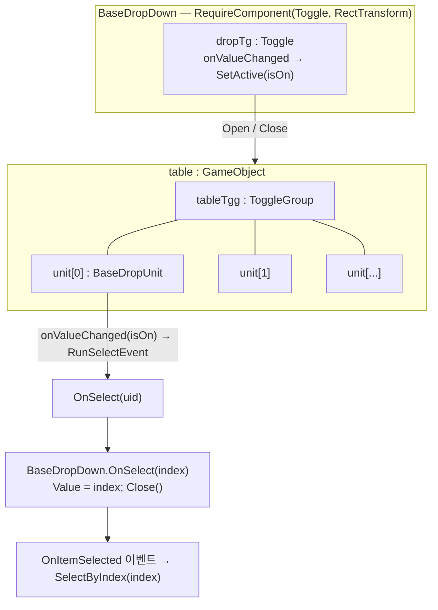
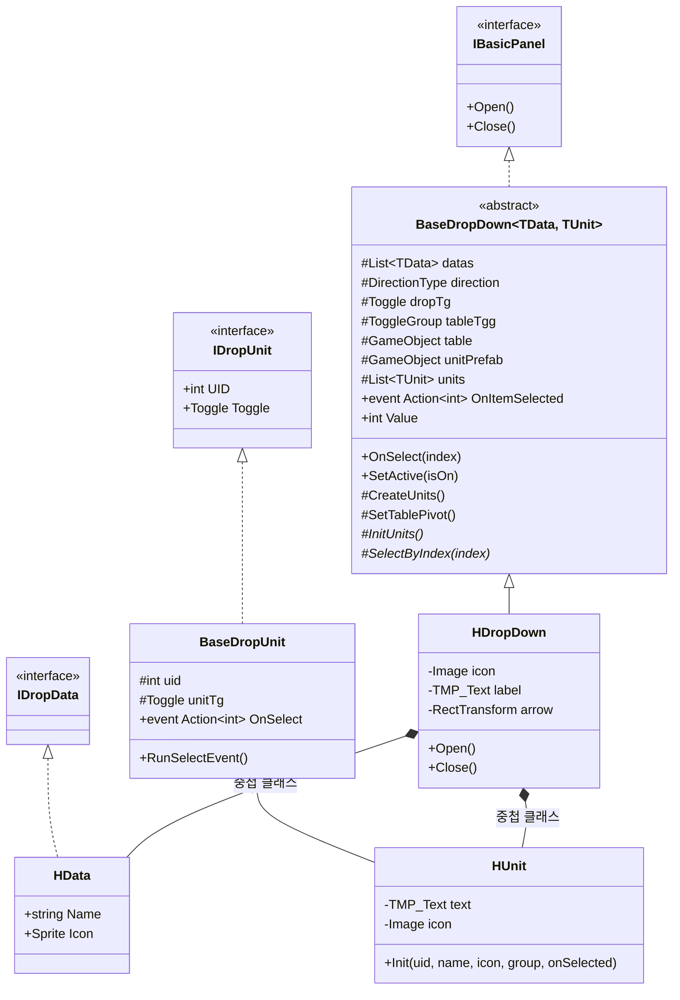
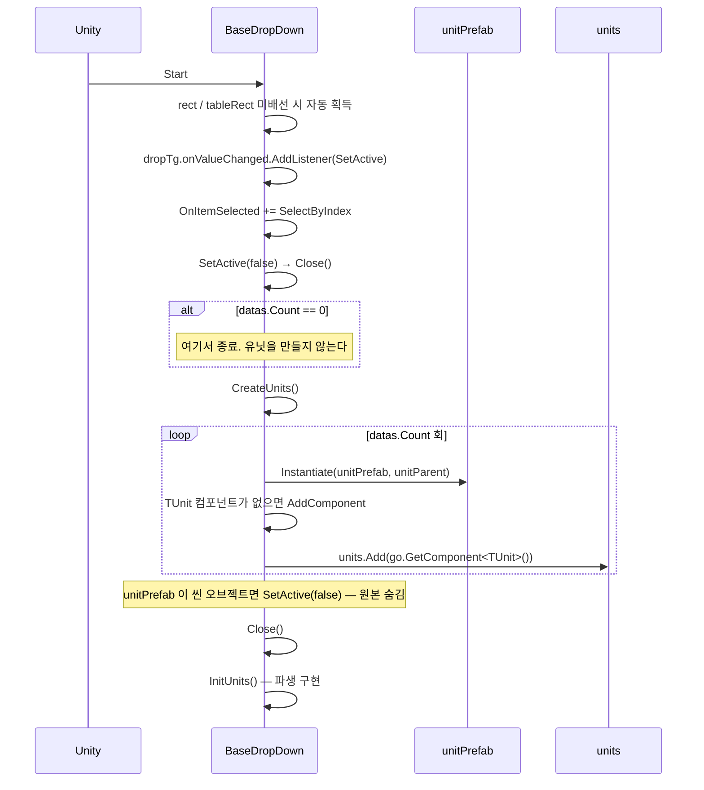
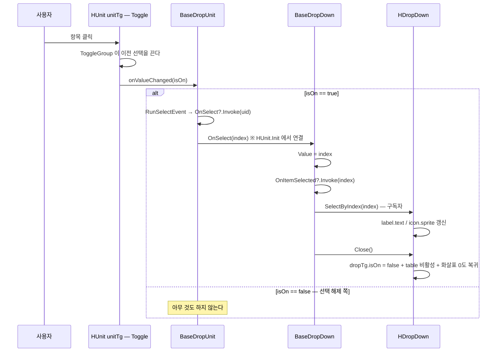
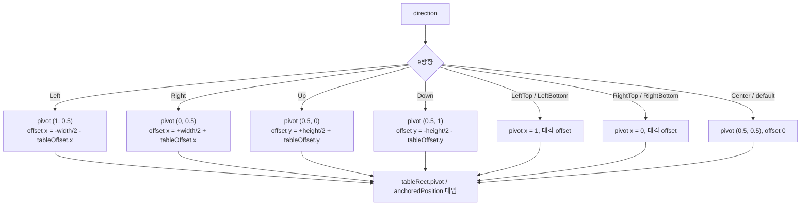

# DropDown — 드롭다운

> 어셈블리: `HCUP.HUI` — [Runtime/README.md](../Runtime/README.md)
> 네임스페이스: `HUI.Dropdown`
> 파일: `Runtime/HUI/DropDown/` 6개 (392행)

---

## 요약

**Unity `Toggle` 두 겹으로 만든 드롭다운**이다. 바깥 `Toggle` 하나가 테이블 열림/닫힘을 담당하고,
테이블 안의 항목마다 `Toggle` 이 하나씩 있으며 `ToggleGroup` 이 단일 선택을 강제한다.



**`Value` 세터가 이벤트 발화 지점이다.** 그리고 `Start` 에서 자기 자신의 `SelectByIndex` 를 그
이벤트에 구독한다 (`BaseDropDown.cs:79`) — 즉 선택 반영도 외부 알림과 같은 경로로 흐른다.

---

## 파일 지도

| 경로 | 행 | 역할 |
|---|---|---|
| `BaseDropDown.cs` | 227 | 추상 본체. 데이터·유닛 생성·테이블 배치·선택 이벤트 |
| `BaseDropUnit.cs` | 52 | 항목 기반. `uid` + `Toggle` + `OnSelect` |
| `HDropDown.cs` | 92 | 유일한 구체 구현. 아이콘·라벨·화살표 회전 |
| `IDropData.cs` | 2 | 빈 마커 인터페이스 |
| `IDropUnit.cs` | 7 | `UID` / `Toggle` |
| `DirectionType.cs` | 12 | 9방향 (`Left`~`RightBottom`, `Center`) |

---

## 계층 구조



제네릭 제약은 `TData : IDropData, new()` / `TUnit : MonoBehaviour, IDropUnit`
(`BaseDropDown.cs:27-28`). `new()` 제약이 있으나 `BaseDropDown` 안에서 `new TData()` 를 하는 곳은
없다.

---

## 흐름 1 — 초기화



`HDropDown.InitUnits` 는 각 유닛에 `uid = 인덱스`, 이름·아이콘·`ToggleGroup`·선택 콜백을 꽂고,
0번을 `isOn = true` 로 켠 뒤 `SelectByIndex(0)` 로 라벨을 맞춘다 (`HDropDown.cs:74-84`).

`HUnit.Init` 은 매번 `RemoveAllListeners` 를 먼저 해 중복 구독을 막는다 (`:46`). 다만
`OnSelect += onSelected` 는 누적된다 (`:43`).

---

## 흐름 2 — 항목 선택



`Close()` 안에서 `dropTg.isOn = false` 를 하면 `dropTg.onValueChanged → SetActive(false) → Close()`
로 한 번 더 들어온다 (`HDropDown.cs:67`). 두 번째 `Close` 는 이미 꺼진 값을 다시 대입하므로
Unity `Toggle` 이 이벤트를 발화하지 않아 재귀는 2단계에서 멈춘다.

---

## 흐름 3 — 테이블 위치 (`SetTablePivot`)

`direction` 값을 인스펙터에서 바꾸면 `[HOnValueChanged("SetTablePivot")]` 가 즉시 재배치한다
(`BaseDropDown.cs:34`). 런타임 호출처는 없다.



**`LeftTop` 은 pivot `(1, 0)`, `LeftBottom` 은 `(1, 1)` 이다** (`:147-154`). 이름과 pivot 의 y 가
반대로 보이는데, pivot 은 "테이블의 어느 점을 기준점에 맞출지"이므로 아래로 펼치려면 pivot y 가
1이어야 한다. 이름은 **버튼 기준 방향**이 아니라 반대 규약으로 읽어야 한다.

`Right*` 두 항목의 x offset 부호는 `Left*` 와 대칭이 아니다 — 둘 다 `- tableOffset.x` 다
(`:157, :161`). `Right` 단독 케이스는 `+ tableOffset.x` 다 (`:137`).

---

## 사용 예

```csharp
// 1) 기성 HDropDown 사용 — 데이터는 코드로 넣어야 한다 (아래 §정리 대상 6)
var dd = GetComponent<HDropDown>();
dd.OnItemSelected += index => _ApplyOption(index);

// 2) 자체 드롭다운 만들기
public sealed class LangDropDown : BaseDropDown<LangDropDown.Data, LangDropDown.Unit> {
    [Serializable] public class Data : IDropData { public string Code; }
    public class Unit : BaseDropUnit {
        [SerializeField] TMP_Text label;
        public void Init(int uid, string code, ToggleGroup group, Action<int> onSelected) {
            this.uid = uid;
            label.text = code;
            OnSelect += onSelected;
            unitTg.group = group;
            unitTg.onValueChanged.RemoveAllListeners();
            unitTg.onValueChanged.AddListener(isOn => { if (isOn) RunSelectEvent(); });
        }
    }

    protected override void InitUnits() {
        for (int k = 0; k < datas.Count; k++) units[k].Init(k, datas[k].Code, tableTgg, OnSelect);
        SelectByIndex(0);
    }
    protected override void SelectByIndex(int index) => HTextLocalizer.RaiseLanguageChanged(datas[index].Code);
}
```

---

## 주의할 점

### 계약

1. **유닛은 `Start` 에서 단 한 번 생성된다** (`BaseDropDown.cs:82-85`). `datas` 를 나중에 바꾸는
   API 가 없다. 데이터 변경 = 오브젝트 재생성이다.
2. **`datas.Count == 0` 이면 `InitUnits` 조차 돌지 않는다** (`:82`). 파생 클래스의 초기 라벨 설정도
   같이 건너뛰어진다.
3. **`ToggleGroup` 이 단일 선택을 보장한다.** `tableTgg` 배선을 빠뜨리면 여러 항목이 동시에
   켜지고 `RunSelectEvent` 가 중복 발화한다.
4. **`Value` 세터는 값이 같아도 이벤트를 쏜다** (`:65-71`). 같은 항목을 다시 눌러도
   `OnItemSelected` 가 발화한다.
5. **`OnSelect(int index)` 의 인자는 `uid` 다** (`BaseDropUnit.cs:36`). `HDropDown` 이 `uid = 배열
   인덱스`로 배선하기 때문에 (`HDropDown.cs:79`) 둘이 같을 뿐이다. `uid` 를 다르게 배선하면
   `SelectByIndex(index)` 의 `datas[index]` 가 범위를 벗어난다 (`:87`).

### 정리 대상

6. **`HDropDown.HData` 는 Unity 가 직렬화하지 못한다.**
   ```csharp
   // HDropDown.cs:27-30 — [Serializable] 이 없고 MonoBehaviour/ScriptableObject 도 아니다
   public class HData : IDropData {
       public string Name;
       public Sprite Icon;
   }
   ```
   기반의 `[SerializeField] protected List<TData> datas` (`BaseDropDown.cs:30-31`)는 이 타입으로는
   인스펙터에 나타나지도, 저장되지도 않는다. **`HDropDown` 은 인스펙터만으로는 항목을 채울 수
   없다.** `[Serializable]` 을 붙이면 해결된다.
7. **`HDropDown` 은 패키지 내 사용처가 0이다** (전역 grep 1건 = 선언 자신). `BaseDropDown` 의
   유일한 구체 구현이자 참조 예제다.
8. **`CreateUnits` 안에 죽은 지역 변수가 있다.**
   ```csharp
   // BaseDropDown.cs:108-115
   for (int k = 0; k < datas.Count; k++) {
       var index = k;                 // 사용되지 않는다
       var data = datas[index];       // 사용되지 않는다
       var go = Instantiate(unitPrefab, unitParent);
   ```
   데이터는 `InitUnits` 에서 별도로 다시 인덱싱된다.
9. **`haveUnit` 판정이 루프 밖에서 한 번만 이뤄진다** (`:107`). `TryGetComponent(typeof(TUnit), out
   var comp)` 의 `comp` 도 쓰이지 않는다. 프리팹은 모든 인스턴스가 같으므로 결과는 옳지만,
   `AddComponent(typeof(TUnit))` 직후 `GetComponent<TUnit>()` 로 다시 찾는 것(`:113-114`)은
   반환값을 버리는 중복이다.
10. **`SetTablePivot` 은 런타임 호출처가 없다** (`:123`). 에디터 `[HOnValueChanged]` 전용이므로
    `direction` 을 코드로 바꿔도 반영되지 않는다.
11. **`RightTop`/`RightBottom` 의 x offset 부호가 `Right` 와 다르다** (`:157, :161` vs `:137`).
    대칭성으로 보면 오타로 보이나(추론), 의도된 보정일 가능성도 있어 시각 확인이 필요하다.
12. **`IDropData` 는 멤버가 없는 빈 인터페이스다** (`IDropData.cs:2`). 제네릭 제약 표식 외에
    아무 계약도 강제하지 않는다.
13. **`BaseDropUnit` 은 `[Serializable]` 이면서 `MonoBehaviour` 다** (`BaseDropUnit.cs:22-23`).
    `MonoBehaviour` 는 이미 직렬화되므로 이 속성은 무효다.
14. **`units` 가 `[SerializeField]` 다** (`BaseDropDown.cs:59-60`). `CreateUnits` 가 `Add` 만 하고
    `Clear` 를 하지 않으므로, 인스펙터에 잔존 값이 남아 있으면 `units[k]` 인덱스가 `datas[k]` 와
    어긋난다.
15. **`IDropUnit.UID` / `Toggle` 을 통해 호출하는 코드가 없다** — 전부 구체 타입으로 접근한다.

---

## 확장 지점

| 하고 싶은 것 | 손댈 곳 |
|---|---|
| 새 드롭다운 종류 | `BaseDropDown<TData, TUnit>` 상속 + `InitUnits`/`SelectByIndex` 구현 |
| 항목 UI 변경 | `BaseDropUnit` 상속 + 자체 `Init` (기반에는 `Init` 이 없다 — 파생 규약) |
| 열림/닫힘 연출 | `Open`/`Close` 오버라이드 (`HDropDown.cs:61-71` 이 DOTween 예시) |
| 테이블 방향 추가 | `DirectionType` enum + `SetTablePivot` 의 `switch` |
| 런타임 데이터 교체 | **없음** — `CreateUnits`/`InitUnits` 를 다시 부르는 공개 경로를 새로 만들어야 한다 |
| 다중 선택 | `tableTgg`(`ToggleGroup`) 제거 + `OnSelect` 누적 처리 — 현재 구조로는 불가 |
