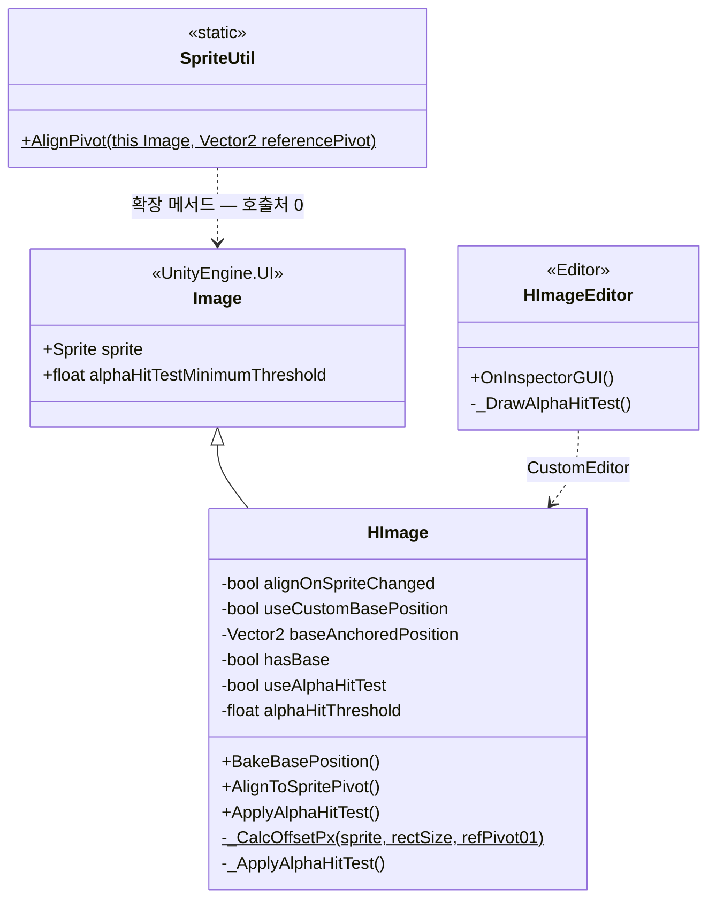
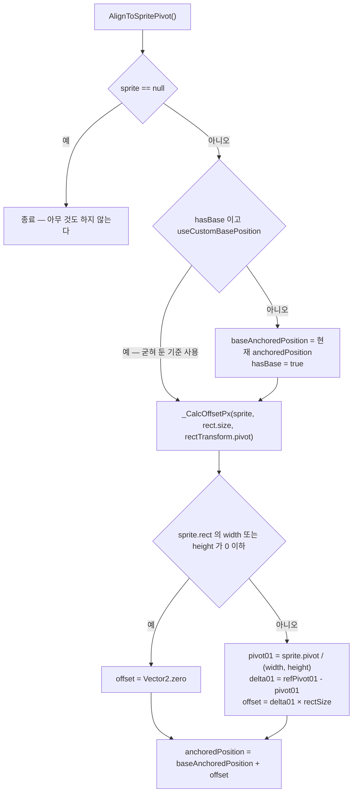
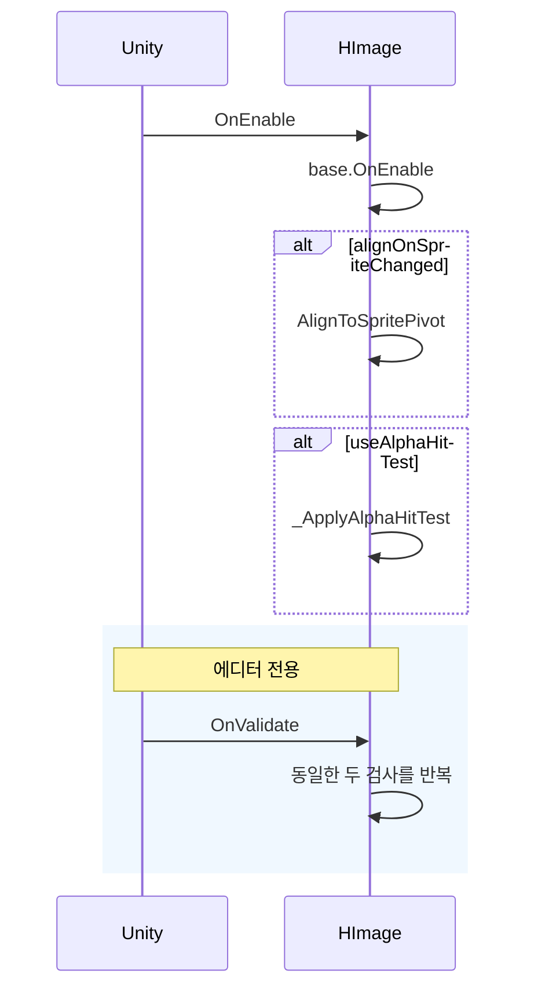

# Graphic — 이미지 · 스프라이트 피벗

> 어셈블리: `HCUP.HUI` — [Runtime/README.md](../Runtime/README.md) / `HCUP.HUI.Editor` — [Editor/README.md](../Editor/README.md)
> 네임스페이스: `HUI.ImageUI`, `HUI.Graphic`
> 파일: `Runtime/HUI/Image/HImage.cs` + `Runtime/HUI/Graphic/SpriteUtil.cs` + `Editor/HUI/Image/HImageEditor.cs` (285행)

---

## 요약

HUI 에서 가장 작은 시스템이고, **하나의 문제를 두 번 푼다.**

문제는 이것이다 — 스프라이트를 교체하면 스프라이트마다 pivot 이 달라서 화면상 위치가 튄다.
`RectTransform` 은 자기 pivot 만 알고 스프라이트 pivot 은 모른다.

해법은 **두 pivot 의 차이만큼 `anchoredPosition` 을 보정**하는 것이다.

```
offset = (rectTransform.pivot − sprite.pivot/spriteSize) × rectSize
```

이 계산이 `HImage._CalcOffsetPx` (`HImage.cs:96-113`) 와 `SpriteUtil.AlignPivot`
(`SpriteUtil.cs:13-42`) 두 곳에 **각각 구현되어 있다.** 차이는 기준 위치를 다루는 방식뿐이다.

| | `HImage.AlignToSpritePivot` | `SpriteUtil.AlignPivot` |
|---|---|---|
| 기준 위치 | `baseAnchoredPosition` 을 기억하고 **거기서부터** 계산 | 현재 위치에 **누적 가산** (`rt.anchoredPosition += offset`) |
| 반복 호출 | 안전 — 항상 같은 결과 | **위험** — 부를 때마다 밀린다 |
| 기준 pivot | `rectTransform.pivot` 을 그대로 사용 | 호출자가 인자로 지정 |
| 호출처 | `OnEnable` / `OnValidate` / 에디터 버튼 | **0건** |

---

## 파일 지도

| 경로 | 행 | 역할 |
|---|---|---|
| `Image/HImage.cs` | 138 | `UnityEngine.UI.Image` 상속. pivot 정렬 + 알파 히트 테스트 |
| `Graphic/SpriteUtil.cs` | 44 | `Image` 확장 메서드 1개. **사용처 없음** |
| `Editor/HUI/Image/HImageEditor.cs` | 103 | `ImageEditor` 상속 인스펙터. 액션 버튼 3개 |

---

## 계층 구조



---

## 데이터 모델

```csharp
// Image/HImage.cs:44-58
[HTitle("Pivot Align")]
[SerializeField] bool alignOnSpriteChanged = false;   // OnEnable/OnValidate 에서 자동 정렬할지
[SerializeField] bool useCustomBasePosition = true;   // 기억해 둔 base 를 쓸지, 매번 현재 위치를 base 로 볼지
[SerializeField, HideInInspector] Vector2 baseAnchoredPosition;   // Bake 로 굳힌 기준 위치
[SerializeField, HideInInspector] bool hasBase;                   // base 가 유효한지

[HTitle("Raycast (Alpha Hit Test)")]
[SerializeField] bool useAlphaHitTest;
[SerializeField, Range(0f, 1f)] float alphaHitThreshold = 0.2f;
```

`baseAnchoredPosition` / `hasBase` 는 `[HideInInspector]` 다 — 값이 아니라 **에디터 버튼으로
굳히는 상태**이기 때문이다. 그 버튼을 `HImageEditor` 가 그린다.

---

## 흐름 1 — pivot 정렬



`baseAnchoredPosition` **에서부터** 더하는 것이 요점이다 (`HImage.cs:91`). 누적이 아니므로
스프라이트를 몇 번 바꿔도 위치가 밀리지 않는다.

```csharp
// Image/HImage.cs:96-113
private static Vector2 _CalcOffsetPx(Sprite sprite, Vector2 rectSize, Vector2 refPivot01) {
    Assert.IsNotNull(sprite);
    Rect sr = sprite.rect;
    float width = sr.width, height = sr.height;
    if (width <= 0f || height <= 0f) return Vector2.zero;

    // sprite.pivot: 픽셀 좌표(좌하단 기준)
    Vector2 pivot01 = new Vector2(sprite.pivot.x / width, sprite.pivot.y / height);
    Vector2 delta01 = refPivot01 - pivot01;
    return new Vector2(delta01.x * rectSize.x, delta01.y * rectSize.y);
}
```

### 자동 호출 시점



**이름과 달리 `alignOnSpriteChanged` 는 스프라이트 변경을 감지하지 않는다.** `sprite` 프로퍼티
세터를 후킹하지 않으므로, 런타임에 `image.sprite = x` 로 바꿔도 정렬이 돌지 않는다.
호출되는 시점은 `OnEnable` 과 에디터 `OnValidate` 뿐이다 (`HImage.cs:62-74`).

---

## 흐름 2 — 알파 히트 테스트

투명 픽셀을 클릭 판정에서 제외한다. Unity 의 `alphaHitTestMinimumThreshold` 를 그대로 쓰되,
**텍스처 Read/Write 설정 누락을 에디터에서 경고**하는 것이 추가분이다.

```csharp
// Image/HImage.cs:121-135
private void _ApplyAlphaHitTest() {
    alphaHitTestMinimumThreshold = useAlphaHitTest ? Mathf.Clamp01(alphaHitThreshold) : 0f;
#if UNITY_EDITOR
    if (!useAlphaHitTest) return;
    if (sprite == null) return;
    var tex = sprite.texture;
    if (tex == null) return;
    if (!tex.isReadable) {
        HLogger.Warning(
            $"[HImage] Alpha Hit Test가 활성화되어 있으나, Texture Read/Write가 꺼져있습니다. (Sprite: {sprite.name})",
            gameObject);
    }
#endif
}
```

Read/Write 가 꺼져 있으면 Unity 는 런타임에 `UnityException` 을 던진다. 이 경고가 **빌드에서는
사라지므로**, 에디터에서 한 번은 활성 상태로 확인해야 한다.

---

## 흐름 3 — 에디터 버튼

`HImageEditor` 가 그리는 3개 버튼이 이 시스템의 실제 사용 인터페이스다.

| 버튼 | 호출 | 언제 쓰나 |
|---|---|---|
| `Bake Base Position` | `BakeBasePosition()` | 현재 위치를 "정렬의 기준"으로 굳힌다 |
| `Align To Sprite Pivot` | `AlignToSpritePivot()` | 기준 + 오프셋으로 즉시 이동해 결과를 확인한다 |
| `Apply Alpha Hit Test` | `ApplyAlphaHitTest()` | 임계값을 바꾼 뒤 즉시 반영 + Read/Write 경고 확인 |

```csharp
// Editor/HUI/Image/HImageEditor.cs:42-46
if (GUILayout.Button("Bake Base Position")) {
    Undo.RecordObject(image.rectTransform, "Bake Base Position");
    image.BakeBasePosition();
    EditorUtility.SetDirty(image);
}
```

---

## 사용 예

```csharp
// 1) 프리팹 저작 — 인스펙터에서
//    ① 원하는 위치로 배치 → [Bake Base Position]
//    ② Align On Sprite Change 체크
//    ③ [Align To Sprite Pivot] 로 결과 확인

// 2) 런타임에 스프라이트를 바꾸면 정렬을 직접 불러야 한다
hImage.sprite = newSprite;
hImage.AlignToSpritePivot();      // ← 자동으로 돌지 않는다

// 3) 알파 히트 테스트 — 텍스처의 Read/Write Enabled 가 켜져 있어야 한다
hImage.ApplyAlphaHitTest();
```

---

## 주의할 점

### 계약

1. **`alignOnSpriteChanged` 는 스프라이트 변경을 감지하지 않는다** (`HImage.cs:62-74`).
   `OnEnable` / 에디터 `OnValidate` 에서만 정렬한다. 런타임 스프라이트 교체 후에는
   `AlignToSpritePivot()` 를 직접 불러야 한다.
2. **`useCustomBasePosition = false` 면 매 호출이 현재 위치를 기준으로 삼는다**
   (`:85-88`). 이 상태에서 `AlignToSpritePivot` 을 두 번 부르면 두 번째는 이미 이동한 위치를
   기준으로 잡아 **오프셋이 누적된다.** `true`(기본값) + `Bake` 조합이 안전한 사용법이다.
3. **알파 히트 테스트는 텍스처 Read/Write Enabled 를 요구한다.** 경고는 `#if UNITY_EDITOR` 안에만
   있고 (`:123-134`), 빌드에서는 Unity 가 `UnityException` 을 던진다.
4. **`Assert.IsNotNull(sprite)` 는 릴리즈에서 사라진다** (`:97`). 다만 유일한 호출자
   `AlignToSpritePivot` 이 진입부에서 `sprite == null` 을 검사하므로 (`:84`) 실피해는 없다.
5. **`SpriteUtil.AlignPivot` 은 누적 가산이다** (`SpriteUtil.cs:41`). `HImage` 와 규약이 다르다 —
   반복 호출하면 이미지가 계속 밀려난다.

### 정리 대상

6. **`SpriteUtil.cs` 의 주석이 전부 깨진 인코딩이다.**
   ```
   // SpriteUtil.cs:9-12, :22-38
   /// Image�� ��������Ʈ pivot�� rectTransform�� referencePivot ��ġ�� ...
   ```
   CP949 로 저장된 한국어가 UTF-8 로 읽히고 있다. 파일 전체(9~12, 22, 28, 31, 34, 37행)가 해당된다.
   **HUI 에서 유일하게 인코딩이 깨진 파일**이다.
7. **`SpriteUtil` 은 호출처가 0이다** (전역 grep: `SpriteUtil` 1건, `AlignPivot` 1건 — 둘 다 선언
   자신). 로직은 `HImage._CalcOffsetPx` 와 동일하며, 차이는 §요약의 표 하나뿐이다. `HImage` 로
   흡수하거나 `HImage` 가 이것을 호출하도록 통합해야 한다.
8. **`ApplyAlphaHitTest()` 는 `_ApplyAlphaHitTest()` 를 한 줄 감싸기만 한다** (`HImage.cs:117-119`).
   `#region Private - Alpha Hit` 안에 public 메서드가 들어 있어 리전 이름과 내용이 어긋난다.
9. **`HImage` 는 커스텀 에디터가 없으면 새 필드가 보이지 않는다.** `alignOnSpriteChanged` /
   `useCustomBasePosition` / `useAlphaHitTest` / `alphaHitThreshold` 는 `[HideInInspector]` 가
   아닌데도 `ImageEditor` 가 자체 GUI 만 그리므로 나타나지 않는다 — `HImageEditor` 가
   `FindProperty` 로 직접 그려야 하는 이유다 (`HImageEditor.cs:36-39, :58-59`).
10. **`_CalcOffsetPx` 는 `sprite.rect` 를 쓰고 `sprite.pixelsPerUnit` 을 고려하지 않는다**
    (`HImage.cs:99-112`). PPU 가 다른 스프라이트를 섞으면 오프셋 계산이 rect 크기 비율만
    반영한다. 프로젝트가 PPU 를 통일한다는 전제(미검증)에 기대고 있다.
11. **`Graphic` 폴더에 `Graphic` 관련 코드가 사실상 없다.** 파일 1개, 죽은 확장 메서드 1개다.
    폴더를 없애고 `Image/` 로 합치는 편이 구조에 맞는다.

---

## 확장 지점

| 하고 싶은 것 | 손댈 곳 |
|---|---|
| 스프라이트 교체 시 자동 정렬 | `HImage` 에 `sprite` 를 `new` 로 가리는 프로퍼티 추가 또는 `OnPopulateMesh` 후킹 — 현재 구현 없음 |
| 기준 pivot 을 rectTransform 이 아닌 값으로 | `_CalcOffsetPx` 의 `refPivot01` 인자 — `AlignToSpritePivot` 이 하드코딩한다 (`:90`) |
| 알파 임계값 정책 | `alphaHitThreshold` (`Range(0,1)`, 기본 0.2) + `_ApplyAlphaHitTest` |
| 새 에디터 액션 버튼 | `HImageEditor.OnInspectorGUI` + `HImage` 의 public 메서드 |
| PPU 를 고려한 정렬 | `_CalcOffsetPx` 에 `sprite.pixelsPerUnit` 반영 |
