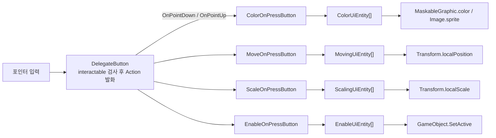
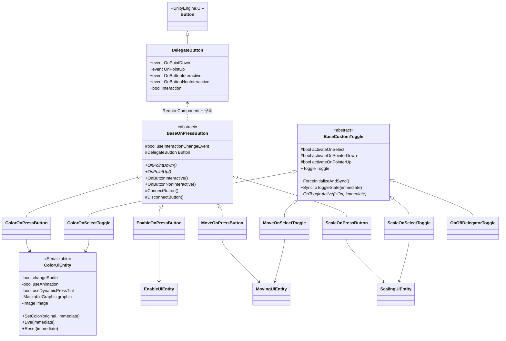
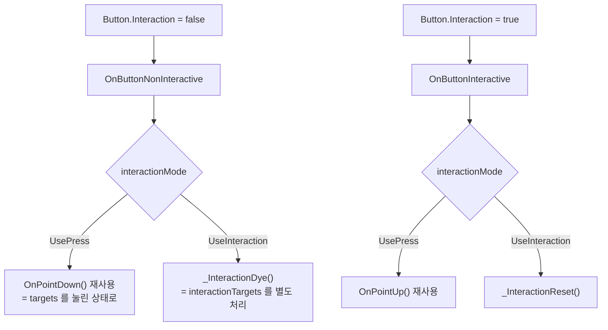
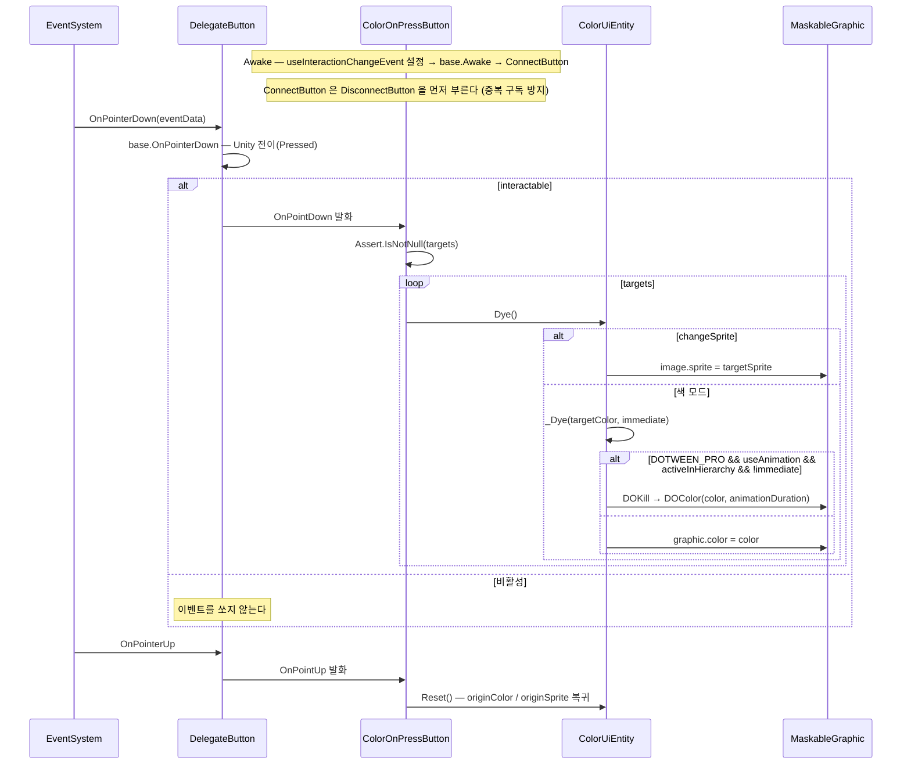
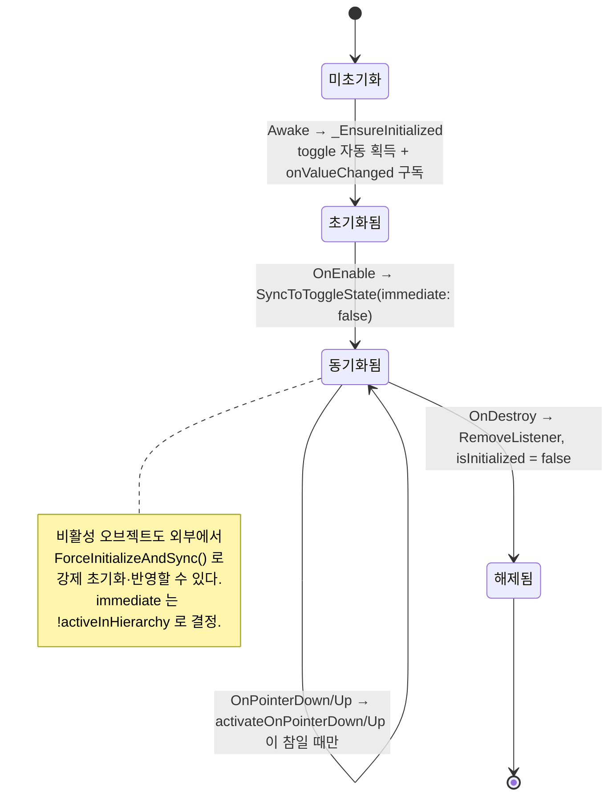
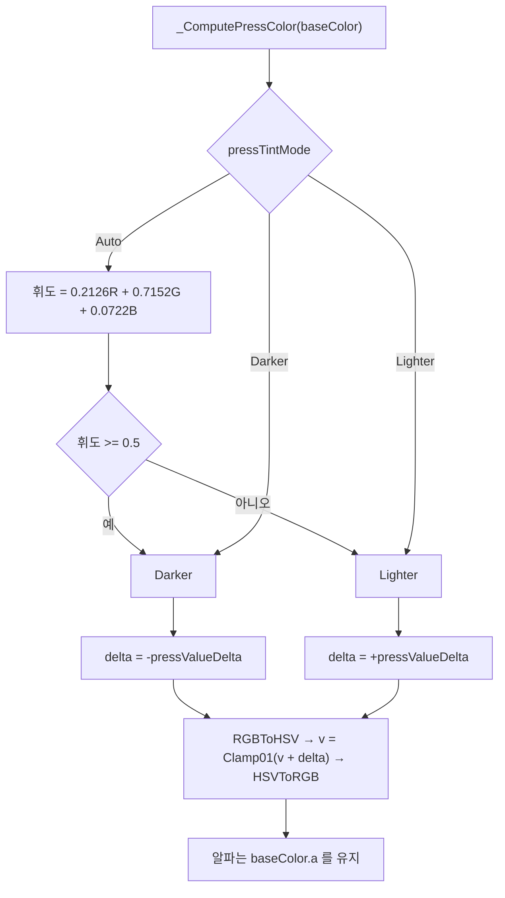

# InputControls — 버튼 · 토글 · UI 엔티티

> 어셈블리: `HCUP.HUI` — [Runtime/README.md](../Runtime/README.md)
> 네임스페이스: `HUI.ButtonUI`, `HUI.ToggleUI`, `HUI.Entity`
> 파일: `Button/` 8개 + `Toggle/` 6개 + `Entity/` 6개 = 20개 (950행)

세 폴더를 한 문서에 묶는 근거: **`Entity` 는 `Button` 과 `Toggle` 외에는 사용처가 없고**, 버튼·토글
파생 클래스는 전부 `*UiEntity` 배열을 순회하는 것이 유일한 본체다. 세 폴더는 하나의 파이프라인이다.

---

## 요약

**"입력을 받는 컴포넌트"와 "연출을 적용하는 컴포넌트"를 분리한다.**

- 입력: `DelegateButton`(Unity `Button` 상속) / `BaseCustomToggle`(Unity `Toggle` 동반). 이벤트만 쏜다.
- 연출: `*OnPressButton` / `*OnSelectToggle`. 이벤트를 받아 엔티티 배열을 순회한다.
- 적용: `ColorUiEntity` / `MovingUiEntity` / `ScalingUiEntity` / `EnableUiEntity`. **`MonoBehaviour`
  가 아니라 `[Serializable]` 클래스**다 — 인스펙터에 배열로 늘어놓는다.

이 분리의 효과는 **한 버튼에 색·이동·스케일 컴포넌트를 동시에 붙일 수 있다**는 것이다. 각각이
독립적으로 `DelegateButton` 의 같은 이벤트를 구독한다.



---

## 파일 지도

| 경로 | 행 | 역할 |
|---|---|---|
| `Button/DelegateButton.cs` | 57 | `Button` 상속. `OnPointDown`/`OnPointUp`/`OnButtonInteractive`/`OnButtonNonInteractive` |
| `Button/IDelegateButton.cs` | 14 | `OnPointDown()` / `OnPointUp()` |
| `Button/BaseOnPressButton.cs` | 88 | 연출 컴포넌트 기반. `Awake` 구독 / `OnDestroy` 해제 |
| `Button/ButtonEventMode.cs` | 13 | `UsePress` / `UseInteraction` |
| `Button/ColorOnPressButton.cs` | 168 | 색·스프라이트. 두 모드 + 에디터 디버그 버튼 6개 |
| `Button/EnableOnPressButton.cs` | 100 | GameObject 활성 토글. 두 모드 |
| `Button/MoveOnPressButton.cs` | 34 | 이동 |
| `Button/ScaleOnPressButton.cs` | 34 | 스케일 |
| `Toggle/BaseCustomToggle.cs` | 139 | Unity `Toggle` 리스너 등록 + 상태 동기화 |
| `Toggle/IDelegateToggle.cs` | 14 | `OnToggleActive(bool)` |
| `Toggle/ColorOnSelectToggle.cs` | 63 | 색 |
| `Toggle/MoveOnSelectToggle.cs` | 59 | 이동 |
| `Toggle/ScaleOnSelectToggle.cs` | 58 | 스케일 |
| `Toggle/OnOffDelegatorToggle.cs` | 48 | `UnityEvent` 2개로 중계 (연출 없음) |
| `Entity/ColorUiEntity.cs` | 258 | 색/스프라이트 + DOTween + 동적 tint 계산 |
| `Entity/ColorTintMode.cs` | 6 | `Darker` / `Lighter` / `Auto` |
| `Entity/MovingUiEntity.cs` | 59 | 상대 이동 또는 절대 좌표 |
| `Entity/ScalingUiEntity.cs` | 59 | 배율 또는 절대 스케일 |
| `Entity/EnableUiEntity.cs` | 25 | **로직 없음** — 4개 bool 플래그 + `Target` |
| `Entity/IAttachable.cs` | 4 | **구현체 0** |

---

## 계층 구조



**버튼과 토글은 서로를 모른다.** 공통 기반 클래스도, 공통 인터페이스도 없다 —
`IDelegateButton` 과 `IDelegateToggle` 은 별개다. 유일한 접점이 `*UiEntity` 다.

---

## 두 가지 이벤트 모드

`ColorOnPressButton` 과 `EnableOnPressButton` 만 `ButtonEventMode` 를 갖는다. 같은
`OnButtonInteractive`/`OnButtonNonInteractive` 콜백이 모드에 따라 다른 일을 한다.



**`useInteractionChangeEvent` 가 구독 여부를 가른다** (`BaseOnPressButton.cs:49-52`). 그리고 이
플래그는 `base.Awake()` **앞에서** 정해져야 한다.

```csharp
// Button/ColorOnPressButton.cs:56-58
protected override void Awake() {
    useInteractionChangeEvent = interactionMode == ButtonEventMode.UseInteraction;
    base.Awake();   // ← 여기서 ConnectButton() 이 돈다
}
```

즉 `interactionMode == UsePress` 인 버튼은 `OnButtonInteractive`/`OnButtonNonInteractive` 를
**구독조차 하지 않는다.** 위 다이어그램의 `UsePress` 분기는 `_DebugSetModeUsePressColors`
(`:152-157`)로 `useInteractionChangeEvent = true` 를 강제했을 때만 실행된다.

---

## 흐름 1 — 버튼 입력



---

## 흐름 2 — 토글 상태 동기화

토글은 버튼과 초기화 방식이 다르다. **`OnEnable` 마다 현재 `isOn` 을 다시 반영한다.**



```csharp
// Toggle/BaseCustomToggle.cs:68-71
public void ForceInitializeAndSync() {
    _EnsureInitialized();
    SyncToToggleState(immediate: !gameObject.activeInHierarchy);
}
```

**세 개의 타이밍 플래그**가 어떤 이벤트에 반응할지 정한다 (`BaseCustomToggle.cs:28-34`).
기본값은 `activateOnSelect = true`, 나머지 둘은 `false` — 즉 선택 상태 변화에만 반응한다.

---

## 흐름 3 — 동적 press tint

`ColorUiEntity` 의 고유 기능이다. 고정 `targetColor` 대신 `originColor` 에서 명도를 계산한다.



에디터에서는 `[HOnValueChanged(nameof(_RefreshTargetColorInEditor))]` 가 `originColor` /
`useDynamicPressTint` / `pressTintMode` / `pressValueDelta` 변경 시 `targetColor` 를 즉시
다시 계산한다 (`ColorUiEntity.cs:203-212`).

---

## 사용 예

```csharp
// 1) 프리팹 구성 — 컴포넌트를 겹쳐 붙인다
//    GameObject
//      ├ DelegateButton        (RequireComponent 대상)
//      ├ ColorOnPressButton    targets: [ ColorUiEntity(graphic = Background) ]
//      └ ScaleOnPressButton    targets: [ ScalingUiEntity(target = transform, scaleFactor = 0.95) ]

// 2) 코드에서는 이벤트만 잡는다
GetComponent<DelegateButton>().OnPointUp += _StartGame;

// 3) interactable 전환 — 프로퍼티를 쓰면 이벤트가 함께 발화한다
button.Interaction = false;      // OnButtonNonInteractive 발화
// button.interactable = false;  // ← Unity 원본. 이벤트가 발화하지 않는다

// 4) 색을 런타임에 바꾼다
colorOnPressButton.SetColor(targetIndex: 0, Color.red);        // originColor 갱신
colorOnPressButton.SetColor(backgroundGraphic, Color.red);     // 참조로 찾기

// 5) 비활성 토글의 상태를 강제 반영 (예: 설정 창을 열기 전에)
foreach (var t in optionToggles) t.ForceInitializeAndSync();

// 6) 새 연출 만들기
public sealed class RotateOnPressButton : BaseOnPressButton {
    [SerializeField] RotatingUiEntity[] targets;
    public override void OnPointDown() { foreach (var t in targets) t.Rotate(); }
    public override void OnPointUp()   { foreach (var t in targets) t.Reset(); }
}
```

---

## 주의할 점

### 계약

1. **`useInteractionChangeEvent` 는 `base.Awake()` 전에 정해야 한다** (`ColorOnPressButton.cs:56-58`,
   `EnableOnPressButton.cs:39-42`). 이후에 바꾸면 구독 상태와 어긋나고, 해제 시
   `DisconnectButton` 이 같은 플래그를 보므로 **구독은 됐는데 해제되지 않는** 상태가 만들어진다
   (`BaseOnPressButton.cs:59-62`).
2. **`Interaction` 프로퍼티와 `interactable` 필드는 다르다.** 전자만 이벤트를 발화한다
   (`DelegateButton.cs:25-36`). 인스펙터에서 `interactable` 을 끄거나 다른 코드가
   `button.interactable = false` 를 하면 연출이 갱신되지 않는다.
3. **`DelegateButton` 은 비활성 상태에서 이벤트를 쏘지 않는다** (`:42, :47`). 그래서
   `OnPointerUp` 없이 비활성으로 전환되면 **눌린 연출이 그대로 남는다.** `UsePress` 모드가
   `OnButtonNonInteractive → OnPointDown` 으로 연결된 것이 이 상황을 정상화하는 장치이지만,
   그 모드에서는 구독 자체가 안 된다(위 §계약 1, 아래 §정리 대상 8).
4. **`MovingUiEntity` / `ScalingUiEntity` 의 `originPosition` 은 `_Init` 이 돌 때 잡힌다**
   (`MovingUiEntity.cs:33-35`). `_Init` 은 `[HOnValueChanged]` 로 **에디터에서 target 을 배선할 때만**
   호출된다 — 런타임 진입점이 없다. 즉 직렬화된 값이 그대로 쓰인다.
5. **`EnableUiEntity` 는 아무 로직도 갖지 않는다** (`Entity/EnableUiEntity.cs`). 4개 bool 과
   `Target` 프로퍼티가 전부이고, 실제 `SetActive` 는 `EnableOnPressButton` 이 한다
   (`:50-51, :93-94`). 다른 엔티티 3종과 규약이 다르다.

### 정리 대상

6. **`ColorUiEntity.SetColor(original, target, immediate)` 의 `immediate` 인자가 무시된다.**
   ```csharp
   // Entity/ColorUiEntity.cs:139-142 — 필드만 대입하고 immediate 를 쓰지 않는다
   public void SetColor(Color original, Color target, bool immediate = false) {
       originColor = original;
       targetColor = target;
   }
   ```
   파일 하단 데브로그(`:255`)도 이 사실을 명시한다. 색을 즉시 반영하려면 `Dye`/`Reset` 을 따로
   불러야 한다.
7. **`ScalingUiEntity._ApplyScale` 이 `immediate` 를 무시한다.**
   ```csharp
   // Entity/ScalingUiEntity.cs:48-57
   private void _ApplyScale(Vector3 scale, bool immediate = false) {
       target.DOKill();
       if (_CanAnimate()) {          // ← && !immediate 가 빠져 있다
           target.DOScale(scale, animationDuration).SetUpdate(true);
   ```
   `MovingUiEntity._ApplyMove` 는 `if (_CanAnimate() && !immediate)` 로 올바르다
   (`MovingUiEntity.cs:51`). `ScaleOnSelectToggle` 이 `immediate: true` 로 넘겨도 애니메이션이 돈다.
8. **`ButtonEventMode` 는 이름이 `[Flags]` 를 암시하지만 `[Flags]` 가 아니다.**
   ```csharp
   // Button/ButtonEventMode.cs:10-13
   public enum ButtonEventMode : byte { UsePress = 1 << 0, UseInteraction = 1 << 1 }
   ```
   비트 값을 쓰면서 `switch` 로만 소비된다 (`ColorOnPressButton.cs:90-103`). `UsePress |
   UseInteraction` 은 어느 `case` 에도 걸리지 않고 `default: break` 로 조용히 무시된다.
9. **`EnableOnPressButton` 은 `[RequireComponent(typeof(DelegateButton))]` 을 중복 선언한다**
   (`:19`). 기반 `BaseOnPressButton` 에 이미 있다 (`:17`).
10. **`ColorUiEntity._Init` 은 `[HOnValueChanged]` 로만 호출된다** (`:74, :88`). 런타임에는 절대
    돌지 않으므로 `changeSprite` 모드에서 `graphic = image` 동기화(`:115`)가 직렬화된 상태에
    의존한다. `changeSprite` 를 코드로 바꾸면 `Reset`/`Dye` 가 배선되지 않은 참조를 쓴다.
11. **`Reset()` / `Dye()` 의 스프라이트 모드에 null 가드가 없다** (`ColorUiEntity.cs:145-146,
    :154-155`). 색 모드의 `_Dye` 에는 있다 (`:170-175`).
12. **`ColorOnPressButton.SetColor(MaskableGraphic, Color)` 는 `First` 를 쓴다**
    (`:46-48`). 일치하는 엔티티가 없으면 `InvalidOperationException` 이다. 인덱스 오버로드는
    `Assert` 로 검사하지만 릴리즈에서 사라진다 (`:50`).
13. **`Entity/IAttachable.cs` 는 구현체도 호출처도 없다** (전역 grep 1건 = 선언 자신).
14. **`IDelegateButton` / `IDelegateToggle` 은 선언과 구현 외에 사용처가 없다** (각각 grep 2건).
    다형적으로 이 인터페이스를 통해 호출하는 코드가 어디에도 없다.
15. **`OnOffDelegatorToggle` 은 타이밍 플래그를 무시한다** (`:20-24`). `activateOnSelect` 가
    false 여도 `_OnOff` 를 실행하고, 포인터 콜백은 빈 구현이다 — 나머지 3개 토글과 규약이 다르다.
16. **`MoveOnPressButton` / `ScaleOnPressButton` 은 null 검사가 전혀 없다** (`:22-32`).
    `targets` 가 비어 있으면 `NullReferenceException` 이다. `EnableOnPressButton` 은
    `if (targets == null) return` 을 둔다 (`:47`).

---

## 확장 지점

| 하고 싶은 것 | 손댈 곳 |
|---|---|
| 새 버튼 연출 | `BaseOnPressButton` 상속 + `OnPointDown`/`OnPointUp` 구현 |
| 새 토글 연출 | `BaseCustomToggle` 상속 + `OnToggleActive(isOn, immediate)`/`OnPointerDown`/`OnPointerUp` 구현 |
| 새 적용 대상 (예: 회전·알파) | `[Serializable]` 엔티티 클래스 신설 — `Reset`/`Apply` 쌍 + `_CanAnimate` 패턴을 따를 것 |
| 새 버튼 이벤트 시점 (Hover 등) | `DelegateButton` 에 인터페이스 + `event` 추가 (`DelegateButton.cs:54-58` 주석이 이 확장을 예고) |
| 눌림 색 계산 규칙 | `ColorUiEntity._ComputePressColor` + `ColorTintMode` |
| 애니메이션 시간축 | `MovingUiEntity`/`ScalingUiEntity` 는 `SetUpdate(true)` 로 unscaled — `ColorUiEntity` 는 지정하지 않아 timeScale 을 따른다 |
| 에디터에서 눌림 상태 확인 | `ColorOnPressButton` 의 `[HButton]` 디버그 6종 (`:129-165`) — 다른 연출에는 없다 |
