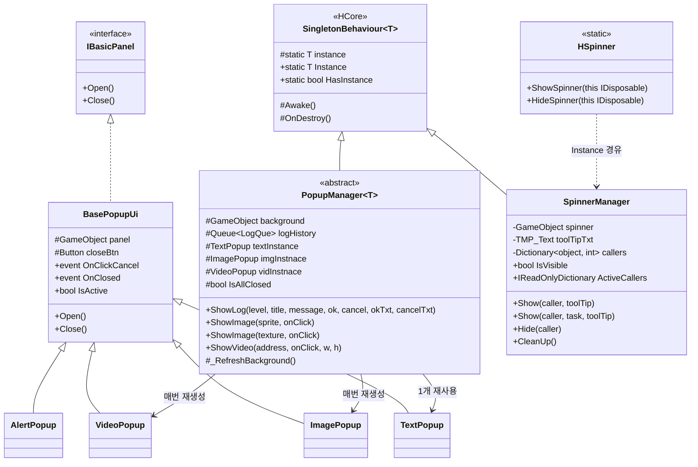
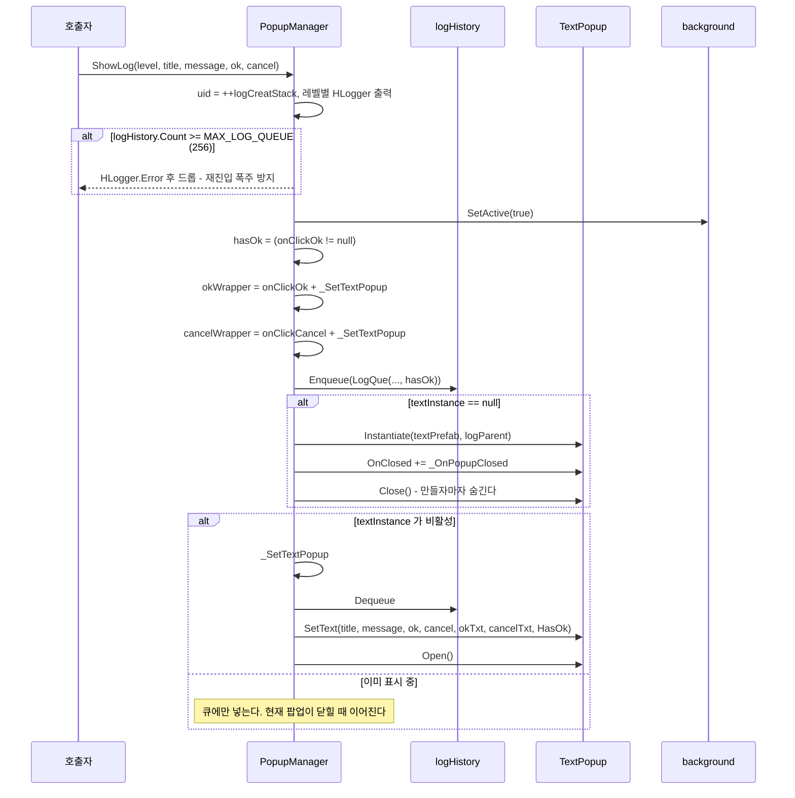
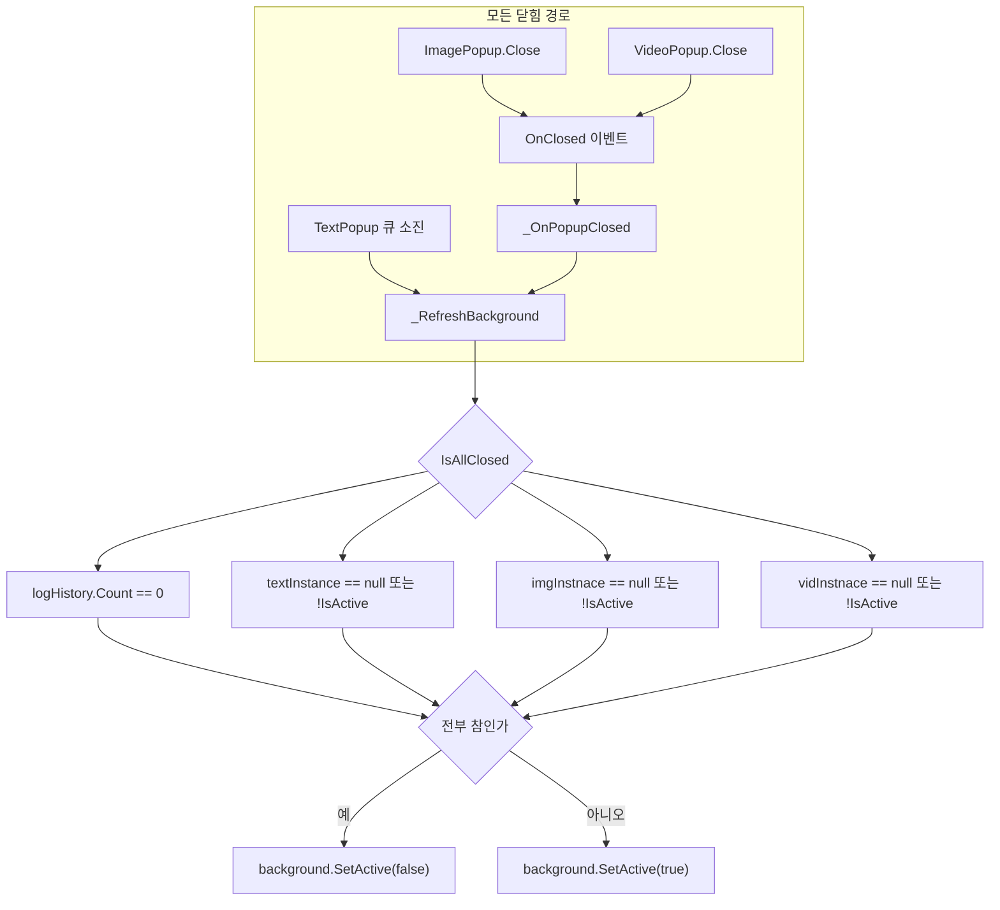
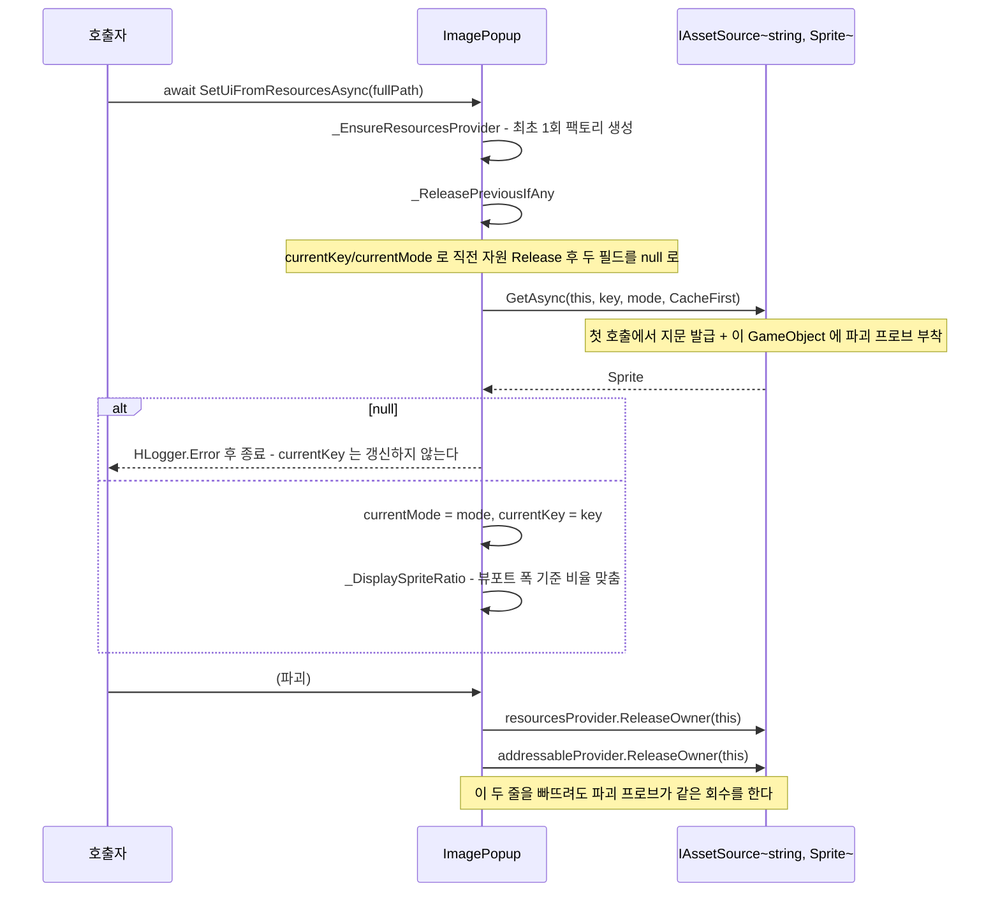
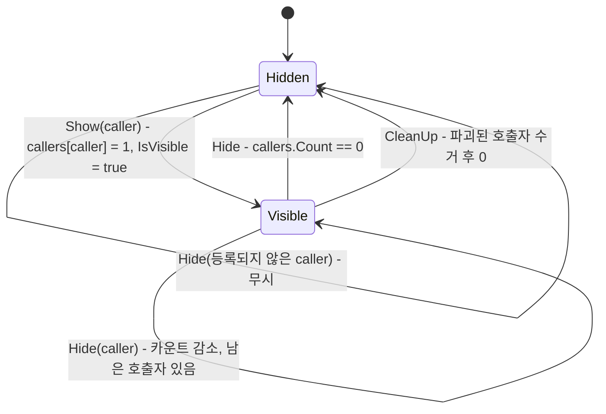

# Overlay - 팝업 · 스피너

> 어셈블리: `HCUP.HUI` - [Runtime/README.md](../Runtime/README.md)
> 네임스페이스: `HUI.Popup`, `HUI.Spinner`
> 파일: `Runtime/HUI/Popup/` 7개 + `Runtime/HUI/Spinner/` 2개 (858행)

---

## 요약

두 시스템을 한 문서에 묶은 이유는 **같은 문제를 푸는 같은 형태**이기 때문이다. 둘 다
`HCore.SingletonBehaviour<T>` 를 상속한 전역 오버레이 매니저이고, 둘 다 **"열린 것이 하나라도
있으면 차단 레이어를 띄우고, 전부 닫히면 내린다"** 는 계산을 한다. 그리고 둘 다 그 계산이
틀려서 오버레이가 고착되는 사고를 겪었고, 코드 주석이 그 이력을 명시한다.

계산 방식은 다르다.

| | 판정 근거 | 실패 시 증상 |
|---|---|---|
| `PopupManager<T>` | 큐 길이 + 인스턴스 3종의 `IsActive` (`PopupManager.cs:108-112`) | 배경이 남아 입력을 영구 차단 |
| `SpinnerManager` | 호출자별 **참조 카운트** 사전 (`SpinnerManager.cs:45`) | 스피너가 남아 입력을 영구 차단 |

---

## 파일 지도

| 경로 | 행 | 역할 |
|---|---|---|
| `Popup/PopupManager.cs` | 274 | 추상 매니저. 로그 큐 + 인스턴스 3종 + 배경 제어 |
| `Popup/BasePopupUi.cs` | 53 | 팝업 공통. `Open`/`Close`/`OnClosed`/`OnClickCancel` |
| `Popup/TextPopup.cs` | 67 | 제목·본문 + 확인/닫기 버튼 |
| `Popup/ImagePopup.cs` | 165 | `RawImage` 표시 + `HResource` 로 스프라이트 비동기 로드 |
| `Popup/VideoPopup.cs` | 52 | `VideoPlayer` + `RenderTexture` |
| `Popup/AlertPopup.cs` | 28 | **사용처 없음** (아래 정리 대상) |
| `Popup/PopLevel.cs` | 7 | `Log` / `Warning` / `Alert` / `Fatal` |
| `Spinner/SpinnerManager.cs` | 251 | 참조 카운트 스피너 + 씬 전환 정리 |
| `Spinner/HSpinner.cs` | 59 | `IDisposable` 확장 메서드 5개 |

---

## 계층 구조



**`TextPopup` 만 인스턴스가 재사용된다** (`PopupManager.cs:147-151`). 이미지·비디오는 호출마다
이전 것을 `Destroy` 하고 새로 `Instantiate` 한다 (`:168-170, :178-180`).

---

## 데이터 모델 - `LogQue`

```csharp
// Popup/PopupManager.cs:24-68 (요약)
[Serializable]
public class LogQue {
    int uid;                 // ++logCreatStack. 로그 문자열에만 쓰인다
    PopLevel level;
    string title, message, okText, cancelText;

    public Action OnClickOk { get; private set; }
    public Action OnClickCancel { get; private set; }

    // 큐 진행 콜백을 합성하면 OnClickOk 는 절대 null 이 아니게 된다.
    // 호출자가 실제로 OK 를 원했는지는 이 플래그로 따로 보존한다.
    public bool HasOk { get; private set; }
}
```

`HasOk` 가 이 모델의 핵심이다. `ShowLog` 는 큐 진행 콜백 `_SetTextPopup` 을 **OK/Cancel 양쪽에**
합성하므로 (`PopupManager.cs:140-143`), 합성 후에는 `OnClickOk != null` 이 항상 참이 된다.
"취소 전용 팝업"을 구분할 수 있는 유일한 정보가 `HasOk` 다.

```csharp
// Popup/TextPopup.cs:39-52 - showOk 를 별도 인자로 받는 이유
var isOkActive = showOk && (okEvent != null);
okBtn.gameObject.SetActive(isOkActive);
```

---

## 흐름 1 - ShowLog 와 큐 진행



사용자가 OK 나 Cancel 을 누르면 합성된 `_SetTextPopup` 이 다시 돌아 다음 항목을 꺼낸다.
큐가 비면 팝업을 닫고 `_RefreshBackground` 를 부른다 (`PopupManager.cs:226-230`).

---

## 흐름 2 - 배경 해제 판정

이 시스템에서 **가장 최근에 고쳐진 부분**이다. 코드 주석이 종전 동작과 그 실패를 명시한다.



두 가지가 함께 고쳐졌다.

```csharp
// Popup/BasePopupUi.cs:18-20
// 팝업이 스스로 닫혔음을 매니저에 알리는 유일한 경로. 이것이 없어서
// PopupManager 는 이미지/비디오 팝업이 닫힌 사실을 영원히 알지 못했다 (배경 잔존).
public event Action<BasePopupUi> OnClosed;
```

```csharp
// Popup/PopupManager.cs:106-112
// 종전: gameParent.childCount 기반. Destroy 가 프레임 종료 후에 적용되고 "닫혔지만 살아있는"
// 자식도 계수되어, 이미지/비디오 팝업을 닫아도 배경이 영원히 남았다. 인스턴스 활성 여부로 판정한다.
protected bool IsAllClosed =>
    logHistory.Count == 0
    && (textInstance == null || !textInstance.IsActive)
    && (imgInstnace == null || !imgInstnace.IsActive)
    && (vidInstnace == null || !vidInstnace.IsActive);
```

`OnClosed` 는 **실제로 열려 있던 팝업이 닫힐 때만** 발화한다 - `Close()` 진입 시 `IsActive` 를
먼저 읽어 두고, 참이었을 때만 쏜다 (`BasePopupUi.cs:48-52`). 중복 `Close` 호출이 배경 계산을
흔들지 않는다.

---

## 흐름 3 - ImagePopup 의 에셋 수명

`HResource` 를 직접 쓰는 HUI 내 유일한 컴포넌트다. **"스프라이트를 하나만 유지"** 를 필드 교체로
보장한다.



이 팝업은 `AssetOwnerId` 를 들지 않는다. 소유자로 자기 자신을 넘길 뿐이고, 지문 발급과
파괴 감지는 provider 안에서 일어난다. `SetUi(Sprite)` 로만 쓰는 팝업은 provider 를 만들지
않으므로 지문도 발급되지 않는다.

---

## 흐름 4 - SpinnerManager 참조 카운트



`await` 오버로드 5종은 전부 `try/finally` 로 감싸 **취소·예외에도 반드시 내린다.**

```csharp
// Spinner/SpinnerManager.cs:152-160
public async UniTask Show(object caller, Func<UniTask> taskFunc, string toolTip = null) {
    Show(caller, toolTip);
    try { await taskFunc(); }
    finally { _HideSafely(caller); }
}
```

`_HideSafely` 는 `finally` 안의 예외가 원본 예외를 덮어쓰는 것을 막는다 (`:200-208`).

### 씬 전환 정리

```csharp
// Spinner/SpinnerManager.cs:76-90
protected override void Awake() {
    base.Awake();
    // base 가 중복 인스턴스를 Destroy 한 경우 정적 이벤트를 구독하면 유령 구독자가 남는다.
    if (instance != this) return;
    SceneLoader.OnSceneLoaded += CleanUp;
    SceneLoader.OnSceneUnloaded += CleanUp;
}

protected override void OnDestroy() {
    SceneLoader.OnSceneLoaded -= CleanUp;
    SceneLoader.OnSceneUnloaded -= CleanUp;
    base.OnDestroy();
}
```

`CleanUp` 이 수거하는 것은 **파괴된 `UnityEngine.Object` 호출자**다. 정적 타입이 `object` 라
Unity 의 `==` 오버로드가 걸리지 않으므로 명시 캐스트로 판정한다 (`:218-222`). `Dictionary` 는
null 키를 담지 못하므로 종전의 `key != null` 검사는 항상 no-op 이었다는 주석이 남아 있다.

---

## 사용 예

```csharp
// 1) 프로젝트 매니저 정의 - PopupManager<T> 는 추상이다
public sealed class MyPopupManager : PopupManager<MyPopupManager> { }

// 2) 확인/취소 팝업
MyPopupManager.Instance.ShowLog(
    PopLevel.Warning, "저장 실패", "다시 시도하시겠습니까?",
    onClickOk: () => _Retry(),
    onClickCancel: null,
    okTxt: "재시도", cancelTxt: "그만두기");

// 3) 취소 전용 팝업 - onClickOk 를 null 로 두면 HasOk = false 로 OK 버튼이 숨는다
MyPopupManager.Instance.ShowLog(PopLevel.Log, "안내", "저장했습니다.");

// 4) 스피너 - 수동 쌍
SpinnerManager.Instance.Show(this, "불러오는 중...");
try { await LoadAsync(); }
finally { SpinnerManager.Instance.Hide(this); }

// 5) 스피너 - await 오버로드가 finally 를 대신한다
await SpinnerManager.Instance.Show(this, LoadAsync());
var result = await SpinnerManager.Instance.Show(this, FetchAsync<Profile>());

// 6) 고착 조사 - 릴리즈 빌드에서도 호출 가능
Debug.Log(SpinnerManager.Instance.GetCallerData());
```

---

## 주의할 점

### 계약

1. **`ShowLog` 의 큐 진행 콜백은 OK/Cancel 양쪽에 합성된다** (`PopupManager.cs:140-143`).
   호출자가 넘긴 `onClickOk` 안에서 `ShowLog` 를 다시 부르면 재진입이 된다. 상한
   `MAX_LOG_QUEUE = 256` 이 유일한 방어이며, 초과분은 `HLogger.Error` 와 함께 **버려진다**
   (`:131-134`) - 호출자에게 실패가 반환되지 않는다.
2. **`TextPopup.SetText` 의 `showOk` 는 별도 인자다.** `okEvent != null` 로 판정하면 합성된
   래퍼 때문에 항상 참이 된다 (`TextPopup.cs:37-38` 주석). 직접 호출할 때 이 인자를 빠뜨리면
   기본값 `true` 로 OK 버튼이 항상 뜬다.
3. **`SpinnerManager.Show` 의 `toolTip` 은 명시했을 때만 갱신된다** (`SpinnerManager.cs:99-101`).
   후행 호출이 선행 호출자의 안내 문구를 지우지 않게 하려는 규약이다.
4. **스피너는 참조 카운트다.** `Show` 를 3번 불렀으면 `Hide` 도 3번 불러야 내려간다. `await`
   오버로드는 자기 몫만 자동으로 처리한다.
5. **`Hide` 는 등록되지 않은 호출자를 조용히 무시한다** (`SpinnerManager.cs:185`). 짝이 맞지 않는
   `Hide` 는 로그도 남기지 않는다.
6. **`ImagePopup` 의 로드 실패는 상태를 바꾸지 않는다** (`ImagePopup.cs:117-120`). `currentKey` 가
   갱신되지 않으므로 이전 자원은 이미 `_ReleasePreviousIfAny` 로 반납된 뒤이고, 화면에는 직전
   텍스처가 남는다.

### 정리 대상

7. **`AlertPopup` 은 완전한 죽은 코드다** (`Popup/AlertPopup.cs`, 전역 grep 3건 = 전부 자기 파일).
   `PopupManager` 는 이 타입을 알지 못하고, `OnReturn(AlertPopup)` / `OnDispose(AlertPopup)` 는
   풀 콜백 시그니처를 흉내내지만 이 클래스를 담는 풀이 없다. `OnDispose` 는 `panel` 만
   `Destroy` 하고 자기 `gameObject` 는 남긴다 (`:26`).
8. **필드명 오타가 공개 상태에 노출되어 있다** - `imgInstnace`, `vidInstnace`
   (`PopupManager.cs:97-98`). `protected` 라 파생 클래스가 그대로 쓴다.
9. **`LogQue.uid` 는 로그 문자열에만 쓰이고 팝업을 식별하지 않는다** (`PopupManager.cs:121-127`).
   특정 팝업을 취소하거나 찾아오는 API 가 없다.
10. **`HSpinner` 확장 메서드는 `this IDisposable` 을 요구한다** (`Spinner/HSpinner.cs:24-31`).
    `SpinnerManager.Show` 는 `object` 를 받으므로 이 제약에는 근거가 없다 -
    `MonoBehaviour` 는 `IDisposable` 이 아니라서 가장 흔한 호출자가 확장 메서드를 못 쓴다.
    **패키지 내 `ShowSpinner`/`HideSpinner` 호출처는 0건**이다.
11. **`HSpinner` 는 `Show(caller, UniTask)` / `Show<T>(caller, UniTask<T>)` 오버로드를 노출하지
    않는다** (`SpinnerManager.cs:162, :172` 는 존재). 확장 메서드 표면이 매니저 API 의 부분집합이다.
12. **`SpinnerManager.ActiveCallers` / `GetCallerData` 는 패키지 내 호출처가 0이다**
    (`:50-60`). 주석이 밝히듯 릴리즈 빌드 진단을 위해 의도적으로 남긴 것이므로, 죽은 코드가
    아니라 **외부 호출 전제 API** 다.
13. **`PopupManager` 는 `Awake` 를 오버라이드하지 않는다.** `OnDestroy` 만 오버라이드해
    (`:187-199`) 중복 인스턴스가 파괴될 때도 `_DisposeImageInstance` 등이 돈다. 다른 인스턴스의
    상태를 건드리지는 않으므로 무해하지만, `SpinnerManager` 의 `instance != this` 가드
    (`:79`)와 규약이 다르다.
14. **`VideoPopup` 은 `RenderTexture` 를 `Destroy` 하지 않는다** (`VideoPopup.cs:48-49`). 인스펙터로
    배선된 에셋을 `width`/`height` 만 덮어쓰므로 - **에셋을 런타임에 변형한다.** 에디터에서는
    이 변경이 에셋 파일에 남을 수 있다.

---

## 확장 지점

| 하고 싶은 것 | 손댈 곳 |
|---|---|
| 프로젝트 팝업 매니저 | `PopupManager<T>` 상속 + `background`/`textPrefab`/`imagePrefab`/`videoPrefab`/parent 3종 배선 |
| 새 팝업 종류 | `BasePopupUi` 상속 (`panel`·`closeBtn` 필수) + `PopupManager` 에 인스턴스 필드·`Show*`·`_Dispose*Instance`·`IsAllClosed` 항 추가 |
| 팝업 큐 정책 변경 | `MAX_LOG_QUEUE` (`PopupManager.cs:103`) + `_SetTextPopup` |
| 팝업 열림/닫힘 애니메이션 | `BasePopupUi.Open`/`Close` 오버라이드 - `OnClosed` 발화 시점을 유지할 것 |
| 스피너 연출 교체 | `SpinnerManager` 의 `spinner` GameObject - 매니저는 `SetActive` 만 한다 |
| 스피너 고착 조사 | `SpinnerManager.GetCallerData()` / `ActiveCallers` |
| 이미지 로드 경로 추가 | `ImagePopup._LoadAndApplyAsync` + 새 `_Ensure*Provider` |
