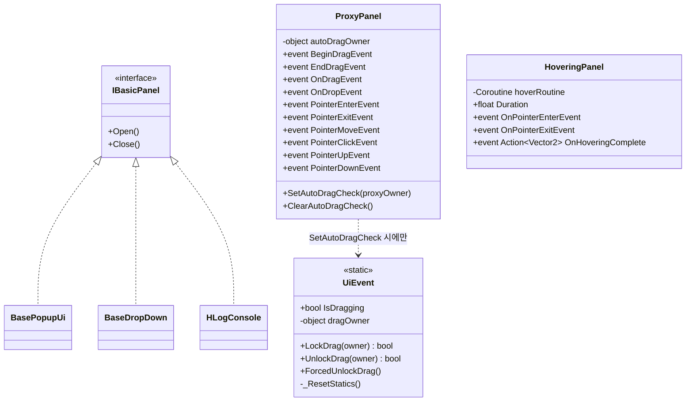
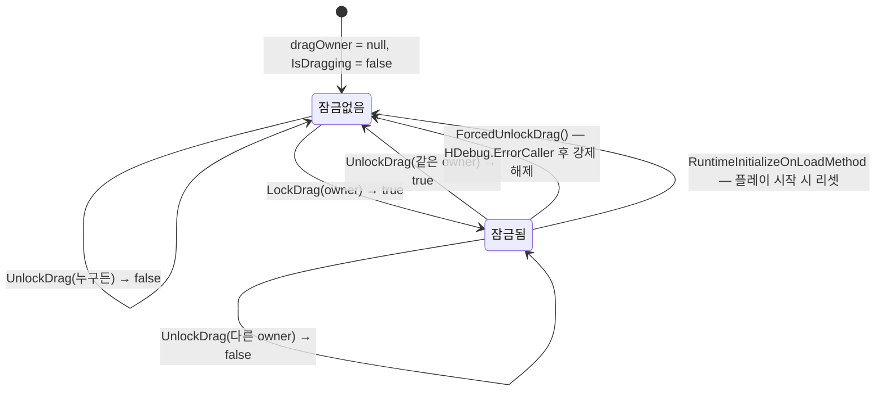
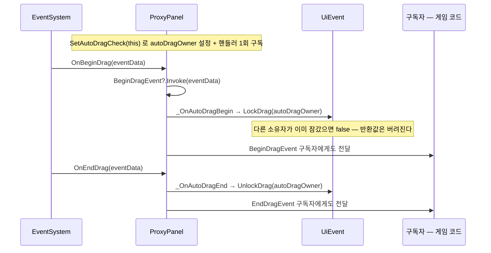
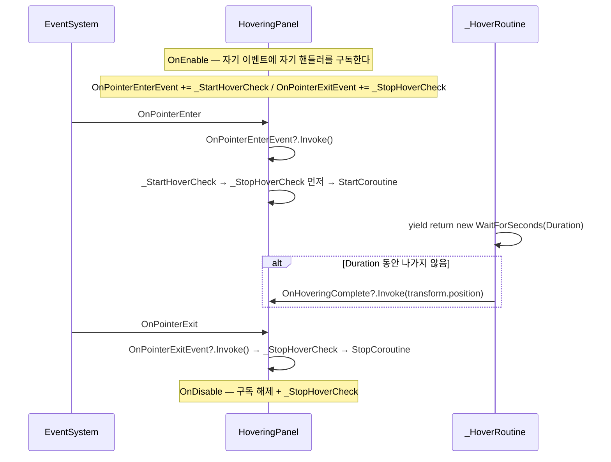

# Panel — 패널 · 포인터 프록시 · 드래그 잠금

> 어셈블리: `HCUP.HUI` — [Runtime/README.md](../Runtime/README.md)
> 네임스페이스: `HUI.Panel` + **전역 네임스페이스 2개** (`UiEvent`, `IBasicPanel`)
> 파일: `Runtime/HUI/Panel/` 3개 + `Runtime/HUI/UiEvent.cs` = 4개 (190행)

`UiEvent.cs` 를 이 문서에 넣는 근거: 패키지 전역에서 `UiEvent` 를 쓰는 코드는 `ProxyPanel` 하나뿐이다
(`ProxyPanel.cs:42-43`, 전역 grep 결과 나머지는 자기 파일의 주석).

---

## 요약

HUI 에서 가장 작은 시스템이고, **자체 상태를 거의 갖지 않는다.**

| 파일 | 하는 일 |
|---|---|
| `IBasicPanel` | `Open()` / `Close()` 두 메서드짜리 계약 |
| `ProxyPanel` | Unity 포인터 인터페이스 10종을 `event Action<PointerEventData>` 10개로 그대로 중계 |
| `HoveringPanel` | 포인터가 N초 머무르면 `OnHoveringComplete(위치)` 발화 |
| `UiEvent` | 전역 드래그 잠금 — 동시에 하나만 드래그하도록 소유자를 기록 |

`ProxyPanel` 은 README 의 "UI 는 이벤트만 발화한다" 규약을 극단까지 밀어붙인 컴포넌트다.
54줄 중 10줄이 다음 형태의 한 줄짜리 중계다.

```csharp
// Panel/ProxyPanel.cs:45-54
public void OnBeginDrag(PointerEventData eventData) => BeginDragEvent?.Invoke(eventData);
public void OnEndDrag(PointerEventData eventData)   => EndDragEvent?.Invoke(eventData);
// ... OnDrag / OnDrop / OnPointerEnter / Exit / Move / Click / Up / Down
```

---

## 파일 지도

| 경로 | 행 | 역할 |
|---|---|---|
| `Panel/IBasicPanel.cs` | 3 | `Open()` / `Close()`. **전역 네임스페이스** |
| `Panel/ProxyPanel.cs` | 56 | 포인터 이벤트 10종 중계 + 자동 드래그 잠금 |
| `Panel/HoveringPanel.cs` | 55 | 호버 지속 시간 감지 (코루틴) |
| `UiEvent.cs` | 76 | 전역 드래그 잠금. **전역 네임스페이스**, `static` |

### `IBasicPanel` 구현체

| 타입 | 파일 | 문서 |
|---|---|---|
| `BasePopupUi` | `Popup/BasePopupUi.cs:7` | [Overlay.md](Overlay.md) |
| `BaseDropDown<TData, TUnit>` | `DropDown/BaseDropDown.cs:26` | [DropDown.md](DropDown.md) |
| `HLogConsole` | `DebugConsole/HLogConsole.cs:11` | [DebugConsole.md](DebugConsole.md) |

**`Panel` 폴더 안에는 구현체가 없다.** 인터페이스만 여기 있고 실제 패널은 세 시스템에 흩어져 있다.

---

## 계층 구조



`ProxyPanel` 이 구현하는 Unity 인터페이스 10종: `IBeginDragHandler`, `IDragHandler`,
`IEndDragHandler`, `IPointerEnterHandler`, `IPointerExitHandler`, `IPointerMoveHandler`,
`IPointerClickHandler`, `IPointerUpHandler`, `IPointerDownHandler`, `IDropHandler`
(`ProxyPanel.cs:6-10`).

---

## 흐름 1 — 전역 드래그 잠금



**소유자 동일성이 유일한 규칙이다.** 잠근 객체만 풀 수 있다.

```csharp
// UiEvent.cs:32-44
public static bool LockDrag(object owner) {
    if (dragOwner != null) return false;
    dragOwner = owner; IsDragging = true; return true;
}
public static bool UnlockDrag(object owner) {
    if (dragOwner == null || dragOwner != owner) return false;
    dragOwner = null; IsDragging = false; return true;
}
```

정적 상태이므로 Domain Reload 비활성 환경 방어가 필수다.

```csharp
// UiEvent.cs:24-29
// Domain Reload 비활성 시 드래그 잠금이 이전 플레이에서 잔존하면 전 UI 드래그가 무음 불능이 된다.
[UnityEngine.RuntimeInitializeOnLoadMethod(UnityEngine.RuntimeInitializeLoadType.SubsystemRegistration)]
private static void _ResetStatics() { dragOwner = null; IsDragging = false; }
```

이 방어는 HUI 에서 `HTextLocalizer` 와 함께 단 두 곳뿐이다.

---

## 흐름 2 — ProxyPanel 자동 드래그 잠금

`SetAutoDragCheck` 를 부르면 드래그 시작·종료가 `UiEvent` 에 자동 연결된다. **명명 핸들러 1회
구독**이 이 API 의 핵심이다.

```csharp
// Panel/ProxyPanel.cs:26-40
public void SetAutoDragCheck(object proxyOwner) {
    // 익명 람다 구독은 해제 수단이 없고 재호출마다 누적된다 — 명명 핸들러 1회 구독으로 고정.
    if (autoDragOwner == null) {
        BeginDragEvent += _OnAutoDragBegin;
        EndDragEvent += _OnAutoDragEnd;
    }
    autoDragOwner = proxyOwner;
}

public void ClearAutoDragCheck() {
    if (autoDragOwner == null) return;
    BeginDragEvent -= _OnAutoDragBegin;
    EndDragEvent -= _OnAutoDragEnd;
    autoDragOwner = null;
}
```



---

## 흐름 3 — HoveringPanel



**자기 이벤트를 자기가 구독하는 구조**다 (`HoveringPanel.cs:17-20`). 외부에서
`OnPointerEnterEvent` 를 직접 발화해도 호버 타이머가 시작된다.

`Duration` 은 `[SerializeField]` 가 아닌 **public 프로퍼티**로 기본값 2초다 (`:10`) — 인스펙터에서
설정할 수 없고 코드로만 바꾼다.

---

## 사용 예

```csharp
// 1) ProxyPanel — 드래그 가능한 창
var proxy = window.GetComponent<ProxyPanel>();
proxy.SetAutoDragCheck(this);                       // 전역 드래그 잠금 자동 연결
proxy.OnDragEvent += e => window.anchoredPosition += e.delta;
proxy.PointerClickEvent += _ => _BringToFront();
// 파괴 전
proxy.ClearAutoDragCheck();

// 2) 다른 드래그가 진행 중인지 확인
if (UiEvent.IsDragging) return;

// 3) 수동 잠금 — 잠근 객체만 풀 수 있다
if (UiEvent.LockDrag(this)) {
    // 드래그 시작
}
UiEvent.UnlockDrag(this);

// 4) 잠금이 고착되었을 때 (진단 로그가 남는다)
UiEvent.ForcedUnlockDrag();

// 5) HoveringPanel — 툴팁
var hover = icon.GetComponent<HoveringPanel>();
hover.Duration = 0.6f;
hover.OnHoveringComplete += pos => _ShowTooltip(pos, item.Description);
```

---

## 주의할 점

### 계약

1. **`UiEvent` 는 잠금을 강제하지 않는다.** `LockDrag` 가 `false` 를 반환해도 드래그를 막는
   메커니즘이 없다. 호출자가 반환값을 보고 스스로 중단해야 한다.
2. **`ProxyPanel._OnAutoDragBegin` 은 `LockDrag` 반환값을 버린다** (`ProxyPanel.cs:42`). 즉 다른
   소유자가 잠근 상태에서 드래그를 시작해도 `BeginDragEvent` 구독자는 그대로 호출된다 —
   **자동 잠금은 "기록"이지 "차단"이 아니다.**
3. **`SetAutoDragCheck` 를 재호출하면 소유자만 바뀐다** (`:32`). 드래그 진행 중에 호출하면
   `_OnAutoDragEnd` 가 **새 소유자로** `UnlockDrag` 를 시도하므로 실패하고, 잠금이 영구히 남는다.
   `ForcedUnlockDrag` 가 그 상황의 탈출구다.
4. **`HoveringPanel.OnDisable` 은 구독 해제와 코루틴 정지를 함께 한다** (`:22-26`). `OnEnable`
   에서 다시 구독하므로 비활성 → 활성 왕복에도 중복 구독이 생기지 않는다.
5. **`HoveringPanel` 은 `WaitForSeconds` 를 쓴다** (`:51`). `Time.timeScale = 0` 인 일시정지
   상태에서는 타이머가 진행되지 않는다.
6. **`IBasicPanel` 은 상태를 정의하지 않는다.** `Open`/`Close` 만 있고 "지금 열려 있는가"를 묻는
   멤버가 없다. 구현체마다 `IsActive`(`BasePopupUi.cs:22`) / `IsOpen`(`HLogConsole.cs:73`) 로
   제각각 노출한다.

### 정리 대상

7. **`UiEvent` 와 `IBasicPanel` 이 전역 네임스페이스에 있다** (`UiEvent.cs:19`,
   `Panel/IBasicPanel.cs:1`). 패키지가 전역 이름을 차지한다 — 나머지 61개 파일은 전부 `HUI.*` 다.
8. **`ProxyPanel.SetAutoDragCheck` / `ClearAutoDragCheck` 는 호출처가 0이다** (전역 grep 각 1건 =
   선언 자신). 따라서 `UiEvent.LockDrag`/`UnlockDrag` 도 실행되는 경로가 패키지 안에 없다.
9. **`UiEvent.ForcedUnlockDrag` 는 호출처가 0이다** (grep 3건 = 선언 + 주석 2). 고착 상황의
   유일한 탈출구인데 어디서도 노출되지 않는다.
10. **`HoveringPanel` 은 패키지 내 사용처가 0이다** (grep 1건 = 선언 자신). `OnHoveringComplete`
    구독자가 없다.
11. **`ProxyPanel` 은 이벤트를 `OnDestroy` 에서 비우지 않는다.** 10개 `event` 어디에도 정리 코드가
    없어, 구독자가 패널보다 오래 살면 참조가 남는다. `BasePopupUi` 는 `OnDestroy` 에서
    `OnClickCancel = null; OnClosed = null;` 을 한다 (`Popup/BasePopupUi.cs:31-37`) — 같은
    어셈블리 안에서 규약이 갈린다.
12. **`ProxyPanel` 의 이벤트 이름이 두 가지 규칙을 섞는다.** 드래그 4개는 `BeginDragEvent` /
    `EndDragEvent` / `OnDragEvent` / `OnDropEvent` (앞 둘은 `On` 없음, 뒤 둘은 있음), 포인터 6개는
    전부 `Pointer*Event` (`On` 없음). `HoveringPanel` 은 또 `OnPointerEnterEvent` 로 `On` 을 붙인다.
13. **`HoveringPanel.Duration` 이 직렬화되지 않는다** (`:10`). 프리팹마다 다른 값을 주려면 코드가
    필요하다.
14. **`using System;` 이 `HoveringPanel` 에서 필요하지만 `ProxyPanel` 의 `using UnityEngine;`
    (`:2`)는 `MonoBehaviour` 때문에만 쓰인다** — 사소하나 정리 대상.

---

## 확장 지점

| 하고 싶은 것 | 손댈 곳 |
|---|---|
| 새 포인터 이벤트 중계 | `ProxyPanel` 에 Unity 인터페이스 + `event` + 한 줄 중계 추가 |
| 드래그 차단을 실제로 강제 | `ProxyPanel._OnAutoDragBegin` 이 `LockDrag` 반환값으로 이벤트 발화를 막도록 수정 (`:42`) |
| 잠금 고착 진단 UI | `UiEvent` 에 `dragOwner` 게터 추가 — 현재 노출되지 않는다 |
| 호버 지연 시간 조정 | `HoveringPanel.Duration` — 직렬화하려면 `[SerializeField]` 필드로 바꿔야 한다 |
| 일시정지 중 호버 | `_HoverRoutine` 의 `WaitForSeconds` → `WaitForSecondsRealtime` |
| 패널 상태 질의 표준화 | `IBasicPanel` 에 `bool IsOpen { get; }` 추가 후 구현체 3곳 정리 |
