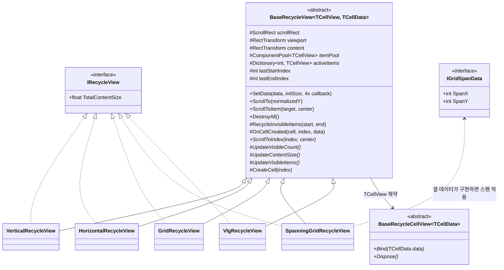
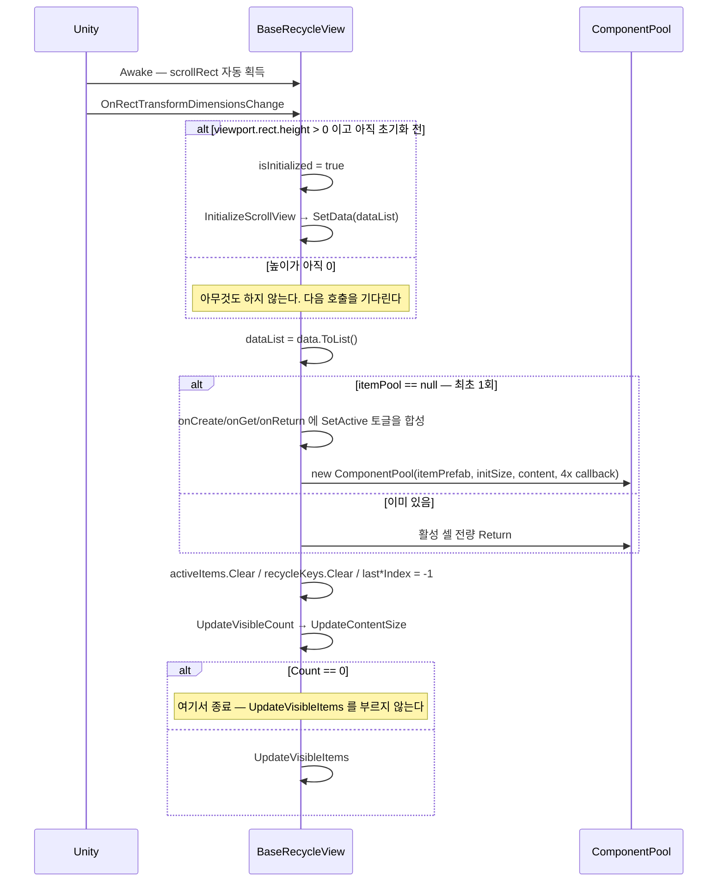
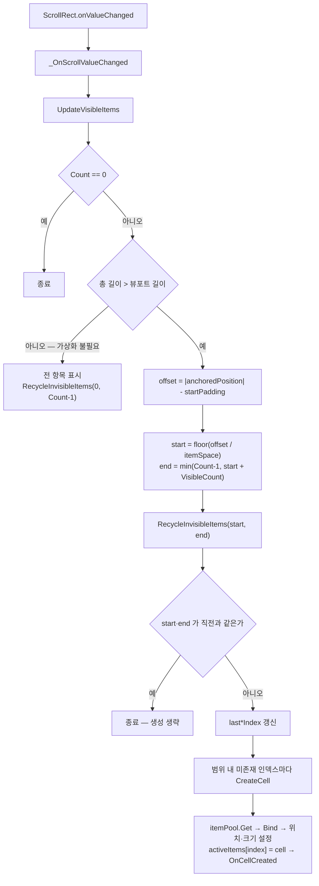
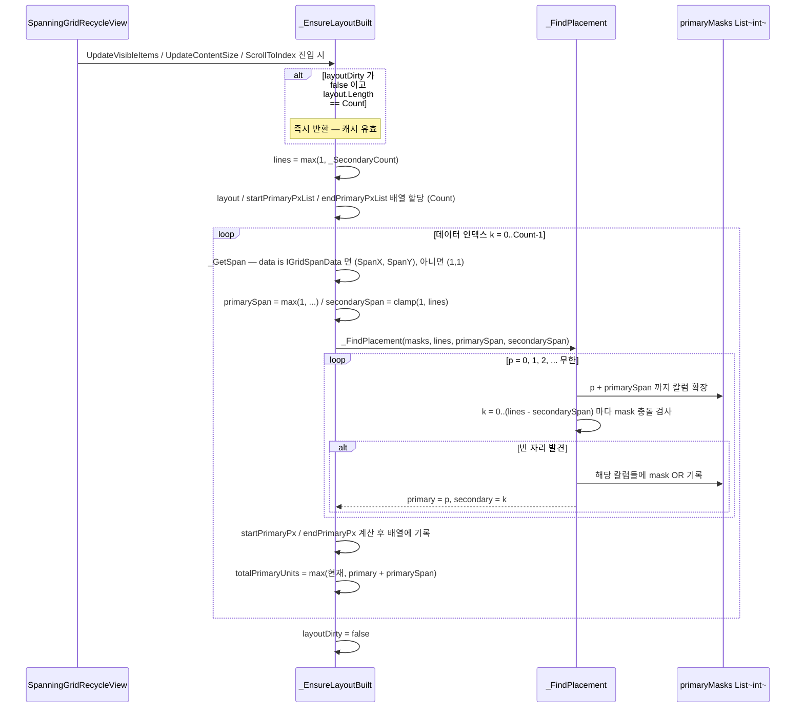
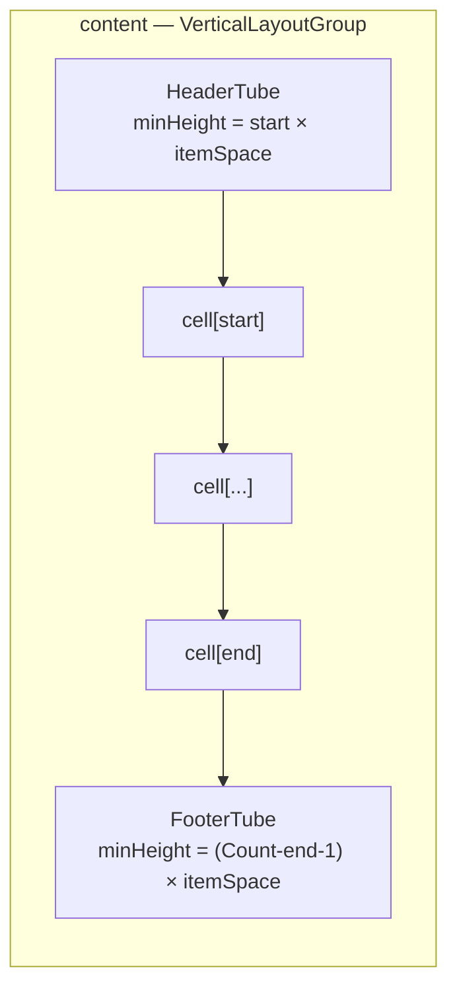

# Scrollview — 재활용 스크롤뷰

> 어셈블리: `HCUP.HUI` — [Runtime/README.md](../Runtime/README.md)
> 네임스페이스: `HUI.ScrollView`
> 파일: `Runtime/HUI/Scrollview/` 10개 (1,530행 — HUI 최대 시스템)

---

## 요약

**셀 인스턴스를 재사용해 대량 데이터를 그리는 가상화 리스트**다. `BaseRecycleView<TCellView,
TCellData>` 가 뼈대(풀·활성 셀 사전·재활용)를 갖고, 레이아웃 계산은 5개 추상 메서드로 파생
클래스에 전부 위임한다.

설계 규약 셋.

1. **`ScrollRect` 는 위치만 준다.** 셀 배치는 `content.anchoredPosition` 을 직접 읽어 인덱스
   범위를 역산한다 — Unity `LayoutGroup` 을 쓰지 않는다. 유일한 예외가 `VlgRecycleView` 다.
2. **초기화는 `OnRectTransformDimensionsChange` 가 트리거한다.** `Start` 가 아니라 뷰포트의 높이가
   처음 0보다 커지는 순간이다 (`BaseRecycleView.cs:96-101`).
3. **셀은 `Bind(data)` 만 안다.** 인덱스도, 이웃도, 스크롤 위치도 모른다. 외부 콜백 배선은
   `OnCellCreated` 훅으로 뷰가 매번 다시 꽂는다.

---

## 파일 지도

| 경로 | 행 | 역할 |
|---|---|---|
| `BaseRecycleView.cs` | 241 | 뼈대. 풀·`activeItems`·`RecycleInvisibleItems`·`SetData` |
| `BaseRecycleCellView.cs` | 77 | 셀 추상. `Bind(TCellData)` / `Dispose()` |
| `BaseRecycleCellData.cs` | 47 | 빈 추상 클래스 — 마커 타입 |
| `IRecycleView.cs` | 53 | `float TotalContentSize` 하나만 |
| `IGridSpanData.cs` | 52 | `SpanX` / `SpanY` — 스패닝 그리드 전용 |
| `VerticalRecycleView.cs` | 162 | 세로 균등 높이 |
| `HorizontalRecycleView.cs` | 162 | 가로 균등 너비 |
| `GridRecycleView.cs` | 247 | 균등 셀 그리드 (primary/secondary 축 추상화) |
| `SpanningGridRecycleView.cs` | 461 | 가변 스팬 그리드. 비트마스크 배치 + 이분 탐색 |
| `VlgRecycleView.cs` | 158 | `VerticalLayoutGroup` + 상하 스페이서(tube) 방식 |

---

## 계층 구조



### 제네릭 제약이 서로 다르다

| 파생 | `TCellData` 제약 |
|---|---|
| `VerticalRecycleView` | `class` |
| `GridRecycleView` | `class` |
| `SpanningGridRecycleView` | `class` |
| `HorizontalRecycleView` | **`BaseRecycleCellData`** |
| `VlgRecycleView` | **`BaseRecycleCellData`** |

`BaseRecycleView` 자신의 제약은 `class` 다 (`BaseRecycleView.cs:57`). 따라서 `BaseRecycleCellData`
를 요구하는 것은 두 파생의 독자 결정이고, **같은 셀 데이터 타입으로 세로/가로 뷰를 바꿔 끼울 수
없다.** `BaseRecycleCellData` 는 멤버가 하나도 없는 빈 클래스라 이 제약이 얻어 내는 것도 없다
(`BaseRecycleCellData.cs:21`).

---

## 데이터 모델

```csharp
// BaseRecycleView.cs:72-80
[SerializeField] protected List<TCellData> dataList = new();

protected ComponentPool<TCellView> itemPool;             // HUtil.Pooling
protected readonly List<int> recycleKeys = new();        // 회수 대상 인덱스 임시 버퍼
protected readonly Dictionary<int, TCellView> activeItems = new();   // 인덱스 → 화면에 있는 셀

protected int lastStartIndex = -1;   // 직전 프레임의 가시 범위. 같으면 재계산을 건너뛴다
protected int lastEndIndex = -1;
```

`activeItems` 의 **키가 데이터 인덱스**라는 점이 전부다. 셀은 인덱스를 모르고, 사전이 대신 안다.

---

## 흐름 1 — 초기화와 SetData



**`itemPool` 은 한 번만 만들어진다** (`BaseRecycleView.cs:132`). 그래서 `SetData` 로 넘긴
`onCreate`/`onGet`/`onReturn`/`onDispose` 는 **최초 호출의 것만 적용되고, 두 번째부터는 조용히
버려진다.**

```csharp
// BaseRecycleView.cs:132-145
if (itemPool == null) {
    onCreate += (item) => { item.gameObject.SetActive(false); };
    onGet    += (item) => { item.gameObject.SetActive(true); };
    onReturn += (item) => { item.gameObject.SetActive(false); };
    itemPool = new(itemPrefab, initSize, content, onCreate, onGet, onReturn, onDispose);
}
else {
    foreach (var kvp in activeItems) { itemPool.Return(kvp.Value); }
}
```

---

## 흐름 2 — 스크롤 → 셀 갱신 (균등 크기 계열)

`VerticalRecycleView` / `HorizontalRecycleView` / `GridRecycleView` 가 공유하는 형태다.



**회수는 조기 반환보다 먼저 일어난다** (`VerticalRecycleView.cs:106` → `:108`). 범위가 그대로일 때
생성만 건너뛰고 회수는 항상 수행하므로, 회수 누락으로 셀이 새는 경로가 없다.

`RecycleInvisibleItems` 는 `recycleKeys` 버퍼를 재사용해 순회 중 삭제를 피한다.

```csharp
// BaseRecycleView.cs:176-189
protected virtual void RecycleInvisibleItems(int start, int end) {
    recycleKeys.Clear();
    foreach (var kvp in activeItems) {
        if (kvp.Key < start || kvp.Key > end) { itemPool.Return(kvp.Value); recycleKeys.Add(kvp.Key); }
    }
    foreach (var key in recycleKeys) { activeItems.Remove(key); }
}
```

---

## 흐름 3 — SpanningGridRecycleView 의 레이아웃 빌드

가변 스팬 셀을 겹치지 않게 배치하는 시스템 내 유일한 알고리즘이다. **primary 축 라인마다 32비트
점유 마스크**를 두고, 앞에서부터 빈 자리를 찾는다.



가시 범위는 이 배열 위에서 **이분 탐색**으로 찾는다 — 균등 계열의 나눗셈 역산이 불가능하기 때문이다.

```csharp
// SpanningGridRecycleView.cs:215-216
int startIndex = _LowerBoundEndPrimary(minPos);    // endPrimaryPx >= minPos 인 첫 인덱스
int endIndex   = _UpperBoundStartPrimary(maxPos);  // startPrimaryPx <= maxPos 인 마지막 인덱스
```

`layoutDirty` 는 `SetData` 와 `OnRectTransformDimensionsChange` 두 곳에서 선다
(`SpanningGridRecycleView.cs:139, :130`).

---

## 흐름 4 — VlgRecycleView 의 tube 방식

혼자만 `content.anchoredPosition` 을 직접 쓰지 않고 **Unity `VerticalLayoutGroup` 에 맡긴다.**
가시 범위 밖의 공간은 높이만 가진 빈 `LayoutElement` 두 개(header/footer tube)로 대신한다.



tube 는 `Awake` 와 `SetData` 진입 시 없으면 만들어지고(`VlgRecycleView.cs:119-130`), 갱신 때마다
`SetAsFirstSibling` / `SetAsLastSibling` 로 위치를 재고정한다(`:155-156`). 셀은
`SetSiblingIndex(index + 1)` 로 헤더 tube 바로 뒤에 꽂힌다(`:141`).

---

## 사용 예

```csharp
// 1) 셀 데이터 — 스패닝 그리드를 쓸 때만 IGridSpanData 를 구현한다
public sealed class ItemCellData : IGridSpanData {
    public string Name;
    public int SpanX => isFeatured ? 2 : 1;
    public int SpanY => 1;
}

// 2) 셀 뷰
public sealed class ItemCellView : BaseRecycleCellView<ItemCellData> {
    [SerializeField] TMP_Text nameTxt;
    public override void Bind(ItemCellData data) => nameTxt.text = data.Name;
    public override void Dispose() { }
}

// 3) 뷰 — 제네릭을 닫아야 MonoBehaviour 로 붙는다
public sealed class ItemListView : SpanningGridRecycleView<ItemCellView, ItemCellData> {
    // 셀에 클릭 콜백을 꽂으려면 OnCellCreated 를 오버라이드한다.
    // Bind 안에서 하면 풀 재사용 시 이전 구독이 남는다.
    protected override void OnCellCreated(ItemCellView cell, int index, ItemCellData data) {
        cell.OnClick = _HandleCellClicked;
    }
}

// 4) 데이터 주입
itemListView.SetData(items);
itemListView.ScrollToIndex(selectedIndex, center: true);
```

---

## 주의할 점

### 계약

1. **`SetData` 의 콜백 4종은 최초 호출에서만 반영된다** (`BaseRecycleView.cs:132`). 두 번째부터는
   인자가 무시된다 — 풀이 이미 존재하기 때문이다.
2. **초기화는 `viewport.rect.height > 0` 에 달려 있다** (`BaseRecycleView.cs:97`). `viewport` 를
   인스펙터에서 배선하지 않으면 `Awake` 가 아니라 이 지점에서
   `NullReferenceException` 이 난다. `Awake` 는 `scrollRect` 만 자동 획득한다 (`:93`).
3. **`ScrollToItem` 은 `List.IndexOf` 로 참조 동등성에 의존한다** (`BaseRecycleView.cs:171`).
   `TCellData` 가 `Equals` 를 재정의하지 않았다면 같은 내용의 다른 인스턴스로는 찾지 못한다.
4. **`ScrollTo(normalizedY)` 는 `verticalNormalizedPosition` 만 건드린다** (`:163-168`).
   `HorizontalRecycleView` / 가로 모드 `GridRecycleView` 에서 호출하면 아무 효과가 없다.
5. **`DestroyAll` 이후의 재사용은 정의되어 있지 않다.** `itemPool.Dispose()` 와
   `content.DestroyAllChildren()` 은 하지만 `itemPool` 을 `null` 로 되돌리지도, `activeItems` 를
   비우지도 않는다 (`:113-116`). 이후 `SetData` 는 파괴된 셀을 담은 풀을 그대로 쓴다.

### 정리 대상

6. **`VlgRecycleView.SetData` 가 콜백 4종을 통째로 버린다.**
   ```csharp
   // VlgRecycleView.cs:40-48 — 시그니처는 4개를 받는데 base 로는 2개만 넘긴다
   public override void SetData(IEnumerable<TCellData> data, int initSize = 0,
       Action<TCellView> onCreate = null, Action<TCellView> onGet = null,
       Action<TCellView> onReturn = null, Action<TCellView> onDispose = null) {
       _InitTubesIfNeeded();
       base.SetData(data, initSize);      // ← onCreate/onGet/onReturn/onDispose 소실
       ScrollToIndex(0, false);
   }
   ```
   `SpanningGridRecycleView.SetData` 는 6개를 모두 전달한다 (`SpanningGridRecycleView.cs:138`) —
   같은 오버라이드에서 규약이 갈린다.
7. **`VlgRecycleView.CreateCell` 만 `OnCellCreated` 를 부르지 않는다** (`VlgRecycleView.cs:132-143`).
   나머지 4개 파생은 전부 호출한다. 이 뷰에서는 셀 콜백 배선 훅이 죽어 있다.
8. **`SpanningGridRecycleView.cs:266` 은 아무 일도 하지 않는 문장이다.**
   ```csharp
   if (_SecondaryCount <= 0) _SecondaryCount.ToString();   // 결과를 버린다
   ```
   `ToString()` 호출은 부작용이 없다. 로그 호출이 지워진 흔적으로 보인다(추론).
9. **`_FindPlacement` 의 반환값이 쓰이지 않는다** (`SpanningGridRecycleView.cs:291`). `bool` 을
   반환하지만 항상 `true` 이고(무한 루프로 자리를 찾을 때까지 확장), 호출부는 `var pos` 에 받아
   버린다. 시그니처를 `void` 로 줄이거나 실패 경로를 만들어야 한다.
10. **이분 탐색이 배열의 단조성을 전제하는데, 배치 알고리즘이 그것을 보장하지 않는다.**
    `_LowerBoundEndPrimary` / `_UpperBoundStartPrimary` 는 `startPrimaryPxList` /
    `endPrimaryPxList` 가 인덱스에 대해 비감소라고 가정한다 (`SpanningGridRecycleView.cs:385-407`).
    그런데 `_FindPlacement` 는 매 항목마다 `p = 0` 부터 다시 탐색하므로 (`:355`), 큰 스팬 셀이
    남긴 구멍을 뒤 인덱스의 작은 셀이 메우면 그 셀의 `primary` 가 앞 셀보다 작아진다. 혼합 스팬
    데이터에서 가시 범위 계산이 어긋날 수 있다.
11. **`Assert.IsFalse(lines > 32)` 는 릴리즈 빌드에서 사라진다** (`SpanningGridRecycleView.cs:276`).
    그 뒤 `spanMaskBase << k` 는 `int` 시프트라 33라인 이상에서 마스크가 순환하며 셀이 겹친다.
    런타임 가드가 없다.
12. **`GridRecycleView.TotalContentSize` 는 초기화 전에 0으로 나눈다.**
    ```csharp
    // GridRecycleView.cs:56-62
    int primaryCount = Mathf.CeilToInt((float)Count / secondaryCount);
    ```
    `secondaryCount` 는 `rowCount`/`columnCount` 에서 오고 둘 다 `UpdateVisibleCount` 이전에는 0이다.
    `SetData` 경로는 `UpdateVisibleCount` 를 먼저 부르므로 안전하지만(`BaseRecycleView.cs:153`),
    **public 프로퍼티를 외부에서 먼저 읽으면 `Count/0` → `Infinity` → `CeilToInt` 오버플로가 난다.**
    `SpanningGridRecycleView` 는 같은 자리에 `units <= 0` 가드를 둔다 (`:106-108`).
13. **`BaseRecycleCellView.Dispose()` 는 프레임워크가 호출하지 않는다.** 패키지 전역에서
    `.Dispose()` 호출은 `BaseRecycleView.cs:114` 의 `itemPool?.Dispose()` 하나뿐이고,
    `ComponentPool`/`BasePool` 은 셀의 `Dispose` 가 아니라 `onDispose` 델리게이트를 부른다.
    셀의 `Dispose` 를 살리려면 `SetData` 의 `onDispose` 에 `cell => cell.Dispose()` 를 직접 넘겨야
    한다 — 어느 호출처도 그렇게 하지 않는다.
14. **`VisibleCount` 계산에 버퍼가 제각각이다.** `VerticalRecycleView` `+0`
    (`:72`), `GridRecycleView` `+1` (`:107`), `SpanningGridRecycleView` `+2` (`:171`).
    근거가 코드에 없다.
15. **`HorizontalRecycleView` 는 패키지 내 사용처가 0이다** (전역 grep 1건 = 선언 자신).

---

## 확장 지점

| 하고 싶은 것 | 손댈 곳 |
|---|---|
| 새 레이아웃 (예: 원형·워터폴) | `BaseRecycleView` 상속 + 추상 5종 구현 (`ScrollToIndex` / `UpdateVisibleCount` / `UpdateContentSize` / `UpdateVisibleItems` / `CreateCell`) |
| 셀에 외부 콜백 배선 | `OnCellCreated` 오버라이드 (`BaseRecycleView.cs:193`) — `VlgRecycleView` 는 제외 |
| 셀 생성/반납 시 커스텀 처리 | `SetData` 의 콜백 4종 — **최초 1회만 유효** |
| 가변 크기 셀 | `IGridSpanData` 구현 + `SpanningGridRecycleView` 사용 |
| 콘텐츠 총 길이 조회 | `IRecycleView.TotalContentSize` — 파생마다 별도 구현 |
| 프리팹 없이 셀 생성 | `ComponentPool` 이 `prefab == null` 이면 빈 GameObject 를 만든다 (`HUtil/ComponentPool.cs:46-49`) |
