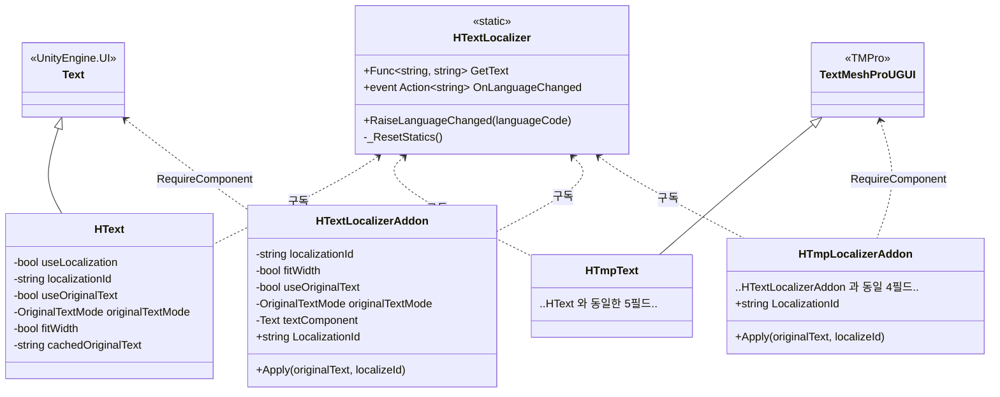
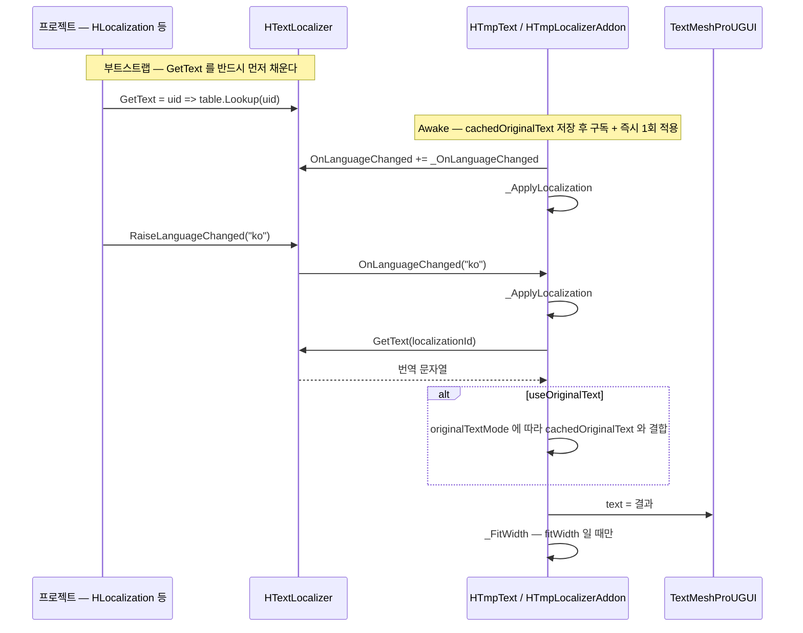
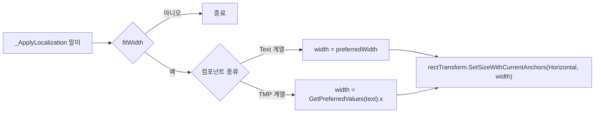

# Text — 텍스트 · 로컬라이제이션

> 어셈블리: `HCUP.HUI` — [Runtime/README.md](../Runtime/README.md) / `HCUP.HUI.Editor` — [Editor/README.md](../Editor/README.md)
> 네임스페이스: `HUI.TextUI`, `HUI.Editor.TextUI`
> 파일: `Runtime/HUI/Text/Localization/` 6개 (403행) + 에디터 4개 (315행)

---

## 요약

**HUI 는 번역 데이터를 갖지 않는다.** 이 시스템 전체가 `HTextLocalizer` 라는 정적 클래스 하나를
축으로 돈다. 그 안에는 **델리게이트 하나와 이벤트 하나**뿐이다.

```csharp
// Text/Localization/HTextLocalizer.cs:4-9
public static class HTextLocalizer {
    public static Func<string, string> GetText;              // 프로젝트가 대입한다
    public static event Action<string> OnLanguageChanged;    // 프로젝트가 발화한다
}
```

번역 테이블·언어 목록·로드 정책은 전부 바깥에 있다 — 실제로 `HLocalization` 패키지의
`LocalizationManager` 가 `GetText` 를 채우고 `RaiseLanguageChanged` 를 부른다
(`HLocalization/.../LocalizationManager.cs:55, :85, :103`).

HUI 가 제공하는 것은 **그 델리게이트를 구독해 자기 텍스트를 갱신하는 컴포넌트 4종**이다.

---

## 파일 지도

| 경로 | 행 | 역할 |
|---|---|---|
| `HTextLocalizer.cs` | 25 | 정적 축. `GetText` / `OnLanguageChanged` / `RaiseLanguageChanged` |
| `OriginalTextMode.cs` | 10 | `AppendOrigin` / `PrependOrigin` / `FormatOrigin` |
| `HText.cs` | 81 | `UnityEngine.UI.Text` 상속형 |
| `HTmpText.cs` | 82 | `TextMeshProUGUI` 상속형 |
| `HTextLocalizerAddon.cs` | 103 | `Text` 동반 애드온형 |
| `HTmpLocalizerAddon.cs` | 102 | `TextMeshProUGUI` 동반 애드온형 |
| `Editor/HUI/Text/HTextEditor.cs` | 92 | `HText` 인스펙터 |
| `Editor/HUI/Text/HTmpTextEditor.cs` | 95 | `HTmpText` 인스펙터 |
| `Editor/HUI/Text/HTextLocalizerAddonEditor.cs` | 64 | 애드온 인스펙터 |
| `Editor/HUI/Text/HTmpLocalizerAddonEditor.cs` | 64 | 애드온 인스펙터 |

---

## 계층 구조 — 상속형 vs 애드온형

같은 기능을 두 가지 방식으로 제공한다. 애드온형의 존재 이유가 코드 주석에 명시되어 있다.

```csharp
// Text/Localization/HTmpLocalizerAddon.cs:7-9
/// 기존 TextMeshProUGUI 컴포넌트에 애드온으로 부착하여 로컬리제이션 기능을 추가한다.
/// TMP를 상속하지 않으므로 기존 TMP의 Copy/Paste Component Values가 그대로 동작한다.
```



| | 상속형 (`HText` / `HTmpText`) | 애드온형 (`*LocalizerAddon`) |
|---|---|---|
| `useLocalization` 스위치 | 있음 — 꺼져 있으면 **구독조차 하지 않는다** | 없음 — 붙이면 항상 활성 |
| 필드 노출 | `[HideInInspector]` + 커스텀 에디터 | 일반 `[SerializeField]` + 커스텀 에디터 |
| 런타임 ID 교체 | **불가** (공개 API 없음) | `LocalizationId` 세터 / `Apply(origin, id)` |
| Copy/Paste Component Values | 원본 컴포넌트와 호환되지 않음 | 그대로 동작 |
| `cachedOriginalText` 갱신 | `Awake` 1회뿐 | `Apply` 로 갱신 가능 |

**재활용 셀에서는 애드온형만 쓸 수 있다.** ID 를 바꿔 다시 적용하는 경로가 상속형에는 없다.

---

## 데이터 모델 — `OriginalTextMode`

`useOriginalText` 가 켜지면 번역 결과를 인스펙터에 적어 둔 원본 텍스트와 결합한다.

| 모드 | 결과 | 코드 |
|---|---|---|
| `PrependOrigin` | `cachedOriginalText + localizedText` | `HText.cs:56-58` |
| `AppendOrigin` | `localizedText + cachedOriginalText` | `HText.cs:59-61` |
| `FormatOrigin` | `string.Format(localizedText, cachedOriginalText)` | `HText.cs:62-64` |

**이름과 동작이 반대로 읽힌다.** `PrependOrigin` 이 원본을 앞에 두고, `AppendOrigin` 이 뒤에
둔다 — 즉 이름은 "원본을 어디에 붙이는가" 기준이다. `enum` 선언 순서는
`AppendOrigin, PrependOrigin, FormatOrigin` 으로 표와 다르다 (`OriginalTextMode.cs:6-8`).

`FormatOrigin` 은 번역 문자열이 `"남은 시간: {0}"` 같은 형식이고 원본이 인자가 되는 경우다.

---

## 흐름 1 — 언어 변경 전파



`_ApplyLocalization` 의 세 가드가 모두 **조용한 반환**이다.

```csharp
// Text/Localization/HTmpText.cs:49-51
private void _ApplyLocalization() {
    if (string.IsNullOrEmpty(localizationId)) return;
    if (HTextLocalizer.GetText == null) return;      // 부트스트랩 전이면 원본 텍스트 유지
```

`GetText` 가 아직 없을 때 원본 텍스트가 그대로 남는 것은 **의도된 폴백**이다 —
`LocalizationManager` 도 초기화 실패 시 `GetText = uid => uid` 로 passthrough 를 세운다
(`HLocalization/.../LocalizationManager.cs:55`).

---

## 흐름 2 — 정적 상태 리셋

`GetText` 는 정적 필드라 Domain Reload 비활성 환경에서 이전 플레이의 람다가 살아남는다. 그 람다가
파괴된 매니저를 캡처하고 있으면 조용히 잘못된 값을 낸다.

```csharp
// Text/Localization/HTextLocalizer.cs:11-16
// Domain Reload 비활성 시 이전 플레이의 델리게이트가 잔존해 파괴된 로컬라이저를 가리키는 것을 방지.
[UnityEngine.RuntimeInitializeOnLoadMethod(UnityEngine.RuntimeInitializeLoadType.SubsystemRegistration)]
private static void _ResetStatics() {
    GetText = null;
    OnLanguageChanged = null;
}
```

`SubsystemRegistration` 은 씬 로드보다도 먼저 도는 시점이라, **어떤 컴포넌트의 `Awake` 보다도
앞선다.** 구독은 그 뒤에 다시 쌓인다.

---

## 흐름 3 — `fitWidth`



에디터 툴팁이 "비활성 상태에서도 동작"이라고 명시한다 (`HTextEditor.cs:65`) — `preferredWidth` /
`GetPreferredValues` 는 레이아웃 리빌드를 기다리지 않고 즉시 계산하기 때문이다.

---

## 사용 예

```csharp
// 1) 부트스트랩 — 컴포넌트가 Awake 하기 전에 GetText 를 채워야 첫 적용이 유효하다
HTextLocalizer.GetText = uid => _table.TryGetValue(uid, out var v) ? v : uid;
HTextLocalizer.RaiseLanguageChanged("ko");

// 2) 정적 라벨 — 상속형. 인스펙터에서 Use Localization 체크 + ID 입력
//    (HTmpText 컴포넌트를 붙이고 HTmpTextEditor 가 그리는 필드를 채운다)

// 3) 재활용 셀 — 애드온형. 셀 데이터마다 ID 를 갈아 끼운다
public override void Bind(ItemCellData data) {
    nameLocalizer.Apply(originalText: data.Count.ToString(), localizeId: data.NameId);
}

// 4) ID 만 교체 (원본 텍스트 유지)
addon.LocalizationId = "UI.MAIN.PLAY";   // 세터가 _ApplyLocalization 을 부른다

// 5) 동적 문자열 — 컴포넌트 없이 직접 조회
string label = HTextLocalizer.GetText?.Invoke("UI.CONFIRM") ?? "UI.CONFIRM";
```

---

## 주의할 점

### 계약

1. **`HTextLocalizer.GetText` 는 프로젝트가 채워야 한다.** HUI 는 절대 대입하지 않는다.
   비어 있으면 4개 컴포넌트가 전부 조용히 아무 일도 하지 않는다.
2. **`cachedOriginalText` 는 `Awake` 시점의 `text` 값이다** (`HText.cs:29` 등). 상속형은 이후
   갱신할 방법이 없으므로, 코드로 `text` 를 바꾼 뒤 언어를 전환하면 **`Awake` 시점의 옛 원본이
   다시 결합된다.** 애드온형은 `Apply` 로 갱신할 수 있다.
3. **상속형은 `useLocalization` 이 꺼져 있으면 구독하지 않는다** (`HText.cs:31-34`). 런타임에 이
   플래그를 켜는 공개 경로가 없으므로 프리팹 저작 시점에 결정된다.
4. **`FormatOrigin` 은 번역 문자열에 `{0}` 이 없으면 원본이 사라진다.** `string.Format` 이 인자를
   그냥 버린다. 형식 오류(`{` 불균형)면 `FormatException` 이다 — try/catch 가 없다.
5. **애드온형은 `Awake` 에서 `GetComponent` 를 하고 `RequireComponent` 로 보장한다**
   (`HTextLocalizerAddon.cs:12, :52`). `AddComponent` 로 런타임에 붙이면 `Awake` 가 그 프레임에
   돌므로 순서 문제는 없다.

### 정리 대상

6. **4개 컴포넌트의 `_ApplyLocalization` 이 사실상 동일한 코드다.** 상속형 2개는 `text` 프로퍼티에,
   애드온 2개는 `textComponent.text` 에 쓰는 것만 다르고 나머지 20여 줄이 같다
   (`HText.cs:48-72` ≡ `HTmpText.cs:49-73` ≡ `HTextLocalizerAddon.cs:69-94` ≡
   `HTmpLocalizerAddon.cs:68-93`). `_FitWidth` 도 4벌이다. 정적 헬퍼
   `(string localized, string origin, bool useOrigin, OriginalTextMode mode) => string` 하나로
   모을 수 있다.
7. **`HTextLocalizerAddon.cs` 가 쓰지 않는 `using` 을 2개 연다** — `using TMPro;` (`:2`) 와
   `using HInspector;` 는 필요하지만 `TMPro` 는 이 파일에서 참조되지 않는다.
8. **상속형과 애드온형의 필드 순서·구성이 다르다.** 상속형은
   `useLocalization / localizationId / useOriginalText / originalTextMode / fitWidth`,
   애드온형은 `localizationId / fitWidth / useOriginalText / originalTextMode`. 커스텀 에디터가
   문자열로 `FindProperty` 하므로 (`HTextEditor.cs:27-31`), 이 불일치는 에디터 4벌을 따로
   유지해야 하는 원인이다.
9. **애드온형은 `[HShowIf("useOriginalText")]` 를 붙였지만** (`HTextLocalizerAddon.cs:21`)
   전용 에디터가 `HInspector` 를 거치지 않고 직접 `PropertyField` 를 그린다
   (`HTextLocalizerAddonEditor.cs:38-42`). 조건부 노출이 두 겹으로 구현되어 있고, 실제로 동작하는
   것은 에디터 쪽 `if` 다.
10. **`OriginalTextMode` 의 선언 순서가 의미 순서와 다르다** (`OriginalTextMode.cs:6-8`).
    `AppendOrigin = 0` 이므로 **기본값이 "원본을 뒤에"** 다. 인스펙터에서 `useOriginalText` 만
    켜면 이 모드가 적용된다.
11. **`HText` 는 `UnityEngine.UI.Text` 를 상속한다.** Unity 는 이 컴포넌트를 레거시로 분류하며
    신규 프로젝트에서는 TMP 를 권장한다. `HText` / `HTextLocalizerAddon` / `HTextEditor` /
    `HTextLocalizerAddonEditor` 4파일이 그 계열이다.
12. **`RaiseLanguageChanged` 의 인자는 어디서도 쓰이지 않는다.** 4개 컴포넌트 모두
    `_OnLanguageChanged(string newLanguage)` 에서 인자를 무시하고 전량 재적용한다
    (`HText.cs:44-46` 등).

---

## 확장 지점

| 하고 싶은 것 | 손댈 곳 |
|---|---|
| 번역 백엔드 연결 | `HTextLocalizer.GetText` 대입 + 언어 전환 시 `RaiseLanguageChanged` 호출 |
| 새 결합 방식 | `OriginalTextMode` enum + 4개 컴포넌트의 `switch` (4곳 동시 수정) |
| 재활용 셀 텍스트 | 애드온형 + `Apply(originalText, localizeId)` |
| ID 자동완성 | `HCUP.HUI.Editor` — [Editor/README.md](../Editor/README.md) §확장 지점 |
| 폰트 자동 교체 (언어별) | 없음 — `OnLanguageChanged` 를 별도 구독하는 컴포넌트를 새로 만들어야 한다 |
| 서식 인자 다중화 | `FormatOrigin` 은 인자가 1개 고정 (`string.Format(localized, cachedOriginalText)`) |
