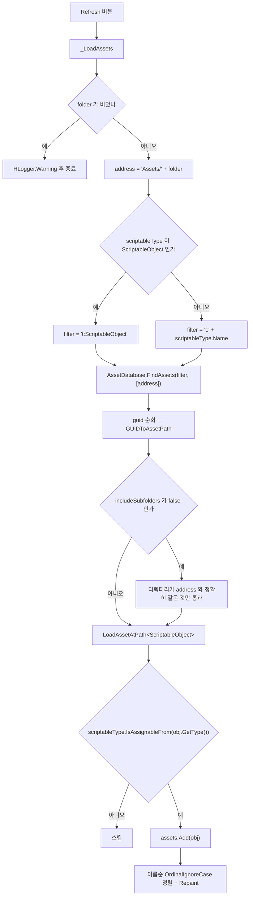

# HCUP.HUtil.Odin.Editor

> 어셈블리: `HCUP.HUtil.Odin.Editor` (파일명은 `Editor/Odin/HCUP.Util.Odin.Editor.asmdef` — **파일명과 어셈블리명 불일치**, rootNamespace `HUtil.Odin.Editor`, `includePlatforms: ["Editor"]`)
> 의존: `HCUP.HDiagnosis`
> 컴파일 조건: `defineConstraints: ["ODIN_INSPECTOR"]`
> 동반 어셈블리: `HCUP.HUtil`(런타임), `HCUP.HUtil.Editor`

---

## 요약

파일 1개, 163 행. Odin 이 있어야만 컴파일되는 **ScriptableObject 탐색 윈도우** 하나뿐이다.

| 파일 | 타입 | 진입 |
|---|---|---|
| `FileBrowser.cs` | `OdinEditorWindow` | 메뉴 `HCUP/Windows/File Browser` |

`HUtil` 런타임 코드와는 아무 관계가 없다. 어셈블리를 삭제해도 `HCUP.HUtil` 은 그대로
동작한다.

---

## FileBrowser

폴더 + 타입 조건으로 프로젝트의 `ScriptableObject` 를 찾아, Odin 의 `[InlineEditor]` 로
결과 목록을 **인라인 편집 가능한 형태**로 보여준다.



| 멤버 | 성격 | 행 |
|---|---|---|
| `folder` | `[FolderPath(ParentFolder = "Assets")]` — 기본값 `"Assets"` | `:31-32` |
| `scriptableType` | `[ValueDropdown(nameof(GetScriptableTypes))]` | `:37-38` |
| `includeSubfolders` | `[ToggleLeft]` 기본 `true` | `:40-41` |
| `Refresh()` | `[Button(ButtonSizes.Large)]` → `_LoadAssets()` | `:43-44` |
| `OpenFolder()` / `SelectAll()` / `PingAll()` | `[ButtonGroup]` 보조 3종 | `:48-63` |
| `assets` | `[Searchable]` + `[ListDrawerSettings]` + `[InlineEditor(CompletelyHidden)]` | `:68-72` |
| `GetScriptableTypes()` | 전 어셈블리 순회로 드롭다운 항목 생성 | `:76-93` |
| `_LoadAssets()` | 실제 검색 | `:95-131` |

### 타입 드롭다운

```csharp
// FileBrowser.cs:76-83 — 어셈블리별 GetTypes() 실패를 개별로 흡수한다
var types = AppDomain.CurrentDomain.GetAssemblies()
    .SelectMany(a => {
        Type[] ts;
        try { ts = a.GetTypes(); }
        catch { ts = Array.Empty<Type>(); }
        return ts;
    })
    .Where(t => typeof(ScriptableObject).IsAssignableFrom(t) && !t.IsAbstract)
    .OrderBy(t => t.Name);
```

`ReflectionTypeLoadException` 이 나는 어셈블리를 빈 배열로 갈아 넘겨 전체 열거가 죽지
않게 한다.

### 필터가 2중인 이유

`AssetDatabase.FindAssets` 의 `t:{Name}` 필터는 **타입 이름 문자열 기반**이라 동명 타입을
구별하지 못하고 파생 타입 처리도 불완전하다. 그래서 로드 후
`scriptableType.IsAssignableFrom(obj.GetType())` 로 한 번 더 걸러낸다 (`:120-123`).

---

## 사용 예

메뉴 `HCUP/Windows/File Browser` → `folder` 지정 → `Type` 선택 → `Refresh`.

`assets` 리스트는 `[InlineEditor(InlineEditorObjectFieldModes.CompletelyHidden)]` 이므로
**목록에서 바로 각 SO 의 필드를 편집할 수 있다** (`:71`). 오브젝트 필드 자체는 숨겨진다.

---

## 주의할 점

### 계약

1. **Odin 없이는 이 어셈블리가 존재하지 않는다.** asmdef `defineConstraints` 와 소스
   `#if UNITY_EDITOR && ODIN_INSPECTOR` (`:1`)의 이중 가드다.
2. **`folder` 값에 `"Assets/"` 를 붙이면 경로가 중복된다.** 코드가 항상
   `"Assets/" + folder` 를 만들고(`:50`, `:102`), `[FolderPath(ParentFolder = "Assets")]`
   가 이미 `Assets` 를 기준으로 잡는다. 기본값이 `"Assets"` 이므로 초기 상태의 경로는
   `"Assets/Assets"` 가 된다 — 첫 `Refresh` 는 대개 아무것도 찾지 못한다.
3. **`includeSubfolders = false` 는 정확히 그 폴더만 본다** (`:109-115`). 디렉터리 문자열
   완전 일치 비교이므로 경로 구분자 정규화(`\\` → `/`)에 의존한다.
4. **결과는 매번 이름순으로 재정렬된다** (`:129`). `[ListDrawerSettings]` 의
   `DraggableItems = false` 와 맞물려 사용자 순서를 유지하지 않는다.

### 정리 대상

5. **하단 주석의 메뉴 경로가 실제와 다르다.** `HCUP → View → File Browser` 라고 적었으나
   (`:152`), 실제 `[MenuItem]` 은 `HCUP/Windows/File Browser` 다 (`:22`).
6. **asmdef 파일명과 어셈블리명이 불일치한다.** 파일은 `HCUP.Util.Odin.Editor.asmdef`,
   내부 `name` 은 `HCUP.HUtil.Odin.Editor` 다. 같은 문제가 `HUtil/Runtime/Odin`
   (`HCUP.Util.Odin`)에도 있다.
7. ~~`HCUP.HUtil` 참조가 쓰이지 않는다.~~ `FileBrowser` 의 `using` 은 `System`,
   `System.Linq`, `System.Collections.Generic`, `UnityEditor`, `UnityEngine`,
   `Sirenix.*`, `HDiagnosis.Logger` 뿐이라 asmdef 에서 제거, `HCUP.HDiagnosis` 만
   남김 (2026-08-07 반영).
8. **네임스페이스가 rootNamespace 와 다르다.** 파일은 `namespace HUtil.Editor` (`:20`)
   인데 asmdef `rootNamespace` 는 `HUtil.Odin.Editor` 다. 결과적으로
   `HCUP.HUtil.Editor` 어셈블리의 `HUtil.Editor` 네임스페이스와 같은 이름 공간을
   공유한다.
9. **로그 태그가 클래스명과 다르다.** `HLogger.Warning("[SO Browser] ...")` (`:98`)
   인데 클래스는 `FileBrowser` 다.
10. **`OpenFolder` 는 존재하지 않는 경로에서 실패한다** (`:49-53`).
    `Path.GetFullPath` 는 예외를 던지지 않지만 `RevealInFinder` 가 조용히 무동작한다.
    경로 존재 검사가 없다.

---

## 확장 지점

| 하고 싶은 것 | 손댈 곳 |
|---|---|
| SO 외 타입(Prefab, Texture 등) 지원 | `_LoadAssets` (`:95-131`)의 `LoadAssetAtPath<ScriptableObject>` 와 `assets` 필드 타입 |
| 페이지 크기 / 검색 UI 변경 | `assets` 의 `[ListDrawerSettings]` (`:70`, 현재 `NumberOfItemsPerPage = 20`) |
| 드롭다운 후보 축소 (특정 어셈블리만) | `GetScriptableTypes` (`:76-93`)의 `Where` 절 |
| 정렬 기준 변경 | `_LoadAssets` 말미의 `OrderBy` (`:129`) |
| 폴더 경로 중복 버그 수정 | `"Assets/" + folder` 조합 지점 2곳 (`:50`, `:102`) — `[FolderPath]` 규약과 일치시킬 것 |
