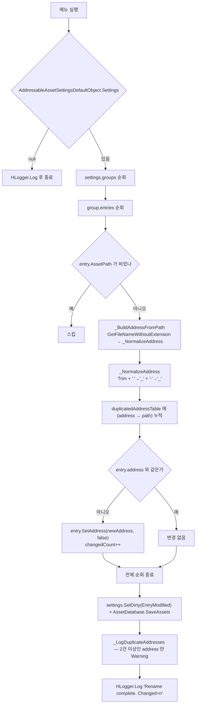

# HCUP.HUtil.Editor

> 어셈블리: `HCUP.HUtil.Editor` (`Editor/HCUP.HUtil.Editor.asmdef`, rootNamespace `HUtil.Editor`, `includePlatforms: ["Editor"]`)
> 의존: `Unity.TextMeshPro`, `Unity.TextMeshPro.Editor`, `Unity.Addressables.Editor`, `HCUP.HUtil`, `HCUP.HDiagnosis`
> 동반 어셈블리: `HCUP.HUtil`(런타임), `HCUP.HUtil.Odin.Editor`(`ODIN_INSPECTOR` 조건부)

---

## 요약

파일 1개짜리 어셈블리다. **Addressables 엔트리의 address 를 파일명 기준으로 일괄
재설정하는 메뉴 커맨드** 하나뿐이다.

| 파일 | 행수 | 진입 |
|---|---|---|
| `Inspector/Addressables/AddressableBatchRenameTool.cs` | 120 | 메뉴 `HCUP/Addressables/Rename All Addresses To File Name` |

---

## 동작



| 단계 | 코드 | 행 |
|---|---|---|
| 메뉴 등록 | `[MenuItem("HCUP/Addressables/Rename All Addresses To File Name")]` | `:25` |
| 설정 부재 가드 | `if (settings == null) { HLogger.Log(...); return; }` | `:27-31` |
| 중복 후보 수집 | `Dictionary<string, List<string>>(StringComparer.OrdinalIgnoreCase)` | `:33` |
| address 생성 | `_BuildAddressFromPath` → `Path.GetFileNameWithoutExtension` | `:72-76` |
| 정규화 | `_NormalizeAddress` — `Trim()`, 공백·하이픈을 `_` 로 | `:78-81` |
| 변경 없으면 스킵 | `string.Equals(entry.address, newAddress, Ordinal)` | `:55` |
| 반영 | `entry.SetAddress(newAddress, false)` | `:57` |
| 저장 | `settings.SetDirty(...)` + `AssetDatabase.SaveAssets()` | `:62-63` |
| 중복 경고 | `_LogDuplicateAddresses` | `:83-90` |

**중복 검사는 사후 보고다.** 중복이 발생해도 rename 을 되돌리지 않고, 전부 적용한 뒤
경고만 출력한다 (`:65`). address 충돌은 사용자가 수동으로 해결해야 한다.

**중복 판정만 대소문자 무시다.** `duplicatedAddressTable` 은 `OrdinalIgnoreCase` 이지만
(`:33`) 실제 `SetAddress` 여부 판정은 `StringComparison.Ordinal` 이다 (`:55`). 즉
`Icon` 과 `icon` 은 "중복" 으로 경고되지만 각자 다른 address 로 기록된다.

---

## 사용 예

메뉴에서 실행하는 것이 정상 경로다. 코드 호출도 가능하다.

```csharp
// public static 이므로 다른 에디터 스크립트에서 직접 호출할 수 있다
AddressableBatchRenameTool.RenameAllAddressesToFileName();
```

실행 전 **버전관리 커밋 상태를 정리해 둘 것.** 되돌리기 기능이 없고
`AssetDatabase.SaveAssets()` 로 즉시 디스크에 반영된다 (`:8-9` 헤더 주석).

---

## 주의할 점

### 계약

1. **되돌릴 수 없다.** Undo 기록을 남기지 않고 `SaveAssets()` 로 즉시 저장한다 (`:62-63`).
2. **address 충돌은 막지 않는다.** 파일명만 쓰므로 서로 다른 폴더의 동명 에셋이 같은
   address 를 갖게 된다. 도구는 경고만 남긴다 (`:83-90`).
3. **공백과 하이픈은 `_` 로 치환된다** (`:79`). 기존 address 규약이 하이픈을 쓰고 있었다면
   전부 바뀐다.
4. **`entry.SetAddress(newAddress, false)` 의 두 번째 인자는 `postEvent`** 다. `false` 라
   개별 변경 이벤트가 발생하지 않고, 루프가 끝난 뒤 `SetDirty` 한 번으로 묶는다 (`:62`).

### 정리 대상

5. **헤더의 메뉴 경로가 실제와 다르다.** 하단 주석은 `Tools/DR2/Addressables/Rename All
   Addresses To File Name` 라고 안내하지만(`:105`), 실제 `[MenuItem]` 은
   `HCUP/Addressables/...` 다 (`:25`). 어셈블리 prefix 가 `HCUP.*` 로 통일되기 전의 잔재다.
6. **주석 템플릿이 채워지지 않은 채 남아 있다.** "변수 설명 ::" 아래가 `X` / `XX` /
   `XXX` 다 (`:108-111`).
7. **`Unity.TextMeshPro` / `Unity.TextMeshPro.Editor` 참조가 쓰이지 않는다.** 이
   어셈블리의 유일한 파일은 TMP 를 참조하지 않는다 (`using` 은 `System`, `System.IO`,
   `System.Collections.Generic`, `UnityEditor`, `UnityEditor.AddressableAssets*`,
   `HDiagnosis.Logger`). asmdef 정리 대상이다.
8. **폴더 구조가 내용과 맞지 않는다.** 경로가 `Editor/Inspector/Addressables/` 인데
   인스펙터 코드가 아니다. `Editor/Addressables/` 가 맞다.

---

## 확장 지점

| 하고 싶은 것 | 손댈 곳 |
|---|---|
| 폴더명 prefix 로 충돌 회피 | `_BuildAddressFromPath` (`:72-76`) — 상위 폴더명을 붙여 반환 |
| 정규화 규칙 변경 (소문자화 등) | `_NormalizeAddress` (`:78-81`) |
| 충돌 시 rename 자체를 중단 | 현재 구조로는 불가 — 1패스로 수집·적용을 동시에 한다. 수집 패스와 적용 패스를 분리해야 한다 |
| 특정 그룹만 대상 | `foreach (var group in settings.groups)` (`:36`)에 그룹명 필터 추가 |
