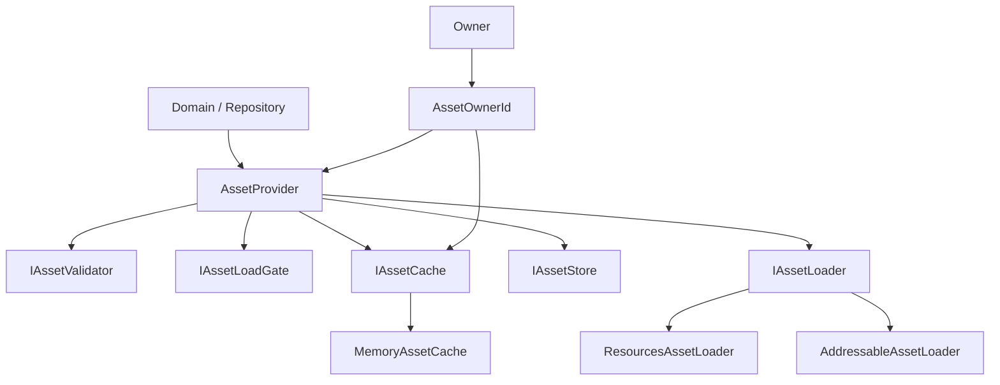
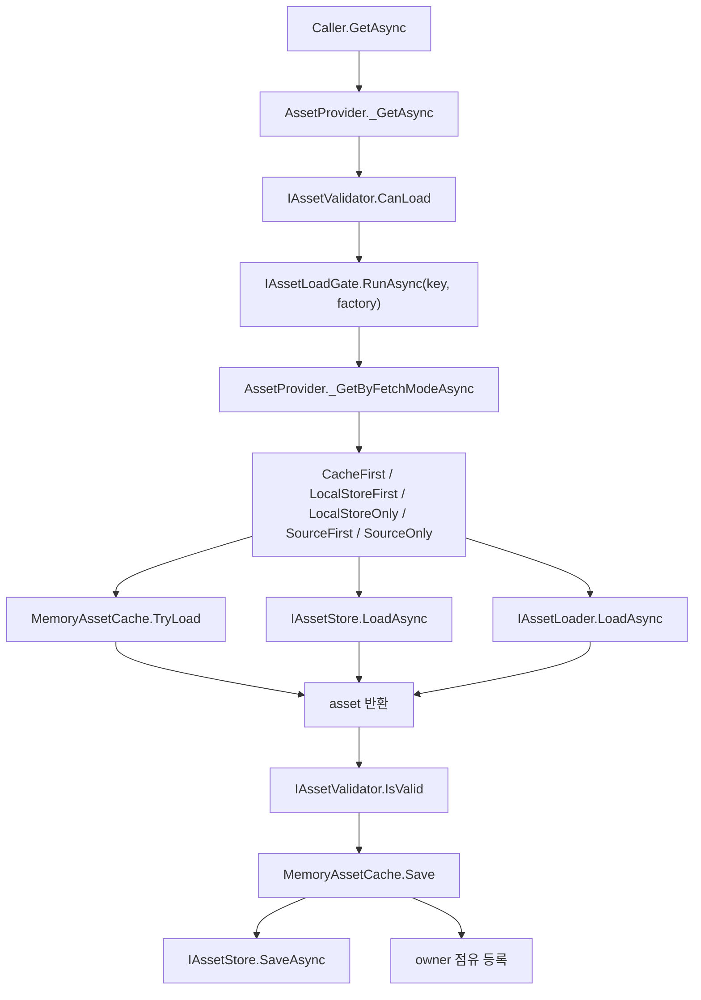
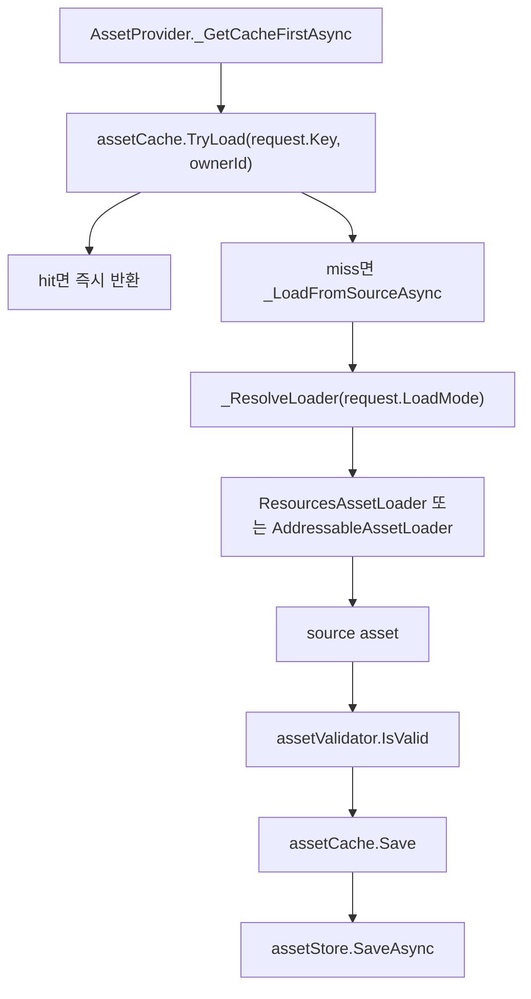
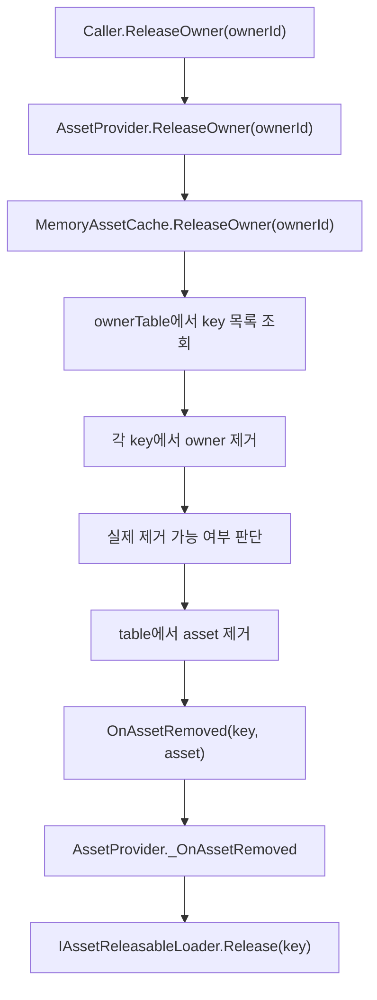
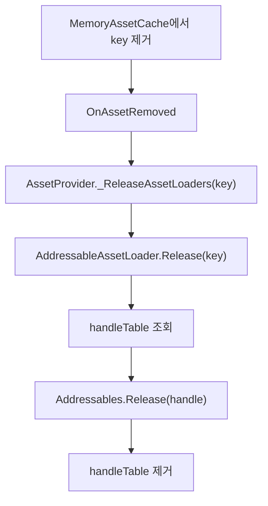
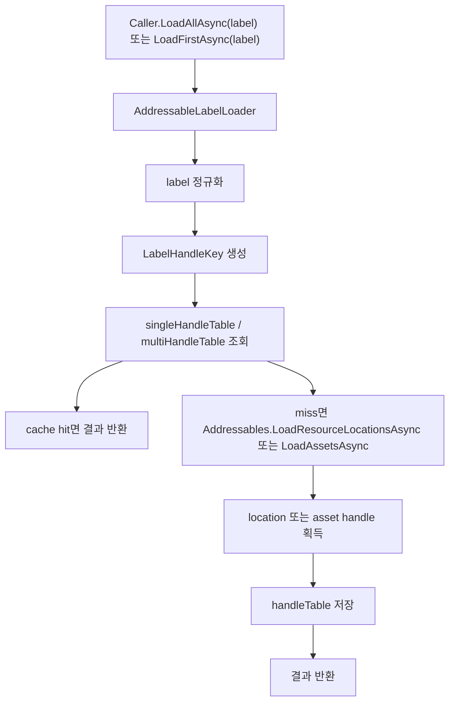

# HUtil.AssetHandler

## 개요
`HUtil.AssetHandler`는 asset 조회, 저장, 해제 흐름을 공통화한 시스템이다.  
핵심 목표는 아래 두 가지다.

- `cache / store / source` 책임 분리
- `AssetOwnerId` 기반 owner-aware 수명 관리

핵심 구성은 아래와 같다.

- `AssetProvider`
  시스템의 중심 진입점이다. fetch mode에 따라 조회 순서를 조율한다.
- `MemoryAssetCache`
  메모리 캐시이자 owner 점유 추적 테이블이다.
- `ResourcesAssetLoader`, `AddressableAssetLoader`
  실제 source 로딩 책임을 가진 loader들이다.
- `AddressableLabelLoader`
  일반 provider 축과 분리된 label query 도구이다.
- `AssetOwnerId`, `AssetOwnerIdGenerator`
  owner lifecycle을 reference 대신 값 식별자로 다룬다.

## 시스템 구조

### 선분 설명
| From | To | 작업 |
|---|---|---|
| Domain / Repository | AssetProvider<TKey, TAsset> | 도메인 코드가 asset 조회와 해제 요청을 보낸다. |
| AssetProvider<TKey, TAsset> | IAssetValidator<TKey, TAsset> | key와 결과 asset의 최소 유효성을 검사한다. |
| AssetProvider<TKey, TAsset> | IAssetLoadGate<TKey, TAsset> | 동일 key 중복 로드를 하나의 작업으로 합친다. |
| AssetProvider<TKey, TAsset> | IAssetCache<TKey, TAsset> | cache 조회, 저장, 해제를 수행한다. |
| AssetProvider<TKey, TAsset> | IAssetStore<TKey, TAsset> | 선택적 local store 조회와 저장을 수행한다. |
| AssetProvider<TKey, TAsset> | IAssetLoader<TKey, TAsset> | load mode에 맞는 실제 source loader를 선택한다. |
| IAssetCache<TKey, TAsset> | MemoryAssetCache<TKey, TAsset> | 기본 메모리 캐시 구현으로 연결된다. |
| IAssetLoader<TKey, TAsset> | ResourcesAssetLoader<TAsset> | Resources source 로드 경로를 제공한다. |
| IAssetLoader<TKey, TAsset> | AddressableAssetLoader<TAsset> | Addressable source 로드와 source release를 제공한다. |
| Owner | AssetOwnerId | owner 객체를 수명 식별자로 변환한다. |
| AssetOwnerId | AssetProvider<TKey, TAsset> | 요청과 release에 owner 문맥을 전달한다. |
| AssetOwnerId | IAssetCache<TKey, TAsset> | owner 점유 등록과 owner 단위 해제를 가능하게 한다. |

## 흐름 1. 일반 조회
기본 조회는 `AssetRequest` 또는 직접 인자 기반 `GetAsync`로 시작한다.

### 선분 설명
| From | To | 작업 |
|---|---|---|
| Caller.GetAsync | AssetProvider._GetAsync | provider 진입점에서 요청을 받는다. |
| AssetProvider._GetAsync | IAssetValidator.CanLoad | key가 로드 가능한지 먼저 검사한다. |
| IAssetValidator.CanLoad | IAssetLoadGate.RunAsync(key, factory) | 유효한 key만 load gate에 넣는다. |
| IAssetLoadGate.RunAsync(key, factory) | AssetProvider._GetByFetchModeAsync | fetch mode에 따른 실제 조회 루틴을 실행한다. |
| AssetProvider._GetByFetchModeAsync | CacheFirst / LocalStoreFirst / LocalStoreOnly / SourceFirst / SourceOnly | 요청 정책에 따라 조회 순서를 선택한다. |
| 정책 분기 | MemoryAssetCache.TryLoad | 캐시에서 즉시 조회를 시도한다. |
| 정책 분기 | IAssetStore.LoadAsync | local store 사용 시 저장소 조회를 시도한다. |
| 정책 분기 | IAssetLoader.LoadAsync | 실제 source 로드를 수행한다. |
| MemoryAssetCache.TryLoad | asset 반환 | cache hit이면 바로 결과를 돌려준다. |
| IAssetStore.LoadAsync | asset 반환 | store hit이면 결과를 반환한다. |
| IAssetLoader.LoadAsync | asset 반환 | source load 성공 결과를 반환한다. |
| asset 반환 | IAssetValidator.IsValid | 결과 asset이 유효한지 다시 검사한다. |
| IAssetValidator.IsValid | MemoryAssetCache.Save | 유효하면 cache에 저장한다. |
| MemoryAssetCache.Save | IAssetStore.SaveAsync | source 결과면 store에도 저장할 수 있다. |
| MemoryAssetCache.Save | owner 점유 등록 | owner가 있으면 cache에 점유 관계를 기록한다. |

## 흐름 2. CacheFirst 세부 흐름
가장 기본적인 조회 정책은 `CacheFirst`이다.

### 선분 설명
| From | To | 작업 |
|---|---|---|
| AssetProvider._GetCacheFirstAsync | assetCache.TryLoad(request.Key, ownerId) | 먼저 cache hit을 확인하면서 owner 점유를 연결할 수 있다. |
| assetCache.TryLoad(request.Key, ownerId) | hit면 즉시 반환 | 이미 cache에 있으면 source 호출 없이 종료한다. |
| assetCache.TryLoad(request.Key, ownerId) | miss면 _LoadFromSourceAsync | cache miss면 실제 source 로드로 넘어간다. |
| _LoadFromSourceAsync | _ResolveLoader(request.LoadMode) | load mode에 맞는 loader를 선택한다. |
| _ResolveLoader(request.LoadMode) | ResourcesAssetLoader 또는 AddressableAssetLoader | 선택된 source loader에 실제 로드를 위임한다. |
| ResourcesAssetLoader 또는 AddressableAssetLoader | source asset | source 결과 asset을 반환한다. |
| source asset | assetValidator.IsValid | 로드 결과의 최소 유효성을 검사한다. |
| assetValidator.IsValid | assetCache.Save | 유효하면 cache에 저장한다. |
| assetCache.Save | assetStore.SaveAsync | store가 있으면 후속 저장을 수행한다. |

## 흐름 3. Owner 기반 release
이 시스템의 핵심은 `object owner`가 아니라 `AssetOwnerId` 기준 release이다.

### 선분 설명
| From | To | 작업 |
|---|---|---|
| Caller.ReleaseOwner(ownerId) | AssetProvider.ReleaseOwner(ownerId) | 외부에서 owner 단위 정리를 요청한다. |
| AssetProvider.ReleaseOwner(ownerId) | MemoryAssetCache.ReleaseOwner(ownerId) | 실제 owner 점유 기록은 cache가 들고 있으므로 cache에 위임한다. |
| MemoryAssetCache.ReleaseOwner(ownerId) | ownerTable에서 key 목록 조회 | owner가 점유한 모든 key를 찾는다. |
| ownerTable에서 key 목록 조회 | 각 key에서 owner 제거 | 각 asset에서 해당 owner 점유를 제거한다. |
| 각 key에서 owner 제거 | 실제 제거 가능 여부 판단 | anonymous dependency와 남은 owner가 없는지 확인한다. |
| 실제 제거 가능 여부 판단 | table에서 asset 제거 | 더 이상 참조가 없으면 cache에서 asset을 제거한다. |
| table에서 asset 제거 | OnAssetRemoved(key, asset) | 실제 제거 사실을 이벤트로 알린다. |
| OnAssetRemoved(key, asset) | AssetProvider._OnAssetRemoved | provider가 cache 제거 이벤트를 받는다. |
| AssetProvider._OnAssetRemoved | IAssetReleasableLoader.Release(key) | Addressable handle 같은 source 수명 정리를 수행한다. |

## 흐름 4. Addressable release
Addressable은 cache 제거만으로 끝나지 않는다.

### 선분 설명
| From | To | 작업 |
|---|---|---|
| MemoryAssetCache에서 key 제거 | OnAssetRemoved | cache 수준 제거 사실을 알린다. |
| OnAssetRemoved | AssetProvider._ReleaseAssetLoaders(key) | provider가 releasable loader 목록에 release를 전달한다. |
| AssetProvider._ReleaseAssetLoaders(key) | AddressableAssetLoader.Release(key) | Addressable loader가 key별 handle 정리를 맡는다. |
| AddressableAssetLoader.Release(key) | handleTable 조회 | 저장된 Addressable handle을 찾는다. |
| handleTable 조회 | Addressables.Release(handle) | 실제 engine/source release를 수행한다. |
| Addressables.Release(handle) | handleTable 제거 | 내부 handle 캐시에서도 key를 제거한다. |

## 흐름 5. Addressable label query
label 조회는 일반 provider 축과 별도 도구로 분리되어 있다.

### 선분 설명
| From | To | 작업 |
|---|---|---|
| Caller.LoadAllAsync(label) 또는 LoadFirstAsync(label) | AddressableLabelLoader | label query 요청을 전용 로더가 받는다. |
| AddressableLabelLoader | label 정규화 | 공백과 포맷을 정리한다. |
| label 정규화 | LabelHandleKey 생성 | `label + mode + index` 조합으로 내부 key를 만든다. |
| LabelHandleKey 생성 | singleHandleTable / multiHandleTable 조회 | 동일 query의 기존 handle이 있는지 찾는다. |
| singleHandleTable / multiHandleTable 조회 | cache hit면 결과 반환 | 이미 유효한 handle이 있으면 바로 결과를 반환한다. |
| singleHandleTable / multiHandleTable 조회 | miss면 Addressables.LoadResourceLocationsAsync 또는 LoadAssetsAsync | query 모드에 맞는 Addressables API를 호출한다. |
| Addressables API 호출 | location 또는 asset handle 획득 | first, single, index는 location 해석 후 asset handle을 얻는다. |
| location 또는 asset handle 획득 | handleTable 저장 | mode별 내부 handle 테이블에 저장한다. |
| handleTable 저장 | 결과 반환 | query 결과 asset 또는 리스트를 반환한다. |

## 운영 규칙
- `AssetLoadMode`는 source 종류이고, `AssetFetchMode`는 조회 우선순위다.
- `AssetProvider`는 조율자이고, 실제 source 로드는 loader가 담당한다.
- owner 수명 관리는 `AssetOwnerId` 기준으로 한다.
- `MemoryAssetCache`는 단순 dictionary가 아니라 owner-aware cache다.
- Addressable label query는 일반 `AssetProvider` 경로에 억지로 넣지 않는다.
- lease 계층은 선택 기능이며 필수 구조는 아니다.

## 관련 파일
- `Provider/AssetProvider.cs`
- `Provider/AssetProviderFactory.cs`
- `Cache/MemoryAssetCache.cs`
- `Load/ResourcesAssetLoader.cs`
- `Load/AddressableAssetLoader.cs`
- `Load/AddressableLabelLoader.cs`
- `Subscription/AssetOwnerId.cs`
