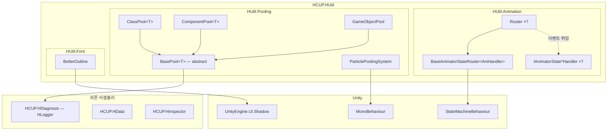
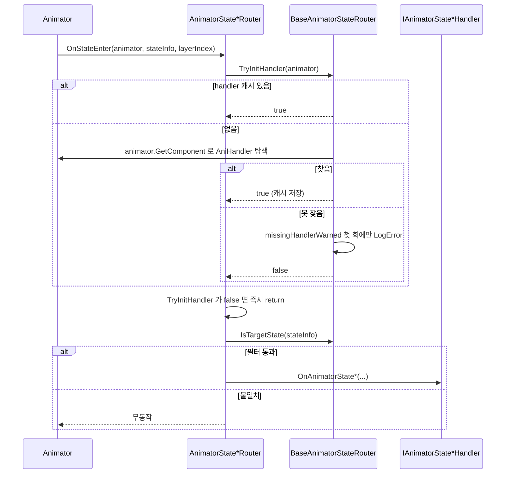
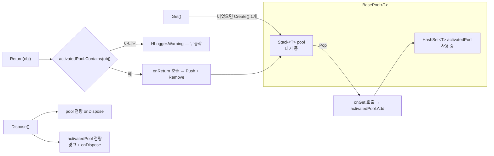
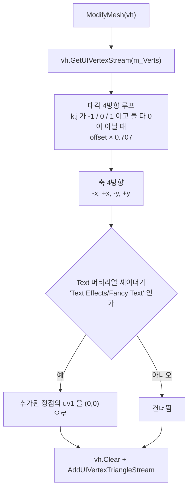

# HCUP.HUtil

> 어셈블리: `HCUP.HUtil` (`Runtime/HCUP.HUtil.asmdef`, rootNamespace `HUtil`)
> 의존: `HCUP.HData`, `HCUP.HDiagnosis`, `HCUP.HInspector`
> 동반 어셈블리: `HCUP.HUtil.Editor`, `HCUP.HUtil.Odin.Editor`(`ODIN_INSPECTOR` 조건부), `HCUP.Util.Odin`·`HCUP.Util.Tween`(**둘 다 `.cs` 0개 — 빈 어셈블리**)

---

## 요약

이 문서는 **`HCUP.HUtil` 런타임 어셈블리의 현재 내용물**만 다룬다. 상위
`HUtil/README.md` 가 서술하는 `AssetHandler` / `Data` / `Scene` / `Time` / `Logger` 계층은
전부 다른 어셈블리(`HCUP.HResource`, `HCUP.HCore`, `HCUP.HDiagnosis`)로 분리되었고 여기에
없다. **상위 README 는 낡았다.**

지금 남아 있는 것은 서로 무관한 세 시스템이다.

| 시스템 | 파일 | 성격 |
|---|---|---|
| **Animation 라우터** | 15 | `StateMachineBehaviour` → 인터페이스 핸들러 브리지 |
| **Pooling** | 5 | 타입 무관 오브젝트 풀 계층 |
| **Font** | 1 | `UnityEngine.UI.Text` 용 다방향 아웃라인 (실제 8방향) |

**세 시스템 사이에 참조가 없다.** 어느 하나를 지워도 나머지가 컴파일된다. 21 파일 925 행
(`Samples~` 제외 — Animation 254+143, Pooling 418, Font 110)이고, Animation 15 파일 중
14 파일이 20~26 행짜리 정형 파일이다. 별도 문서로 분리할 만한 부피가 아니라 이 README
하나로 충분하다.

---

## 파일 지도

| 경로 | 행수 | 역할 |
|---|---|---|
| `HUtil/Animation/BaseAnimatorStateRouter.cs` | 74 | 라우터 공통 베이스. 핸들러 확보 + 상태명 필터 |
| `HUtil/Animation/AnimatorStateEnterRouter.cs` | 26 | `OnStateEnter` → `IAnimatorStateEnterHandler` |
| `HUtil/Animation/AnimatorStateExitRouter.cs` | 26 | `OnStateExit` → `IAnimatorStateExitHandler` |
| `HUtil/Animation/AnimatorStateUpdateRouter.cs` | 26 | `OnStateUpdate` → `IAnimatorStateUpdateHandler` |
| `HUtil/Animation/AnimatorStateMoveRouter.cs` | 26 | `OnStateMove` → `IAnimatorStateMoveHandler` |
| `HUtil/Animation/AnimatorStateIkRouter.cs` | 26 | `OnStateIK` → `IAnimatorStateIkHandler` |
| `HUtil/Animation/AnimatorStateMachineEnterRouter.cs` | 25 | `OnStateMachineEnter` → 대응 핸들러 |
| `HUtil/Animation/AnimatorStateMachineExitRouter.cs` | 25 | `OnStateMachineExit` → 대응 핸들러 |
| `HUtil/Animation/IAnimatorState*Handler.cs` ×7 | 20~23 | 핸들러 인터페이스 7종 |
| `HUtil/Pooling/BasePool.cs` | 160 | 풀 본체. `Stack` + `HashSet` 2컬렉션 |
| `HUtil/Pooling/ClassPool.cs` | 53 | `new()` 제약 C# 클래스 풀 |
| `HUtil/Pooling/ComponentPool.cs` | 79 | `Component` 풀. prefab 유무 분기 |
| `HUtil/Pooling/GameObjectPool.cs` | 66 | `GameObject` prefab 풀 |
| `HUtil/Pooling/ParticlePoolingSystem.cs` | 60 | 파티클 종료 감지 보조 컴포넌트 |
| `HUtil/Font/BetterOutline.cs` | 110 | `Shadow` 파생 아웃라인 (외부 출처 코드) |
| `Samples~/SceneUtil/SceneTester.cs` | 19 | **컴파일되지 않음** (`Samples~`) |

---

## 계층 구조



`HCUP.HData` / `HCUP.HInspector` 는 asmdef references 에 있으나 **런타임 코드에서 실제로
사용되지 않는다** (아래 "정리 대상" 참조).

---

## 시스템 1 — Animation 라우터

### 문제와 해법

Unity 의 `StateMachineBehaviour` 는 Animator 컨트롤러 에셋에 붙는다. 씬 오브젝트를 직접
참조할 수 없어서, State 이벤트를 게임 로직으로 넘길 표준 경로가 없다.

이 시스템은 **"Animator 가 붙은 GameObject 에서 핸들러 인터페이스를 `GetComponent` 로 찾아
넘긴다"** 는 한 가지 규칙으로 그 경로를 만든다.



### TryInitHandler — null 가드

라우터 7종 전부가 이벤트 첫 줄에서 `TryInitHandler` 를 호출하고, `false` 면 즉시 반환한다.

```csharp
// HUtil/Animation/BaseAnimatorStateRouter.cs:29-44
/// <summary> Handler 확보 시도. 없으면 1회 경고 후 false — 호출측은 즉시 return 할 것. </summary>
protected bool TryInitHandler(Animator animator) {
    if (handler != null) return true;
    handler = animator.GetComponent<AniHandler>();
    if (handler != null) return true;

    // Handler 부재 시 매 이벤트(Update 라우터는 매 프레임) NRE 를 던지던 결함 —
    // 경고 1회 후 조용히 무시하는 대신 스팸 없이 원인을 남긴다.
    if (!missingHandlerWarned) {
        missingHandlerWarned = true;
        Debug.LogError(
            $"[{GetType().Name}] {typeof(AniHandler).Name} component not found on '{animator.gameObject.name}'. Router events will be ignored.",
            animator);
    }
    return false;
}
```

`missingHandlerWarned` 플래그(`:27`)가 핵심이다. **`AnimatorStateUpdateRouter` 는 매
프레임 호출되므로**, 가드가 없으면 콘솔이 초당 수십 줄의 NRE 로 채워진다.

### 라우터 ↔ 핸들러 대응표

| Router | Unity 콜백 | 핸들러 인터페이스 | 핸들러 메서드 | 상태명 필터 |
|---|---|---|---|---|
| `AnimatorStateEnterRouter` | `OnStateEnter` | `IAnimatorStateEnterHandler` | `OnAnimatorStateEnter` | 적용 |
| `AnimatorStateExitRouter` | `OnStateExit` | `IAnimatorStateExitHandler` | `OnAnimatorStateExit` | 적용 |
| `AnimatorStateUpdateRouter` | `OnStateUpdate` | `IAnimatorStateUpdateHandler` | `OnAnimatorStateUpdate` | 적용 |
| `AnimatorStateMoveRouter` | `OnStateMove` | `IAnimatorStateMoveHandler` | `OnAnimatorStateMove` | 적용 |
| `AnimatorStateIkRouter` | `OnStateIK` | `IAnimatorStateIkHandler` | `OnAnimatorStateIK` | 적용 |
| `AnimatorStateMachineEnterRouter` | `OnStateMachineEnter` | `IAnimatorStateMachineEnterHandler` | `OnAnimatorStateMachineEnter` | **미적용** |
| `AnimatorStateMachineExitRouter` | `OnStateMachineExit` | `IAnimatorStateMachineExitHandler` | `OnAnimatorStateMachineExit` | **미적용** |

StateMachine 계열 2종만 필터를 걸지 않는다. Unity 가 넘겨주는 인자가
`int stateMachinePathHash` 뿐이라 `AnimatorStateInfo` 가 없기 때문이다
(`AnimatorStateMachineEnterRouter.cs:19-22`).

### 상태명 필터

```csharp
// HUtil/Animation/BaseAnimatorStateRouter.cs:46-49
protected bool IsTargetState(AnimatorStateInfo stateInfo) {
    if (!useStateNameFilter || string.IsNullOrEmpty(targetStateName)) return true;
    return stateInfo.IsName(targetStateName);
}
```

`useStateNameFilter` 를 켰어도 **`targetStateName` 이 비어 있으면 전부 통과한다**
(`:47`). "필터를 켰는데 아무것도 안 걸러지는" 상태가 조용히 성립한다.

---

## 시스템 2 — Pooling

### 컬렉션 2개 구조



**`Stack` 을 쓰는 이유는 캐시 지역성이다** — 최근 반환된 객체가 메모리 캐시에 가깝다
(`BasePool.cs` Dev Log). **`HashSet` 을 쓰는 이유는 중복 반환 검사**다
(`BasePool.cs:106-115`).

| 멤버 | 의미 | 행 |
|---|---|---|
| `CountTotal` | `pool.Count + activatedPool.Count` | `:41` |
| `CountAvaliable` | 대기 중 (원문 오타 그대로) | `:42` |
| `CountActivated` | 사용 중 | `:43` |
| `Activates` | `activatedPool` 을 **`HashSet<T>` 그대로 노출** | `:44` |
| `Init(capacity)` | 부족분만 `Create` — 이미 충분하면 무동작 | `:77-81` |
| `Create(count)` | 명시적 사전 확장 | `:85-89` |
| `Get()` | 비었으면 1개 생성 후 Pop | `:93-102` |
| `Return(obj)` | 미보유 객체는 경고 후 무시 | `:106-115` |
| `Dispose()` | 미반납분 경고 + 양쪽 `onDispose` | `:119-129` |
| `protected abstract T Create()` | 파생 클래스의 유일한 책임 | `:133` |

### 파생 3종

| 클래스 | 제약 | `Create()` 구현 | 행 |
|---|---|---|---|
| `ClassPool<T>` | `class, new()` | `new T()` | `ClassPool.cs:27-31` |
| `ComponentPool<T>` | `Component` | prefab 있으면 `Instantiate`, 없으면 `new GameObject(typeof(T).Name, typeof(T))` | `ComponentPool.cs:41-53` |
| `GameObjectPool` | (비제네릭) | `Instantiate(prefab, parent)` | `GameObjectPool.cs:37-42` |

세 클래스 모두 **생성자에서 `Init(initialSize)` 를 호출한다.** 즉 `new ComponentPool<T>(prefab, 20)`
시점에 20개가 즉시 `Instantiate` 된다 (`ComponentPool.cs:36`, `GameObjectPool.cs:32`,
`ClassPool.cs:23`).

`ParticlePoolingSystem` 은 풀이 아니라 **보조 컴포넌트**다. `ParticleSystem.main.stopAction`
을 `Callback` 으로 강제해(`ParticlePoolingSystem.cs:30-34`) 재생 종료 시
`OnParticleSystemStopped` 를 받고, 이를 `OnStopped` 이벤트로 외부에 넘긴다. 풀에 되돌리는
것은 구독자의 책임이다.

---

## 시스템 3 — BetterOutline

`UnityEngine.UI.Shadow` 를 상속해 `ModifyMesh` 에서 그림자를 여러 방향으로 찍는다.



대각선 오프셋에 `0.707`(≈ 1/√2)을 곱해 대각 방향 거리를 축 방향과 맞춘다
(`BetterOutline.cs:53`).

**`[RequireComponent(typeof(Text))]`** 이므로 TextMeshPro 에는 쓸 수 없다 (`:21`).

---

## 사용 예

```csharp
// 1) Animation 라우터 — 핸들러는 Animator 와 같은 GameObject 에 있어야 한다
public class PlayerAnim : MonoBehaviour, IAnimatorStateEnterHandler {
    public void OnAnimatorStateEnter(Animator animator, AnimatorStateInfo info, int layer) {
        // Animator 컨트롤러의 해당 State 에 AnimatorStateEnterRouter 를 Add Behaviour 로 붙인다
    }
}

// 2) Pooling — 생성자에서 initialSize 만큼 즉시 생성된다
var bullets = new ComponentPool<Bullet>(bulletPrefab, initialSize: 30, parent: poolRoot,
                                        onGet: b => b.gameObject.SetActive(true),
                                        onReturn: b => b.gameObject.SetActive(false));
Bullet b = bullets.Get();
bullets.Return(b);
bullets.Dispose();      // 미반납분이 있으면 경고가 뜬다

// 3) 파티클 — 종료 이벤트를 받아 직접 반납한다
particleHelper.OnStopped += p => particlePool.Return(p);
```

---

## 주의할 점

### 계약

1. **핸들러는 Animator 와 같은 GameObject 에 있어야 한다.** `TryInitHandler` 가
   `animator.GetComponent<AniHandler>()` 만 부른다 (`BaseAnimatorStateRouter.cs:32`).
   자식·부모 오브젝트에 있으면 찾지 못한다.
2. **핸들러 부재는 `LogError` 1회 후 영구 무시다.** `missingHandlerWarned` 는 리셋되지
   않으므로 (`:27`, `:37-38`), 런타임 중 핸들러를 나중에 붙여도 이미 경고가 나간 라우터는
   **다시 시도는 하지만 경고는 다시 뜨지 않는다.** 반대로 핸들러를 나중에 붙이면
   `handler != null` 체크가 매 이벤트 `GetComponent` 를 다시 부른다 — 매 프레임 호출되는
   `AnimatorStateUpdateRouter` 에서는 이게 지속적인 비용이다.
3. **`StateMachineBehaviour` 인스턴스는 Animator 컨트롤러 단위로 공유될 수 있다.**
   `handler` 필드가 인스턴스 상태이므로, 같은 컨트롤러를 여러 오브젝트가 공유하면
   먼저 캐시된 핸들러가 다른 오브젝트의 이벤트에도 쓰인다. 라우터를 쓰는 Animator
   컨트롤러는 오브젝트별로 복제해야 안전하다.
4. **`useStateNameFilter` 가 켜져도 `targetStateName` 이 비면 전부 통과한다** (`:47`).
5. **`Return` 은 그 풀에서 나온 객체만 받는다** (`BasePool.cs:107-110`). 다른 풀의 객체나
   직접 생성한 객체를 넣으면 경고 후 무시된다 — 조용히 실패하지는 않지만 반납도 안 된다.
6. **`Dispose` 는 풀을 비울 뿐 Unity 오브젝트를 파괴하지 않는다** (`:119-129`).
   `Destroy` 는 `onDispose` 콜백으로 호출측이 넘겨야 한다.
7. **`BetterOutline` 은 `UnityEngine.UI.Text` 전용이다** (`:21`).

### 정리 대상

8. **`HUtil/Runtime/Odin`(`HCUP.Util.Odin`)과 `HUtil/Runtime/Tween`(`HCUP.Util.Tween`)은
   `.cs` 가 0개인 빈 어셈블리다.** `Odin` 쪽은 `Core/` `Pooling/` `Sound/` 하위 폴더까지
   비어 있다. Unity 는 빈 asmdef 도 어셈블리로 만들어 컴파일 대상에 넣는다 — 삭제 대상이다.
9. **`asmdef` 이름 규약이 어긋난다.** `HUtil/Runtime/Odin` 의 어셈블리명은
   `HCUP.Util.Odin` (`HUtil` 아님), `HUtil/Editor/Odin` 은 파일명이
   `HCUP.Util.Odin.Editor.asmdef` 인데 안의 `name` 은 `HCUP.HUtil.Odin.Editor` 다.
   파일명과 어셈블리명이 불일치한다.
10. **`HCUP.HData` / `HCUP.HInspector` 참조가 런타임 코드에서 쓰이지 않는다.**
    `HUtil/Runtime` 의 `using` 은 `UnityEngine`, `UnityEngine.UI`, `System*`,
    `HDiagnosis.Logger` 뿐이다. 두 참조는 코드가 분리돼 나간 뒤 남은 잔재로 보인다.
11. **`BetterOutline` 헤더의 "12개 Shadow" 서술이 코드와 다르다.** 헤더는 "8방향 + 4방향
    총 12개"라고 적었으나(`:8`), 실제로는 대각 4개(`:48-56`, `k != 0 && j != 0` 조합) +
    축 4개(`:58-73`) = **8개**다.
12. **`BetterOutline` 이 `ModifyMesh` 마다 `Shader.Find` + `GetComponent` 를 호출한다**
    (`:76`). `ModifyMesh` 는 UI 리빌드마다 불리므로 캐시해야 할 호출이다.
13. **`BetterOutline.OnValidate` 는 `base.OnValidate()` 만 부른다** (`:29-31`). 순수한
    빈 오버라이드로 제거 가능하다.
14. **`ParticlePoolingSystem.Awake` 에 null 가드가 없다** (`ParticlePoolingSystem.cs:30-34`).
    `GetComponent<ParticleSystem>()` 도 실패하면 다음 줄 `particle.main` 에서 NRE 다.
    Animation 라우터가 받은 `TryInitHandler` 가드와 동일한 처방이 필요한 자리다.
15. **`CountAvaliable` 오타** (`BasePool.cs:42`). `CountAvailable` 이 맞다. 공개
    프로퍼티라 변경 시 호출처 확인이 필요하다.
16. **`Activates` 가 내부 `HashSet<T>` 을 그대로 노출한다** (`:44`). 외부에서
    `activatedPool.Clear()` 를 부르면 풀 회계가 무너진다. `IReadOnlyCollection<T>` 로
    좁히는 것이 맞다.
17. **`onCreate` 호출 위치가 `BasePool` 이 아니라 파생 클래스다** (`ClassPool.cs:29`,
    `ComponentPool.cs:51`, `GameObjectPool.cs:39`). 세 곳에 같은 코드가 반복되고, 새
    파생 클래스가 이를 빠뜨리면 조용히 콜백이 죽는다. `BasePool.Create(int)` 쪽으로
    올릴 수 있다.
18. **`Samples~/SceneUtil/SceneTester.cs` 는 컴파일되지 않는다.** `Samples~` 는 Unity 가
    무시하는 폴더다. 수정 시 grep 으로 잔존 참조를 직접 확인해야 한다.

---

## 확장 지점

| 하고 싶은 것 | 손댈 곳 |
|---|---|
| 새 Animator 이벤트 라우팅 (예: `OnStateMachineEnter` 변형) | `IAnimatorState*Handler` 인터페이스 + `BaseAnimatorStateRouter<T>` 파생 클래스 1쌍 추가 |
| 핸들러 탐색 범위 확대 (자식/부모) | `BaseAnimatorStateRouter.TryInitHandler` (`:30-44`)의 `GetComponent` 를 `GetComponentInChildren` 등으로 |
| 상태 필터를 해시 기반으로 | `IsTargetState` (`:46-49`) — `stateInfo.shortNameHash` 비교로 교체 |
| 새 풀 타입 | `BasePool<T>` 상속 + `protected override T Create()` 하나만 구현 (`BasePool.cs:133`) |
| 풀 상한(최대 개수) 도입 | `BasePool.Get()` (`:93-102`)의 자동 생성 분기 |
| 미반납 추적 강화 | `BasePool.Dispose()` (`:119-129`)의 `activatedPool` 순회 — 이미 경고를 찍는다 |
| 파티클 자동 반납 | `ParticlePoolingSystem.OnStopped` 구독을 `ComponentPool` 의 `onGet` 에서 배선 |
| TMP 아웃라인 | `BetterOutline` 재사용 불가 — TMP 는 자체 셰이더 아웃라인을 쓴다 |
