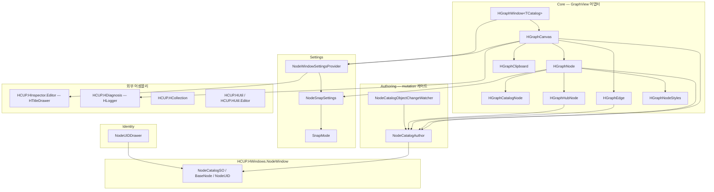

# HCUP.HWindows.NodeWindow.Editor

> 어셈블리: `HCUP.HWindows.NodeWindow.Editor` (`Editor/NodeWindow/HCUP.HWindows.NodeWindow.Editor.asmdef`, rootNamespace `HWindows.Editor.NodeWindow`)
> 의존: `HCUP.HWindows.NodeWindow`, `HCUP.HInspector.Editor`, `HCUP.HUtil`, `HCUP.HUtil.Editor`, `HCUP.HDiagnosis`, `HCUP.HCollection`
> `includePlatforms: ["Editor"]` / **`autoReferenced: false`**
> 동반 어셈블리: `HCUP.HWindows.NodeWindow` — [`../../Runtime/NodeWindow/README.md`](../../Runtime/NodeWindow/README.md)

---

## 요약

GraphView 기반 노드 그래프 에디터 전체가 이 어셈블리에 있다. 14개 파일이 네 관심사로 나뉘고,
각각 별도 시스템 문서를 둔다.

| 관심사 | 폴더 | 파일 | 문서 |
|---|---|---|---|
| 그래프 캔버스·시각 요소 | `Core/` | 8 | [`../../docs/GraphEditor.md`](../../docs/GraphEditor.md) |
| 데이터 mutation 게이트 | `NodeCatalog/Authoring/` | 2 | [`../../docs/NodeCatalog.md`](../../docs/NodeCatalog.md) |
| 스냅·그리드 설정 | `Settings/` | 3 | [`../../docs/Settings.md`](../../docs/Settings.md) |
| 식별자 표시 | `Identity/` | 1 | [`../../docs/NodeCatalog.md`](../../docs/NodeCatalog.md#nodeuid--식별자) |

이 README 는 어셈블리 경계와 진입점만 정리한다.

---

## 파일 지도

| 경로 | 행수 | 역할 |
|---|---|---|
| `Core/HGraphWindow.cs` | 374 | `HGraphWindow<TCatalog> : EditorWindow`. 메뉴바·툴바·바인드·드래그드롭·검색 |
| `Core/HGraphCanvas.cs` | 958 | `GraphView` 어댑터. populate / 단축키 / 클립보드 / 검색 / 하이라이트 |
| `Core/HGraphNode.cs` | 407 | 시각 노드. 헤더·바디·포트·컨텍스트 메뉴·스냅 |
| `Core/HGraphCatalogNode.cs` | 116 | `CatalogNode` 전용 뷰. `ObjectField` + 더블클릭 전환 |
| `Core/HGraphHubNode.cs` | 217 | `HubNode` 전용 뷰. 동적 N 출구 포트 |
| `Core/HGraphEdge.cs` | 114 | 시각 엣지. 선택 하이라이트 + 우클릭 메뉴 |
| `Core/HGraphClipboard.cs` | 189 | Cut/Paste JSON 직렬화 + magic/version 검증 |
| `Core/HGraphNodeStyles.cs` | 59 | 헤더 색 상수 + 도메인 타입별 색 레지스트리 |
| `NodeCatalog/Authoring/NodeCatalogAuthor.cs` | 667 | **mutation 단일 게이트.** static, 상태 0 |
| `NodeCatalog/Authoring/NodeCatalogObjectChangeWatcher.cs` | 63 | `[InitializeOnLoad]`. Inspector 직접 수정 감지 |
| `Settings/NodeSnapSettings.cs` | 71 | `ScriptableSingleton`. gridUnit / showGrid / mode |
| `Settings/NodeWindowSettingsProvider.cs` | 126 | `[SettingsProvider]` + 공유 IMGUI + 변경 이벤트 |
| `Settings/SnapMode.cs` | 36 | `Off` / `OnShiftHold` / `Always` |
| `Identity/NodeUIDDrawer.cs` | 93 | `[CustomPropertyDrawer(typeof(NodeUID))]` |
| `UI/HGraphWindow.uss` | — | 창 레이아웃 스타일 |
| `UI/HGraphNode.uss` | — | 노드 스타일 |

---

## 계층 구조



**의존 방향이 한 갈래다.** 시각 계층(Core) → Author → Runtime 데이터.
Author 는 GraphView 를 모르고, Runtime 은 Editor 를 모른다.

### `UnityEditor.Experimental.GraphView` 격리

이 네임스페이스를 직접 `using` 하는 파일은 **5개로 제한**된다.

| 파일 | 사용 타입 |
|---|---|
| `Core/HGraphCanvas.cs` | `GraphView`, `Port`, `Edge`, `GraphElement`, `GraphViewChange`, 매니퓰레이터 |
| `Core/HGraphNode.cs` | `Node`, `Port`, `Capabilities` |
| `Core/HGraphCatalogNode.cs` | `DropdownMenuAction` |
| `Core/HGraphHubNode.cs` | `Port`, `Orientation`, `Direction` |
| `Core/HGraphEdge.cs` | `Edge`, `Capabilities`, `DropdownMenuAction` |

`HGraphWindow` / `HGraphClipboard` / `NodeCatalogAuthor` / `Settings/` / `Identity/` 는 이
Experimental API 를 모른다. `HGraphCanvas` 가 `GetSelectedNodes()` /
`GetSingleSelectedHGraphNode()` 어댑터를 제공해 창이 `ISelectable` 을 다루지 않게 한다
(`HGraphCanvas.cs:466-487`).

---

## 진입점

### 에디터 도구 — 메뉴 경로

| 항목 | 경로 | 등록 방식 |
|---|---|---|
| Node Window 설정 | **`Project Settings ▸ HCUP ▸ Node Window`** | `[SettingsProvider]` — `NodeWindowSettingsProvider.cs:39`, 경로 상수 `"Project/HCUP/Node Window"` |
| 그래프 창 | **없음** | 파생 창이 각자 `[MenuItem]` 을 단다 |
| `NodeUID` 인스펙터 표시 | — | `[CustomPropertyDrawer(typeof(NodeUID))]` — `NodeUIDDrawer.cs:26` |

**`[MenuItem]` 이 이 어셈블리에 하나도 없다.** `HGraphWindow<TCatalog>` 의
`Window/HWindows/Node Window/Graph Editor` 메뉴는 2026.05.15 제네릭 전환 시 제거됐다
(`HGraphWindow.cs:366`) — 제네릭 클래스는 `GetWindow` 대상이 될 수 없기 때문이다.

### 코드 진입점

| 진입점 | 시그니처 | 용도 |
|---|---|---|
| `HGraphWindow<TCatalog>` | `class ... : EditorWindow where TCatalog : NodeCatalogSO` | 파생 창 베이스 |
| `NodeCatalogAuthor` | `static class` | 모든 데이터 변경 |
| `NodeCatalogAuthor.CatalogMutated` | `static event Action<NodeCatalogSO>` | 변경 구독 |
| `HGraphCanvas.RegisterNodeViewFactory` | `static (Type, Func<BaseNode, bool, HGraphNode>)` | 도메인 노드 뷰 등록 |
| `HGraphNodeStyles.RegisterHeaderColor` | `static (Type, Color)` | 도메인 노드 헤더 색 |
| `HGraphCanvas.AdditionalContextMenuActions` | `public Action<ContextualMenuPopulateEvent>` 필드 | 우클릭 메뉴 주입 |
| `HGraphCanvas.HighlightActiveNode` / `SetTraceMode` / `TracePathFrom` | `public` | Play 모드 시각화 |

---

## 사용 예 — 파생 창

```csharp
using HWindows.Editor.NodeWindow;
using HWindows.Editor.NodeWindow.Authoring;
using HWindows.NodeWindow;
using UnityEditor;
using UnityEditor.UIElements;
using UnityEngine;
using UnityEngine.UIElements;

public sealed class MyFeatureNodeWindow : HGraphWindow<MyFeatureCatalogSO> {

    [MenuItem("MyProject/MyFeature/Open Node Window", false, 10)]
    public static void Open() {
        MyFeatureNodeWindow window = GetWindow<MyFeatureNodeWindow>();
        window.titleContent = new GUIContent("MyFeature Graph Editor");
        window.minSize = new Vector2(400, 300);
    }

    protected override void CreateGUI() {
        base.CreateGUI();            // canvas 초기화 — 반드시 먼저
        canvas.AdditionalContextMenuActions = evt => {
            if (currentCatalog == null) return;
            evt.menu.AppendAction("My Line Node",
                a => NodeCatalogAuthor.CreateNode<MyLineNode>(
                         currentCatalog,
                         canvas.ToGraphPosition(a.eventInfo.localMousePosition)),
                _ => DropdownMenuAction.Status.Normal);
        };
    }

    [InitializeOnLoadMethod]         // 도메인 리로드마다 재등록 — 레지스트리가 static
    static void _Register() {
        HGraphNodeStyles.RegisterHeaderColor(typeof(MyLineNode), new Color(0.2f, 0.4f, 0.8f));
    }
}
```

단계별 가이드와 노드 뷰 팩토리 등록은
[`../../docs/GraphEditor.md` 의 "파생 창 구현"](../../docs/GraphEditor.md#파생-창-구현) 참조.

소비 어셈블리의 asmdef 에는 아래 3개가 필요하다 — **양쪽 모두 `autoReferenced: false`** 이므로
명시 참조가 필수다.

| 참조 | 이유 |
|---|---|
| `HCUP.HWindows.NodeWindow.Editor` | `HGraphWindow` / `HGraphCanvas` / `NodeCatalogAuthor` |
| `HCUP.HWindows.NodeWindow` | `BaseNode` / `HubNode` / `NodeCatalogSO` |
| 기능 런타임 어셈블리 | 도메인 카탈로그·노드 타입 |

---

## 주의할 점

### 계약

1. **`catalog.Internal*` 를 직접 호출하지 않는다.** `InternalsVisibleTo` 때문에 이 어셈블리
   안에서는 **컴파일이 된다.** 우회하면 Undo·SetDirty·SaveAssets·`CatalogMutated` 가 모두
   빠진다.
2. **Experimental API 를 5개 파일 밖으로 내보내지 않는다.** 외부는
   `HWindows.Editor.NodeWindow` 네임스페이스의 타입만 소비한다.
3. **`base.CreateGUI()` 를 먼저 호출한다.** `canvas` 가 여기서 만들어진다.
   `_AppendExtraMenuBarItems` 는 그 안에서 호출되므로 그 시점 `canvas` 는 `null` 이다.
4. **팩토리·헤더 색 레지스트리는 `static` 이다.** `[InitializeOnLoadMethod]` 재등록이 필수다.
5. **`NodeCatalogSO` 를 Unity MCP 의 `assets-modify` 로 수정하지 않는다.** 명시하지 않은
   필드가 기본값(0)으로 리셋된다.
6. **노드 sub-asset 을 Project 창에서 직접 삭제하지 않는다.** `HDictionary` 키만 남는
   ghost UID 가 생긴다. 창을 다시 열면 `PurgeNullNodes` 가 자동 정리하지만, 정식 경로는
   우클릭 `삭제 (Delete)` 다.

### 버전 호환

7. **`NodeCatalogObjectChangeWatcher` 가 Unity 6000+ 전용 API 를 조건부 분기 없이 쓴다.**
   `EditorUtility.EntityIdToObject(data.instanceId)` (`NodeCatalogObjectChangeWatcher.cs:18`)는 `InstanceIDToObject(int)` 가
   6000.3.11f1 에서 Obsolete 처리되어 교체된 것인데, `#if UNITY_6000_0_OR_NEWER` 가드가 없다.
   **이 파일은 2022.3 LTS 에서 컴파일되지 않는다** — 상위 `HWindows/README.md` 의
   "Unity 최저 2022.3.x LTS" 선언과 어긋난다.

### 기존 문서와의 불일치 (`../../Runtime/NodeWindow/docs/README.md`)

이 어셈블리에는 311행짜리 선행 문서가 `Runtime/NodeWindow/docs/README.md` 에 있다. 대부분
정확하지만 아래 3건이 현재 코드와 다르다. **`../../docs/` 의 3개 문서가 현행이다.**

| 항목 | 선행 문서 | 실제 코드 |
|---|---|---|
| 노드 뷰 팩토리 시그니처 | `(node, catalog) => new HGraphNode(node, catalog)` | `Func<BaseNode, bool, HGraphNode>` — 둘째 인자는 **`isRoot`**(`HGraphCanvas.cs:63`, `:598`). `HGraphNode` 생성자도 `(BaseNode, bool isRoot = false)`(`HGraphNode.cs:77`) |
| 디렉토리 구성 | `NodeCatalog/Identity/NodeUIDDrawer.cs` | 실제 경로는 `Editor/NodeWindow/Identity/NodeUIDDrawer.cs` (`NodeCatalog/` 하위가 아니다) |
| 기능 목록 | Active 하이라이트 / Trace 모드 미기재 | `HighlightActiveNode` / `SetTraceMode` / `TracePathFrom` 이 `public` 으로 존재 (`HGraphCanvas.cs:812-898`) |

추가로 선행 문서의 "Dev Log 이력" 표가 가리키는
`../../../../docs/history/HWindows/Editor/NodeWindow/**` 11개 파일은 **실제로 존재한다** —
링크는 유효하다.

### 정리 대상

8. **`HGraphNode.GetOutputPort(int)` 에 호출처가 없다** (`HGraphNode.cs:61` +
   `HGraphHubNode.cs:65` override, 패키지 전역 grep 0건).
9. **`HGraphCanvas._searchQuery` 는 대입만 되고 읽히지 않는다** (`:51`, `:767`, `:794`).
10. **`_ClearSearchUI` 와 `ClearSearch` 의 호출 시점이 어긋난다.** `_PopulateInternal` 은
    `ClearSearch`(캔버스 상태)만 하고 툴바 텍스트는 그대로 두므로, mutation 후 검색어가 남은
    채 결과가 비어 있다 (`HGraphCanvas.cs:618` vs `HGraphWindow.cs:291-294`).
11. **`_OnCatalogMutated` 의 주석이 구현과 반대다** (`HGraphCanvas.cs:143-146`).
    "`_Populate` 가 viewport 리셋을 포함하므로 깜빡일 가능성"이라 적혀 있으나 실제 호출은
    `_RepopulateNoViewportReset` 이다.
12. **`RefreshPortLabels` 가 `Port.connections.Count()` 를 쓴다** (`HGraphNode.cs:66-67`,
    `HGraphHubNode.cs:71-78`). `IEnumerable<Edge>` 전체 순회이고 populate 끝에서 노드 전량에
    호출되므로 O(노드×엣지) 다.
13. **소비처 없는 Author API 1건** — `NodeCatalogAuthor.CreateHubNode` (`:267`).
    2026.05.15 에 "허브 노드 생성" 우클릭 항목이 제거되며 호출자가 사라졌다.

---

## 확장 지점

| 하고 싶은 것 | 손댈 곳 |
|---|---|
| 기능별 그래프 창 만들기 | `HGraphWindow<TCatalog>` 상속 + `[MenuItem]` → [`GraphEditor.md`](../../docs/GraphEditor.md#파생-창-구현) |
| 도메인 노드 시각 커스터마이즈 | `HGraphNode` 상속 + `HGraphCanvas.RegisterNodeViewFactory` |
| 노드 헤더 색 | `HGraphNodeStyles.RegisterHeaderColor` |
| 우클릭 메뉴 항목 추가 | `canvas.AdditionalContextMenuActions` (빈 캔버스) / `HGraphNode.BuildContextualMenu` override (노드) |
| 새 mutation 연산 | `NodeCatalogAuthor` 에 static 메서드 — Undo → Internal* → SetDirty → SaveAssets → `_NotifyMutated` 순서 준수 |
| 설정 항목 추가 | [`Settings.md` 의 확장 지점](../../docs/Settings.md#확장-지점) |
| 노드 스타일 | `UI/HGraphNode.uss` / `UI/HGraphWindow.uss` — 이름으로 검색해 로드된다 |
| Play 모드 시각화 | `HighlightActiveNode(uid)` / `SetTraceMode(bool)` — 도메인 창이 런타임 이벤트를 구독해 호출 |
