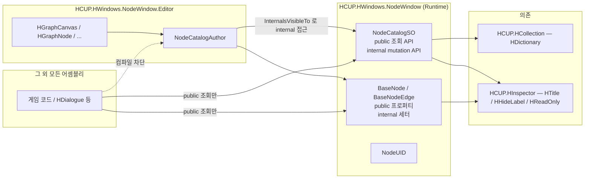

# HCUP.HWindows.NodeWindow

> 어셈블리: `HCUP.HWindows.NodeWindow` (`Runtime/NodeWindow/HCUP.HWindows.NodeWindow.asmdef`, rootNamespace `HWindows.NodeWindow`)
> 의존: `HCUP.HCollection`, `HCUP.HInspector` / `includePlatforms: []` (전 플랫폼) / **`autoReferenced: false`**
> 동반 어셈블리: `HCUP.HWindows.NodeWindow.Editor` — [`../../Editor/NodeWindow/README.md`](../../Editor/NodeWindow/README.md)

---

## 요약

노드 그래프의 **데이터 타입만** 담는 어셈블리다. 에디터 코드는 한 줄도 없다. GraphView 도,
`AssetDatabase` 도, `UnityEditor` 네임스페이스도 참조하지 않는다.

`includePlatforms` 가 비어 있어 플레이어 빌드에 포함된다. 런타임에서 카탈로그를 읽어 그래프를
순회하는 것이 정상 사용이다 — 실제로 `HDialogue` 가 `BaseNode` 를 파생해 대화 그래프를 만든다.

**전체 설명은 시스템 문서에 있다** → [`../../docs/NodeCatalog.md`](../../docs/NodeCatalog.md)

이 README 는 어셈블리 경계와 계약만 정리한다.

---

## 파일 지도

| 경로 | 행수 | 역할 |
|---|---|---|
| `NodeCatalog/NodeCatalogSO.cs` | 192 | 그래프 데이터 컨테이너. 노드·엣지·루트의 단일 소유자 |
| `NodeCatalog/BaseNode.cs` | 209 | 노드 추상 베이스 (`ScriptableObject`) |
| `NodeCatalog/BaseNodeEdge.cs` | 72 | 엣지 추상 베이스 (`[Serializable]` plain class) |
| `NodeCatalog/SimpleNode.cs` | 7 | 인프라 검증용 최소 구현 |
| `NodeCatalog/SimpleNodeEdge.cs` | 36 | 비-허브 노드 간 엣지 |
| `NodeCatalog/HubNode.cs` | 122 | 키 기반 1→N 라우팅 노드 |
| `NodeCatalog/HubNodeEdge.cs` | 54 | 출구 포트 키를 담는 엣지 |
| `NodeCatalog/CatalogNode.cs` | 86 | 다른 카탈로그 참조 노드 |
| `Identity/NodeUID.cs` | 132 | GUID 기반 식별자 `struct` |
| `AssemblyInfo.cs` | 41 | `[assembly: InternalsVisibleTo(...)]` 단 한 줄 |

---

## 어셈블리 경계



```csharp
// AssemblyInfo.cs:1-3 — 이 한 줄이 mutation 계약을 컴파일러 수준에서 강제한다
using System.Runtime.CompilerServices;

[assembly: InternalsVisibleTo("HCUP.HWindows.NodeWindow.Editor")]
```

**문자열이 Editor asmdef 의 `name` 필드와 정확히 일치해야 한다.** 한 글자만 달라도 친구
어셈블리로 인식되지 않아 `NodeCatalogAuthor` 전체가 "inaccessible due to its protection level"
로 컴파일 실패한다 (`AssemblyInfo.cs:28-30`).

---

## public 표면

`NodeCatalogSO` 가 노출하는 것은 **읽기 전용 뷰와 조회 헬퍼뿐**이다.

| 멤버 | 반환 | 비고 |
|---|---|---|
| `Nodes` | `IReadOnlyDictionary<NodeUID, BaseNode>` | |
| `Edges` | `IReadOnlyList<BaseNodeEdge>` | |
| `EdgeByPair` | `IReadOnlyDictionary<(NodeUID, NodeUID), BaseNodeEdge>` | lazy rebuild |
| `NodeCount` / `EdgeCount` | `int` | |
| `RootUID` / `HasRoot` | `NodeUID` / `bool` | |
| `EditorDescription` | `string` | **소비처 없음** |
| `GetIncomingEdges(leaf)` / `GetOutgoingEdges(branch)` | `IEnumerable<BaseNodeEdge>` | `edges` 선형 순회 |
| `GetBranchNodes(leaf)` / `GetLeafNodes(branch)` | `IEnumerable<BaseNode>` | 위 두 개 경유 |
| `HasEdgeBetween(b, l)` / `TryGetEdge(b, l, out)` | `bool` | `EdgeByPair` 해시 조회 |

| `BaseNode` 멤버 | 비고 |
|---|---|
| `UID` / `Title` | 읽기 전용 |
| `ClipboardMagic` | `virtual`. 파생에서 override 권장 |
| `GetInspectorSummary(catalog)` | `virtual`. `HDialogue.DialogueLineNode` 가 실제로 override |
| `EditorPosition` / `EditorFoldoutOpen` | **`#if UNITY_EDITOR`** — 런타임 코드에서 참조 불가 |

`internal` 인 것: `NodeCatalogSO.Internal*` 6개, `BaseNode.AssignIdentity` / `SetTitle` /
`ResetIdentity` / `SetEditorPosition` / `SetEditorFoldoutOpen`,
`BaseNodeEdge.AssignIdentity`, `HubNode.AddEntry` / `RemoveEntry` / `SetEntryKey` /
`KeysChanged`, `HubNodeEdge.SetPortKey`, `CatalogNode.SetReferencedCatalog`.

---

## 에셋 생성

| 항목 | 값 |
|---|---|
| `NodeCatalogSO` | `[CreateAssetMenu(menuName = "HWindows/Node Catalog")]` (`NodeCatalogSO.cs:8`) |
| 파생 카탈로그 | 파생 클래스에 `[CreateAssetMenu]` 를 직접 붙인다 |
| 노드 | **에셋 메뉴 없음.** `NodeCatalogAuthor.CreateNode<T>` 가 sub-asset 으로 생성 |

이 어셈블리에는 `[MenuItem]` 이 없다 — 런타임 어셈블리이므로 당연하다.

---

## 사용 예 — 런타임 순회

```csharp
using HWindows.NodeWindow;
using HWindows.NodeWindow.Identity;

public sealed class GraphWalker {
    readonly NodeCatalogSO catalog;

    public BaseNode Current { get; private set; }

    public void Start() {
        if (!catalog.HasRoot) return;
        catalog.Nodes.TryGetValue(catalog.RootUID, out BaseNode root);
        Current = root;
    }

    // 허브가 아니면 첫 번째 출구로, 허브면 키로 분기한다.
    public bool Advance(string hubKey = null) {
        foreach (BaseNodeEdge e in catalog.GetOutgoingEdges(Current.UID)) {
            if (hubKey != null && e is HubNodeEdge he && he.BranchPortKey != hubKey) continue;
            if (catalog.Nodes.TryGetValue(e.LeafUID, out BaseNode next) && next != null) {
                Current = next;
                return true;
            }
        }
        return false;
    }
}
```

### 도메인 노드 정의

```csharp
public sealed class MyLineNode : BaseNode {
    [SerializeField] string text;
    public string Text => text;

    // 도메인별 고유 문자열. 리네임하면 기존 클립보드 페이로드와 호환이 깨진다.
    public override string ClipboardMagic => "HGRAPH_MYFEATURE_LINE_NODE_V1";
}

// 다중 출구가 필요하면 HubNode 파생
public sealed class MyBranchNode : HubNode {
    [SerializeField] string conditionKey;
    public override string ClipboardMagic => "HGRAPH_MYFEATURE_BRANCH_NODE_V1";
}

[CreateAssetMenu(menuName = "HWindows/MyFeature/My Feature Catalog")]
public sealed class MyFeatureCatalogSO : NodeCatalogSO { }
```

---

## 주의할 점

### 계약

1. **`autoReferenced: false` 다.** 소비 어셈블리는 asmdef 에 `HCUP.HWindows.NodeWindow` 를
   명시해야 한다. 누락 시 CS0012.
2. **`EditorPosition` / `EditorFoldoutOpen` 은 `#if UNITY_EDITOR` 안에 있다**
   (`BaseNode.cs:52-55`). 런타임 코드에서 참조하면 플레이어 빌드가 깨진다. 같은 이유로
   `CatalogNode.ReferencedCatalog` 도 런타임에서 쓸 수 없다 (`CatalogNode.cs:31`).
3. **`GetIncomingEdges` / `GetOutgoingEdges` 는 `edges` 전체를 선형 순회한다**
   (`NodeCatalogSO.cs:54-64`). 엣지가 많은 그래프를 매 프레임 순회하면 비용이 든다.
   `EdgeByPair` 는 `(branch, leaf)` 쌍 조회 전용이라 "이 노드의 출구 전부" 질의에는 쓸 수 없다.
4. **`UnityEngine.Object` 타입 필드를 노드에 직접 두지 않는다** (전역 규칙, `BaseNode.cs:179-182`).
   `AssetReference`(Addressables) 또는 string key 로 간접 참조한다. SO 메모리 오버헤드와 빌드
   크기 분리 때문이다.
5. **`SerializeReference` 로 저장되는 엣지 클래스는 리네임·이동에 취약하다.** FQN 이 YAML 에
   박히므로 데이터가 유실된다 (`BaseNodeEdge.cs:58-62`).
6. **`NodeCatalogSO` 를 Unity MCP 의 `assets-modify` 로 수정하지 않는다.** 명시하지 않은 필드가
   기본값(0)으로 리셋된다. YAML 직접 수정 + `assets-refresh` 조합을 쓴다.

### 정리 대상

7. **`SimpleNode` 는 `sealed` 라 상속이 불가한데, "직접 사용 금지" 규약을 코드가 강제하지 않는다.**
   `NodeCatalogAuthor.CreateNode<SimpleNode>` 는 정상 동작한다.
8. **소비처 없는 멤버 3건** — `NodeCatalogSO.EditorDescription`,
   `BaseNodeEdge.GetEdgeSummary()`, `HubNode.SetEntryKey(int, string)`.
   상세는 [`../../docs/NodeCatalog.md` 의 정리 대상](../../docs/NodeCatalog.md#정리-대상) 참조.
9. **`BaseNodeEdge.AssignIdentity` 의 재할당 가드가 OR 조건이다** (`:23`).
   한쪽 endpoint 만 유효해도 전체가 차단된다. 정상 경로에서는 둘이 함께 설정되므로 무해하다.
