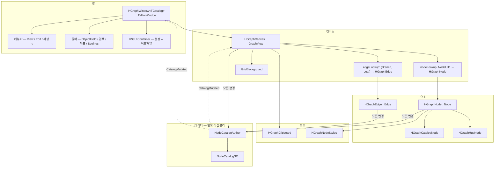
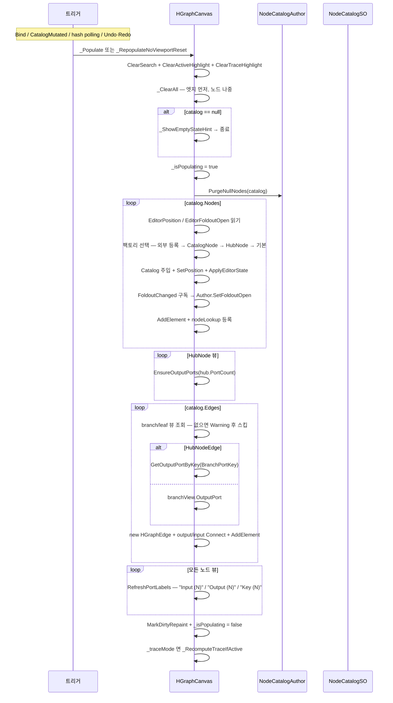
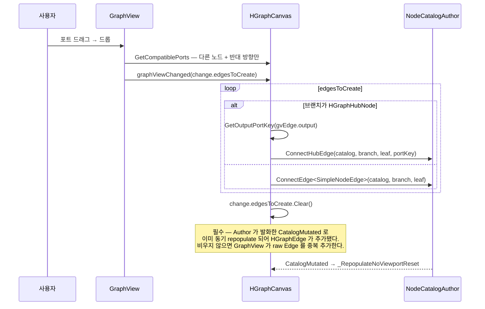
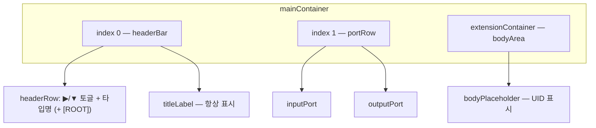
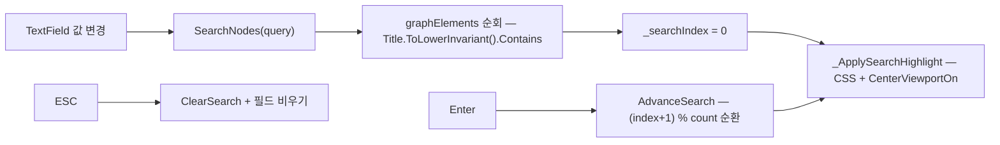
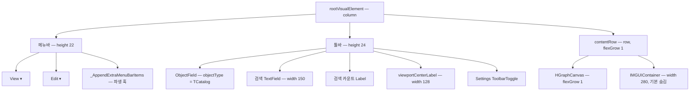
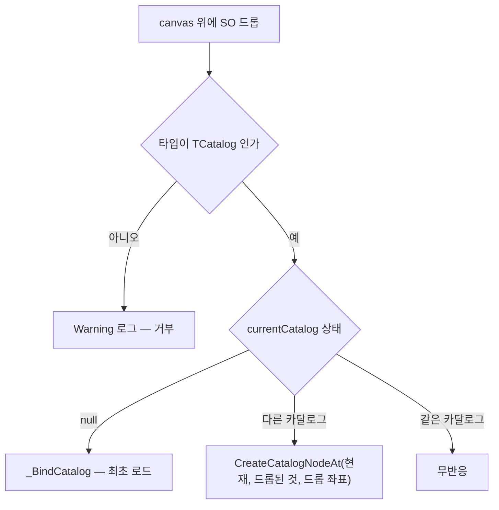

# GraphEditor — GraphView 캔버스와 시각 노드

> 대상 어셈블리: `HCUP.HWindows.NodeWindow.Editor` (`Editor/NodeWindow/Core/` 8파일)
> 관련 문서: [`NodeCatalog.md`](NodeCatalog.md) · [`Settings.md`](Settings.md)

---

## 요약

`UnityEditor.Experimental.GraphView` 위에 얹은 노드 그래프 에디터다. 8개 파일이 세 층으로 나뉜다.

| 층 | 클래스 | 기반 |
|---|---|---|
| 창 | `HGraphWindow<TCatalog>` | `EditorWindow` |
| 캔버스 | `HGraphCanvas` | `GraphView` |
| 요소 | `HGraphNode` / `HGraphCatalogNode` / `HGraphHubNode` / `HGraphEdge` | `Node` / `Edge` |
| 보조 | `HGraphClipboard` / `HGraphNodeStyles` | static |

**`HGraphWindow<TCatalog>` 는 직접 열 수 없다.** `[MenuItem]` 이 없고(2026.05.15 제거,
`HGraphWindow.cs:366`), 제네릭 파라미터 때문에 `GetWindow` 대상이 될 수도 없다. 기능별 파생 창을
만들어야 한다 — [파생 창 구현](#파생-창-구현) 절 참조.

### Experimental API 격리

`UnityEditor.Experimental.GraphView` 를 직접 `using` 하는 파일은 **5개로 제한**된다.
`HGraphCanvas` / `HGraphNode` / `HGraphCatalogNode` / `HGraphHubNode` / `HGraphEdge`.
`HGraphWindow` 도, `HGraphClipboard` 도, `NodeCatalogAuthor` 도 이 네임스페이스를 모른다.

`HGraphWindow` 가 `ISelectable` 을 직접 다루지 않도록 `HGraphCanvas` 가
`GetSelectedNodes()` / `GetSingleSelectedHGraphNode()` 어댑터를 제공한다
(`HGraphCanvas.cs:466-487`).

---

## 파일 지도

| 경로 | 행수 | 역할 |
|---|---|---|
| `Core/HGraphWindow.cs` | 374 | `EditorWindow` 제네릭 베이스. 메뉴바 + 툴바 + 바인드 + 드래그드롭 + 검색 |
| `Core/HGraphCanvas.cs` | 958 | `GraphView` 어댑터. populate / 단축키 / 클립보드 / 검색 / 하이라이트 / 엣지 훅 |
| `Core/HGraphNode.cs` | 407 | `BaseNode` 1개에 대응하는 시각 노드. 헤더·바디·포트·컨텍스트 메뉴 |
| `Core/HGraphCatalogNode.cs` | 116 | `CatalogNode` 전용. `ObjectField` + 더블클릭 카탈로그 전환 |
| `Core/HGraphHubNode.cs` | 217 | `HubNode` 전용. 동적 N 출구 포트 + 키 목록 UI |
| `Core/HGraphEdge.cs` | 114 | `BaseNodeEdge` 1개에 대응하는 시각 엣지 |
| `Core/HGraphClipboard.cs` | 189 | Cut/Paste JSON 직렬화 + magic/version 검증 |
| `Core/HGraphNodeStyles.cs` | 59 | 헤더 색 상수 + 도메인 타입별 색 레지스트리 |
| `UI/HGraphWindow.uss` | — | 창 레이아웃 스타일 |
| `UI/HGraphNode.uss` | — | 노드 스타일 |

---

## 계층 구조



`HGraphCatalogNode` 와 `HGraphHubNode` 는 `HGraphNode` 의 **파생**이다. `HGraphNode` 가
`sealed` 가 아니고 `_BuildPorts` / `OnHeaderDoubleClick` 이 `virtual` 인 이유가 이것이다.

---

## 흐름 1 — populate

캔버스의 심장이다. **부분 갱신이 없다** — 항상 전량 재구성한다.



**순서가 강제된다.** 노드가 전부 추가된 뒤에야 엣지를 연결할 수 있고(포트 참조 유효성),
엣지 연결이 끝난 뒤에야 포트 라벨의 연결 수가 정확하다.

`_ClearAll` 이 엣지를 먼저 지우는 것도 같은 이유다 — 포트 참조가 살아 있는 상태에서 노드를
제거하면 GraphView 내부 포트 정리가 엣지 상태와 충돌한다 (`HGraphCanvas.cs:744-756`).

### repopulate 트리거 4종

| 트리거 | 진입점 | viewport |
|---|---|---|
| `Bind(catalog)` — 카탈로그 교체 | `_Populate` | **원점 리셋** (`UpdateViewTransform(zero, one)`) |
| `CatalogMutated` 이벤트 | `_OnCatalogMutated` → `_RepopulateNoViewportReset` | 보존 |
| hash polling | `EditorApplication.update` → `_PollCatalogChanges` | 보존 |
| Undo / Redo | `_OnUndoRedo` → `NotifyExternalMutation` → 위 경로 | 보존 |

### hash polling — 이벤트의 안전망

```csharp
// HGraphCanvas.cs:125-138
private int _CalculateCatalogHash() {
    if (currentCatalog == null) return 0;
    int hash = 17;
    hash = hash * 31 + currentCatalog.NodeCount;
    hash = hash * 31 + currentCatalog.EdgeCount;
    hash = hash * 31 + currentCatalog.RootUID.GetHashCode();
    foreach (KeyValuePair<NodeUID, BaseNode> pair in currentCatalog.Nodes) {
        hash = hash * 31 + pair.Key.GetHashCode();
        if (pair.Value != null) {
            hash = hash * 31 + (pair.Value.Title ?? string.Empty).GetHashCode();
        }
    }
    return hash;
}
```

`EditorApplication.update` 마다 계산한다. **감지 범위는 노드 수 / 엣지 수 / 루트 UID / 노드
UID 집합 / 노드 타이틀 5가지뿐이다.** 노드 위치, foldout 상태, `HubNode` 키 목록,
`CatalogNode` 참조 대상, 도메인 필드 변경은 해시에 반영되지 않는다 — 그쪽은 이벤트 경로에 의존한다.

### 이벤트 구독은 Attach/Detach 짝

생성자에서 구독하고 Detach 에서 해제하는 비대칭은, 창을 도킹 이동하거나 탭을 복원할 때
구독이 죽은 채 기능이 무음으로 멈추는 원인이었다. 그래서 4개 구독이 모두
`AttachToPanelEvent` / `DetachFromPanelEvent` 쌍으로 묶여 있다 (`HGraphCanvas.cs:93-113`).

| 구독 | 용도 |
|---|---|
| `NodeCatalogAuthor.CatalogMutated` | mutation 통합 신호 |
| `EditorApplication.update` | hash polling fallback |
| `NodeWindowSettingsProvider.SnapSettingsChanged` | `showGrid` 동기화 |
| `Undo.undoRedoPerformed` | Undo/Redo 후 재동기화 |

Attach 직후의 첫 polling tick 이 detach 동안 놓친 변경을 흡수한다.

---

## 흐름 2 — 엣지 생성



`GetCompatiblePorts` 는 **타입 제약이 없다** (`HGraphCanvas.cs:179-187`). 모든 포트가
`typeof(bool)` 로 만들어지고, 필터는 "같은 노드 제외 + 같은 방향 제외" 두 가지뿐이다.
self-loop 와 중복 엣지의 실제 차단은 `NodeCatalogAuthor._ValidateEdgeCreation` 이 한다.

### 포트 사양

| 노드 | 입력 | 출력 |
|---|---|---|
| `HGraphNode` (기본) | `Capacity.Multi` × 1 | `Capacity.Multi` × 1 |
| `HGraphCatalogNode` | 기본 상속 | 기본 상속 |
| `HGraphHubNode` | `Capacity.Multi` × 1 | **`Capacity.Single` × N** — 키 하나당 하나 |

허브 출구가 `Single` 인 것이 라우팅 의미를 만든다 — 키 하나는 목적지 하나를 가리킨다.

---

## 시각 노드 — `HGraphNode`



**`portRow` 를 `mainContainer` 에 직접 넣는 것이 설계 요점이다** (`HGraphNode.cs:345-351`).
GraphView 의 `extensionContainer` 는 `expanded == false` 일 때 자동으로 숨겨지므로, 포트를
거기에 두면 노드를 접었을 때 연결선이 사라진다. `mainContainer` 는 collapse 관리 범위 밖이라
항상 표시된다.

### 토글 진입점 2개

| 진입점 | 조건 |
|---|---|
| 헤더 좌측 `▶`/`▼` 클릭 | 좌클릭. `toggleArrow` 가 먼저 잡는다 |
| 헤더 더블클릭 | `clickCount == 2` 좌클릭 → `OnHeaderDoubleClick` (**`virtual`**) |

`HGraphCatalogNode` 가 `OnHeaderDoubleClick` 을 override 해 foldout 대신 **카탈로그 전환**을
요청한다 (`HGraphCatalogNode.cs:40-46`).

토글 결과는 `FoldoutChanged` 이벤트로 나가고, `HGraphCanvas` 가 구독해
`NodeCatalogAuthor.SetFoldoutOpen` 을 호출한다 (`HGraphCanvas.cs:672`).

### 선택 → Inspector 동기화

```csharp
// HGraphNode.cs:125-134
public override void OnSelected() {
    base.OnSelected();
    AddToClassList("hgraph-node--selected");
    Selection.activeObject = dataNode;      // 클릭 즉시 Inspector 에 SO 표시
}
```

`base` 호출이 필수다 — Unity 의 internal selection 추적이 끊어지면 이동·삭제 단축키가 깨진다.

### 헤더 색

| 우선순위 | 색 | 조건 |
|---|---|---|
| 1 | `RootHeaderColor` (0.85, 0.7, 0.2) 노랑 | `isRoot` — 도메인 등록과 무관하게 항상 이김 |
| 2 | 도메인 등록 색 | `HGraphNodeStyles.RegisterHeaderColor(type, color)` |
| 3 | `CatalogNodeHeaderColor` (0.15, 0.52, 0.48) 청록 | `nodeType == typeof(CatalogNode)` |
| 4 | `DefaultHeaderColor` (0.29, 0.435, 0.647) 파랑 | 그 외 |

우선순위 1은 `HGraphNode._BuildHeader` 가 처리하고(`:289-291`), 2~4는
`HGraphNodeStyles.GetHeaderColorFor` 가 처리한다 (`HGraphNodeStyles.cs:28-32`).

### CSS 클래스

| 클래스 | 부여 시점 |
|---|---|
| `hgraph-node` | 생성자 |
| `hgraph-catalog-node` / `hgraph-hub-node` | 파생 생성자 |
| `hgraph-node--selected` | `OnSelected` / `OnUnselected` |
| `hgraph-node--search-active` | 검색 현재 결과 |
| `hgraph-node--edge-highlight` | 엣지 선택 시 양 끝 노드 |
| `hgraph-node--active` | `SetActive(true)` — Play 모드 활성 노드 |
| `hgraph-node--trace` | `SetTrace(true)` — Trace 모드 도달 가능 노드 |

USS 는 `AssetDatabase.FindAssets($"t:StyleSheet {이름}")` 로 **이름 검색**해 로드한다
(`HGraphCanvas.cs:529`, `HGraphNode.cs:355`). 프로젝트 어디에 있든 찾지만, 같은 이름의
StyleSheet 가 둘 이상이면 `guids[0]` 이 잡힌다.

---

## 컨텍스트 메뉴

**노드/엣지 위 우클릭과 빈 캔버스 우클릭이 다른 메뉴를 낸다.** ContextualMenu 는 leaf 에서
parent 로 버블링하며 양쪽 `BuildContextualMenu` 가 모두 호출되므로, 캔버스가 명시적으로 중복을
차단한다.

```csharp
// HGraphCanvas.cs:196-205
public override void BuildContextualMenu(ContextualMenuPopulateEvent evt) {
    if (currentCatalog == null) return;

    // 노드/엣지 위 우클릭 시 해당 요소의 BuildContextualMenu 가 항목 추가 — 중복 회피.
    VisualElement target = evt.target as VisualElement;
    while (target != null && target != this) {
        if (target is HGraphNode) return;
        if (target is HGraphEdge) return;
        target = target.parent;
    }
    ...
```

`base.BuildContextualMenu` 를 호출하지 않는 것도 의도적이다 — GraphView 기본 Cut/Copy/Paste/
Duplicate/Delete 자동 추가를 막는다.

| 대상 | 항목 |
|---|---|
| 빈 캔버스 | `AdditionalContextMenuActions` 주입분 → 구분선 → 붙여넣기 → 모두 선택 |
| `HGraphNode` | 복사 / 잘라내기 / 붙여넣기 / 복제 / 루트 노드 재설정 → 구분선 → 삭제 |
| `HGraphCatalogNode` | 붙여넣기 → 구분선 → 삭제 (**복사·잘라내기·복제·루트 재설정 없음**) |
| `HGraphEdge` | 연결 해제 → 구분선 → 브랜치 시점 중앙 / 리프 시점 중앙 |

`HGraphEdge` 는 `Edge` 베이스 체인이 `BuildContextualMenu` 를 `virtual` 로 노출하지 않아
(CS0115) `RegisterCallback<ContextualMenuPopulateEvent>` 로 대체한다 (`HGraphEdge.cs:41-43`).

### 작업 대상 결정

GraphView 는 우클릭 시 selection 을 바꾸지 않는다. 그래서 우클릭한 노드가 selection 에
포함돼 있으면 selection 전체를, 아니면 그 노드 하나만 대상으로 삼는다
(`HGraphNode._GetEffectiveTargets`, `:233-240`).

---

## 단축키

`HGraphCanvas._OnKeyDown` 한 곳에 모여 있다 (`:326-385`). `evt.actionKey` 가 플랫폼을
추상화한다 (Mac `Cmd`, 그 외 `Ctrl`).

| 키 | 동작 |
|---|---|
| `Ctrl+C` | `CopyNodes(GetSelectedNodes())` |
| `Ctrl+X` | `CutNodes(...)` |
| `Ctrl+V` | `PasteFromClipboard()` |
| `Ctrl+D` | `DuplicateNodes(...)` |
| `Ctrl+A` | `SelectAllNodes()` |
| `Ctrl+Z` / `Ctrl+Shift+Z` | `Undo.PerformUndo()` / `PerformRedo()` |
| `Ctrl+Y` | `Undo.PerformRedo()` (Windows 관용) |
| `Ctrl+Home` | `GoToRoot()` |
| `Ctrl+0` | `CloseAllFoldouts()` |
| `Delete` (modifier 없음) | `DeleteNodes(...)` **+** `_DeleteSelectedEdges()` |

**Undo 를 직접 호출하는 이유**: GraphView 에 포커스가 있으면 Unity 전역 단축키가 UIElements 에
막힌다 (`:352-353`).

**Delete 가 두 가지를 지운다**: `HGraphNode` 와 `HGraphEdge` 모두 `Capabilities.Deletable` 을
꺼 두었기 때문에 `graphViewChanged.elementsToRemove` 경로가 없다. 노드는
`DeleteNodes`, 엣지는 `_DeleteSelectedEdges` 가 직접 처리한다 (`:378-384`).

| 요소 | 끈 capability | 이유 |
|---|---|---|
| `HGraphNode` | `Copiable` \| `Deletable` | `Copiable` 하나가 Cut/Copy/Duplicate 3항목을 통제 |
| `HGraphEdge` | `Deletable` | Delete 처리를 캔버스로 집중 |

---

## 클립보드 형식

```json
{
  "magic": "HGRAPH_<DOMAIN>_NODE_V<N>",
  "version": 1,
  "entries": [
    { "typeName": "<AssemblyQualifiedName>",
      "nodeJson": "<JsonUtility.ToJson 결과>",
      "layout": { "x": 0, "y": 0 },
      "foldoutOpen": false }
  ]
}
```

| 상수 | 값 |
|---|---|
| `MAGIC_PREFIX` | `"HGRAPH_"` |
| `MAGIC_VERSION_SEP` | `"_V"` |
| `VERSION` | `1` |

`TryParse` 검증 순서 (`HGraphClipboard.cs:82-103`): JSON 파싱 → `magic` 비어 있지 않음 →
`HGRAPH_` 접두 → `_V` 뒤가 정수 → `version == 1` → `entries != null`.

**`Serialize` 는 혼합 도메인을 거부한다.** 첫 노드의 `ClipboardMagic` 을 기준으로 나머지를
비교하고, 하나라도 다르면 `null` 을 반환한다 (`:49-53`). wrapper 의 magic 이 하나뿐이므로
표현할 방법이 없기 때문이다.

`typeName` 은 `AssemblyQualifiedName` 이다 — HCUP 패키지 분리 환경에서도 `Type.GetType` 이
정확히 동작하게 하려는 선택이다 (`HGraphClipboard.cs:155`).

`entries` 의 `layout` / `foldoutOpen` 은 **중복 정보**다. `nodeJson` 에 이미 포함되어
`FromJsonOverwrite` 가 자동 복원하며, 이 필드들은 명시적 접근용으로만 남아 있다 (`:58-60`).

---

## 검색 / 하이라이트 / Trace

세 가지 하이라이트가 서로 독립적으로 CSS 클래스를 토글한다.

| 기능 | 진입 | 상태 | 대상 |
|---|---|---|---|
| 검색 | 툴바 TextField | `_searchQuery` / `_searchResults` / `_searchIndex` | 현재 결과 1개 |
| Active | `HighlightActiveNode(uid)` (`public`) | `_activeNode` | 1개 |
| Trace | `SetTraceMode(bool)` (`public`) | `_traceMode` / `_traceNodes` | BFS 도달 가능 전부 |

세 가지 모두 `_PopulateInternal` 진입부에서 초기화된다 — 노드 인스턴스가 전면 교체되므로
stale 참조를 남기지 않기 위해서다 (`HGraphCanvas.cs:618-620`).

### 검색



반환값 `(count, current)` 가 툴바의 `현재/전체` 라벨이 된다. 결과가 없으면 `"0"` 이다.

### Trace 모드

`TracePathFrom(rootUid)` 가 BFS 로 도달 가능한 모든 노드를 표시한다.
`HashSet<NodeUID> visited` 가 사이클을 막는다 (`:862-883`).

Trace 가 켜져 있으면 **선택이 바뀔 때마다 자동 재계산**된다 — `AddToSelection` /
`RemoveFromSelection` / `ClearSelection` 세 override 가 각각
`_RecomputeTraceIfActive` 를 부른다 (`:834-847`). 시작점은 단일 선택 노드,
없으면 카탈로그 루트다.

```csharp
// HGraphCanvas.cs:834-837 — base 호출 누락은 selection 상태를 끊는다
public override void AddToSelection(ISelectable selectable) {
    base.AddToSelection(selectable);
    _RecomputeTraceIfActive();
}
```

---

## 창 — `HGraphWindow<TCatalog>`



### 메뉴 항목

| 메뉴 | 항목 | 단축키 | 활성 조건 |
|---|---|---|---|
| View | Go To Root | `Ctrl+Home` | 카탈로그 바인드됨 |
| View | Close All Foldouts | `Ctrl+0` | 카탈로그 바인드됨 |
| Edit | Select All | `Ctrl+A` | 카탈로그 바인드됨 |
| Edit | Set as Root | — | **단일 노드 선택 + 이미 루트가 아님** |

`Set as Root` 만 동적 status callback 을 쓴다 — 메뉴를 열 때마다 selection 을 재평가한다
(`HGraphWindow.cs:254-260`). 단축키 문자열은 라벨에 공백으로 정렬해 넣은 것이고 실제 바인딩은
`HGraphCanvas._OnKeyDown` 에 있다.

### 드래그드롭 3분기



콜백은 `canvas` 에만 등록한다 — 툴바 `ObjectField` 의 자체 드래그드롭과 충돌을 피하기 위해서다
(`:304-308`).

`CreateCatalogNodeAt` 는 **양방향 생성**이다. A 에 B 참조 노드를 만들면 B 에도 A 참조 노드가
자동 생성된다(미존재 시, 위치 `(100, 100)` 고정). 중복은 거부한다 —
[`NodeCatalog.md`](NodeCatalog.md#검증-규칙) 참조.

### 카탈로그 전환

`HGraphCatalogNode` 헤더 더블클릭 → `canvas.RequestCatalogSwitch(referenced)` →
`CatalogSwitchRequested` 이벤트 → `HGraphWindow._BindCatalog` 로 이어진다.
`currentCatalog` 는 **직렬화되지 않으므로** 창을 닫았다 열면 바인드가 풀린다 (의도된 동작,
`HGraphWindow.cs:14`).

---

## 파생 창 구현

`HGraphWindow<TCatalog>` 를 상속하고 `[MenuItem]` 을 직접 단다.

```csharp
public sealed class MyFeatureNodeWindow : HGraphWindow<MyFeatureCatalogSO> {

    [MenuItem("MyProject/MyFeature/Open Node Window", false, 10)]
    public static void Open() {
        MyFeatureNodeWindow window = GetWindow<MyFeatureNodeWindow>();
        window.titleContent = new GUIContent("MyFeature Graph Editor");
        window.minSize = new Vector2(400, 300);
    }

    protected override void CreateGUI() {
        base.CreateGUI();           // 반드시 먼저 — canvas 를 초기화한다
        _WireFeatureContextMenu();  // canvas 준비 후 주입
    }

    // base.CreateGUI() 내부에서 호출된다 — 이 시점에 canvas 는 아직 null 이다.
    protected override void _AppendExtraMenuBarItems(VisualElement menuBar) {
        ToolbarMenu createMenu = new ToolbarMenu { text = "Create" };
        _AppendFeatureNodeItems(createMenu.menu, _ => canvas.GetViewportCenterWorld());
        menuBar.Add(createMenu);
    }

    void _WireFeatureContextMenu() {
        canvas.AdditionalContextMenuActions = evt => {
            if (currentCatalog == null) return;
            _AppendFeatureNodeItems(evt.menu,
                action => canvas.ToGraphPosition(action.eventInfo.localMousePosition));
        };
    }

    void _CreateNodeAt<T>(Vector2 position) where T : BaseNode {
        if (currentCatalog == null) return;
        NodeCatalogAuthor.CreateNode<T>(currentCatalog, position);
    }
}
```

### 확장 훅

| 훅 | 시그니처 | 호출 시점 |
|---|---|---|
| `CreateGUI` | `protected virtual void` | `EditorWindow` 라이프사이클 |
| `_AppendExtraMenuBarItems` | `protected virtual void (VisualElement)` | `_BuildMenuBar` 내부, **canvas 초기화 전** |
| `_BindCatalog` | `protected virtual void (TCatalog)` | ObjectField 변경 / 드롭 / 카탈로그 전환 |
| `AdditionalContextMenuActions` | `public Action<ContextualMenuPopulateEvent>` **필드** | 빈 캔버스 우클릭 |
| `HGraphCanvas.RegisterNodeViewFactory` | `static (Type, Func<BaseNode, bool, HGraphNode>)` | populate 시 조회 |
| `HGraphNodeStyles.RegisterHeaderColor` | `static (Type, Color)` | 헤더 색 결정 시 |

**팩토리 시그니처는 `(BaseNode node, bool isRoot)` 다** (`HGraphCanvas.cs:63`, `:598`).
두 번째 인자는 카탈로그가 아니라 **루트 여부**다.

```csharp
[InitializeOnLoadMethod]     // 도메인 리로드마다 재등록 필수 — 레지스트리가 static 이다
static void _Register() {
    HGraphCanvas.RegisterNodeViewFactory(
        typeof(MyLineNode),
        (node, isRoot) => new MyLineNodeView((MyLineNode)node, isRoot));
    HGraphNodeStyles.RegisterHeaderColor(typeof(MyLineNode), new Color(0.2f, 0.4f, 0.8f));
}
```

### asmdef 참조

| 참조 | 이유 |
|---|---|
| `HCUP.HWindows.NodeWindow.Editor` | `HGraphWindow` / `HGraphCanvas` / `NodeCatalogAuthor` |
| `HCUP.HWindows.NodeWindow` | `BaseNode` / `HubNode` / `NodeCatalogSO` |
| 기능 런타임 어셈블리 | 도메인 카탈로그·노드 타입 |

두 어셈블리 모두 `autoReferenced: false` 다. 명시 참조 없이 사용하면 CS0012 가 난다.

---

## 주의할 점

### 계약

1. **`base.CreateGUI()` 를 먼저 호출한다.** `canvas` 가 여기서 만들어진다.
2. **`_AppendExtraMenuBarItems` 안에서 `canvas` 에 접근하지 않는다.** `_BuildMenuBar` 는
   `_BuildContentRow` 보다 먼저 실행되므로 이 시점 `canvas` 는 `null` 이다
   (`HGraphWindow.cs:46-48`). 위 예제가 `canvas` 를 람다 안에서만 참조하는 이유다.
3. **`AdditionalContextMenuActions` 는 인스턴스 필드다** (`HGraphCanvas.cs:45`). 창마다 독립
   구성이 보장되며, 파생 창이 `CreateGUI` 마다 대입한다.
4. **팩토리·헤더 색 레지스트리는 `static` 이다.** 도메인 리로드로 초기화되므로
   `[InitializeOnLoadMethod]` 재등록이 필수다.
5. **`HGraphCanvas.RegisterNodeViewFactory` 는 `CatalogNode` / `HubNode` 폴백보다 우선한다**
   (`:656-664`). `CatalogNode` 에 팩토리를 등록하면 `HGraphCatalogNode` 의 더블클릭 전환이
   사라진다.
6. **`ClearSearch` 는 `_PopulateInternal` 이 자동 호출한다.** 검색 중 mutation 이 일어나면
   검색 상태가 사라진다. 툴바 텍스트는 남지만 결과 목록은 비어 있다 — `Enter` 를 눌러도
   `(0, 0)` 이다.
7. **`GetCompatiblePorts` 는 유효성 검증이 아니다.** 시각적으로 연결 가능해 보여도
   `_ValidateEdgeCreation` 이 거부할 수 있다. 거부는 경고 로그로만 드러난다.

### 정리 대상

8. **`HGraphNode.GetOutputPort(int)` 에 호출처가 없다** (`HGraphNode.cs:61`,
   `HGraphHubNode.cs:65` override, 패키지 전역 grep 0건). 허브 엣지 populate 는
   `GetOutputPortByKey`, 엣지 생성은 `GetOutputPortKey` 를 쓴다 — 인덱스 기반 조회는 남은 잔재다.
9. **`HGraphCanvas._searchQuery` 는 쓰기만 하고 읽지 않는다** (`:51`, `:767`, `:794`).
   실제 검색은 `SearchNodes` 의 지역 변수 `lower` 로 수행된다.
10. **`HGraphNode._OnContextCopy` 계열이 `catalog` 파라미터를 받고 쓰지 않는다**
    (`:245-263`). 5개 핸들러 중 `_OnContextSetAsRoot` 만 실제로 사용하고(캔버스가 null 일 때
    폴백), 나머지 4개는 캔버스로 위임만 한다.
11. **`_OnCatalogMutated` 의 주석이 현재 구현과 어긋난다** (`HGraphCanvas.cs:143-145`).
    "현재 구현은 `_Populate` 가 viewport 리셋을 포함하므로 깜빡일 가능성 있음"이라고 적혀
    있으나, 그 바로 아래 줄은 `_RepopulateNoViewportReset` 을 호출한다 — 리셋되지 않는다.
12. **`HGraphNode` 의 `using System.Linq` 는 `connections.Count()` 하나 때문이다**
    (`:66-67`). `Port.connections` 는 `IEnumerable<Edge>` 이므로 `Count()` 가 전체 순회다.
    `RefreshPortLabels` 가 populate 끝에서 노드 전량에 대해 호출되므로, 엣지가 많은 그래프에서
    O(노드×엣지) 순회가 된다.
13. **`_ClearSearchUI` 는 `_BindCatalog` 에서만 호출된다** (`:291-294`, `:348`).
    `_PopulateInternal` 의 `ClearSearch` 와 짝이 맞지 않아, mutation 후에는 툴바에 검색어가
    남은 채 결과만 사라진다 (위 계약 6번과 같은 현상).
