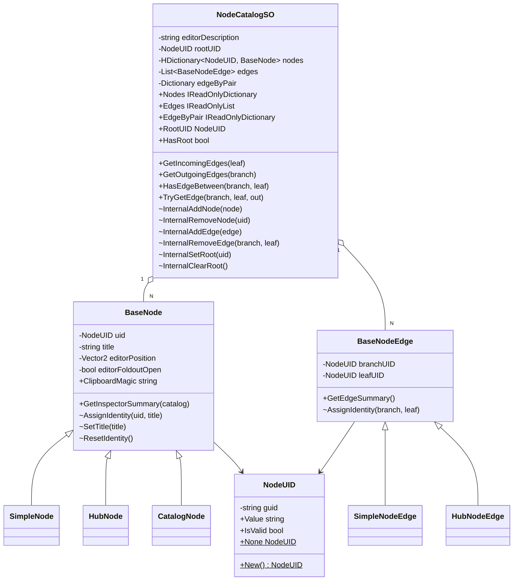
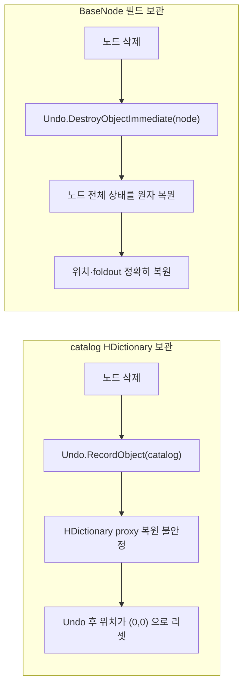
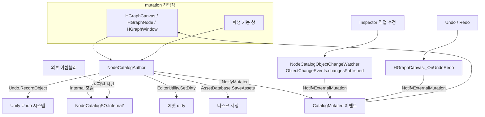
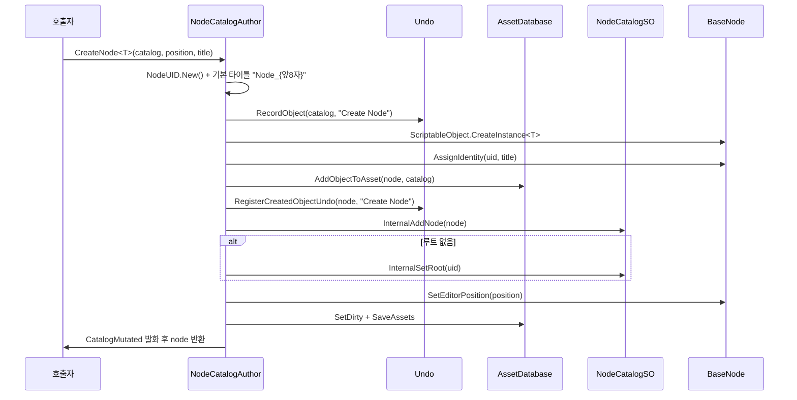
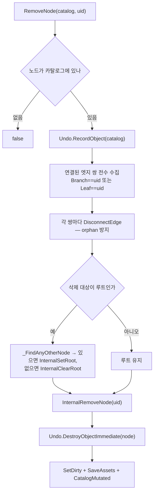
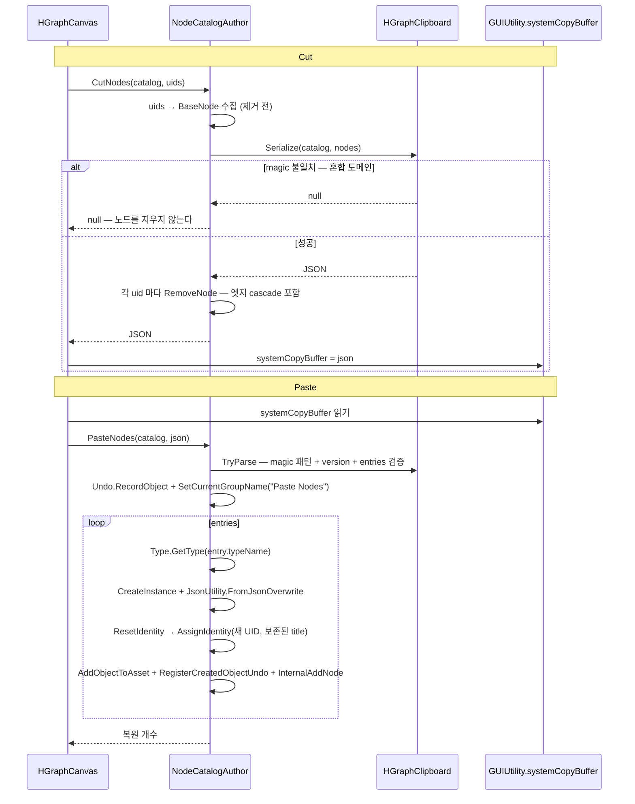
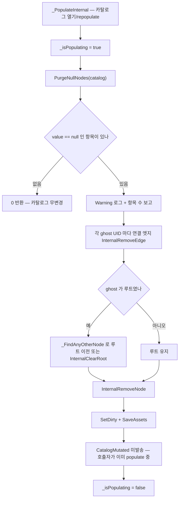

# NodeCatalog — 그래프 데이터 모델과 mutation 게이트

> 대상 어셈블리: `HCUP.HWindows.NodeWindow`(데이터) + `HCUP.HWindows.NodeWindow.Editor`(Author)
> 관련 문서: [`GraphEditor.md`](GraphEditor.md) · [`Settings.md`](Settings.md)

---

## 요약

NodeWindow 의 데이터는 **`NodeCatalogSO` 하나에 모여 있다.** 그래프 한 개 = 카탈로그 에셋 한 개이고,
노드들은 그 에셋의 **sub-asset** 으로 저장된다.

이 시스템의 중심 규약은 두 가지다.

1. **모든 변경은 `NodeCatalogAuthor` 를 통과한다.** `NodeCatalogSO` 의 mutation API 는 전부
   `internal` 이고, `[assembly: InternalsVisibleTo("HCUP.HWindows.NodeWindow.Editor")]`
   (`Runtime/NodeWindow/AssemblyInfo.cs:3`) 한 줄이 Editor 어셈블리에만 문을 연다. 다른
   어셈블리는 **컴파일 타임에** 차단된다.
2. **노드는 자기 이웃을 모른다.** 인접 관계는 `catalog.edges` 가 단독 소유한다. 양방향 동기화
   책임이 구조적으로 사라진다.

---

## 파일 지도

### Runtime (`HCUP.HWindows.NodeWindow`)

| 경로 | 행수 | 역할 |
|---|---|---|
| `NodeCatalog/NodeCatalogSO.cs` | 192 | 노드·엣지·루트의 단일 소유자. 인접 조회 + `internal` mutation |
| `NodeCatalog/BaseNode.cs` | 209 | 노드 추상 베이스 (`ScriptableObject`). UID + Title + 에디터 상태 |
| `NodeCatalog/BaseNodeEdge.cs` | 72 | 엣지 추상 베이스 (**plain class**). branch + leaf UID |
| `NodeCatalog/SimpleNode.cs` | 7 | 인프라 검증용 최소 구현 |
| `NodeCatalog/SimpleNodeEdge.cs` | 36 | 비-허브 노드 간 엣지 |
| `NodeCatalog/HubNode.cs` | 122 | 키 기반 1→N 라우팅 노드 |
| `NodeCatalog/HubNodeEdge.cs` | 54 | 출구 포트 키를 담는 엣지 |
| `NodeCatalog/CatalogNode.cs` | 86 | 다른 카탈로그 참조 노드 |
| `Identity/NodeUID.cs` | 132 | GUID 기반 식별자 `struct` |
| `AssemblyInfo.cs` | 41 | `InternalsVisibleTo` 선언 |

### Editor (`HCUP.HWindows.NodeWindow.Editor`)

| 경로 | 행수 | 역할 |
|---|---|---|
| `NodeCatalog/Authoring/NodeCatalogAuthor.cs` | 667 | **mutation 단일 게이트.** 상태 0, 전부 static |
| `NodeCatalog/Authoring/NodeCatalogObjectChangeWatcher.cs` | 63 | Inspector 직접 수정 감지 → 이벤트 발송 |
| `Identity/NodeUIDDrawer.cs` | 93 | `NodeUID` 인스펙터 한 줄 표시 |

---

## 데이터 모델



### 직렬화 방식이 세 가지로 갈린다

| 데이터 | 직렬화 | 이유 |
|---|---|---|
| `nodes` | `HDictionary<NodeUID, BaseNode>` (`HCollection`) | List+Dict 싱크 / 중복 키 검증 자동. 노드는 `ScriptableObject` 라 sub-asset 참조 |
| `edges` | `[SerializeReference] List<BaseNodeEdge>` | abstract base 의 polymorphic 직렬화. **클래스 FQN 이 YAML 에 박히므로 리네임에 취약** |
| `edgeByPair` | `[NonSerialized]` + lazy rebuild | `(branch, leaf)` 값 튜플 키 조회 캐시. `OnAfterDeserialize` 에서 null 로 비운다 |

### 노드는 SO, 엣지는 plain class

의도된 비대칭이다 (`BaseNodeEdge.cs:45-52`).

| | `BaseNode` | `BaseNodeEdge` |
|---|---|---|
| 기반 | `ScriptableObject` | `[Serializable] class` |
| 저장 | 카탈로그의 sub-asset | 카탈로그 필드 안의 `SerializeReference` |
| 외부 참조 | 가능 (Project 창 선택 대상) | 불가 — 카탈로그 내부 전용 |
| 메모리 | ~200B (SO 베이스) | ~50B |

근거로 Unity Animator 자체가 같은 비대칭이라는 점을 든다 —
`AnimatorState` = SO, `AnimatorTransition` = plain class.

---

## `NodeUID` — 식별자

```csharp
// Runtime/NodeWindow/Identity/NodeUID.cs:22-42
[Serializable]
public struct NodeUID : IEquatable<NodeUID> {
    [SerializeField, HideInInspector] string guid;

    public string Value => guid ?? string.Empty;
    public static NodeUID None => new(string.Empty);
    public bool IsValid => !string.IsNullOrEmpty(guid);

    public static NodeUID New() => new(Guid.NewGuid().ToString("N"));
}
```

**중앙 레지스트리가 없다.** 과거에는 `int` + `ProjectSettings/NodeUIDRegistry.asset` 방식이었으나,
다중 브랜치 환경에서 같은 `nextValue` 가 서로 다른 노드에 발급되는 충돌이 필연이라 2026.05.09 에
GUID 로 전환하고 레지스트리를 삭제했다 (`NodeUID.cs:79-91`). 부수 효과로 **삭제된 노드의 UID 는 절대
재사용되지 않는다.**

`guid` 필드에 `[HideInInspector]` 가 붙은 것도 의도적이다. 이것이 없으면 `NodeUID` 가
"visible children 을 가진 Generic 프로퍼티"로 판정되어 `HDictionaryDrawer` 가 컨테이너
foldout 경로로 라우팅한다. 자식을 감추면 simple cell 경로로 떨어져
`NodeUIDDrawer`(`CustomPropertyDrawer<NodeUID>`)가 32자 GUID 를 한 줄로 그린다 (`NodeUID.cs:63-76`).

| 표시 | 조건 |
|---|---|
| `SelectableLabel` (32자 GUID, `EditorStyles.textField`, Ctrl+C 가능) | `guid` 가 비어 있지 않음 |
| `(None)` — 회색 이탤릭 | `guid` 가 `null` 또는 `""` |

---

## 노드 타입

| 노드 | 클래스 | `ClipboardMagic` | 특징 |
|---|---|---|---|
| Base | `BaseNode` (abstract) | `HGRAPH_BASE_NODE_V1` | UID + Title + 에디터 상태만 |
| Simple | `SimpleNode` (sealed) | `HGRAPH_SIMPLE_NODE_V1` | 필드 0. **인프라 검증용** |
| Hub | `HubNode` | `HGRAPH_HUB_NODE_V1` | `List<HubPortEntry>` — 출구 키 목록 |
| Catalog | `CatalogNode` (sealed) | `HGRAPH_CATALOG_NODE_V1` | `NodeCatalogSO referencedCatalog` (**Editor-only 필드**) |

`ClipboardMagic` 은 Cut/Paste 클립보드 wrapper 의 타입 식별자다. 명명 규칙은
`HGRAPH_<DOMAIN>_NODE_V<N>` 이며, **혼합 도메인 selection 은 직렬화가 거부한다**
(`HGraphClipboard.Serialize`, [`GraphEditor.md`](GraphEditor.md#클립보드-형식) 참조).

### 에디터 상태의 소유권

`editorPosition` / `editorFoldoutOpen` 은 **카탈로그가 아니라 노드가 들고 있다**
(`BaseNode.cs:32-38`, `#if UNITY_EDITOR` 가드). 2026.05.09 에 카탈로그의
`HDictionary` 3개에서 이관했고, 이유는 Undo 다.



### `HubNode` — 키 목록과 실시간 동기화

```csharp
// Runtime/NodeWindow/NodeCatalog/HubNode.cs:30-33, :49-50
[Serializable]
public struct HubPortEntry {
    public string Key;
    public HubPortEntry(string key) { Key = key; }
}
...
internal event Action KeysChanged;
private void OnValidate() => KeysChanged?.Invoke();
```

`entries` 에는 `[HReadOnly]` 가 없다 — Inspector 직접 편집이 허용된다. 대신 `OnValidate` →
`KeysChanged` 이벤트로 시각 노드가 즉시 반응한다. 이는 **전체 repopulate 없이 포트 수와
라벨만 갱신하는 경량 경로**다 (`HGraphHubNode._OnKeysChanged`).

키 값의 범위·의미·중복 여부는 **시스템이 검증하지 않는다.** 전적으로 사용자 정의다.

### `CatalogNode` — Editor-only 필드

`referencedCatalog` 는 `#if UNITY_EDITOR` 안에 있다 (`CatalogNode.cs:23-27`). 빌드 바이너리에
카탈로그 참조가 남지 않으므로 SO 참조 메모리·빌드 크기 영향이 0 이다. `[HReadOnly]` 가 붙어
Inspector 직접 편집이 막혀 있고, 정식 편집 채널은 GraphView 노드 본문의 `ObjectField` 다 —
그쪽만 `Undo.RecordObject` + `SetDirty` 를 수행한다.

---

## Mutation 게이트 — `NodeCatalogAuthor`

**상태 0, 필드 0, 전부 `static`.** 모든 컨텍스트가 파라미터로 전달된다.



### API 표

| 그룹 | 메서드 | Undo 라벨 | SaveAssets | `CatalogMutated` |
|---|---|---|---|---|
| 노드 | `CreateNode<T>(catalog, title)` | Create Node | ✅ | ✅ |
| 노드 | `CreateNode<T>(catalog, position, title)` | Create Node | ✅ | ✅ |
| 노드 | `CreateCatalogNodeAt(catalog, referenced, pos)` | Create Catalog Node | ✅ | ✅ |
| 노드 | `DuplicateNode<T>(catalog, sourceUID)` | Duplicate Node | ✅ | ✅ |
| 노드 | `RemoveNode(catalog, uid)` | Remove Node | ✅ | ✅ |
| 허브 | `CreateHubNode(catalog, position)` | Create Hub Node | ✅ | ✅ |
| 허브 | `AddHubEntry(catalog, hubUID, key)` | Add Hub Entry | ✅ | ✅ |
| 허브 | `RemoveHubEntry(catalog, hubUID, index)` | Remove Hub Entry | ✅ | ✅ |
| 엣지 | `ConnectEdge<TEdge>(catalog, branch, leaf)` | Connect Edge | ✅ | ✅ |
| 엣지 | `ConnectHubEdge(catalog, branch, leaf, portKey)` | Connect Hub Edge | ✅ | ✅ |
| 엣지 | `DisconnectEdge(catalog, branch, leaf)` | Disconnect Edge | ✅ | ✅ |
| 루트 | `SetRoot(catalog, uid)` | Set Root | ✅ | ✅ |
| 클립보드 | `CutNodes(catalog, uids)` → JSON | (RemoveNode 경유) | ✅ | ✅ |
| 클립보드 | `PasteNodes(catalog, json)` → int | Paste Nodes | 복원 ≥1 시 | 복원 ≥1 시 |
| **고빈도** | `SetLayout(catalog, uid, pos)` | ❌ 없음 | ❌ | ❌ |
| **고빈도** | `SetFoldoutOpen(catalog, uid, open)` | ❌ 없음 | ❌ | ❌ |
| 복구 | `PurgeNullNodes(catalog)` → int | ❌ 없음 | ✅ | ❌ **의도적 미발송** |
| 알림 | `NotifyExternalMutation(catalog)` | — | — | ✅ |

**고빈도 2건이 예외 처리되는 이유**: 노드를 드래그하면 프레임마다 `SetLayout` 이 호출된다.
매번 `SaveAssets` + broadcast 하면 에디터가 멈추고 캔버스가 깜빡인다. 그래서 `SetDirty` 만 하고
저장은 Unity 의 일반 저장 시점에 맡긴다 (`NodeCatalogAuthor.cs:417-434`, `:543-561`).

`PurgeNullNodes` 가 `CatalogMutated` 를 보내지 않는 것도 의도적이다 — 호출자
(`HGraphCanvas._PopulateInternal`)가 이미 populate 중이며, 재진입은 `_isPopulating` 가드가 막는다
(`:568-570`).

### 검증 규칙

`_ValidateEdgeCreation` (`:618-645`) 이 엣지 생성 전 6가지를 검사한다.

| # | 조건 | 거부 사유 |
|---|---|---|
| 1 | `catalog != null` | `catalog is null` |
| 2 | `branch.IsValid && leaf.IsValid` | `invalid UID` |
| 3 | `branch != leaf` | `self-loop forbidden` |
| 4 | branch 노드가 카탈로그에 존재 + non-null | `branch node {uid} not in catalog` |
| 5 | leaf 노드가 카탈로그에 존재 + non-null | `leaf node {uid} not in catalog` |
| 6 | `!catalog.HasEdgeBetween(branch, leaf)` | `parallel edge forbidden` |

노드 쪽 제약은 세 가지다.

| 규칙 | 위치 |
|---|---|
| **`CatalogNode` 는 루트가 될 수 없다** | `SetRoot` 타입 가드 (`:404-407`) + `_CreateCatalogNodeCore` 자동 루트 스킵 (`:172`) |
| **같은 카탈로그 안에 동일 referenced 를 가리키는 `CatalogNode` 는 1개** | `_HasCatalogNodeFor` 중복 거부 (`:137-140`) |
| **`AssignIdentity` 는 최초 1회만** | `if (uid.IsValid) return` (`BaseNode.cs:68`) |

---

## 흐름 1 — 노드 생성



인자 없는 오버로드는 자동 배치를 쓴다 — `X = (Nodes.Count - 1) * AUTO_LAYOUT_STRIDE_X`,
`Y = 0` (`AUTO_LAYOUT_STRIDE_X = 220f`, `:32`, `:83-84`).

---

## 흐름 2 — 노드 삭제와 cascade



`Undo.DestroyObjectImmediate` 가 `AssetDatabase.RemoveObjectFromAsset` +
`DestroyImmediate` 를 대체한다. Undo 시 sub-asset 이 에디터 상태까지 포함해 원자 복원된다
(`:254-256`).

`RemoveHubEntry` 도 같은 cascade 를 쓴다 — 삭제할 키를 `BranchPortKey` 로 갖는
`HubNodeEdge` 를 먼저 전부 끊는다 (`:332-338`).

---

## 흐름 3 — Cut / Paste



**Paste 는 항상 새 UID 를 발급한다** (2026-05-08 결정, `:523-530`). 두 카탈로그가 같은 UID 노드를
보유할 수 있는 환경이라 충돌 회피가 우선이다. **title 은 보존**하되 비어 있으면
`Node_{새UID앞8자}` 로 대체한다.

`typeName` 은 `AssemblyQualifiedName` 이다. 타입을 못 찾거나 `BaseNode` 파생이 아니면
해당 entry 만 건너뛰고 경고를 남긴다 (`:505-520`) — 나머지는 계속 복원된다.

**엣지는 클립보드에 포함되지 않는다.** Cut 한 노드를 Paste 하면 연결이 사라진 채 노드만 돌아온다.

---

## 흐름 4 — ghost UID 정리

Project 창에서 sub-asset 을 직접 삭제하면 `HDictionary` 의 키는 남고 값만 `null` 이 된다.



`SaveAssets` 가 `ObjectChangeWatcher` 를 통해 다음 repopulate 를 자동 예약하므로 별도 알림이
필요 없다. `_isPopulating` 가드가 그 사이의 동기 재진입을 막는다.

---

## 변경 알림 — `CatalogMutated`

시각 레이어가 구독하는 **단일 진입점**이다. 세 경로가 이 이벤트로 합쳐진다.

| 경로 | 트리거 |
|---|---|
| Author mutation | `_NotifyMutated` — 위 API 표의 ✅ 항목 |
| Inspector 직접 수정 | `NodeCatalogObjectChangeWatcher` → `NotifyExternalMutation` |
| Undo / Redo | `HGraphCanvas._OnUndoRedo` → `NotifyExternalMutation` |

`NodeCatalogObjectChangeWatcher` 는 `[InitializeOnLoad]` 정적 생성자에서
`ObjectChangeEvents.changesPublished` 를 구독한다. `ChangeAssetObjectProperties` 이벤트만 보고,
`EditorUtility.EntityIdToObject(instanceId)` 로 역조회한 결과가 `NodeCatalogSO` 일 때만 통과시킨다
(`NodeCatalogObjectChangeWatcher.cs:12-23`).

> `EntityIdToObject` 는 Unity 6000.3.11f1 에서 `InstanceIDToObject(int)` 가 Obsolete 처리되어
> 교체된 API 다 (`NodeCatalogObjectChangeWatcher.cs:31-38`). **이 파일은 2022.3 LTS 에서 컴파일되지 않는다** —
> 상위 `HWindows/README.md` 가 선언한 "Unity 최저 2022.3.x" 와 어긋난다.

---

## 사용 예

```csharp
using HWindows.Editor.NodeWindow.Authoring;
using HWindows.NodeWindow;

// 1) 노드 생성 — 위치 지정
MyLineNode node = NodeCatalogAuthor.CreateNode<MyLineNode>(catalog, new Vector2(200, 0), "인사말");

// 2) 엣지 연결 — 검증 6종을 통과해야 성공
SimpleNodeEdge edge = NodeCatalogAuthor.ConnectEdge<SimpleNodeEdge>(catalog, a.UID, b.UID);
if (edge == null) { /* self-loop / 중복 / 미존재 노드 — 경고는 이미 로그에 있다 */ }

// 3) 조회 — catalog 는 읽기 전용 뷰만 노출한다
foreach (BaseNodeEdge e in catalog.GetOutgoingEdges(a.UID)) { ... }
if (catalog.TryGetEdge(a.UID, b.UID, out BaseNodeEdge found)) { ... }

// 4) 절대 이렇게 하지 않는다 — 애초에 컴파일되지 않는다
// catalog.InternalAddNode(node);   // CS0122: inaccessible due to its protection level
```

---

## 주의할 점

### 계약

1. **`catalog.Internal*` 를 직접 부르지 않는다.** Editor 어셈블리 안에서는
   `InternalsVisibleTo` 때문에 **컴파일이 된다.** `NodeCatalogAuthor` 를 우회하면 Undo 등록,
   `SetDirty`, `SaveAssets`, `CatalogMutated` 가 전부 빠져 캔버스와 데이터가 어긋난다.
2. **`AssemblyInfo.cs` 의 문자열과 Editor asmdef 의 `name` 은 정확히 일치해야 한다.**
   한 글자만 달라도 친구 어셈블리로 인식되지 않아 Author 전체가 컴파일 실패한다
   (`AssemblyInfo.cs:28-30`).
3. **`SerializeReference` 는 클래스 FQN 으로 저장된다.** `BaseNodeEdge` 파생 클래스를
   리네임하거나 다른 네임스페이스로 옮기면 기존 `.asset` 의 엣지 데이터가 유실된다
   (`BaseNodeEdge.cs:58-62`).
4. **`ClipboardMagic` 리네임은 기존 클립보드 페이로드와의 호환을 깬다.** 도메인별 고유
   문자열로 한 번 정하면 바꾸지 않는다.
5. **`edgeByPair` 는 `(branch, leaf)` 를 키로 하므로 parallel edge 를 표현할 수 없다.**
   `_RebuildEdgeCache` 가 인덱서 대입(`edgeByPair[key] = e`)을 쓰므로 중복 쌍이 있으면
   마지막 것만 남는다 (`NodeCatalogSO.cs:118-123`). Author 가 중복 생성을 막으므로 정상
   경로에서는 발생하지 않지만, `InternalAddEdge` 는 `edgeByPair?.Add(...)` 를 쓰기 때문에
   캐시가 이미 만들어진 상태에서 중복이 들어오면 `ArgumentException` 이다 (`NodeCatalogSO.cs:97`).
6. **`SetLayout` / `SetFoldoutOpen` 은 Undo 대상이 아니다.** 노드를 드래그로 옮긴 뒤 Ctrl+Z 를
   눌러도 위치는 되돌아오지 않는다.

### 정리 대상

7. **`SimpleNode` / `HubNode` 직접 사용 금지가 문서 규약일 뿐 코드가 막지 않는다.**
   `SimpleNode` 는 `sealed` 라 상속조차 불가한데, `NodeCatalogAuthor.CreateNode<SimpleNode>` 는
   정상 동작한다. `HubNode` 도 `CreateHubNode` 가 직접 인스턴스화한다 (`:278`).
8. **`BaseNodeEdge.AssignIdentity` 의 재할당 차단이 부분적이다.**
   `if (branchUID.IsValid || leafUID.IsValid) return` — **OR** 조건이라 한쪽만 유효해도
   전체가 차단된다 (`BaseNodeEdge.cs:23`). 정상 경로에서는 둘 다 함께 설정되므로 무해하다.
9. **`HubNode.SetEntryKey(int, string)` 에 호출처가 없다** (`HubNode.cs:61-63`, 전역 grep 0건).
   Inspector 직접 편집이 `entries` 를 통째로 다루므로 Author 경유 키 수정 API 가 쓰이지 않는다.
10. **소비처가 없는 public/internal 멤버 3건** (패키지 전역 grep 기준, 정의 외 참조 0건).
    - `NodeCatalogSO.EditorDescription` (`NodeCatalogSO.cs:31`) — Inspector 에서 편집은 되지만
      어디에서도 표시하지 않는다.
    - `BaseNodeEdge.GetEdgeSummary()` (`BaseNodeEdge.cs:30`) — `virtual` 이지만 override 도
      호출도 없다. `BaseNode.GetInspectorSummary` 는 `HDialogue.DialogueLineNode` 가 실제로
      override 하므로 대조적이다.
    - `NodeCatalogAuthor.CreateHubNode(catalog, position)` (`:267`) — 2026.05.15 에
      "허브 노드 생성" 우클릭 메뉴 항목이 제거되면서 호출자가 사라졌다. `HubNode` 생성은 이제
      파생 창의 `CreateNode<T>` 경로로만 가능하다.
11. **`PurgeNullNodes` 의 루트 이전이 부정확할 수 있다.** `_FindAnyOtherNode(catalog, NodeUID.None)`
    는 `uid != NodeUID.None` 인 첫 키를 반환하는데(`:647-652`), 이 시점에는 ghost 가 이미
    제거됐으므로 결과는 "임의의 남은 노드"다. `CatalogNode` 가 선택될 수 있고, 그러면
    `SetRoot` 의 타입 가드를 우회한 상태가 된다 — `InternalSetRoot` 를 직접 부르기 때문이다.
    같은 문제가 `RemoveNode` 의 루트 이전(`:248-250`)에도 있다.
