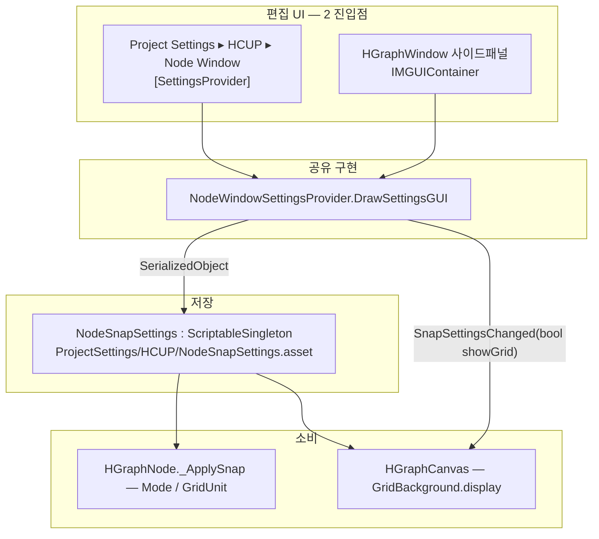
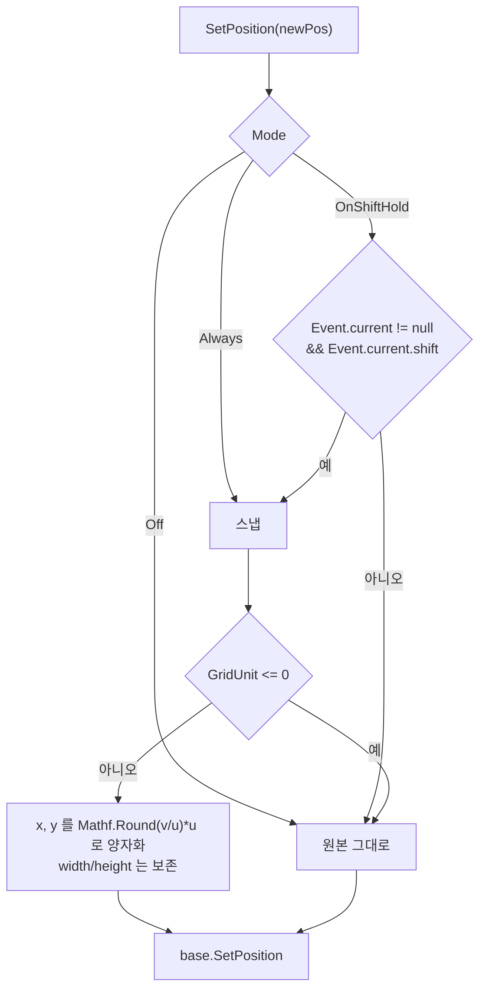
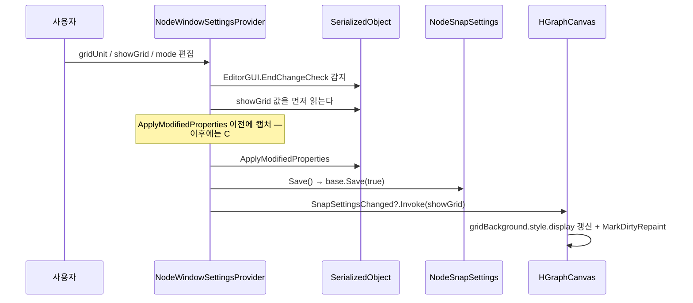

# Settings — 스냅 / 그리드 설정

> 대상 어셈블리: `HCUP.HWindows.NodeWindow.Editor` (`Editor/NodeWindow/Settings/` 3파일)
> 관련 문서: [`NodeCatalog.md`](NodeCatalog.md) · [`GraphEditor.md`](GraphEditor.md)

---

## 요약

NodeWindow 의 설정은 **필드 3개짜리 `ScriptableSingleton` 하나**가 전부다. 그 값을 편집하는
UI 가 두 곳(Project Settings 페이지 / 그래프 창 사이드패널)에 있고, **같은 그리기 코드를
공유**한다.



**한쪽에서 바꾸면 다른 쪽에 즉시 반영된다.** 두 UI 가 같은 `ScriptableSingleton` 인스턴스를
가리키기 때문이다.

---

## 파일 지도

| 경로 | 행수 | 역할 |
|---|---|---|
| `Settings/NodeSnapSettings.cs` | 71 | `ScriptableSingleton`. 3필드 + getter + `internal Save()` |
| `Settings/NodeWindowSettingsProvider.cs` | 126 | `[SettingsProvider]` 등록 + 공유 IMGUI + 변경 이벤트 |
| `Settings/SnapMode.cs` | 36 | `Off` / `OnShiftHold` / `Always` |
| `Identity/NodeUIDDrawer.cs` | 93 | (별도 관심사) `NodeUID` 인스펙터 표시 — [`NodeCatalog.md`](NodeCatalog.md#nodeuid--식별자) |

---

## 데이터 모델

```csharp
// Settings/NodeSnapSettings.cs:30-51
[FilePath("ProjectSettings/HCUP/NodeSnapSettings.asset",
          FilePathAttribute.Location.ProjectFolder)]
public sealed class NodeSnapSettings : ScriptableSingleton<NodeSnapSettings> {
    [SerializeField, Range(1, 100)] int gridUnit = 20;
    [SerializeField] bool showGrid = true;
    [SerializeField] SnapMode mode = SnapMode.OnShiftHold;

    public int GridUnit => gridUnit;      // 외부 노출은 getter 만
    public bool ShowGrid => showGrid;
    public SnapMode Mode => mode;

    internal void Save() => base.Save(true);
}
```

| 필드 | 타입 | 범위 | 기본값 | 의미 |
|---|---|---|---|---|
| `gridUnit` | `int` | `[1, 100]` | `20` | 스냅 단위 (px). GridBackground minor 격자와 정합 |
| `showGrid` | `bool` | — | `true` | `GridBackground` 표시 여부 |
| `mode` | `SnapMode` | — | `OnShiftHold` | 스냅 동작 방식 |

**저장 위치가 `ProjectSettings/HCUP/` 다.** `Assets/` 를 오염시키지 않으면서 레포에 커밋되어
팀원 간 공유된다. 머신 종속 값이 아니라는 판단이다.

**세터가 없다.** 변경은 `SerializedObject` 를 통해서만 가능하고, 그 경로가
`NodeWindowSettingsProvider._DrawSnapSettings` 하나다.

### `SnapMode`

| 값 | 동작 |
|---|---|
| `Off` | 절대 스냅하지 않는다. `Shift` 를 눌러도 무시 |
| `OnShiftHold` | `Shift` 가 눌린 동안만 실시간 스냅 (**기본값**) |
| `Always` | `Shift` 무관 항상 실시간 스냅 |

---

## 스냅 적용 지점

`HGraphNode.SetPosition` 하나뿐이다. `SelectionDragger` 가 드래그 중 매 프레임 호출한다.

```csharp
// Core/HGraphNode.cs:140-162
public override void SetPosition(Rect newPos) {
    Rect quantized = _ApplySnap(newPos);
    base.SetPosition(quantized);
}

Rect _ApplySnap(Rect r) {
    NodeSnapSettings s = NodeSnapSettings.instance;
    bool shouldSnap = s.Mode == SnapMode.Always
                   || (s.Mode == SnapMode.OnShiftHold
                       && Event.current != null
                       && Event.current.shift);
    if (!shouldSnap) return r;
    int u = s.GridUnit;
    if (u <= 0) return r;  // P1E-4 DivByZero 가드
    return new Rect(
        Mathf.Round(r.x / u) * u,
        Mathf.Round(r.y / u) * u,
        r.width,
        r.height);
}
```



**좌상단 기준 양자화다.** 크기는 건드리지 않는다. `Range(1, 100)` 어트리뷰트가 UI 에서
0 이하를 막지만, 에셋 YAML 직접 수정 등을 대비해 `u <= 0` 가드가 별도로 있다.

**스냅 결과는 저장으로 이어진다.** `base.SetPosition` 이후 GraphView 가
`graphViewChanged.movedElements` 를 발행하고, `HGraphCanvas._OnGraphViewChanged` 가
`NodeCatalogAuthor.SetLayout` 을 호출한다.

---

## 편집 UI

```csharp
// Settings/NodeWindowSettingsProvider.cs:39-46
[SettingsProvider]
public static SettingsProvider Create() {
    return new SettingsProvider(SETTINGS_PATH, SettingsScope.Project) {
        label = "Node Window",
        guiHandler = DrawSettingsGUI,
        keywords = new[] { "HCUP", "Node", "Snap", "Grid", "UID" }
    };
}
```

| 항목 | 값 |
|---|---|
| 경로 상수 | `SETTINGS_PATH = "Project/HCUP/Node Window"` |
| 표시 위치 | **`Project Settings ▸ HCUP ▸ Node Window`** |
| 라벨 | `Node Window` |
| 검색 키워드 | `HCUP`, `Node`, `Snap`, `Grid`, `UID` |
| 사이드패널 | `HGraphWindow` 툴바의 `Settings` 토글 → `IMGUIContainer` (width 280, 기본 숨김) |

두 진입점 모두 `internal static DrawSettingsGUI(string searchContext)` 를 호출한다.
`SettingsProvider.guiHandler` 시그니처에 맞추느라 파라미터를 받지만 사용하지 않는다 —
사이드패널은 `string.Empty` 를 넘긴다 (`HGraphWindow.cs:299`).

섹션 헤더는 `HInspector.Editor.HTitleDrawer.Draw("Snap Settings")` 다 — 이것이
`HCUP.HInspector.Editor` 참조가 필요한 이유 중 하나다.

> **이 어셈블리에는 `[MenuItem]` 이 하나도 없다.** 설정 페이지는 `[SettingsProvider]` 로,
> 그래프 창은 파생 창의 `[MenuItem]` 으로 열린다.

---

## 변경 전파



```csharp
// Settings/NodeWindowSettingsProvider.cs:68-74
if (EditorGUI.EndChangeCheck()) {
    // ApplyModifiedProperties 전에 값을 읽어야 SerializedProperty 기준 최신값 보장.
    bool showGrid = so.FindProperty("showGrid").boolValue;
    so.ApplyModifiedProperties();
    settings.Save();
    SnapSettingsChanged?.Invoke(showGrid);
}
```

**이벤트가 `Action` 이 아니라 `Action<bool>` 인 이유가 이 순서다.** 종전에는 파라미터 없이
발화하고 구독자가 `NodeSnapSettings.instance.ShowGrid` 를 읽었는데,
`ApplyModifiedProperties` 이후 `ScriptableSingleton` 의 C# 필드 갱신이 지연되어 옛 값을
반환하는 경우가 있었다 (2026.05.12 버그픽스, `NodeWindowSettingsProvider.cs:85-99`).

`gridUnit` 과 `mode` 변경은 이벤트로 전파되지 않는다 — `_ApplySnap` 이 드래그마다
`NodeSnapSettings.instance` 를 직접 읽으므로 즉시 반영된다. `showGrid` 만
`GridBackground` 의 `style.display` 를 능동적으로 갱신해야 해서 이벤트가 필요하다.

`style.display` 를 쓰는 것도 의도적이다 — GraphView 렌더 패스에서 `visibility: hidden` 이
반영되지 않는 케이스를 피한다 (`HGraphCanvas.cs:418-419`).

### 캔버스 초기값

캔버스 생성자에서 `NodeSnapSettings.instance.ShowGrid` 를 읽어 `GridBackground` 의 초기
`display` 를 정한다 (`HGraphCanvas.cs:80-82`). 이후 갱신은 이벤트 경로다.

---

## 사용 예

```csharp
using HWindows.Editor.NodeWindow.Settings;

// 읽기 — getter 만 열려 있다
int unit = NodeSnapSettings.instance.GridUnit;
SnapMode mode = NodeSnapSettings.instance.Mode;
bool grid = NodeSnapSettings.instance.ShowGrid;

// 쓰기 — SerializedObject 경유가 유일한 경로
SerializedObject so = new SerializedObject(NodeSnapSettings.instance);
so.FindProperty("gridUnit").intValue = 40;
so.ApplyModifiedProperties();
NodeSnapSettings.instance.Save();   // internal — 같은 어셈블리 안에서만
```

`Save()` 는 `internal` 이므로 **다른 어셈블리에서는 영구 저장을 트리거할 수 없다.**

---

## 주의할 점

### 계약

1. **필드 추가 시 기존 에셋 값이 리셋될 수 있다.** `ScriptableObject` 에셋에 없는 필드는
   직렬화 기본값으로 채워진다. 이 위험 때문에 Phase 1-E 에서 3필드를 한 번에 도입했다
   (`NodeSnapSettings.cs:68-70`).
2. **`gridUnit` 은 그리드 배경의 시각 간격과 별개다.** `GridBackground` 는 GraphView 내장
   요소이고 자체 간격을 쓴다. `gridUnit` 은 **스냅 계산에만** 쓰인다 — 기본값 20 이
   GridBackground minor 격자와 맞춰진 값일 뿐, 하나를 바꿔도 다른 쪽이 따라오지 않는다.
3. **`NodeWindowSettingsProvider` 는 `static class` 이며 `internal` 이다** (`NodeWindowSettingsProvider.cs:26`).
   `SnapSettingsChanged` 도 `internal` 이라 다른 어셈블리에서 구독할 수 없다.
4. **`OnShiftHold` 는 `Event.current` 에 의존한다.** IMGUI 이벤트 컨텍스트 밖에서
   `SetPosition` 이 호출되면 `Event.current` 가 `null` 이라 스냅되지 않는다 —
   populate 시 `view.SetPosition(new Rect(pos, Vector2.zero))` 로 저장된 위치를 복원하는
   경로가 그렇다 (`HGraphCanvas.cs:666`). 저장값이 스냅으로 왜곡되지 않아 오히려 바람직하다.

### 정리 대상

5. **`SerializedObject` 를 GUI 호출마다 새로 만든다** (`NodeWindowSettingsProvider.cs:61`). `_DrawSnapSettings` 가
   IMGUI 프레임마다 `new SerializedObject(settings)` 를 할당하고 `FindProperty` 를 3~4회
   호출한다. 설정 페이지가 열려 있을 때만 발생하고 필드가 3개라 실측 영향은 미미하다.
6. **`FindProperty("showGrid")` 가 한 프레임에 두 번 호출된다** (`NodeWindowSettingsProvider.cs:65`, `:70`).
7. **`SettingsProvider.keywords` 에 `UID` 가 남아 있다** (`NodeWindowSettingsProvider.cs:44`). UID Registry 섹션은
   2026.05.09 에 제거됐다 (`NodeWindowSettingsProvider.cs:102-109`) — 검색어만 잔존한다.
8. **`SnapMode.cs` 의 `#endif` 위치 때문에 Dev Log 주석이 가드 밖에 있다** (`SnapMode.cs:24-36`).
   동작에는 영향이 없다.

---

## 확장 지점

| 하고 싶은 것 | 손댈 곳 |
|---|---|
| 설정 항목 추가 | `NodeSnapSettings` 필드 + getter → `_DrawSnapSettings` 에 `PropertyField` |
| 새 설정 섹션 | `NodeWindowSettingsProvider.DrawSettingsGUI` 에 `_DrawXxx()` 추가 (`HTitleDrawer.Draw` 로 헤더) |
| 스냅 규칙 변경 (중심 기준 등) | `HGraphNode._ApplySnap` — 단일 지점 |
| 다른 값의 변경 전파 | `SnapSettingsChanged` 를 확장하거나 별도 이벤트 추가. **`ApplyModifiedProperties` 이전에 값을 캡처할 것** |
| 그리드 시각 커스터마이즈 | `GridBackground` 교체 — `HGraphCanvas` 생성자 (`:73-82`) |
