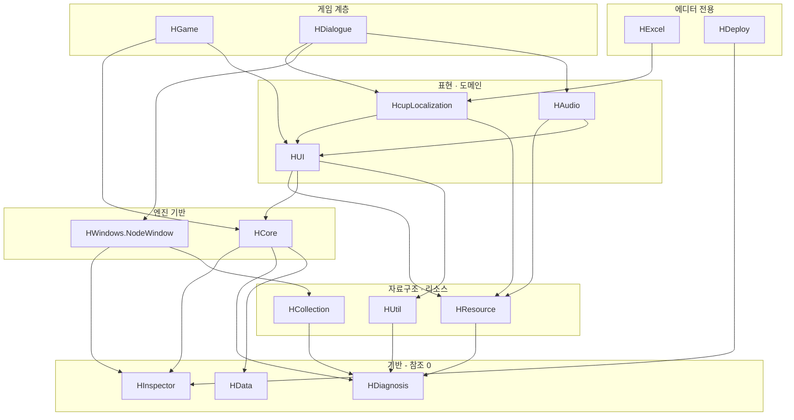

# HCUP-Unity - Hong's Custom Utility

> 저장소: Unity 공용 모듈 15개 폴더 / 어셈블리 29개 (테스트 어셈블리 1개 포함) / 비샘플 소스 402파일
> 사용 방식: **저장소를 통째로 가져다 쓴다** (git 서브모듈 또는 폴더 복사). 개별 UPM 설치는 현재 동작하지 않는다. 아래 "설치" 참조
> 이 문서의 성격: **모듈 지도와 진입점**. 각 어셈블리의 내부 구조·플로우는 해당 어셈블리의 README 로 간다

---

## 개요

반복 구현되던 Unity 기능을 도메인별 어셈블리로 쪼개 재사용하기 쉽게 정리한 묶음이다.
범용 엔진이 아니라 **실제 프로젝트에서 반복 사용된 구조를 유지보수하기 쉽게 모듈화한 것**에 가깝다.

설계상 지키는 규약이 셋 있다.

1. **역방향 참조 금지.** 기반 계층(`HData`·`HDiagnosis`·`HInspector`)은 아무것도 참조하지 않는다.
   상위 계층이 하위를 참조할 뿐, 그 반대는 없다.
2. **에디터 코드는 별도 어셈블리로 분리한다.** `*.Editor` asmdef 가 `includePlatforms: ["Editor"]`
   를 갖고, 런타임 어셈블리는 에디터 API 를 참조하지 않는다.
3. **선택 의존은 `defineConstraints` 로 격리한다.** Odin 브릿지 3종(`HCUP.HCollection.Odin.Editor`, `HCUP.HInspector.Odin.Editor`, `HCUP.HUtil.Odin.Editor`)이 `ODIN_INSPECTOR` 로, `HUnityLocalization` 2종이 `HCUP_UNITY_LOCALIZATION` 으로 묶여 있다.

---

## 모듈 지도

| 모듈 | 소스 | 역할 | 어셈블리 문서 |
|---|---|---|---|
| `HData` | 9 | 인코딩·암호화·문자열/벡터 유틸. 참조 0 | [Runtime](HData/Runtime/README.md) |
| `HDiagnosis` | 4 | `HLogger` / `HDebug`. 참조 0 | [Runtime](HDiagnosis/Runtime/README.md) |
| `HInspector` | 37 | 커스텀 인스펙터 어트리뷰트 20종 + IMGUI 렌더러 | [Runtime](HInspector/Runtime/README.md) · [Editor](HInspector/Editor/README.md) |
| `HCollection` | 9 | `HDictionary`(직렬화 딕셔너리) / `CircularList` / `EnumArray` | [Runtime](HCollection/Runtime/README.md) · [Editor](HCollection/Editor/README.md) |
| `HResource` | 35 | 에셋 로드·캐시·소유권. Addressables/Resources 양쪽 | [Runtime](HResource/Runtime/README.md) · [Editor](HResource/Editor/README.md) |
| `HUtil` | 23 | Animator 상태 라우터 / 오브젝트 풀링 / 폰트 외곽선 | [Runtime](HUtil/Runtime/README.md) · [Editor](HUtil/Editor/README.md) |
| `HCore` | 17 | `SingletonBehaviour` / 서비스 로케이터 / 씬 로드 / 쿨다운·시간 / WebGL 수신 | [Runtime](HCore/Runtime/README.md) |
| `HUI` | 72 | 버튼·토글·드롭다운·팝업·스피너·재활용 스크롤뷰·디버그 콘솔 | [Runtime](HUI/Runtime/README.md) · [Editor](HUI/Editor/README.md) |
| `HAudio` | 24 | token 기반 오디오 재생·카탈로그·소유권 해제 + 에디터 사운드 도구(`HCUP.HAudio.Editor`) | [Runtime](HAudio/Runtime/README.md) |
| `HGame` | 44 | 게임 페이즈 초기화 / 플레이어 / 스킬 / 맵 / 카메라 / 월드 이벤트 | [Runtime](HGame/Runtime/README.md) |
| `HDialogue` | 75 | 노드 그래프 대화 엔진 + 포트레이트 연출 + 저작 에디터 | [Runtime](HDialogue/Runtime/README.md) · [Editor](HDialogue/Editor/README.md) |
| `HLocalization` | 7 | 자체 구현(`HcupLocalization`) / Unity Localization 연동(`HUnityLocalization` Runtime + Editor) | [Hcup](HLocalization/HcupLocalization/Runtime/README.md) · [Unity Runtime](HLocalization/HUnityLocalization/Runtime/README.md) · [Unity Editor](HLocalization/HUnityLocalization/Editor/README.md) |
| `HWindows` | 24 | GraphView 기반 노드 그래프 에디터 + 노드 데이터 계약 | [Runtime](HWindows/Runtime/NodeWindow/README.md) · [Editor](HWindows/Editor/NodeWindow/README.md) |
| `HExcel` | 11 | NPOI 기반 엑셀 임포트 (에디터 전용) | [Editor](HExcel/Editor/README.md) |
| `HDeploy` | 11 | WebGL 빌드 → 배포 레포 push → Vercel 자동 배포 (에디터 전용) | [Editor](HDeploy/Editor/README.md) |

각 모듈 폴더의 `README.md`(이 문서와 같은 층)는 **패키지 카드**다. 설치·요구 조건·구성 어셈블리만 담는다. 코드를 고치러 왔다면 위 표의 어셈블리 문서로 바로 가는 편이 빠르다.

---

## 의존 계층

**계층이 갈리는 지점은 `HResource` 다.** 그 위쪽(`HUI`·`HAudio`·`HDialogue`)은 "무엇을 쓸지"만
알고, 그 에셋이 언제 로드되고 언제 풀리는지는 전부 `HResource` 의 `AssetProvider` 가 소유한다.
`AssetOwnerId` 하나로 소유자별 일괄 반납이 되는 것도 이 경계 덕분이다.

> [!NOTE]
> 위 그림은 주요 간선만 그렸다. 전체 참조 목록은 각 `.asmdef` 의 `references` 배열이 정본이다.

---

## 설치

**저장소를 통째로 가져간다.** git 서브모듈 또는 폴더 복사로 `Assets/` 아래 임의 경로에 둔다.

개별 UPM 설치(`?path=/HAudio` 형태)는 **현재 동작하지 않는다.** 근거:

- `package.json` 이 있는 모듈은 9개뿐이다 (`HAudio`, `HData`, `HDialogue`, `HGame`, `HUI`, `HUtil`, `HWindows`, `HcupLocalization`, `HUnityLocalization`).
- 그런데 `HCUP.HAudio.asmdef` 는 `HCUP.HResource`·`HCore`·`HInspector`·`HDiagnosis`·`HCollection`
  을 참조하고, **이 다섯에는 `package.json` 이 없다.**
- `dependencies` 를 선언한 것은 `HUnityLocalization` 하나다 (`com.unity.localization` 1.5.12, `com.hohong123.hdata` 1.0.0, `com.hohong123.hcuplocalization` 1.0.0). 나머지 8개에는 `dependencies` 필드가 없다.

즉 `HAudio` 만 설치하면 참조 어셈블리를 찾지 못해 컴파일이 실패한다. 개별 배포를 되살리려면
누락된 `package.json` 생성과 `dependencies` 선언이 선행되어야 한다.

### 패키지 버전

| 패키지 | `name` | `version` |
|---|---|---|
| `HAudio` | `com.hohong123.haudio` | 1.0.0 |
| `HData` | `com.hohong123.hdata` | 1.0.0 |
| `HDialogue` | `com.hohong123.hdialogue` | 1.0.0 |
| `HGame` | `com.hohong123.hgame` | 1.0.3 |
| `HUI` | `com.hohong123.hui` | 1.0.2 |
| `HUtil` | `com.hohong123.hutil` | 1.0.2 |
| `HWindows` | `com.hohong123.hwindows` | 1.0.0 |
| `HcupLocalization` | `com.hohong123.hcuplocalization` | 1.0.0 |
| `HUnityLocalization` | `com.hohong123.hunitylocalization` | 1.0.0 |

`HGame`·`HUI`·`HUtil` 의 `Samples~/package.json` 은 별개 사본이다 (각각 0.1.0 / 0.1.6 / 0.1.6). 위 표는 모듈 루트의 `package.json` 기준이다.

### 요구 사항

| 항목 | 비고 |
|---|---|
| Unity | 최소 2021.3 (9개 `package.json` 의 `unity` 필드). 6000.3 에서 개발·검증 |
| UniTask | 런타임 다수가 참조. `UniTask.Addressables`, `UniTask.TextMeshPro` 포함 |
| Addressables / ResourceManager | `HResource`, `HcupLocalization`, `HInspector.Editor`, `HUtil.Editor`, `HDialogue.Editor`. `HUnityLocalization` 은 `ResourceManager` 만 |
| TextMeshPro | `HUI`, `HDialogue`, `HUnityLocalization.Editor` |
| Input System | `HDialogue` |
| DOTween | `HUI` 가 `DOTween.Modules` 를 asmdef 로 직접 참조한다. **선택이 아니라 필수다** |
| Odin Inspector | 선택. `ODIN_INSPECTOR` 정의 시 브릿지 3종이 컴파일된다 |
| Unity Localization | 선택. `com.unity.localization` 1.5 이상이 설치되면 `versionDefines` 가 `HCUP_UNITY_LOCALIZATION` 을 정의해 `HUnityLocalization` Runtime·Editor 가 컴파일된다 |
| NPOI / Newtonsoft.Json | `HExcel` (GUID 참조) |

---

## 진입점

목적별로 어디부터 읽으면 되는지다.

1. **게임 실행 흐름** → [`HGame/docs/InitModule.md`](HGame/docs/InitModule.md): 페이즈 전환 상태머신
2. **에셋 로드·해제** → [`HResource/Runtime/README.md`](HResource/Runtime/README.md): 이 저장소에서 가장 많이 얽히는 축
3. **UI 컴포넌트** → [`HUI/Runtime/README.md`](HUI/Runtime/README.md) 의 시스템 목록에서 필요한 것만
4. **대화 시스템** → [`HDialogue/docs/Graph.md`](HDialogue/docs/Graph.md): 순회 엔진부터
5. **오디오** → [`HAudio/Runtime/README.md`](HAudio/Runtime/README.md): prewarm/play 분리 규약이 핵심
6. **싱글톤 계약** → [`HCore/docs/SingletonBehaviour.md`](HCore/docs/SingletonBehaviour.md): 이 규약 위반이 이 저장소의 반복 결함 원인이었다

---

## 주의할 점

1. **`Samples~` 는 Unity 가 컴파일하지 않는다.** 샘플 코드는 컴파일러의 검증을 받지 않으므로, 샘플이 쓰는 API 를 바꿀 때는 grep 으로 샘플 쪽 참조를 직접 확인해야 한다.
2. **`HCore/Runtime/Scene/Demo/` 가 런타임 asmdef 안에 있다.** 테스트 씬 3개(`Test1`~`Test3.unity`)와 `SceneTester.cs`
   가 플레이어 빌드에 포함된다.

---

## 저장소 안의 다른 문서

| 위치 | 내용 |
|---|---|
| `{모듈}/README.md` | 패키지 카드. 설치·요구 조건·구성 어셈블리 |
| `{모듈}/{Runtime,Editor}/README.md` | **어셈블리 문서**. 목적·참조·플로우. 코드를 고칠 때 읽는다 |
| `{모듈}/docs/*.md` | 시스템 문서. 어셈블리가 커서 쪼갠 것 (HDialogue 9, HUI 8, HGame 6, HResource 4, HWindows 3, HCore 2, HCollection 1) |
| `docs/ReleaseNote/` | 릴리스 노트 (1.0.2 / 1.1.1 시점. 현행 코드와 어긋난 항목이 있다) |
| `docs/history/` | 파일별 변경 이력 |
| `docs/DataLoadingArchitecture.md` | 데이터 로딩 구조 문서 |
| `docs/2026-08-04_ModuleStatus.md` | 모듈 현황 메모 |
| `pull_request_template.md` | PR 템플릿 |

---

## 히스토리

### 2026-09-17 :: HUnityLocalization 에 런타임 어셈블리 추가

- 이전: 모듈 지도의 `HLocalization` 행이 소스 5파일, 문서 링크 2개(Hcup / Unity Editor)였다.
- 현재: `HCUP.HUnityLocalization`(Runtime) 이 추가되어 소스 7파일, 문서 링크 3개다.

### 2026-08-07 :: HWindows 의 `EntityIdToObject` 를 버전 분기

- 이전: 요구 사항 표가 "`EditorUtility.EntityIdToObject` 사용처가 있어 2022.3 에서는 컴파일되지 않는다 (`NodeCatalogObjectChangeWatcher.cs:18`)" 고 적었다.
- 현재: 해당 호출은 `#if UNITY_6000_3_OR_NEWER` 로 분기하고, 그 외 버전에서는 `InstanceIDToObject` 를 쓴다 (`NodeCatalogObjectChangeWatcher.cs:18-23`).

### 2026-08-07 :: HCore / HUtil asmdef 참조 정리

- 이전: `HCore` asmdef 가 코드 근거 없는 참조 4건(`Unity.Addressables`, `Unity.ResourceManager`, `UniTask.Addressables`, `HCUP.HUtil`)을 가져 Addressables 의존이 `HCore` 소비 어셈블리 전체로 전파됐다. 의존 그림도 `HCore → HUtil`, `HUtil → HData`·`HInspector` 간선을 그렸다.
- 현재: `HCore` 는 `HCUP.HData`·`HDiagnosis`·`HInspector`·`UniTask` 만, `HUtil` Runtime 은 `HCUP.HDiagnosis` 만 참조한다.

### 2026-08-06 :: `USE_DOTWEEN` 제약 제거

- 이전: `USE_DOTWEEN` 이 걸린 빈 어셈블리 `HCUP.Util.Tween` 이 있어 규약 3번에 "현재 무효" 단서가 붙어 있었다.
- 현재: 해당 어셈블리는 제거됐다. DOTween 사용처인 `HUI` 는 `defineConstraints: []` 에 `DOTween.Modules` 를 직접 참조한다.
