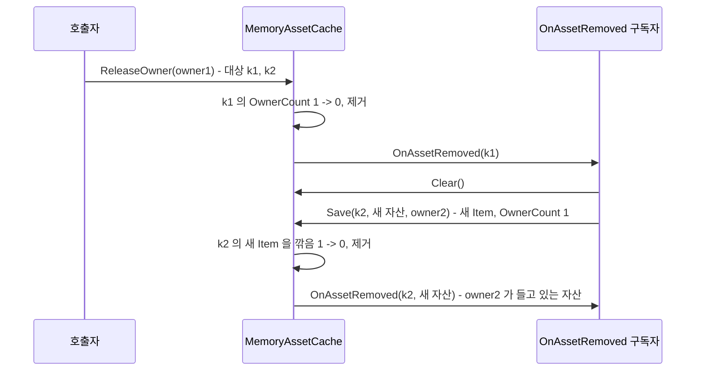

# HResource 캐시 소유자 수 전환과 ReleaseOwner 재진입 수정
---

> 대상 : `HResource` 모듈 (`Runtime/Cache`, `Editor/Subscription`, `docs`)
> 날짜 : 2026-09-23
> 커밋 범위 : `b5f15cd..fc46d0a` (12건)

## 요약
---

- `MemoryAssetCache` 의 key 별 소유자 집합(`Item.Owners`)을 소유자 수(`Item.OwnerCount`)로 줄였습니다. 소유자 목록은 `ownerTable` 한 곳에만 둡니다.
- 에디터 진단 캡처를 key 기준(`CaptureOccupancy`)과 소유자 기준(`CaptureHoldings`) 두 방향으로 나눴습니다.
- Owner Watcher 창은 `OnGUI` 마다 캡처하던 동작을 없애고, 툴바 `Scan` 을 누를 때 활성 탭 방향만 캡처합니다.
- 전환 직후 검수에서 `ReleaseOwner` 재진입 회귀 1건을 찾아 수정했습니다. 수정본은 재진입 시나리오 16건에서 불변식 위반 0건이고, 재진입이 없는 호출 60000회에서 전환 전 구현과 결과가 같습니다.

## 1. 배경
---

### 1-1. 같은 관계를 두 구조가 들고 있었습니다

| 구조                                              | 답하는 질문                      | 빌드에서 읽는 곳                     |
| ------------------------------------------------- | -------------------------------- | ------------------------------------ |
| `Item.Owners` (`HashSet<AssetOwnerId>`)           | 이 key 를 누가 잡고 있는가       | `Owners.Count` (제거 판정)           |
| `ownerTable` (`Dictionary<AssetOwnerId, HashSet<TKey>>`) | 이 소유자가 무엇을 잡고 있는가 | `ReleaseOwner` (일괄 해제)           |

- 빌드에서 `Item.Owners` 는 개수만 쓰였습니다. 소유자 목록 자체는 에디터 진단(`CaptureOccupancy`)만 읽었습니다.
- 소유는 유무 관계(09-05 결정)라서, 같은 소유자의 중복 판정은 `ownerTable` 의 `HashSet<TKey>` 로도 할 수 있습니다.

### 1-2. 진단 창이 매 `OnGUI` 마다 전체를 캡처했습니다

- `AssetOwnerIdWatcherWindow.OnGUI` 첫 줄이 `_RefreshOccupancy` 였습니다.
- `OnGUI` 는 리페인트 한 번에 Layout 과 Repaint 두 번, 입력마다 추가로 호출됩니다. 0.25초 리페인트 기준으로 초당 8회 이상 전체 캡처와 할당이 일어났습니다.

## 2. 변경 내용
---

### 2-1. 선언부 정정 (`e2e67e5`)

- 메인 테이블 이름을 `table` 에서 `assetTable` 로 바꿨습니다.
- `TAsset` 에 `where TAsset : class` 를 걸었습니다. 캐시가 드는 것은 Addressables 와 Resources 에서 받은 리소스라 참조 타입입니다.
- 제약은 구현체에만 걸었습니다. `IAssetCache` 계약에 걸면 계약을 쓰는 제네릭 전부로 전파됩니다.
- 생성 지점은 `AssetProviderFactory` 한 곳이고, 그쪽 `TAsset` 은 `UnityEngine.Object` 제약이라 호환됩니다.

```csharp
public sealed class MemoryAssetCache<TKey, TAsset> : IAssetCache<TKey, TAsset>
#if UNITY_EDITOR
    , IAssetCacheDiagnostics
#endif
    where TAsset : class {
```

- 기반 목록의 첫 항목(`IAssetCache`)은 `#if` 밖에 둡니다. 가드 안의 항목이 첫 번째가 되면 `UNITY_EDITOR` 가 없는 빌드에서 `:` 만 남아 컴파일되지 않습니다.

### 2-2. `Item.Owners` 를 `OwnerCount` 로 축소 (`395c184`)

| 연산            | 전환 전                                   | 전환 후                                              |
| --------------- | ----------------------------------------- | ---------------------------------------------------- |
| `Save` 중복 판정 | `item.Owners.Add(ownerId)`                | `_RegisterOwnerKey` 가 `keys.Add(key)` 결과를 반환   |
| `Release`       | `item.Owners.Remove(ownerId)`             | `_UnregisterOwnerKey` 결과로 판정 후 `OwnerCount--`  |
| 제거 조건       | `Owners.Count == 0`                       | `OwnerCount == 0`                                    |
| `ReleaseOwner`  | key 마다 `Owners.Remove` 확인 후 제거     | 2-5 참조                                             |

- 불변식은 "`OwnerCount` == 그 key 를 담은 `ownerTable` 집합 수" 입니다.
- key 마다 들고 있던 `HashSet<AssetOwnerId>` 가 `int` 하나로 줄었습니다. 신규 key 저장 시 `HashSet` 할당이 없어집니다.
- 공개 API 와 반환값 의미는 바뀌지 않았습니다.

### 2-3. 진단 캡처 두 방향 (`eb6cf90`, `5d721a6`, `1f2b53a`)

| 메서드                     | 방향       | 만드는 방법                     | 소비처 (Owner Watcher) |
| -------------------------- | ---------- | ------------------------------- | ---------------------- |
| `CaptureHoldings(buffer)`  | 소유자 기준 | `ownerTable` 을 그대로 옮김      | Owner Tracker 탭       |
| `CaptureOccupancy(buffer)` | key 기준   | `ownerTable` 을 뒤집음           | Resource Ownership 탭  |

- 소유자 기준 스냅샷 `AssetHoldingSnapshot` 을 추가했습니다 (에디터 전용).
- key 기준 스냅샷의 `TotalCount` 는 캐시의 `OwnerCount`, `Owners` 는 뒤집은 목록입니다. 두 값의 수가 다르면 두 인덱스가 어긋난 것이므로 교차 검증 값으로 쓸 수 있습니다.
- 09-04 의 "스냅샷 모양은 key 중심 하나" 결정을 바꾼 것입니다. 해당 파일 Dev Log 에 기록했습니다.

### 2-4. Owner Watcher 의 Scan 전환 (`d05d7be`)

- 툴바 `Scan` 이 활성 탭 방향만 캡처합니다.
- 버튼은 요청만 표시하고, 캡처는 다음 Layout 패스 선두(`_RunPendingScans`)에서 실행합니다. 그리는 도중 행 수가 바뀌면 IMGUI 레이아웃이 어긋나기 때문입니다.
- 캡처가 끝나면 캐시 참조 목록을 비웁니다. 레지스트리는 캐시를 약한 참조로 들고, 누수 보고기(`AssetCacheLeakReporter`)는 플레이 종료 시 `GC.Collect` 뒤 살아 있는 캐시를 셉니다. 창이 강한 참조를 들고 있으면 그 캐시가 누수로 집계됩니다.
- Resource Ownership 탭의 `ORPHAN` 표시는 레지스트리 기록 유무로 직접 판정합니다. Owner Tracker 의 Scan 여부와 무관합니다.
- 플레이 모드 진입과 종료 때 스냅샷을 비우고, 상태 줄에 Scan 경과 시간을 표시합니다.
- 0.25초 리페인트는 소유자 생사 표시용으로 남았습니다.
- 09-04 의 "Refresh 버튼 제거" 결정을 되돌린 변경입니다. 당시 문제였던 "반영이 안 되는 것으로 오해" 는 경과 시간 표시로 대신 막습니다.

### 2-5. `ReleaseOwner` 재진입 수정 (`3471861`)

- 3장 검수에서 발견한 회귀의 수정입니다.
- 루프 전에 key 마다 그때의 `Item` 을 기억하고, 루프에서 key 가 여전히 같은 `Item` 을 가리킬 때만 `OwnerCount` 를 내립니다.

```csharp
var releaseItems = new List<KeyValuePair<TKey, Item>>(keys.Count);
foreach (var key in keys) {
    if (assetTable.TryGetValue(key, out var item)) releaseItems.Add(new KeyValuePair<TKey, Item>(key, item));
}
int releasedCount = 0;

ownerTable.Remove(ownerId);

foreach (var pair in releaseItems) {
    if (!assetTable.TryGetValue(pair.Key, out var item) || !ReferenceEquals(item, pair.Value)) continue;
    if (ReferenceEquals(item.Asset, null)) continue;
    item.OwnerCount--;
    releasedCount++;
    _TryRemoveItem(pair.Key, item);
}
```

- `Item` 은 `Save` 안에서만 새로 만들어지므로, 같은 key 가 다른 `Item` 을 가리키면 그 `Item` 에는 이 소유자의 떼어낸 몫이 없습니다.

## 3. 검수
---

### 3-1. 방법

| 수단                 | 내용                                                                                          |
| -------------------- | --------------------------------------------------------------------------------------------- |
| 단독 컴파일          | Unity 번들 Roslyn 으로 `HCUP.HResource` (에디터 정의, 플레이어 정의) 와 `HCUP.HResource.Editor` |
| 불변식 하네스        | 실제 `MemoryAssetCache.cs` 소스를 콘솔 앱으로 컴파일. `HLogger` 와 레지스트리만 스텁            |
| 시나리오 비교        | 같은 재진입 시나리오를 전환 전(`b5f15cd`) 소스와 전환 후 소스에 각각 실행                        |
| 독립 재검증          | 별도 에이전트가 시나리오 16건과 무작위 차등 테스트(seed 300 x 200 step)를 직접 작성해 실행       |

- 재진입 시나리오는 `OnAssetRemoved` 구독자가 알림 도중 캐시를 다시 호출하는 경우입니다. `_ClearItems` 가 재진입 `Save` 를 전제로 방어하고 있어, 이 클래스의 계약 범위로 봤습니다.

### 3-2. 발견한 회귀 (S1)



- 2-2 전환 직후의 `ReleaseOwner` 는 떼어낸 key 목록에 있는 key 면 소유 여부를 다시 묻지 않고 수를 내렸습니다.
- 그 결과 owner2 가 방금 잡은 자산에 제거 알림이 발생했습니다. `AssetProvider` 는 이 알림을 받으면 해당 key 의 로더 핸들을 반납합니다.
- `ownerTable` 에는 `owner2 -> k2` 가 남고 `assetTable` 에는 k2 가 없는 상태가 됐습니다.
- 전환 전 구현은 `item.Owners.Remove(owner1)` 가 실패하면 건너뛰었으므로 이 경우를 올바르게 처리했습니다.

### 3-3. 시나리오별 결과

| 시나리오 | 알림 도중 구독자의 호출                    | 전환 전                         | 전환 직후                        | 수정본                  |
| -------- | ------------------------------------------ | ------------------------------- | -------------------------------- | ----------------------- |
| S1       | `Clear` 후 owner2 가 k2 재저장             | k2{2}                           | 비어 있음, 불변식 위반, 가짜 알림 | k2{2}                   |
| S2       | owner1 이 같은 자산으로 k2 재저장          | 비어 있음 (`Save` true 후 소실) | k2{1}                            | k2{1}                   |
| S3       | `Clear` 후 owner1 이 k2 재저장             | 불변식 위반, 가짜 알림          | 불변식 위반, 가짜 알림            | k2{1}                   |
| S10      | `Clear` 후 owner2, owner1 이 k2 재저장     | 불변식 위반                     | 불변식 위반                       | k2{1,2}                 |
| S16      | key 3개, `Clear` 후 k2(owner1), k3(owner2) | 일부 불변식 위반                | k2, k3 모두 제거, 불변식 위반     | k2{1}, k3{2}            |

- 표기 `k2{1,2}` 는 k2 가 남아 있고 owner1, owner2 가 잡고 있다는 뜻입니다.
- S3, S10, S16 은 전환 전 구현에서도 깨지던 경로입니다. 수정본에서 함께 일관된 결과가 됩니다.
- 수정본은 시나리오 16건 전부에서 불변식 위반이 0건입니다.

### 3-4. 재진입이 없는 호출

- 무작위 `Save` / `Release` / `ReleaseOwner` / `TryGet` / `ReleaseAll` / `Clear` 60000회 (무효 소유자, null 자산, 다른 자산 포함)를 전환 전, 전환 직후, 수정본에 실행했습니다.
- 반환값, 경고와 에러 문구, 알림 순서, 최종 상태가 세 구현에서 바이트 단위로 같습니다.

### 3-5. 검증 반복 기록

| 회차 | 대상                     | 결과                                                                                  |
| ---- | ------------------------ | ------------------------------------------------------------------------------------- |
| 1    | 전환 직후 코드, 주장 6건 | S1 회귀 확인. 피해 범위(가짜 알림, 반환값)와 옛 구현의 결함 범위(S10)가 추가로 보고됨  |
| 2    | 수정 적용본              | 16건 위반 0, 60000회 동일. Dev Log 서술 2곳이 불완전                                   |
| 3    | Dev Log 문장             | 단건 `Release` 반환값 서술이 S12 에서 어긋남                                           |
| 4    | Dev Log 문장             | 일시적 과다 계수 서술의 범위가 넓음                                                    |
| 5    | Dev Log 항목 전체        | 틀린 문장 없음                                                                         |

## 4. 남은 동작 차이와 한계
---

### 4-1. `ReleaseOwner` 도중의 같은 소유자 단건 `Release`

| 경우                          | 단건 `Release` 결과            | 바깥 `ReleaseOwner` 반환값 (전환 전 / 수정본) |
| ----------------------------- | ------------------------------ | --------------------------------------------- |
| 다시 저장하지 않은 key (S4)   | false, "Unpaired release" 경고 | 1 / 2                                         |
| 같은 `Item` 에 재저장 (S7)    | false, 경고 없음               | 1 / 2                                         |
| `Clear` 뒤 새 `Item` (S12)    | true                           | 1 / 1                                         |

- 세 경우 모두 최종 상태는 전환 전과 같습니다.
- 원인은 `ReleaseOwner` 가 소유자 집합을 루프 전에 통째로 떼는 것입니다.
- key 별로 떼면 S4 경고는 사라지지만, S2 의 "`Save` 가 true 를 받고도 자산을 잃는" 결함이 돌아옵니다 (검증용 사본으로 확인).
- 떼어낸 몫을 소유자별 pending 스택에 두고 단건 `Release` 가 거기서 꺼내면 두 문제가 모두 해결되는 것을 검증용 사본으로 확인했습니다. 필드와 분기가 늘어 적용하지 않았습니다.

### 4-2. 도달 가능성

- 현재 저장소에서 `OnAssetRemoved` 구독자는 `AssetProvider` 하나이고, 그 처리(`_ReleaseTrackedLoader`)는 캐시를 다시 호출하지 않습니다. 3장의 재진입 시나리오는 현재 코드 경로에서 발생하지 않습니다.
- 외부 경로는 있습니다. `MemoryAssetCache` 와 `AssetProvider` 의 생성자는 공개이고 `IAssetReleasableLoader` 도 공개라, 사용자 코드가 캐시를 직접 구독하거나 로더의 `Release` 에서 provider 를 다시 호출할 수 있습니다.

### 4-3. 확인하지 않은 항목

- Owner Watcher 창의 실제 동작(`Scan` 버튼, Layout 패스 캡처, 플레이 모드 전환 시 초기화)은 에디터에서 실행하지 않았습니다. 컴파일만 확인했습니다.
- `ReleaseOwner` 루프 도중의 일시 상태(같은 `Item` 재저장 시 `OwnerCount` 가 잠시 서로 다른 소유자 수보다 큰 상태)는 루프 종료 후 값으로 추론한 것이며 루프 중간 값을 직접 기록하지 않았습니다.

## 5. 커밋 목록
---

| 커밋      | 종류     | 내용                                                           |
| --------- | -------- | -------------------------------------------------------------- |
| `e2e67e5` | Refact   | `assetTable` 개명, `TAsset : class` 제약                        |
| `eb6cf90` | Feat     | `AssetHoldingSnapshot` 추가                                    |
| `395c184` | Refact   | `Item.OwnerCount` 전환, `ownerTable` 을 점유의 정본으로          |
| `5d721a6` | Feat     | `IAssetCacheDiagnostics.CaptureHoldings` 추가                  |
| `1f2b53a` | Docs     | `AssetOccupancySnapshot` 설명 갱신                             |
| `3471861` | Fix      | `ReleaseOwner` 가 재생성된 `Item` 을 깎지 않도록 수정            |
| `d05d7be` | Feat     | Owner Watcher 의 탭별 `Scan`                                   |
| `3c5f73f` | Docs     | Editor README                                                  |
| `827348f` | Docs     | `docs/Cache.md`                                                |
| `60a6694` | Docs     | `docs/Provider.md`                                             |
| `5b794e6` | Docs     | `docs/Subscription.md`                                         |
| `fc46d0a` | Docs     | Runtime README 행 참조                                         |
