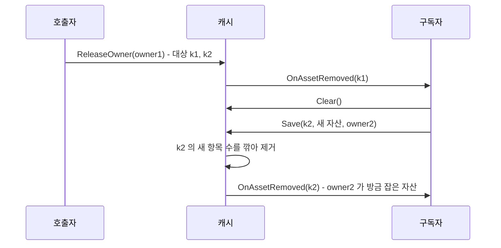

# 개인 패키지 에셋 핸들링 이슈 확인 및 변경 로그

> Unity / 에셋 관리 / 캐시 설계
> C# (Unity 6, Addressables 와 Resources 를 함께 쓰는 개인 유틸 패키지)

에셋 캐시에 인덱스가 두 개 있었다. "이 key 를 누가 잡고 있나" 와 "이 소유자가 무엇을 잡고 있나". 에디터 진단 창이 둘 다 쓰니 둘 다 필요해 보였다. 그런데 빌드 런타임만 놓고 보면 둘 다 필요한가? 이 질문에서 시작해 구조를 줄였고, 줄인 직후 검수에서 회귀 하나를 찾았다. 이어서 이 시스템이 몇 개의 요청까지 버티는지 벤치마크로 재고, 그 결과에서 나온 개선 계획까지 정리한다.

---

## 1. 캐시가 하는 일

에셋 로딩은 세 층으로 나뉜다. 호출자는 Provider 에게 에셋을 요청하고, Provider 는 Addressables 나 Resources 로더로 에셋을 읽은 뒤 캐시에 저장한다. 캐시는 **누가 이 에셋을 쓰고 있는지**를 기록하고, 마지막 사용자가 반납하면 항목을 지우면서 `OnAssetRemoved` 이벤트를 쏜다. Provider 는 그 이벤트를 받아 로더 핸들을 반납한다.

핵심은 "소유자" 개념이다. 같은 에셋을 여러 오브젝트가 쓰면, 한 오브젝트가 반납해도 다른 오브젝트가 남아 있는 동안은 에셋이 살아 있어야 한다. 그래서 캐시는 점유를 소유자 단위로 기록한다. 소유는 횟수가 아니라 유무다. 같은 소유자가 같은 에셋을 두 번 요청해도 한 번 반납하면 끝난다.

바꾸기 전 구조는 이랬다.

```csharp
sealed class Item {
    public TAsset Asset;
    public HashSet<AssetOwnerId> Owners = new();   // 이 key 를 잡은 소유자
}

readonly Dictionary<TKey, Item> table = new();                        // key -> 항목
readonly Dictionary<AssetOwnerId, HashSet<TKey>> ownerTable = new();  // 소유자 -> 잡은 key
```

같은 관계를 양쪽 방향에서 들고 있는 양방향 인덱스다.

---

## 2. 두 인덱스는 같은 정보다

빌드에서 각 구조가 실제로 무엇에 쓰이는지 추적했다.

| 연산 | 필요한 질문 | `Item.Owners` 로 | `ownerTable` 로 |
|---|---|---|---|
| 저장 시 중복 판정 | 이 소유자가 이미 잡았나 | `Owners.Add` | `ownerTable[owner].Add(key)` |
| 단건 반납 | 이 소유자의 점유를 뺄 수 있나 | `Owners.Remove` | `ownerTable[owner].Remove(key)` |
| 제거 판정 | 남은 소유자가 있나 | `Owners.Count` | 모든 소유자를 훑어야 함 |
| 소유자 일괄 반납 | 이 소유자가 잡은 key 는 | 모든 key 를 훑어야 함 | 그 소유자의 집합만 |

한쪽만 남기면 마지막 두 줄 중 하나가 전체 순회가 된다. 여기까지 보면 둘 다 필요해 보인다.

하지만 제거 판정 줄을 다시 보면, 필요한 것은 **소유자 목록이 아니라 소유자 수**다. 빌드에서 `Item.Owners` 는 `Count` 로만 읽혔고, 목록 자체를 읽는 곳은 에디터 진단 창뿐이었다. 양방향 인덱스처럼 보이지만, 실제로는 한쪽은 숫자 하나면 충분한 구조였다.

그래서 이렇게 바꿨다.

- `Item.Owners` 를 `int OwnerCount` 로 줄인다.
- 중복 판정은 `ownerTable` 의 `HashSet<TKey>` 가 맡는다. 소유가 유무이므로 가능하다.
- 누가 무엇을 잡았는지는 `ownerTable` 한 곳에만 둔다. 에디터가 key 기준 목록이 필요하면 `ownerTable` 을 뒤집어 만든다.

이렇게 하면 모든 연산이 전체 순회 없이 끝나고, key 마다 들던 `HashSet` 이 사라진다. 이 경우 제거 판정에 쓰는 수와 소유자 목록의 출처가 달라지므로, 둘 사이의 불변식을 지켜야 한다. **`OwnerCount` 는 그 key 를 담은 `ownerTable` 집합 수와 같아야 한다.**

---

## 3. 변경 로그

### 3.1 제네릭 제약과 `#if` 가드 순서

캐시가 드는 것은 전부 Addressables 나 Resources 에서 받은 리소스라 참조 타입이다. 그래서 `where TAsset : class` 를 걸었다. 이 과정에서 선언부가 한 번 깨졌다.

```csharp
// 깨진 형태 : 빌드에서 ':' 뒤가 비어 문법 오류
public sealed class MemoryAssetCache<TKey, TAsset> :
#if UNITY_EDITOR
     IAssetCacheDiagnostics
#endif
     where TAsset : class, IAssetCache<TKey, TAsset> {

// 고친 형태
public sealed class MemoryAssetCache<TKey, TAsset> : IAssetCache<TKey, TAsset>
#if UNITY_EDITOR
    , IAssetCacheDiagnostics
#endif
    where TAsset : class {
```

기반 목록의 일부만 `#if` 로 감쌀 때는 **첫 항목을 가드 밖에 둬야 한다.** 가드 안의 항목이 첫 번째면 심볼이 없는 빌드에서 `:` 만 남는다. 이 오류는 에디터 컴파일로는 드러나지 않을 수 있어서, `UNITY_EDITOR` 를 뺀 정의로 한 번 더 컴파일해 확인했다. 제약은 구현체에만 걸었다. 인터페이스 계약에 걸면 그 계약을 쓰는 제네릭 전부로 제약이 번진다.

### 3.2 소유자 집합을 소유자 수로

```csharp
sealed class Item {
    public TAsset Asset;
    public int OwnerCount;   // 서로 다른 소유자 수. 획득 횟수가 아니다
}

void _AddOwnerDependency(Item item, AssetOwnerId ownerId, TKey key) {
    if (!_RegisterOwnerKey(ownerId, key)) return;   // 이미 잡고 있으면 아무 일도 없다
    item.OwnerCount++;
}
```

단건 반납도 같은 모양이다. `ownerTable` 에서 떼는 데 성공했을 때만 수를 내린다. 공개 API 와 반환값의 의미는 그대로 두었다.

### 3.3 진단 캡처는 누를 때만

에디터 진단 창은 `OnGUI` 첫 줄에서 모든 캐시의 점유를 캡처하고 있었다. `OnGUI` 는 리페인트 한 번에 Layout 과 Repaint 로 두 번 불리고, 마우스 입력마다 또 불린다. 창이 0.25초마다 스스로 다시 그리도록 되어 있어서, 창을 열어 두면 초당 8회 이상 전체 캡처와 할당이 돌았다. 구조를 바꾼 뒤로는 key 기준 목록을 만들 때 역인덱스를 뒤집는 비용까지 더해진다.

그래서 캡처를 탭별 `Scan` 버튼으로 옮겼다. 두 가지를 같이 챙겼다.

- **캡처 시점을 Layout 패스 선두로 미룬다.** 버튼 클릭은 그리는 도중에 처리되는데, 거기서 행 수가 바뀌면 IMGUI 레이아웃이 어긋난다. 버튼은 요청만 표시하고, 실제 캡처는 다음 Layout 이벤트 맨 앞에서 한다.
- **캡처가 끝나면 캐시 참조를 버린다.** 진단 레지스트리는 캐시를 약한 참조로 든다. 누수 보고기는 플레이가 끝날 때 GC 를 돌리고 나서 살아 있는 캐시를 누수 후보로 센다. 진단 창이 결과를 보존하려고 캐시를 필드에 들고 있으면, 그 캐시가 누수로 보고된다. 누수를 잡으려고 만든 도구가 누수 보고를 오염시키는 셈이다.

---

## 4. 검수에서 나온 회귀

구조를 바꾼 뒤 "메모리 캐싱에 영향이 없는가" 를 따로 검수했다. 걸린 곳은 소유자 일괄 반납(`ReleaseOwner`)이었다.

바꾼 직후의 `ReleaseOwner` 는 소유자의 key 집합을 떼어낸 뒤, 그 목록의 key 마다 소유 여부를 다시 묻지 않고 수를 내렸다. "떼어낸 목록이 곧 이 소유자의 점유다" 라는 가정이었다. 이 가정은 **루프 도중 캐시가 바뀌면** 깨진다. 캐시는 항목을 지울 때마다 `OnAssetRemoved` 를 동기로 쏘고, 구독자는 그 안에서 캐시를 다시 호출할 수 있다. 실제로 이 캐시의 `Clear` 는 "알림 도중 재저장하는 구독자" 를 전제로 방어 코드를 갖고 있다.



결과는 두 가지였다.

- owner2 가 방금 잡은 자산에 **가짜 제거 알림**이 나간다. Provider 는 이 알림을 받으면 로더 핸들을 반납하므로, 살아 있는 소유자의 에셋이 내려간다.
- `ownerTable` 에는 `owner2 -> k2` 가 남는데 캐시 항목은 없다. 불변식이 깨진다.

바꾸기 전 코드는 이 경우를 우연히 막고 있었다. `item.Owners.Remove(owner1)` 가 실패하면 건너뛰었는데, 새로 만들어진 항목에는 owner1 이 없으니 그 검사가 **항목 동일성 검사 역할**을 하고 있었던 것이다. 구조를 줄이면서 그 검사가 함께 사라졌다.

수정은 그 역할을 명시적으로 되살리는 것이다. 떼어낼 때 key 마다 그때의 항목을 기억하고, 루프에서 key 가 여전히 같은 항목을 가리킬 때만 수를 내린다.

```csharp
// ReleaseOwner 요약
var releaseItems = new List<KeyValuePair<TKey, Item>>(keys.Count);
foreach (var key in keys) {
    if (assetTable.TryGetValue(key, out var item)) releaseItems.Add(new KeyValuePair<TKey, Item>(key, item));
}

ownerTable.Remove(ownerId);

foreach (var pair in releaseItems) {
    if (!assetTable.TryGetValue(pair.Key, out var item) || !ReferenceEquals(item, pair.Value)) continue;
    item.OwnerCount--;
    _TryRemoveItem(pair.Key, item);
}
```

항목은 저장할 때만 새로 만들어지므로, 같은 key 가 다른 항목을 가리키면 그 항목에는 이 소유자가 떼어낸 몫이 없다.

| 알림 도중 구독자가 한 일 | 바꾸기 전 | 바꾼 직후 | 수정 후 |
|---|---|---|---|
| `Clear` 후 다른 소유자가 재저장 | 정상 | 가짜 알림, 불변식 위반 | 정상 |
| 같은 소유자가 같은 자산 재저장 | `Save` 성공 후 자산 소실 | 정상 | 정상 |
| `Clear` 후 같은 소유자가 재저장 | 가짜 알림, 불변식 위반 | 가짜 알림, 불변식 위반 | 정상 |

두 번째와 세 번째 줄은 **바꾸기 전 코드에도 있던 결함**이다. 회귀를 고치다 보니 원래 있던 결함 두 개가 함께 정리됐다.

---

## 5. 어떻게 검증했나

이 패키지에는 테스트 어셈블리가 없다. 그래서 검증 수단을 따로 만들었다.

- **캐시 소스를 그대로 콘솔 앱으로 컴파일했다.** Unity 에 의존하는 로거와 진단 레지스트리 두 개만 스텁으로 바꿨다. 에디터 없이 수 초 만에 돌아간다.
- **같은 시나리오를 바꾸기 전 소스와 바꾼 뒤 소스에 각각 돌렸다.** 회귀인지 원래 결함인지는 이렇게 비교해야 가려진다.
- **독립 리뷰 에이전트에게 내 주장을 재검증하게 했다.** 에이전트는 재진입 시나리오 16개와 무작위 호출 60000회 차등 테스트를 직접 만들어 돌렸다. 재진입이 없는 호출에서는 바꾸기 전, 바꾼 직후, 수정 후 세 구현의 반환값, 경고 문구, 알림 순서, 최종 상태가 바이트 단위로 같았다.

검증은 다섯 번 돌았다. 1차에서 회귀가 나왔고, 2차에서 수정본을 확인했다. 3차부터 5차는 **코드가 아니라 변경 기록 문장**을 고친 회차다. "단건 반납은 false 를 받는다" 처럼 한 경우에서 본 사실을 모든 경우로 일반화한 문장이 3차에서 두 개, 4차에서 한 개 걸렸다. 코드는 맞는데 기록이 틀리면, 다음에 그 기록을 믿고 고치는 사람이 틀린다.

---

## 6. 한계를 재다

구조를 바꿨으면 얼마나 버티는지도 알아야 한다. "몇 개의 오브젝트가 한 프레임에 에셋을 요청하면 프레임 예산을 넘는가" 를 재기 위해 PlayMode 테스트로 벤치마크를 만들었다. 테스트 코드를 모두 지운 패키지였지만 측정 도구만 예외로 남겼다. 같은 코드가 에디터와 개발 빌드 플레이어에서 돈다.

### 6.1 무엇을 쟀나

| 시나리오 | 하는 일 |
|---|---|
| 첫 요청 버스트 | 새 오브젝트 N 개가 한 프레임에 같은 key 를 요청한다. 파괴 감지 컴포넌트 부착이 포함된다 |
| 반복 요청 | 같은 소유자가 다시 요청한다. 캐시 히트 경로다 |
| 동시 파괴 | N 개를 한 프레임에 파괴한다. 자동 회수 연쇄가 돈다 |
| 다중 key | 오브젝트 하나가 서로 다른 key M 개를 한 프레임에 처음 로드한다 |

핵심 지표는 **요청을 거는 동기 구간의 시간**이다. 로드 자체는 비동기라 여러 프레임에 흩어지지만, 요청을 거는 순간의 비용은 그 프레임에 그대로 얹힌다. 판정 기준은 60fps 의 16.7ms 이고, fps 와 리소스 크기는 설정 에셋에서 바꿀 수 있게 했다. 크기별 더미 에셋은 무작위 바이트로 만들었다. 0 으로 채우면 번들 압축이 크기를 지워 버린다.

### 6.2 측정에서 밟은 함정

첫 측정 결과는 그대로 믿을 수 없었다. 숫자가 이상한 곳마다 측정 방법이 원인이었다.

- **에디터의 완료 시간이 모든 경우에 약 100ms 였다.** Addressables 의 "Use Asset Database" 모드는 로드마다 0.1초의 인위 지연을 넣는다. 에디터 완료 시간은 로드 비용이 아니었다.
- **요청당 할당이 전부 0 으로 나왔다.** `GC.GetAllocatedBytesForCurrentThread` 는 Unity Mono 플레이어에서 항상 0 을 돌려준다. `ProfilerRecorder` 의 "GC Allocated In Frame" 으로 바꿨다.
- **1 만 개 요청의 GC 가 78KB 였다.** 레코더를 요청 루프 뒤에 시작해서 그 프레임 할당의 대부분이 빠졌다. 루프 앞으로 옮기자 요청 수에 정확히 비례하는 값이 나왔다.
- **두 번째 플레이어 실행이 로그 없이 종료 코드 1 로 끝났다.** 에디터와 연결되지 않은 테스트 플레이어는 끝나도 종료하지 않았고, 프로젝트가 단일 인스턴스 설정이라 다음 실행이 막혔다.

### 6.3 결과

플레이어 기준이다(개발 빌드, Mono, Ryzen 7 7700). 단위당 비용은 1,000 개와 5,000 개 결과의 기울기이고, 한계는 그 기울기를 16.7ms 로 환산한 값이다.

| 시나리오 | 에디터 단위당 | 플레이어 단위당 | 플레이어 한계 |
|---|---|---|---|
| 첫 요청 | 17us | 4.5~5.2us | 약 3,300~3,700 개/프레임 |
| 반복 요청 | 3.4us | 1.4~1.5us | 약 11,000 개/프레임 |
| 동시 파괴 | 4.5~4.9us | 2.4~3.6us | 약 4,600~6,900 개/프레임 |
| 다중 key 첫 로드 | 대표성 없음 | 100~130us | 약 130~160 key/프레임 |

같은 기계에서 다른 Unity 에디터가 함께 떠 있었고, 플레이어 재실행 사이에 편차가 있었다. 그래서 한계는 범위로 적었다.

### 6.4 숫자를 읽는 법

- **병목은 오브젝트 수가 아니라 새 key 로드다.** 오브젝트 100 개가 같은 key 를 처음 요청하면 0.6ms 인데, 오브젝트 하나가 서로 다른 key 100 개를 요청하면 10~13ms 다. 그런데 Addressables 를 직접 부르는 기준선을 재 보니, **그 대부분은 Addressables 자신의 비용**이었다.

| 단위당 (플레이어, 개발 빌드) | Addressables 직접 | 이 패키지 | 패키지 몫 |
|---|---|---|---|
| 같은 key 를 N 번 요청 | 1.1~1.3us | 3.9~4.6us | 약 2.8~3.4us (소유자 등록과 파괴 감지 부착) |
| 서로 다른 key 첫 로드 | 60~73us | 84~101us | 약 11~40us |
| 서로 다른 key 반납 | 2.1us | 2.3us | 거의 같음 |
- **에디터가 1.5~3.5 배 비싸다.** 에디터 전용 감시 도구가 소유자 신원이 발급될 때마다 이름 문자열을 여러 개 만들고, 요청당 약 1KB 를 더 할당한다. 한계 판단은 플레이어 수치로 해야 한다.
- **리소스 크기는 동기 비용을 바꾸지 않는다.** 1KB 와 4MB 의 요청 비용이 같다. 크기는 비동기 완료 시간에만 나타난다.
- **캐시 히트인데 요청마다 768B 가 할당됐다.** 처음에는 설계 결함으로 봤다. 분석해 보니 대부분은 개발 빌드가 디버그 코드 생성으로 컴파일된 탓이었다. 디버그 코드 생성에서는 async 메서드의 상태 기계가 class 가 되어, 모두 동기로 끝나도 호출마다 힙에 올라간다. 보고서에 어셈블리의 코드 생성 모드를 기록하게 해 보니, **스크립트 디버깅을 꺼도 개발 빌드는 디버그 코드 생성**이었다.

| 할당 지점 | 요청당 크기 | 릴리스 코드 생성 |
|---|---|---|
| async 상태 기계 4 개 (class) | 약 592B | 0B (struct) |
| 게이트에 넘기는 람다의 클로저와 델리게이트 | 약 168B | 그대로 남음 |
| 벤치 자신의 배열 원소 | 32B | 그대로 남음 |

패키지 소스를 콘솔로 옮겨 두 런타임과 두 코드 생성 모드로 재 보니, 합계 모델이 실측과 3% 안에서 맞았다. 릴리스 코드 생성이라면 요청당 약 200B 로 추정한다. 이 추정은 **확정하지 못했다.** 비개발 빌드에서는 GC 레코더가 값을 주지 않았다. 시간은 잴 수 있었고, 릴리스 코드 생성이 디버그보다 약 15% 빨랐다(1.19us 에서 1.01us).

---

## 7. 개선과 결과

벤치마크가 준 것은 "빠르다, 느리다" 판정보다 **비용이 어디에 있는지의 지도**다. 그 지도를 기준으로 개선안 다섯 개를 세우고 넷을 적용했다.

| 개선 | 상태 | 이유 |
|---|---|---|
| 캐시 히트 빠른 경로 | 적용 | 가장 자주 도는 경로의 비용이 가장 컸다 |
| Addressables 기준선 측정 | 적용 | 새 key 비용의 책임을 나누기 위해 |
| 소유 단위 지침 | 문서화 | 강제가 아니라 권장이다 |
| 감시 도구의 가벼운 기록 | 적용 | 에디터 비용이 플레이어의 3.5 배였다 |
| 게이트 람다 제거 | **보류** | 빠른 경로가 히트를 가져가면 남는 이득이 작다 |

### 7.1 캐시 히트 빠른 경로

캐시에 이미 있는 key 도 로드와 같은 파이프라인을 탔다. 동시 로드를 합치는 게이트에 들어가고, async 메서드 네 단계를 지났다. 게이트가 존재하는 이유는 **로더 호출을 한 번으로 합쳐 Addressables 참조 수를 1 로 고정하는 것**이다. 그런데 캐시 조회 자체가 게이트 안에 있어야 한다는 근거는 코드에도 문서에도 없었다.

그래서 요청 입구에 "CacheFirst 이고, 소유자가 살아 있고, 캐시에 있고, 에셋이 유효하고, 등록에 성공하면" 동기로 돌려주는 경로를 넣었다. 조건 하나라도 어긋나면 기존 경로로 넘겨서, 기존 로그와 롤백을 그대로 쓴다.

```csharp
// 요청 입구 (async 가 아닌 메서드)
if (_TryAcquireCached(request, liveToken, out TAsset cached)) return UniTask.FromResult(cached);
return _GetAsync(request, liveToken);
```

빠른 경로를 async 메서드 안에 두면 안 된다. 진입만으로 클로저와 상태 기계가 먼저 만들어진다. 문서의 "게이트 우회 경로 0 건" 은 "로더 호출은 반드시 게이트를 지난다" 로 고쳐 썼다.

적용 전후로 같은 재진입, 경합 시나리오 7 개를 돌렸다. 6 개는 결과가 같았다. 달라진 하나는 **이전 코드의 잠복 결함**이었다. 같은 key 에 다른 로드 모드(SourceOnly)가 진행 중일 때 CacheFirst 요청이 오면, 이전 코드는 그 로드에 합류해 다른 에셋을 받고, 캐시가 거부하자 **다른 소유자가 쓰고 있던 핸들을 반납**했다. 빠른 경로에서는 캐시본을 즉시 받으므로 이 경로를 타지 않는다.

| 1,000 개 기준 | 전 | 후 |
|---|---|---|
| 반복 요청 시간 (플레이어, 개발 빌드) | 1.19ms | **0.38ms** |
| 반복 요청 시간 (플레이어, 릴리스 빌드) | 1.01ms | **0.38ms** |
| 반복 요청 GC (플레이어, 개발 빌드) | 768B/요청 | **8.5B/요청** (벤치 자신의 몫) |
| 반복 요청 GC (에디터) | 835B/요청 | **32B/요청** (벤치 자신의 몫) |

반복 요청은 약 3 배 빨라졌고, 패키지 몫의 할당은 사실상 0 이 됐다. 60fps 기준 한 프레임의 반복 요청 상한은 약 11,000 개에서 약 44,000 개가 됐다. 첫 요청, 다중 key, 파괴는 예상대로 거의 변하지 않았다. 그 경로들은 빠른 경로를 타지 않는다.

### 7.2 감시 도구의 가벼운 기록

"창이 열려 있을 때만 기록" 은 쉬워 보이지만 쓰면 안 된다. 창이 닫혀 있던 동안 생긴 소유자는 기록이 없어서, 창을 열면 살아 있는 소유자가 누수로 표시되고 강제 정리 버튼이 사용 중인 에셋을 풀어 버린다. 그래서 구독은 그대로 두고 기록만 가볍게 했다. 발급 시점에는 신원, 참조, 타입, 시각만 남기고 이름 문자열은 창이 그릴 때 만든다.

| 에디터, 1,000 개 첫 요청 | 전 | 후 |
|---|---|---|
| 시간 | 17.4ms | **9.6ms** |
| GC | 1,812B/요청 | **1,219B/요청** |

대가는 창이 닫힌 동안 파괴된 소유자의 기록에 오브젝트 이름이 남지 않고 타입 이름만 남는 것이다.

### 7.3 소유 단위

오브젝트 1 만 개가 같은 스프라이트를 각자 요청하면 약 45ms 스파이크와 약 10MB 가 든다. 풀이나 스포너 하나가 소유자가 되면 요청 한 번이다. 가장 쉬운 사용법(`GetAsync(this, ...)`)이 가장 비싼 사용법이라, 사용 문서에 권장 사항으로 적었다. 대가는 수명 규칙이다. 소유자가 사용자보다 먼저 죽으면 쓰던 에셋이 내려간다.

### 7.4 보류한 것: 게이트 람다 제거

요청마다 `() => _GetByFetchModeAsync(request)` 가 요청을 품은 새 함수를 만든다. 함수를 한 번만 만들고 요청은 인자로 넘기면 이 할당이 사라진다. 그러나 빠른 경로가 히트를 가져간 뒤에는 이 람다를 만드는 경로가 캐시 미스와 합류자뿐이다. 캐시 미스는 Addressables 가 키당 약 6KB 를 할당하므로 이 람다 몫은 약 3% 다. 남는 의미 있는 경우는 같은 새 key 를 여러 오브젝트가 한 프레임에 요청하는 스폰 패턴이고, 그 대가는 공개 인터페이스 변경이다. 그런 패턴이 실제로 흔해질 때 다시 본다.

---

## 8. 하지 말아야 할 것

- **떼어낸 목록을 현재 상태로 믿지 않는다.** 루프 전에 뜬 목록은 스냅샷이다. 루프 안에서 동기 이벤트를 쏜다면, 이벤트 뒤의 상태는 스냅샷과 다를 수 있다.
- **구조를 줄일 때 사라지는 검사의 역할을 확인한다.** 지워지는 줄이 "소유 확인" 처럼 보여도, 실제로는 다른 불변식을 지키고 있을 수 있다.
- **에디터 진단 도구가 런타임 객체를 강하게 붙잡지 않게 한다.** 약한 참조로 설계한 레지스트리의 의미가 도구 하나로 무너진다.
- **`OnGUI` 에서 무거운 수집을 하지 않는다.** 호출 빈도가 리페인트 주기보다 높다.
- **기반 목록의 첫 항목을 `#if` 안에 두지 않는다.** 에디터에서는 컴파일되는데 빌드에서만 깨진다.
- **개발 빌드의 GC 수치를 릴리스 수치로 읽지 않는다.** 디버그 코드 생성은 동기로 끝나는 async 메서드까지 힙에 올린다.
- **기준선 없이 비용의 책임을 정하지 않는다.** 패키지가 느린지 그 아래 엔진이 느린지는 직접 호출과 비교해야 나뉜다.
- **진단 도구의 기록에 공백을 만들지 않는다.** 기록이 빠진 대상을 누수로 판정하는 도구는 공백이 곧 오판이다.
- **비동기 테스트에서 예상되는 에러 로그를 방치하지 않는다.** 테스트 러너는 에러 로그를 보는 즉시 실패 처리하고 정리 코드를 돌리지만, UniTask 이어하기는 코루틴과 묶여 있지 않아 계속 돈다. 그러면 정리된 뒤의 상태를 관측하고 엉뚱한 결론을 낸다.

---

## 9. 정리

처음 질문은 "빌드에서 두 인덱스가 다 필요한가" 였다. 답은 **정보로는 하나면 되고, 다른 한쪽은 수 하나로 충분하다** 이다. 제거 판정에 필요한 것은 목록이 아니라 수이고, 소유자 목록은 한쪽 인덱스를 뒤집으면 얻을 수 있다.

다만 구조를 줄이는 일은 자료를 줄이는 것만이 아니다. 지워진 자료구조가 부수적으로 지키던 불변식까지 같이 사라질 수 있다. 이번에는 `HashSet.Remove` 한 줄이 재진입 상황에서 항목 동일성 검사를 대신하고 있었고, 그 역할은 명시적인 참조 비교로 되살렸다.

남은 동작 차이가 하나 있다. 일괄 반납 도중 같은 소유자가 단건 반납을 부르면 경고가 한 번 더 찍히고 반환값이 달라진다. 최종 상태는 같다. 이 경고까지 없애는 방법(떼어낸 몫을 소유자별 대기 스택에 두는 방식)은 검증용 사본에서 동작을 확인했지만, 필드와 분기가 늘어나 적용하지 않았다. 현재 코드에서 캐시를 구독하는 곳은 Provider 하나이고 그 구독자는 캐시를 다시 부르지 않으므로, 재진입 경로는 지금 코드에서는 일어나지 않는다. 공개 생성자를 통해 외부 코드가 구독할 수 있는 경로는 열려 있다.

벤치마크로 본 한계는 이렇다. 60fps 기준으로 첫 요청은 한 프레임에 약 3,300~3,700 개, 새 key 첫 로드는 약 130~160 개가 상한이다. 동시 동물 수가 한 자릿수인 이 게임에는 두세 자릿수 여유가 있다. 한계가 문제가 되는 것은 수천 개 인스턴스가 각자 소유자가 되는 사용법이고, 그 답은 소유 단위를 풀로 올리는 것이다. 캐시 히트는 빠른 경로로 약 3 배 빨라지고 할당이 사라졌다. 새 key 첫 로드 비용의 대부분은 Addressables 자신의 것이었다. 처음 실망스러웠던 숫자 중 일부는 패키지가 아니라 측정 환경(디버그 코드 생성, 에디터 감시 도구)과 엔진의 몫이었다. 기준선과 코드 생성 모드를 함께 기록하지 않았다면 잘못된 곳을 고쳤을 것이다.
