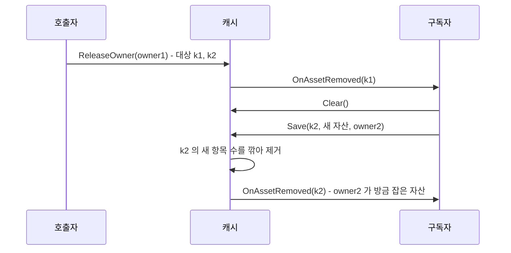

# 개인 패키지 에셋 핸들링 이슈 확인 및 변경 로그

> Unity / 에셋 관리 / 캐시 설계
> C# (Unity 6, Addressables 와 Resources 를 함께 쓰는 개인 유틸 패키지)

에셋 캐시에 인덱스가 두 개 있었다. "이 key 를 누가 잡고 있나" 와 "이 소유자가 무엇을 잡고 있나". 에디터 진단 창이 둘 다 쓰니 둘 다 필요해 보였다. 그런데 빌드 런타임만 놓고 보면 둘 다 필요한가? 이 질문에서 시작해 구조를 줄였고, 줄인 직후 검수에서 회귀 하나를 찾았다. 그 과정을 정리한다.

---

## 1. 캐시가 하는 일

에셋 로딩은 세 층으로 나뉜다. 호출자는 Provider 에게 에셋을 요청하고, Provider 는 Addressables 나 Resources 로더로 에셋을 읽은 뒤 캐시에 저장한다. 캐시는 **누가 이 에셋을 쓰고 있는지**를 기록하고, 마지막 사용자가 반납하면 항목을 지우면서 `OnAssetRemoved` 이벤트를 쏜다. Provider 는 그 이벤트를 받아 로더 핸들을 반납한다.

핵심은 "소유자" 개념이다. 같은 에셋을 여러 오브젝트가 쓰면, 한 오브젝트가 반납해도 다른 오브젝트가 남아 있는 동안은 에셋이 살아 있어야 한다. 그래서 캐시는 점유를 소유자 단위로 기록한다. 소유는 횟수가 아니라 유무다. 같은 소유자가 같은 에셋을 두 번 요청해도 한 번 반납하면 끝난다.

바꾸기 전 구조는 이랬다.

```csharp
sealed class Item {
    public TAsset Asset;
    public HashSet<AssetOwnerId> Owners = new();   // 이 key 를 잡은 소유자
}

readonly Dictionary<TKey, Item> table = new();                        // key -> 항목
readonly Dictionary<AssetOwnerId, HashSet<TKey>> ownerTable = new();  // 소유자 -> 잡은 key
```

같은 관계를 양쪽 방향에서 들고 있는 양방향 인덱스다.

---

## 2. 두 인덱스는 같은 정보다

빌드에서 각 구조가 실제로 무엇에 쓰이는지 추적했다.

| 연산 | 필요한 질문 | `Item.Owners` 로 | `ownerTable` 로 |
|---|---|---|---|
| 저장 시 중복 판정 | 이 소유자가 이미 잡았나 | `Owners.Add` | `ownerTable[owner].Add(key)` |
| 단건 반납 | 이 소유자의 점유를 뺄 수 있나 | `Owners.Remove` | `ownerTable[owner].Remove(key)` |
| 제거 판정 | 남은 소유자가 있나 | `Owners.Count` | 모든 소유자를 훑어야 함 |
| 소유자 일괄 반납 | 이 소유자가 잡은 key 는 | 모든 key 를 훑어야 함 | 그 소유자의 집합만 |

한쪽만 남기면 마지막 두 줄 중 하나가 전체 순회가 된다. 여기까지 보면 둘 다 필요해 보인다.

하지만 제거 판정 줄을 다시 보면, 필요한 것은 **소유자 목록이 아니라 소유자 수**다. 빌드에서 `Item.Owners` 는 `Count` 로만 읽혔고, 목록 자체를 읽는 곳은 에디터 진단 창뿐이었다. 양방향 인덱스처럼 보이지만, 실제로는 한쪽은 숫자 하나면 충분한 구조였다.

그래서 이렇게 바꿨다.

- `Item.Owners` 를 `int OwnerCount` 로 줄인다.
- 중복 판정은 `ownerTable` 의 `HashSet<TKey>` 가 맡는다. 소유가 유무이므로 가능하다.
- 누가 무엇을 잡았는지는 `ownerTable` 한 곳에만 둔다. 에디터가 key 기준 목록이 필요하면 `ownerTable` 을 뒤집어 만든다.

이렇게 하면 모든 연산이 전체 순회 없이 끝나고, key 마다 들던 `HashSet` 이 사라진다. 이 경우 제거 판정에 쓰는 수와 소유자 목록의 출처가 달라지므로, 둘 사이의 불변식을 지켜야 한다. **`OwnerCount` 는 그 key 를 담은 `ownerTable` 집합 수와 같아야 한다.**

---

## 3. 변경 로그

### 3.1 제네릭 제약과 `#if` 가드 순서

캐시가 드는 것은 전부 Addressables 나 Resources 에서 받은 리소스라 참조 타입이다. 그래서 `where TAsset : class` 를 걸었다. 이 과정에서 선언부가 한 번 깨졌다.

```csharp
// 깨진 형태 : 빌드에서 ':' 뒤가 비어 문법 오류
public sealed class MemoryAssetCache<TKey, TAsset> :
#if UNITY_EDITOR
     IAssetCacheDiagnostics
#endif
     where TAsset : class, IAssetCache<TKey, TAsset> {

// 고친 형태
public sealed class MemoryAssetCache<TKey, TAsset> : IAssetCache<TKey, TAsset>
#if UNITY_EDITOR
    , IAssetCacheDiagnostics
#endif
    where TAsset : class {
```

기반 목록의 일부만 `#if` 로 감쌀 때는 **첫 항목을 가드 밖에 둬야 한다.** 가드 안의 항목이 첫 번째면 심볼이 없는 빌드에서 `:` 만 남는다. 이 오류는 에디터 컴파일로는 드러나지 않을 수 있어서, `UNITY_EDITOR` 를 뺀 정의로 한 번 더 컴파일해 확인했다. 제약은 구현체에만 걸었다. 인터페이스 계약에 걸면 그 계약을 쓰는 제네릭 전부로 제약이 번진다.

### 3.2 소유자 집합을 소유자 수로

```csharp
sealed class Item {
    public TAsset Asset;
    public int OwnerCount;   // 서로 다른 소유자 수. 획득 횟수가 아니다
}

void _AddOwnerDependency(Item item, AssetOwnerId ownerId, TKey key) {
    if (!_RegisterOwnerKey(ownerId, key)) return;   // 이미 잡고 있으면 아무 일도 없다
    item.OwnerCount++;
}
```

단건 반납도 같은 모양이다. `ownerTable` 에서 떼는 데 성공했을 때만 수를 내린다. 공개 API 와 반환값의 의미는 그대로 두었다.

### 3.3 진단 캡처는 누를 때만

에디터 진단 창은 `OnGUI` 첫 줄에서 모든 캐시의 점유를 캡처하고 있었다. `OnGUI` 는 리페인트 한 번에 Layout 과 Repaint 로 두 번 불리고, 마우스 입력마다 또 불린다. 창이 0.25초마다 스스로 다시 그리도록 되어 있어서, 창을 열어 두면 초당 8회 이상 전체 캡처와 할당이 돌았다. 구조를 바꾼 뒤로는 key 기준 목록을 만들 때 역인덱스를 뒤집는 비용까지 더해진다.

그래서 캡처를 탭별 `Scan` 버튼으로 옮겼다. 두 가지를 같이 챙겼다.

- **캡처 시점을 Layout 패스 선두로 미룬다.** 버튼 클릭은 그리는 도중에 처리되는데, 거기서 행 수가 바뀌면 IMGUI 레이아웃이 어긋난다. 버튼은 요청만 표시하고, 실제 캡처는 다음 Layout 이벤트 맨 앞에서 한다.
- **캡처가 끝나면 캐시 참조를 버린다.** 진단 레지스트리는 캐시를 약한 참조로 든다. 누수 보고기는 플레이가 끝날 때 GC 를 돌리고 나서 살아 있는 캐시를 누수 후보로 센다. 진단 창이 결과를 보존하려고 캐시를 필드에 들고 있으면, 그 캐시가 누수로 보고된다. 누수를 잡으려고 만든 도구가 누수 보고를 오염시키는 셈이다.

---

## 4. 검수에서 나온 회귀

구조를 바꾼 뒤 "메모리 캐싱에 영향이 없는가" 를 따로 검수했다. 걸린 곳은 소유자 일괄 반납(`ReleaseOwner`)이었다.

바꾼 직후의 `ReleaseOwner` 는 소유자의 key 집합을 떼어낸 뒤, 그 목록의 key 마다 소유 여부를 다시 묻지 않고 수를 내렸다. "떼어낸 목록이 곧 이 소유자의 점유다" 라는 가정이었다. 이 가정은 **루프 도중 캐시가 바뀌면** 깨진다. 캐시는 항목을 지울 때마다 `OnAssetRemoved` 를 동기로 쏘고, 구독자는 그 안에서 캐시를 다시 호출할 수 있다. 실제로 이 캐시의 `Clear` 는 "알림 도중 재저장하는 구독자" 를 전제로 방어 코드를 갖고 있다.



결과는 두 가지였다.

- owner2 가 방금 잡은 자산에 **가짜 제거 알림**이 나간다. Provider 는 이 알림을 받으면 로더 핸들을 반납하므로, 살아 있는 소유자의 에셋이 내려간다.
- `ownerTable` 에는 `owner2 -> k2` 가 남는데 캐시 항목은 없다. 불변식이 깨진다.

바꾸기 전 코드는 이 경우를 우연히 막고 있었다. `item.Owners.Remove(owner1)` 가 실패하면 건너뛰었는데, 새로 만들어진 항목에는 owner1 이 없으니 그 검사가 **항목 동일성 검사 역할**을 하고 있었던 것이다. 구조를 줄이면서 그 검사가 함께 사라졌다.

수정은 그 역할을 명시적으로 되살리는 것이다. 떼어낼 때 key 마다 그때의 항목을 기억하고, 루프에서 key 가 여전히 같은 항목을 가리킬 때만 수를 내린다.

```csharp
// ReleaseOwner 요약
var releaseItems = new List<KeyValuePair<TKey, Item>>(keys.Count);
foreach (var key in keys) {
    if (assetTable.TryGetValue(key, out var item)) releaseItems.Add(new KeyValuePair<TKey, Item>(key, item));
}

ownerTable.Remove(ownerId);

foreach (var pair in releaseItems) {
    if (!assetTable.TryGetValue(pair.Key, out var item) || !ReferenceEquals(item, pair.Value)) continue;
    item.OwnerCount--;
    _TryRemoveItem(pair.Key, item);
}
```

항목은 저장할 때만 새로 만들어지므로, 같은 key 가 다른 항목을 가리키면 그 항목에는 이 소유자가 떼어낸 몫이 없다.

| 알림 도중 구독자가 한 일 | 바꾸기 전 | 바꾼 직후 | 수정 후 |
|---|---|---|---|
| `Clear` 후 다른 소유자가 재저장 | 정상 | 가짜 알림, 불변식 위반 | 정상 |
| 같은 소유자가 같은 자산 재저장 | `Save` 성공 후 자산 소실 | 정상 | 정상 |
| `Clear` 후 같은 소유자가 재저장 | 가짜 알림, 불변식 위반 | 가짜 알림, 불변식 위반 | 정상 |

두 번째와 세 번째 줄은 **바꾸기 전 코드에도 있던 결함**이다. 회귀를 고치다 보니 원래 있던 결함 두 개가 함께 정리됐다.

---

## 5. 어떻게 검증했나

이 패키지에는 테스트 어셈블리가 없다. 그래서 검증 수단을 따로 만들었다.

- **캐시 소스를 그대로 콘솔 앱으로 컴파일했다.** Unity 에 의존하는 로거와 진단 레지스트리 두 개만 스텁으로 바꿨다. 에디터 없이 수 초 만에 돌아간다.
- **같은 시나리오를 바꾸기 전 소스와 바꾼 뒤 소스에 각각 돌렸다.** 회귀인지 원래 결함인지는 이렇게 비교해야 가려진다.
- **독립 리뷰 에이전트에게 내 주장을 재검증하게 했다.** 에이전트는 재진입 시나리오 16개와 무작위 호출 60000회 차등 테스트를 직접 만들어 돌렸다. 재진입이 없는 호출에서는 바꾸기 전, 바꾼 직후, 수정 후 세 구현의 반환값, 경고 문구, 알림 순서, 최종 상태가 바이트 단위로 같았다.

검증은 다섯 번 돌았다. 1차에서 회귀가 나왔고, 2차에서 수정본을 확인했다. 3차부터 5차는 **코드가 아니라 변경 기록 문장**을 고친 회차다. "단건 반납은 false 를 받는다" 처럼 한 경우에서 본 사실을 모든 경우로 일반화한 문장이 3차에서 두 개, 4차에서 한 개 걸렸다. 코드는 맞는데 기록이 틀리면, 다음에 그 기록을 믿고 고치는 사람이 틀린다.

---

## 6. 하지 말아야 할 것

- **떼어낸 목록을 현재 상태로 믿지 않는다.** 루프 전에 뜬 목록은 스냅샷이다. 루프 안에서 동기 이벤트를 쏜다면, 이벤트 뒤의 상태는 스냅샷과 다를 수 있다.
- **구조를 줄일 때 사라지는 검사의 역할을 확인한다.** 지워지는 줄이 "소유 확인" 처럼 보여도, 실제로는 다른 불변식을 지키고 있을 수 있다.
- **에디터 진단 도구가 런타임 객체를 강하게 붙잡지 않게 한다.** 약한 참조로 설계한 레지스트리의 의미가 도구 하나로 무너진다.
- **`OnGUI` 에서 무거운 수집을 하지 않는다.** 호출 빈도가 리페인트 주기보다 높다.
- **기반 목록의 첫 항목을 `#if` 안에 두지 않는다.** 에디터에서는 컴파일되는데 빌드에서만 깨진다.

---

## 7. 정리

처음 질문은 "빌드에서 두 인덱스가 다 필요한가" 였다. 답은 **정보로는 하나면 되고, 다른 한쪽은 수 하나로 충분하다** 이다. 제거 판정에 필요한 것은 목록이 아니라 수이고, 소유자 목록은 한쪽 인덱스를 뒤집으면 얻을 수 있다.

다만 구조를 줄이는 일은 자료를 줄이는 것만이 아니다. 지워진 자료구조가 부수적으로 지키던 불변식까지 같이 사라질 수 있다. 이번에는 `HashSet.Remove` 한 줄이 재진입 상황에서 항목 동일성 검사를 대신하고 있었고, 그 역할은 명시적인 참조 비교로 되살렸다.

남은 동작 차이가 하나 있다. 일괄 반납 도중 같은 소유자가 단건 반납을 부르면 경고가 한 번 더 찍히고 반환값이 달라진다. 최종 상태는 같다. 이 경고까지 없애는 방법(떼어낸 몫을 소유자별 대기 스택에 두는 방식)은 검증용 사본에서 동작을 확인했지만, 필드와 분기가 늘어나 적용하지 않았다. 현재 코드에서 캐시를 구독하는 곳은 Provider 하나이고 그 구독자는 캐시를 다시 부르지 않으므로, 재진입 경로는 지금 코드에서는 일어나지 않는다. 공개 생성자를 통해 외부 코드가 구독할 수 있는 경로는 열려 있다.
