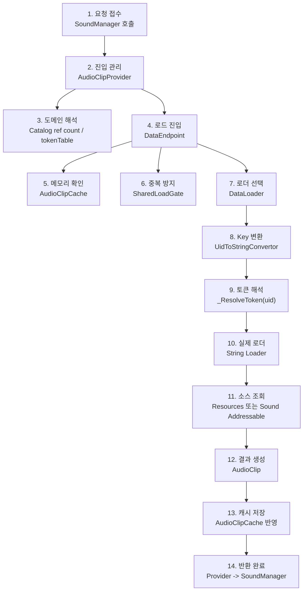
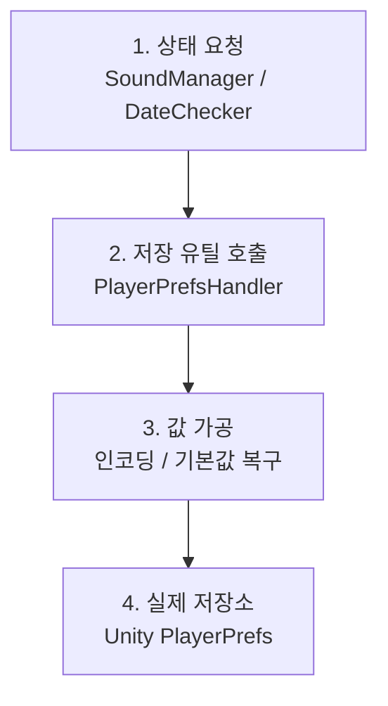
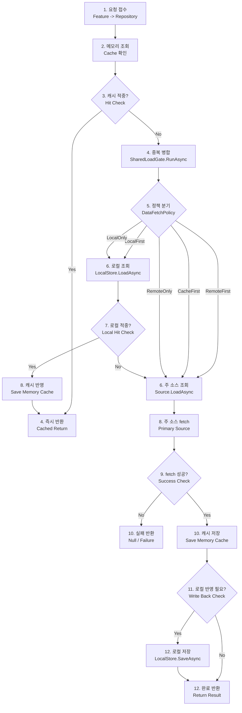
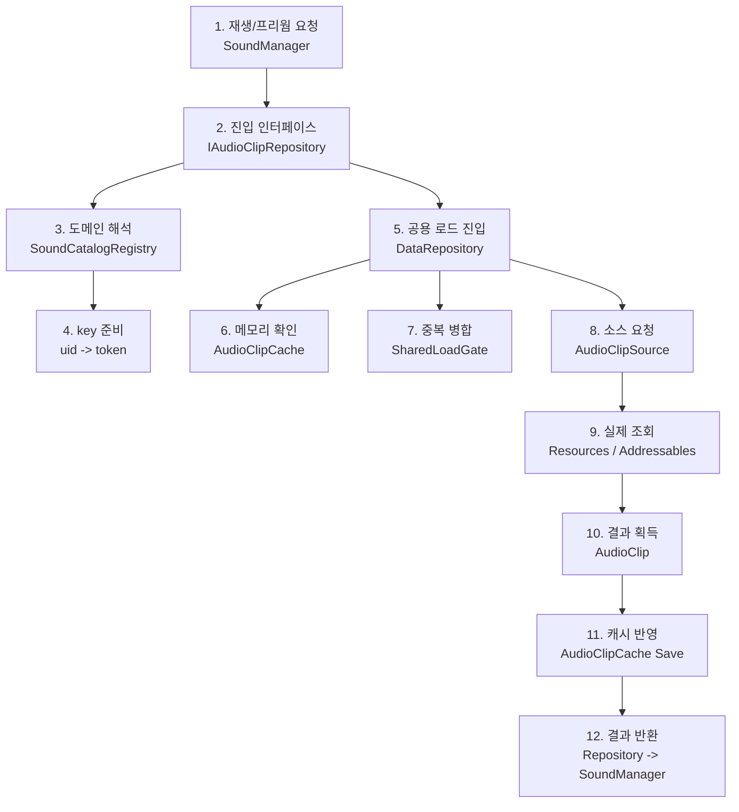
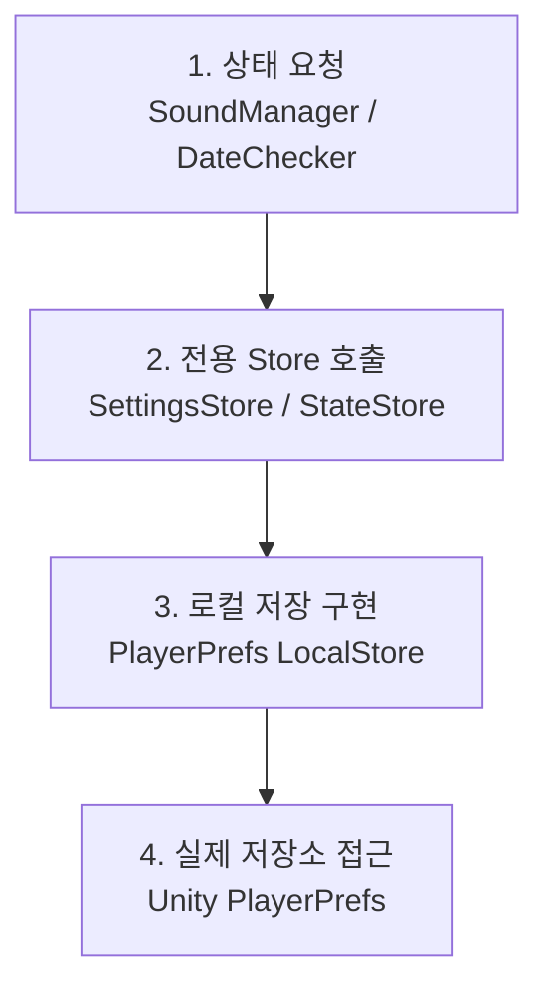

# Data Loading Architecture

## 목표

이 문서는 현재 저장소의 데이터 로딩 구조를 정리하고, 리팩토링 전에 합의할 최소 아키텍처 목표를 정의한다.

이번 설계의 핵심 목표는 다음과 같다.

- 유지보수성
- 확장성
- 낮은 결합도
- 읽기 쉬운 코드
- 불필요한 추상화 지양
- 동일 key 동시 요청 deduplication 지원
- `local-first`, `remote-first` 같은 정책 확장 가능
- 실제 기능에 즉시 적용 가능한 구조

## 범위

이 문서가 다루는 범위는 다음과 같다.

- 현재 `HUtil.Data` 공용 로딩 구조
- 현재 `HGame.Sound`의 실제 사용 흐름
- 업데이트된 `AddressableLoadSequence<TData>`의 현재 역할
- 목표 Repository 중심 로딩 구조
- 리팩토링 진입 전 마이그레이션 순서

이번 문서는 설계 문서이며, 실제 코드 리팩토링은 포함하지 않는다.

---

## 1. 현재 상태 요약

### 공용 로딩 레이어

현재 공용 로딩 레이어의 중심은 다음 구성요소들이다.

- `IDataLoad<TKey, TData>`
- `IReleasableDataLoad<TKey, TData>`
- `DataLoader<TKey, TData>`
- `SharedLoadGate<TKey, TData>`
- `IDataCache<TKey, TData>`
- `BaseDataCache<TKey, TData>`
- `DataEndpoint<TKey, TData>`

현재 장점은 다음과 같다.

- `SharedLoadGate`를 통해 동일 key 동시 요청 deduplication이 이미 존재한다.
- releasable loader를 통해 asset 수명 해제가 가능하다.
- `Sound` 기능이 이미 실제 사용 흐름으로 이 구조를 일부 활용하고 있다.

현재 구조적 한계는 다음과 같다.

- 캐시, 소유권 추적, 로딩, 영속 저장이 한 묶음으로 이야기되지만 실제 책임 분리는 충분하지 않다.
- `DataLoadType`은 더 넓은 확장을 암시하지만 실제 구현은 그 범위를 아직 따라가지 못한다.
- 기능별 규칙이 feature provider 내부에 남아 있다.
- `PlayerPrefs` 접근이 아직 도메인 클래스에서 직접 호출된다.

### 현재 사운드 사용 구조

사운드 시스템은 첫 적용 대상으로 가장 적합하다.

이유는 다음과 같다.

- 카탈로그 기반 key 등록이 있다.
- 캐시가 있다.
- deduplication 요구가 있다.
- 리소스 로딩이 실제로 돌아간다.
- Addressables 확장 요구가 이미 존재한다.
- 설정 저장 같은 로컬 영속 데이터도 붙어 있다.

현재 `AudioClipProvider`는 다음 책임을 동시에 가진다.

- 카탈로그 등록과 ref count 관리
- `uid -> token` 해석
- 로딩 오케스트레이션
- 캐시 사용
- fallback 처리

즉, 도메인 규칙과 데이터 접근 규칙이 한 클래스에 몰려 있다.

### 현재 로컬 저장 구조

로컬 저장은 아직 하나의 공용 아키텍처 흐름으로 정리되어 있지 않다.

예시는 다음과 같다.

- `SoundManager`가 `PlayerPrefsHandler`로 볼륨과 기본 클릭 사운드를 직접 저장한다.
- `DateChecker`가 `PlayerPrefsHandler`로 UTC 상태를 직접 저장한다.

즉, 로컬 저장은 존재하지만 재사용 가능한 `Store` 경계로 아직 정리되어 있지 않다.

---

## 2. 현재 플로우

### 2.1 현재 사운드 프리웜 및 로드 플로우



단계 요약:

- 1: 기능 요청
- 2: 사운드 진입
- 3: 카탈로그 해석
- 4: 공용 엔드포인트 진입
- 5: 캐시 확인
- 6: 중복 요청 병합
- 7: 로더 선택
- 8: key 변환
- 9: 토큰 조회
- 10: 문자열 기반 로더 호출
- 11: 실제 asset 소스 접근
- 12: 클립 획득
- 13: 캐시 반영
- 14: 결과 반환

### 2.2 현재 로컬 저장 플로우



단계 요약:

- 1: 상태 읽기 또는 저장 요청
- 2: PlayerPrefs 래퍼 호출
- 3: key/value 인코딩 및 복구 처리
- 4: Unity PlayerPrefs 접근

### 2.3 현재 플로우의 문제

- feature 코드가 저장 방식 세부사항을 너무 많이 안다.
- asset 로딩과 local persistence가 같은 설계 언어로 설명되지 않는다.
- `local-first`, `remote-first` 같은 정책이 들어갈 자리가 없다.
- 현재 cache 계약은 owner/dependency 개념에 강하게 묶여 있어 일반 데이터에는 무겁다.

---

## 3. 업데이트된 Addressable 기준선

업데이트된 `AddressableLoadSequence<TData>`는 이제 버려야 할 대상이 아니라, 현재 기준선으로 삼을 수 있는 source-layer 자산이다.

### 현재 지원 범위

- Address 기반 단일 asset 로드
- Label 기반 전체 asset 로드
- Label 기반 단일 asset 선택 로드
- Label 첫 번째 결과 로드
- Label 결과가 정확히 하나일 때만 로드
- Label index 지정 로드
- 로드 방식별 별도 handle key 관리
- 로드 방식별 별도 release API 제공
- `ReleaseAll()` 지원

### 현재 역할

이 클래스는 이제 source-layer 유틸리티로 보는 것이 맞다.

현재 해결하는 것:

- Addressables를 어떤 방식으로 조회할지
- handle을 어떻게 유지할지
- 어떤 로드 방식에 어떤 release를 대응시킬지

현재 해결하지 않는 것:

- feature 정책
- `local-first`, `remote-first` 순서 결정
- repository 조합
- local persistence 전략
- 카탈로그 및 도메인 매핑

### 설계상 위치

업데이트된 `AddressableLoadSequence<TData>`는 목표 구조에서도 유지한다.

다만 feature manager가 직접 쓰는 구조가 아니라, source adapter 또는 repository 내부에서 사용되는 방향이 맞다.

---

## 4. 목표 최소 구조

### 핵심 아이디어

구체 source 위에 얇은 orchestration 레이어 하나를 둔다.

- repository가 읽기 흐름을 결정한다.
- cache가 메모리 상태를 보관한다.
- source가 주 데이터 소스에서 값을 읽는다.
- local store가 복구 가능한 상태를 저장한다.
- policy가 조회 순서를 정한다.

### 제안 구성요소

- `DataFetchPolicy`
- `IDataSource<TKey, TData>`
- `ILocalStore<TKey, TData>`
- `IMemoryCache<TKey, TData>`
- `DataRepository<TKey, TData>`
- `SharedLoadGate<TKey, TData>`

현재 저장소에서는 `IMemoryCache`를 완전히 새로 만들 수도 있고, 기존 cache를 generic cache와 asset lifetime cache로 분리할 수도 있다.

### 제안 정책

- `CacheFirst`
- `LocalFirst`
- `RemoteFirst`
- `LocalOnly`
- `RemoteOnly`

이 저장소에서는 `Remote`를 네트워크 전용 의미로만 보지 않는다.

현재 시점의 `Remote` 또는 주 소스는 다음을 포함한다.

- `Resources`
- `Addressables`
- 이후 확장될 API / 서버 소스

---

## 5. 목표 플로우

### 5.1 목표 Repository 로드 플로우



단계 요약:

- 1: repository 요청
- 2: 메모리 캐시 확인
- 3: 캐시 hit 판단
- 4: 즉시 반환 또는 dedupe 진입
- 5: 정책 선택
- 6: 로컬 또는 주 소스 조회
- 7: 로컬 hit 판단
- 8: 캐시 반영 또는 주 소스 fetch
- 9: fetch 성공 여부 확인
- 10: 실패 반환 또는 캐시 저장
- 11: 로컬 write-back 필요 여부 판단
- 12: 저장 후 반환

### 5.2 목표 사운드 적용 플로우



단계 요약:

- 1: 사운드 요청
- 2: repository 진입
- 3: 카탈로그 해석
- 4: uid를 token으로 정리
- 5: 공용 repository 호출
- 6: 메모리 캐시 확인
- 7: 중복 요청 병합
- 8: source 호출
- 9: 실제 asset 조회
- 10: clip 획득
- 11: 캐시 저장
- 12: 사운드 매니저 반환

### 5.3 목표 로컬 설정 플로우



단계 요약:

- 1: 상태 조회 또는 저장 요청
- 2: 전용 store 진입
- 3: PlayerPrefs 기반 local store 처리
- 4: Unity PlayerPrefs 저장/조회

---

## 6. 핵심 책임

### `IDataSource<TKey, TData>`

하나의 주 소스에서만 값을 읽는 책임을 가진다.

예시:

- `ResourcesAudioClipSource`
- `AddressableAudioClipSource`
- 이후의 `RemoteProfileSource`

하지 말아야 하는 일:

- feature 카탈로그 보유
- 정책 결정
- 메모리 캐시 관리

### `ILocalStore<TKey, TData>`

로컬 영속 저장만 담당한다.

예시:

- 볼륨 설정 store
- 날짜 체크 상태 store
- 이후의 JSON 파일 store
- PlayerPrefs 기반 store

하지 말아야 하는 일:

- Addressables 또는 Resources 조회
- feature orchestration 규칙 보유

### `DataRepository<TKey, TData>`

오케스트레이션만 담당한다.

담당해야 하는 일:

- 메모리 캐시 우선 조회
- 동일 key 동시 요청 dedupe
- 정책 적용
- local store와 source를 올바른 순서로 호출
- cache write
- 필요 시 local write-back

가지지 말아야 하는 일:

- feature 카탈로그 파싱
- label 의미 해석
- 직접적인 도메인 규칙 보유

### `SoundCatalogRegistry`

사운드 도메인 매핑만 담당한다.

담당해야 하는 일:

- `SoundCatalogSO` 등록과 해제
- 카탈로그 ref count 관리
- `uid -> token` 제공

가지지 말아야 하는 일:

- 클립 직접 로드
- 공용 로딩 정책 관리

### `AudioSettingsStore`

다음 로컬 상태를 담당한다.

- master / sfx / ui / bgm 값
- 기본 클릭 사운드 uid

이 구조로 가면 `SoundManager`는 `PlayerPrefsHandler`를 직접 호출하지 않게 된다.

---

## 7. 의존성 방향

목표 의존성 방향은 다음과 같다.

```text
Feature
-> Feature Repository / Store Interface
-> Shared Repository
-> Cache / LocalStore / Source
-> Unity APIs
```

현재 저장소에 맞춘 해석은 다음과 같다.

- `SoundManager`
  -> `IAudioClipRepository`
  -> `IAudioSettingsStore`
- `AudioClipRepository`
  -> `SoundCatalogRegistry`
  -> `DataRepository<int, AudioClip>`
- `DataRepository<int, AudioClip>`
  -> `SharedLoadGate<int, AudioClip>`
  -> `AudioClipCache`
  -> `AudioClipSource`
- `AudioClipSource`
  -> `ResourcesLoadSequence` 또는 `AddressableLoadSequence`
- `AudioSettingsStore`
  -> `PlayerPrefsHandler` 또는 이후 `PlayerPrefsLocalStore`

---

## 8. 첫 적용 대상

첫 마이그레이션 대상은 `Sound`가 적합하다.

이유는 다음과 같다.

- 실제 캐시와 로딩 흐름이 이미 존재한다.
- 동일 key dedupe가 실제 요구사항이다.
- 카탈로그 경계가 명확하다.
- 다중 source 확장 요구가 이미 있다.
- 로컬 설정 저장까지 가까이 붙어 있다.

두 번째 적용 후보는 `DateChecker`다.

이유는 다음과 같다.

- 이 문서가 asset loading에만 쓰이는 것이 아니라
- local persisted state에도 적용될 수 있음을 증명할 수 있다.

---

## 9. 마이그레이션 순서

### Phase 1. 설계 기준선 고정

- 이 문서를 리팩토링 기준선으로 유지한다.
- feature 동작은 아직 바꾸지 않는다.
- 업데이트된 `AddressableLoadSequence<TData>`를 source-layer 기준선으로 인정한다.

### Phase 2. Repository 측 계약 도입

- `DataFetchPolicy` 추가
- `IDataSource<TKey, TData>` 추가
- `ILocalStore<TKey, TData>` 추가
- `DataRepository<TKey, TData>` 추가

이 단계에서는 기존 기능이 계속 동작해야 한다.

### Phase 3. Sound 도메인 책임 분리

- `AudioClipProvider`에서 `SoundCatalogRegistry`를 분리한다.
- 카탈로그 ref count와 `uid -> token` 해석 책임을 이동한다.

### Phase 4. Sound 로딩 오케스트레이션 이동

- `AudioClipProvider`를 얇은 호환 wrapper로 유지하거나
- `AudioClipRepository`로 대체한다.

이때 바깥 public API는 최대한 안정적으로 유지한다.

### Phase 5. Addressables 경로 정리

- 사운드 Addressable 경로를 업데이트된 공용 `AddressableLoadSequence<TData>`와 정렬한다.
- production-ready가 아닌 TODO 경로는 노출하지 않는다.

### Phase 6. 로컬 설정 저장 분리

- `AudioSettingsStore` 추출
- 필요 시 `DateCheckerStateStore` 추출

### Phase 7. 오래된 중복 추상화 정리

- `DataLoadType` 중심 분기를 줄인다.
- cache를 unified cache로 둘지, generic cache와 asset lifetime cache로 분리할지 결정한다.

---

## 10. 예상 리스크와 트레이드오프

### 리스크 1. 타입 수 증가

구조를 정리하면 파일 수와 타입 수는 늘어난다.

트레이드오프:

- 파일 수는 조금 늘어난다.
- 대신 책임 경계는 훨씬 선명해진다.

### 리스크 2. cache 추상화 분리 여부

asset 수명 추적은 유용하지만 모든 데이터에 owner/dependency가 필요한 것은 아니다.

트레이드오프:

- 하나의 범용 cache는 표면상 단순해 보인다.
- 두 개의 목적별 cache 계약은 실제 코드에서 더 읽기 쉬울 수 있다.

### 리스크 3. Addressables 이원화

공용 `AddressableLoadSequence<TData>`는 강화되었지만, 사운드 쪽은 아직 완전히 정렬되지 않았다.

트레이드오프:

- 단기적으로는 중복처럼 보일 수 있다.
- 장기적으로는 source 경계가 더 명확해진다.

### 리스크 4. policy 과설계

정책을 너무 이르게 과하게 넣으면 추상화 소음이 생길 수 있다.

트레이드오프:

- 작은 enum과 repository 내부 처리 정도면 충분히 가치가 있다.
- loader마다 정책을 퍼뜨리면 오히려 가독성이 떨어진다.

---

## 11. 리팩토링 규칙

실제 구현 시 다음 원칙을 유지한다.

- policy를 `AddressableLoadSequence<TData>` 내부로 넣지 않는다.
- feature manager가 `PlayerPrefsHandler`를 직접 호출하지 않게 한다.
- `SoundManager`가 구체 source 세부사항을 알지 않게 한다.
- 동일 key dedupe는 repository fetch 경계에 둔다.
- 프레임워크식 추상화보다 읽기 쉬운 코드를 우선한다.

---

## 12. 다음 단계

리팩토링 시작 전 즉시 해야 할 일은 다음과 같다.

1. 이 문서를 마이그레이션 기준선으로 확정한다.
2. `IAudioClipRepository`의 첫 public API를 정의한다.
3. cache를 unified로 유지할지 split할지 결정한다.
4. `Sound`를 먼저 적용하고, 이후 로컬 설정 구조를 옮긴다.
